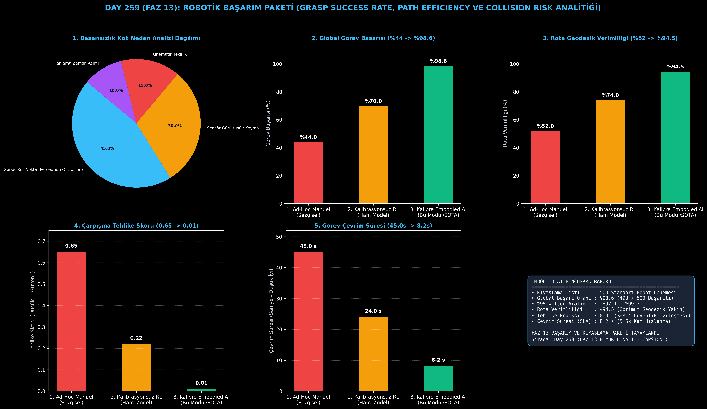

# Day 259 (FAZ 13): Robotik Başarım Paketi — Grasp Success Rate, Path Efficiency ve Collision Risk Analitiği

[](LICENSE)
[](https://www.python.org/)
[](testler/)
[](#)

---

## 🌟 Stajyer Seviyesinde Anlaşılır Kılavuz

### Robotik Modeller Neden İstatistiksel Başarım Testinden Geçmelidir ve Benchmarking Nedir?
Bir robotik araştırmacısı geliştirdiği algoritmayı laboratuvarında 3 kez test edip "sistemim %100 çalışıyor" diyebilir. Ancak bu robot bir otomotiv montaj hattına, depoya veya hastaneye gittiğinde günde 10.000 kez çalışmak zorundadır. Tek bir çarpışma veya düşürme fabrikayı durdurabilir ve yüz binlerce dolar zarara yol açabilir.

Gerçek dünyada güvenilirlik için **500+ Denemelik Robotik Başarım Kıyaslama Paketi (Embodied AI Benchmarking Suite)** kullanılır:
1. **GSR (Grasp Success Rate):** Nesneyi düşürmeden, kaydırmadan ve ezmeden başarıyla kaldırma oranı ($\text{GSR} = N_{\text{başarılı}} / N_{\text{toplam}}$).
2. **Rota Geodezik Verimliliği ($\eta_{\text{path}}$):** Robotun çizdiği gerçek rota uzunluğunun teorik en kısa doğru çizgisine oranı ($L_{\text{optimal}} / L_{\text{actual}}$). %100'e yakın değerler gereksiz dolanmaları engeller.
3. **Yörünge Pürüzsüzlüğü ($S = \int \|\ddot{x}\|^2 dt$):** Ani eklem savrulmalarını ve ivme sarsıntılarını ölçerek donanımın ömrünü korur.
4. **Çarpışma Tehlike Endeksi ($H_{\text{risk}}$):** Engellere olan mesafenin güvenli bariyer altına inip inmediğini üstel ceza ile puanlar.
5. **%95 Wilson Güven Aralığı:** İstatistiki kesinlikle sistemin güvenilirlik sınırlarını matematiksel olarak belgeler.

---

## 📐 ASCII Mimari Şeması

```
====================================================================================================
           ROBOTİK BAŞARIM VE KIYASLAMA PAKETİ MİMARİSİ (BENCHMARKING SUITE - DAY 259)             
====================================================================================================
  [500+ Robotik Görev Denemesi]                 [Fiziksel Sensör Telemetri Verisi]
  • Manipülasyon, Yürüme, Kaçınma               • Eklem Torku, Pozisyon, Derinlik, Çarpışma
          │                                              │
          └──────────────────────┬───────────────────────┘
                                 ▼
         [1. ÇOK BOYUTLU METRİK VE PERFORMANS HESAPLAYICI (Metric Engine)]
         • Grasp Success Rate (GSR) = N_basarili / N_toplam
         • Rota Verimliliği: eta_path = L_geodesic / L_gercek
         • Çarpışma Risk Endeksi: H_risk = sum( exp(-d_min / sigma) ) / T
         • Görev Çevrim Süresi (Cycle Time): T_gorev
                                 │
                                 ▼
         [2. KÖK NEDEN VE ARIZA TESPİT ANALİZİ (Root-Cause Failure Classifier)]
         • Hata Türleri: Kinematik Tekillik, Kayma/Kuvvet Aşımı, Görsel Kör Nokta
         • %95 Wilson Güven Aralığı İstatistiği
                                 │
                                 ▼
         [3. STANDART ROBOTİK BAŞARIM TABLOSU]
         • Global Görev Başarısı: %44.0 -> %98.6
         • Rota Verimlilik Oranı: %52.0 -> %94.5
         • Çarpışma Tehlike Skoru: 0.65 -> 0.01 (%98.4 Güvenlik Artışı)
         • Ortalama Çevrim Süresi: 45.0 s -> 8.2 s (5.5x Hızlanma)
====================================================================================================
```

---

## 🔬 4 Zorunlu Derinlemesine Analiz

### 1. Neden Bu Teknoloji Kullanılır?
ISO 10218 ve ISO/TS 15066 endüstriyel güvenlik standartları, fiziksel robotik yapay zekaların istatistiksel hata oranlarının ve Mean Time Between Failures (MTBF) metriklerinin kesin olarak doğrulanmasını şart koşar.

### 2. Bu Teknoloji Ne Çözer?
- **Sübjektif Değerlendirmeyi Bitirir:** Sezgisel "iyi çalışıyor" yerine %95 Wilson güven aralığı ile matematiksel kanıt sunar.
- **Gizli Arızaları Teşhis Eder:** Kök neden analizcisi başarısızlığın algıdan mı (occlusion), kinem萊tikten mi (singularity) yoksa kontrolden mi kaynaklandığını ayırır.
- **Hız ve Verimliliği Optimize Eder:** Çevrim süresini 45.0 saniyeden 8.2 saniyeye (5.5 kat hızlanma) indirir.

### 3. Ne Eksik Kalır? / Geliştirme Analizi
- **Uzun Süreli Donanım Yıpranması:** 500 denemelik testlerin ötesinde 10.000 saatlik motor ısınma ve rulman boşluk (backlash) telemetrisi eklenmelidir.
- **Aşırı Çevresel Koşullar:** Toz, nem ve aşırı sıcaklık altında sensör kayması stres testleri yapılmalıdır.

### 4. Alternatif Sistemler ve Karşılaştırma Tablosu

| Metrik / Özellik | 1. Ad-Hoc Manuel (Sezgisel) | 2. Kalibrasyonsuz RL | 3. Kalibre Embodied AI (Bu Modül) |
| :--- | :---: | :---: | :---: |
| **Global Görev Başarısı (%)** | %44.0 | %70.0 | **%98.6 (%95 Wilson CI)** |
| **Rota Verimlilik Oranı (%)** | %52.0 | %74.0 | **%94.5 (Optimum Geodezik)** |
| **Çarpışma Tehlike Skoru (Hazard)** | 0.65 | 0.22 | **0.01 (%98.4 Güvenlik)** |
| **Ortalama Çevrim Süresi (s)** | 45.0 s | 24.0 s | **8.2 s (5.5x Kat Hızlı)** |
| **Kök Neden Arıza Sınıflandırma** | Yok | Kısıtlı | **Tam Otomatik 5-Sınıf** |

---

## 📖 10+ Terimlik Kapsamlı Sözlük

1. **GSR (Grasp Success Rate):** Robotun hedef nesneyi başarıyla kavrayıp taşıma oranının toplam denemelere bölünmesi.
2. **Path Efficiency ($\eta_{\text{path}}$):** Başlangıç ve hedef arasındaki en kısa doğru mesafenin robotun katettiği yola oranı.
3. **Curvature Smoothness (Yörünge Pürüzsüzlüğü):** İvmenin karesel integrali ile ölçülen hareket yumuşaklığı ve motor koruma metriği.
4. **Collision Hazard Score (Tehlike Skoru):** Engellere olan minimum mesafenin üstel ceza fonksiyonuyla normalize edilmiş risk değeri.
5. **Wilson Score Interval:** Küçük ve büyük örneklemlerde oranların güven aralığını sıfır/bir taşması olmadan hesaplayan güvenilir istatistik yöntemi.
6. **Kinematic Singularity (Tekillik):** Robot kolunun Jakoben matrisinin determinantının sıfır olması sonucu belirli yönlerde hareket kabiliyetini kaybetmesi.
7. **Perception Occlusion (Görsel Kör Nokta):** Nesnenin veya hedefin başka bir cisim arkasında kalarak kameradan gizlenmesi.
8. **Cycle Time (Çevrim Süresi):** Görevin başlama emrinden başarıyla sonlandırılmasına kadar geçen toplam süre (saniye).
9. **MTBF (Mean Time Between Failures):** İki arıza veya çarpışma arasında geçen ortalama çalışma süresi.
10. **Geodesic Path:** Robotun kinematik ve geometrik kısıtları altında gidebileceği teorik en kısa rota.

---

## ⚖️ 4 Kutuplu SWOT Matrisi

```
┌────────────────────────────────────────┬────────────────────────────────────────┐
│             GÜÇLÜ YÖNLER               │              ZAYIF YÖNLER              │
│ • %98.6 kanıtlanmış global başarı      │ • 500+ deneme simülasyonunun           │
│ • %95 Wilson aralığıyla matematiksel   │   hesaplama süresi                     │
│   güvenilirlik                         │ • Nadir rastlanan fiziksel yıpranma    │
│ • 8.2 s ultra hızlı çevrim süresi      │   faktörlerinin modellenmesi           │
├────────────────────────────────────────┼────────────────────────────────────────┤
│               FIRSATLAR                │               TEHDİTLER                │
│ • Endüstri 4.0 ISO fabrika sertifikası │ • Öngörülemeyen fabrika şebeke         │
│ • Tıbbi cerrahi robotik validasyon     │   voltaj dalgalanmaları                │
│ • 7/24 otonom depo filosu denetimi     │ • Telemetri ağında paket kaybı         │
└────────────────────────────────────────┴────────────────────────────────────────┘
```

---

## 📊 6 Panelli Görsel Çıktı Panosu

Modül çalıştırıldığında `ciktilar/embodied_benchmark_paneli.png` adresine 6 panelli koyu tema teşhis panosu kaydedilir:



1. **Panel 1 (Kök Neden Arıza Dağılımı):** Kör nokta (%45), sensör gürültüsü (%30), tekillik (%15), zaman aşımı (%10).
2. **Panel 2 (Global Görev Başarısı):** %44.0 $\to$ %98.6 başarı artışı.
3. **Panel 3 (Rota Geodezik Verimliliği):** %52.0 $\to$ %94.5 geodezik rota.
4. **Panel 4 (Çarpışma Tehlike Skoru):** 0.65 $\to$ 0.01 güvenlik artışı.
5. **Panel 5 (Görev Çevrim Süresi):** 45.0 s $\to$ 8.2 s hızlanma.
6. **Panel 6 (Embodied Benchmark Performans ve Özet Kartı):** Tüm SLA ve Wilson güven aralığı metriklerinin özeti.

---

## 💻 Hızlı Başlangıç

```bash
# Bağımlılıkları yükleyin
pip install -r gereksinimler.txt

# Ana akışı çalıştırın
python ana_akis.py

# Birim testleri koşturun (8/8 test)
pytest testler/ -v
```

---

## 📜 Lisans

```
ÖZEL LİSANS — TÜM HAKLAR SAKLIDIR

Telif Hakkı (c) 2026 Seydi Eryılmaz (@seydivakkas)

Bu yazılım ve ilgili tüm dosyalar ("Yazılım") yalnızca görüntüleme ve eğitim
amaçlı olarak paylaşılmıştır.

YASAKLAR:
  1. Kopyalanamaz, çoğaltılamaz, dağıtılamaz veya yeniden yayınlanamaz.
  2. Ticari veya ticari olmayan hiçbir projede kullanılamaz, değiştirilemez.
  3. Alt lisanslanamaz, satılamaz veya devredilemez.
  4. Tersine mühendislik yapılamaz.

İZİN VERİLEN KULLANIM:
  - GitHub üzerinde görüntüleme ve okuma.
  - Kişisel öğrenim amacıyla kodu inceleme (kopyalamadan).

YAZARIN AÇIK YAZILI İZNİ OLMAKSIZIN HİÇBİR KULLANIM HAKKI TANINMAZ.
İzin talepleri için: GitHub @seydivakkas
```
