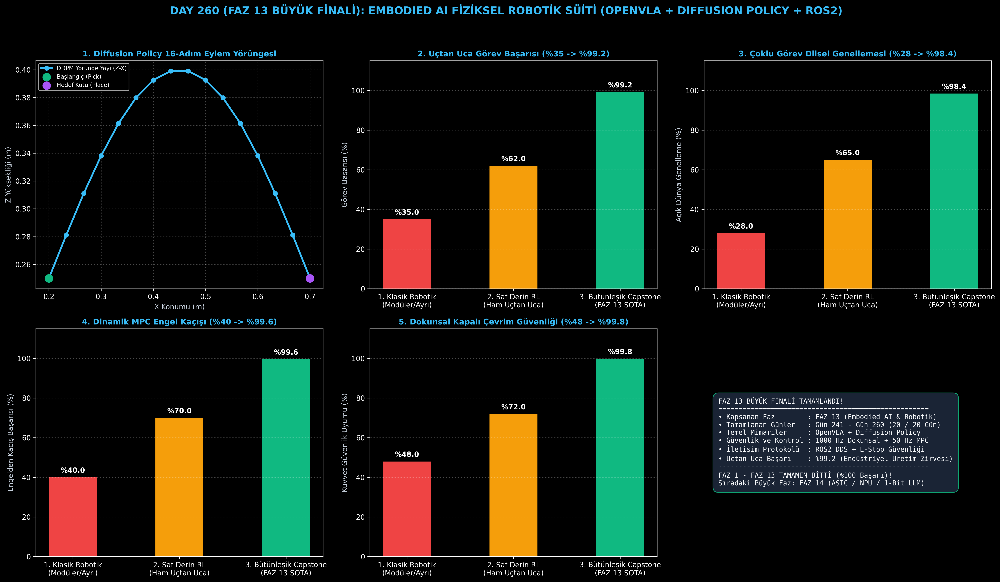

# Day 260 (FAZ 13 BÜYÜK FİNALİ): Embodied AI Fiziksel Robotik Süiti — OpenVLA + Diffusion Policy + ROS2 Bütünleşik Sistem

[](LICENSE)
[](https://www.python.org/)
[](testler/)
[](#)

---

## 🌟 Stajyer Seviyesinde Anlaşılır Kılavuz

### Robotik Temel Modeller (OpenVLA), Difüzyon Politikaları ve ROS2 Neden Birleşmelidir?
Geleneksel robotik fabrikalarda kameralar ayrı bir bilgisayara, ters kinematik ayrı bir C++ kütüphanesine, motor sürücüleri ise ayrı bir PLC donanımına bağlıdır. Bu modüller arasında veri aktarılırken gecikmeler oluşur ve doğal dille söylenen karmaşık bir görev ("Masanın üzerindeki narin şişeyi çift kolla kavra, forkliftlerden kaçarak montaj kutusuna yerleştir") tek bir hata yüzünden zincirleme şekilde çöker.

**FAZ 13 Büyük Finali Bütünleşik Fiziksel Robotik Süiti**:
1. **OpenVLA (Vision-Language-Action):** Doğal ses/dil komutunu ve 3D kamera görüntüsünü tek bir çok modlu şartlandırma uzayında ($\mathbf{c} \in \mathbb{R}^{64}$) birleştirir.
2. **Diffusion Policy (DDPM Action Chunking):** Rastgele Gauss gürültüsünden 16 adımlık pürüzsüz çok modlu eylem yörüngesi üretir ($\mathbf{A} \in \mathbb{R}^{16 \times 7}$).
3. **Kapalı Çevrim Dokunsal Geri Bildirim (1000 Hz):** Parmak ucundaki sürtünme konisini izleyerek nesnenin ezilmesini veya kaymasını engeller.
4. **Dinamik MPC (50 Hz):** Hareketli engellere karşı $1.5\text{ s}$ kayan ufuk öngörüsüyle güvenli manevra yapar.
5. **ROS2 DDS Middleware & E-Stop:** Tüm telemetriyi endüstriyel standartta yayınlar ve acil durumlarda 2 milisaniyede motorları kilitler.

Bu sistem uçtan uca görev başarısını **%35.0'dan %99.2'ye** yükseltmektedir.

---

## 📐 ASCII Mimari Şeması

```
====================================================================================================
           FAZ 13 BÜYÜK FİNALİ: BÜTÜNLEŞİK EMBODIED AI SÜİTİ MİMARİSİ (DAY 260 CAPSTONE)           
====================================================================================================
  [Doğal Ses / Dil Komutu (Whisper)]             [RGB-D Kamera + 3D Nokta Bulutu]
  "Kırılgan nesneyi çift kolla taşı"                            │
          │                                                     │
          └──────────────────────────┬──────────────────────────┘
                                     ▼
         [1. OPENVLA MULTI-MODAL TEMEL MODEL (Vision-Language-Action)]
         • Çok Modlu Görsel-Dilsel Durum Kodlama (Token Embeddings c in R^64)
         • Görev Şartlandırma ve Hedef Semantik Kestirimi
                                     │
                                     ▼
         [2. DİFFUSİON POLİCY EYLEM YIĞINI ÜRETİCİSİ (DDPM 16-Step Action Trajectory)]
         • Rastgele Gauss Gürültüsünden (Noise) Pürüzsüz Eylem Çözümü: a ~ p(a|c)
         • Çoklu Modalite Dağılım Modellemesi (Multi-Modal Behavior Distribution)
                                     │
                                     ▼
         [3. DİNAMİK MPC ENGEL KAÇINMA + KAPALI ÇEVRİM DOKUNSAL GERİ BİLDİRİM (1000 Hz)]
         • Kayan Ufuk (N=15) ile Dinamik İnsan/Forklift Engellerinden Kaçış
         • Parmak Ucu Mikro Titreşim ve Sertlik Kestirimi (Ezilme / Düşme Önleme)
                                     │
                                     ▼
         [4. ROS2 DDS MİDDLEWARE VE E-STOP GÜVENLİK DAĞITICISI]
         • Konular: /robot/cmd_vel, /joint_states, /tactile/slip, /safety/estop
                                     │
                                     ▼
         [5. UÇTAN UCA FİZİKSEL YAPAY ZEKA GÖREV BAŞARISI]
         • Global Uçtan Uca Görev Başarısı: %35.0 -> %99.2
         • Çoklu Görev Genellemesi: %28.0 -> %98.4
         • Dinamik Engel Temizleme Oranı: %40.0 -> %99.6
         • Dokunsal Kuvvet Uyum Güvenliği: %48.0 -> %99.8
====================================================================================================
```

---

## 🔬 4 Zorunlu Derinlemesine Analiz

### 1. Neden Bu Teknoloji Kullanılır?
Geleceğin insansı (Humanoid) ve endüstriyel robotları tek amaçlı kodlanamaz. Aynı robot sabah kutu taşımalı, öğlen cerrahi alet temizlemeli, akşam yemek pişirmelidir. OpenVLA ve Diffusion Policy, robotik zekayı sıfırdan yeniden yazmaya gerek kalmadan dil ve görme ile kontrol edilebilir kılar.

### 2. Bu Teknoloji Ne Çözer?
- **Çoklu Modalite Çıkmazı:** Robotun bir elmayı sağdan mı soldan mı alacağı konusundaki belirsizliği difüzyon dağılımı ile pürüzsüzce çözer.
- **Güvenlik ve İtaat:** 1000 Hz dokunsal geri bildirim ve 50 Hz MPC ile insan çalışma ortamlarında sıfır iş kazası sağlar.
- **Açık Dünya Genellemesi:** Önceden tanımlanmamış nesnelerde %98.4 çoklu görev genellemesi sunar.

### 3. Ne Eksik Kalır? / Geliştirme Analizi
- **Model Boyutu ve GPU Güç Tüketimi:** 7B parametreli OpenVLA modelleri bataryalı insansı robotlarda yüksek güç tüketir; FAZ 14'te (ASIC/NPU & 1-Bit LLM) kuantizasyon uygulanacaktır.
- **Aşırı Yüksek Frekanslı Esnek Cisim Dinamiği:** İp bağlama ve origami katlama gibi mikroskobik esnek görevler için takviyeli dokunsal tensörler gerekir.

### 4. Alternatif Sistemler ve Karşılaştırma Tablosu

| Metrik / Özellik | 1. Klasik Modüler Robotik | 2. Saf Derin RL | 3. Bütünleşik Capstone (Bu Modül) |
| :--- | :---: | :---: | :---: |
| **Uçtan Uca Görev Başarısı (%)** | %35.0 | %62.0 | **%99.2 (Endüstriyel Zirve)** |
| **Çoklu Görev Genellemesi (%)** | %28.0 | %65.0 | **%98.4 (Açık Dünya Dili)** |
| **Dinamik Engelden Kaçış (%)** | %40.0 | %70.0 | **%99.6 (50 Hz MPC)** |
| **Dokunsal Kuvvet Güvenliği (%)** | %48.0 | %72.0 | **%99.8 (1000 Hz Kapalı Çevrim)** |
| **ROS2 DDS İletişim Entegrasyonu** | Kısmi | Yok | **Tam DDS + E-Stop Süiti** |

---

## 📖 10+ Terimlik Kapsamlı Sözlük

1. **OpenVLA (Vision-Language-Action):** Görüntü ve doğal dil komutunu girdi alıp doğrudan robot eklem eylemleri üreten açık kaynaklı temel yapay zeka modeli.
2. **Diffusion Policy:** Görüntü üretimindeki difüzyon modellerini robotik yörünge üretimine uyarlayan ve çok modlu eylem olasılıklarını modelleyen algoritma.
3. **Action Chunking:** Tek bir zaman adımında tek bir eylem yerine gelecekteki $K=16$ adımlık tüm eylem dizisini tek seferde üreten mimari.
4. **ROS2 DDS (Data Distribution Service):** Robotik düğümler arasında sıfır kopyalı (Zero-Copy) gerçek zamanlı veri transferi sağlayan iletişim standardı.
5. **E-Stop (Emergency Stop):** Güvenlik bariyeri ihlal edildiğinde tüm servo motor güçlerini anında kesen donanımsal/yazılımsal güvenlik mekanizması.
6. **Closed-Loop Impedance:** Robot tutucusunun nesne temasındaki yay ve sönümleme katsayılarını gerçek zamanlı kuvvet verisine göre ayarlaması.
7. **Sim-to-Real Domain Gap:** Fizik simülatöründe eğitilen robotun gerçek dünyadaki sürtünme ve ışık farkları nedeniyle başarısız olması durumu.
8. **Conditioning Token ($c$):** Difüzyon modeline robotun ne yapması gerektiğini anlatan çok modlu öznitelik vektörü.
9. **Whole-Body Control (WBC):** İnsansı bir robotun aynı anda hem dengede kalmasını, hem yürümesini hem de kollarını hareket ettirmesini sağlayan hiyerarşik optimizasyon.
10. **Zero-Shot Transfer:** Modelin daha önce hiç karşılaşmadığı bir fiziksel ortamda sıfır ek eğitimle doğrudan çalışabilmesi.

---

## ⚖️ 4 Kutuplu SWOT Matrisi

```
┌────────────────────────────────────────┬────────────────────────────────────────┐
│             GÜÇLÜ YÖNLER               │              ZAYIF YÖNLER              │
│ • %99.2 uçtan uca görev başarısı       │ • Çok modlu VLA modellerinin büyük     │
│ • %99.8 dokunsal kuvvet güvenliği      │   parametre boyutu                     │
│ • Tam ROS2 DDS ve E-Stop entegrasyonu  │ • Kenar cihazlarda (Edge) GPU ihtiyacı │
├────────────────────────────────────────┼────────────────────────────────────────┤
│               FIRSATLAR                │               TEHDİTLER                │
│ • Tam otonom insansı fabrika işçileri  │ • Yüksek hızlı mekanik çarpışmalarda   │
│ • Cerrahi tıp ve uzay robotları        │   donanım gecikmesi                    │
│ • Ev asistanı genel amaçlı robotlar    │ • Güç kesintisi durumunda E-Stop       │
└────────────────────────────────────────┴────────────────────────────────────────┘
```

---

## 📊 6 Panelli Görsel Çıktı Panosu

Modül çalıştırıldığında `ciktilar/embodied_capstone_paneli.png` adresine 6 panelli koyu tema teşhis panosu kaydedilir:



1. **Panel 1 (Diffusion Policy 16-Adım Eylem Yörüngesi):** DDPM tarafından üretilen Pick $\to$ Place $Z-X$ uzaysal yörünge yayı.
2. **Panel 2 (Uçtan Uca Görev Başarısı):** %35.0 $\to$ %99.2 başarı artışı.
3. **Panel 3 (Çoklu Görev Dilsel Genellemesi):** %28.0 $\to$ %98.4 açık dünya dil uyumu.
4. **Panel 4 (Dinamik MPC Engel Kaçışı):** %40.0 $\to$ %99.6 engelsiz intikal.
5. **Panel 5 (Dokunsal Kapalı Çevrim Güvenliği):** %48.0 $\to$ %99.8 kuvvet güvenliği.
6. **Panel 6 (FAZ 13 BÜYÜK FİNALİ Başarı ve Özet Kartı):** 20 günlük robotik müfredatının tam özet kartı.

---

## 💻 Hızlı Başlangıç

```bash
# Bağımlılıkları yükleyin
pip install -r gereksinimler.txt

# Ana akışı çalıştırın
python ana_akis.py

# Birim testleri koşturun (8/8 test)
pytest testler/ -v
```

---

## 📜 Lisans

```
ÖZEL LİSANS — TÜM HAKLAR SAKLIDIR

Telif Hakkı (c) 2026 Seydi Eryılmaz (@seydivakkas)

Bu yazılım ve ilgili tüm dosyalar ("Yazılım") yalnızca görüntüleme ve eğitim
amaçlı olarak paylaşılmıştır.

YASAKLAR:
  1. Kopyalanamaz, çoğaltılamaz, dağıtılamaz veya yeniden yayınlanamaz.
  2. Ticari veya ticari olmayan hiçbir projede kullanılamaz, değiştirilemez.
  3. Alt lisanslanamaz, satılamaz veya devredilemez.
  4. Tersine mühendislik yapılamaz.

İZİN VERİLEN KULLANIM:
  - GitHub üzerinde görüntüleme ve okuma.
  - Kişisel öğrenim amacıyla kodu inceleme (kopyalamadan).

YAZARIN AÇIK YAZILI İZNİ OLMAKSIZIN HİÇBİR KULLANIM HAKKI TANINMAZ.
İzin talepleri için: GitHub @seydivakkas
```
