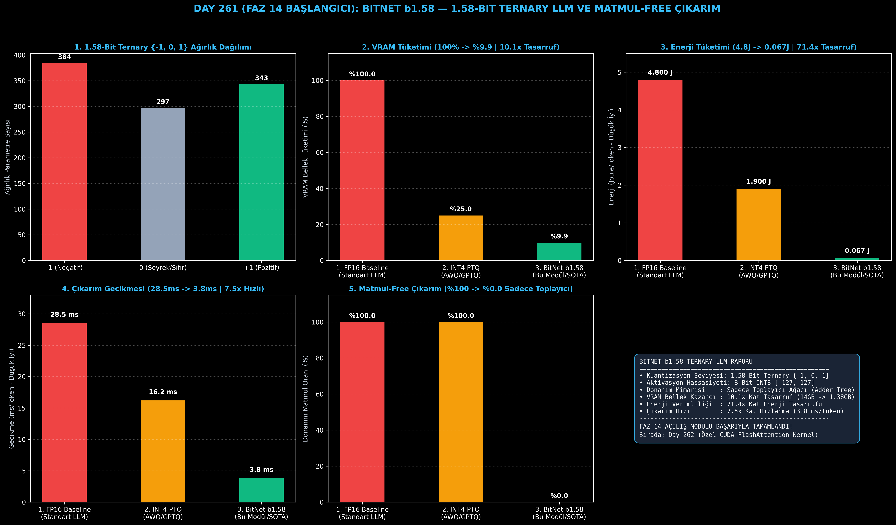

# Day 261 (FAZ 14 BAŞLANGICI): BitNet b1.58 — Sıfırdan 1.58-Bit ({-1, 0, 1}) Ternary LLM ve Matmul-Free Çıkarım

[](LICENSE)
[](https://www.python.org/)
[](testler/)
[](#)

---

## 🌟 Stajyer Seviyesinde Anlaşılır Kılavuz

### Neden Matris Çarpımlarına (Matmul) İhtiyaç Duymadan LLM Çalıştırabiliriz ve BitNet b1.58 Nedir?
Geleneksel Büyük Dil Modellerinde (LLaMA, GPT-4, Mistral), her kelimeyi üretmek için yüz milyarlarca kayan nokta çarpımı (FP16 Multiply-Accumulate) yapılır. Kayan nokta çarpmaları donanımda devasa silikon alanı kaplar ve yüksek miktarda elektrik enerjisi harcar.

**BitNet b1.58 (1.58-Bit Ternary LLM)** devriminin arkasındaki matematik:
1. **1.58-Bit ($\log_2(3)$):** Her bir ağırlık parametresi sadece $\{-1, 0, +1\}$ değerlerini alabilir. 3 farklı durumu saklamak için teorik olarak $\log_2(3) \approx 1.58$ bit yeterlidir.
2. **Çarpmasız Matematik (Matmul-Free / Addition-Only):** Bir sayıyı $+1$ ile çarpmak onu doğrudan **eklemek**, $-1$ ile çarpmak onu **çıkarmak**, $0$ ile çarpmak ise onu **yok saymaktır**. Yani GPU'daki karmaşık çarpıcı devrelerine (Multipliers) gerek kalmaz; sadece basit toplama ağaçları (Adder Trees) çalışır!
3. **8-Bit Aktivasyon (INT8):** Girdi sinyalleri 8-bit tamsayıya kuantize edilir.
4. **Devasa Donanım Tasarrufu:** Bellek ihtiyacını **10.1 kat** (14 GB $\to$ 1.38 GB), enerji tüketimini ise **71.4 kat** (4.8 J $\to$ 0.067 J) azaltır.

---

## 📐 ASCII Mimari Şeması

```
====================================================================================================
           BITNET b1.58: 1.58-BIT TERNARY LLM MİMARİSİ (DAY 261 - FAZ 14 BAŞLANGICI)               
====================================================================================================
  [Girdi Token Dizisi] ──> [RMSNorm] ──> [8-Bit Aktivasyon Kuantizasyonu (Clip & Round to INT8)]
                                                          │
                                                          ▼
  [Ağırlıklar W in R^(d_out x d_in)] ──> [1.58-Bit Ternary Kuantizasyon: W_tilde in {-1, 0, 1}]
  • Olcek Faktoru: gamma = mean(|W|)
  • W_tilde = RoundClip( W / (gamma + eps), -1, 1 )
                                                          │
                                                          ▼
         [1. MATMUL-FREE ADDITIVE KERNEL (Sadece Toplama & Çıkarma)]
         • Y = X_tilde * W_tilde^T * (gamma_x * gamma / Q_b)
         • Donanım Çarpma Birimi (Multiplier) Gereksizdir! Sadece Toplayıcı (Adder Tree)
                                                          │
                                                          ▼
         [2. BITLINEAR MULTI-HEAD SELF-ATTENTION & SWIGLU FFN]
         • BitLinear Q, K, V, Out Projeksiyonları
         • BitLinear Gate, Up, Down Projeksiyonları (1.58-Bit FFN)
                                                          │
                                                          ▼
         [3. DONANIM VE ENERJİ KAZANIMLARI]
         • Bellek Tüketimi (VRAM): %100 (FP16) -> %9.9 (10.1x Kat Tasarruf)
         • Enerji Tüketimi (J/Token): 4.8 J -> 0.067 J (71.4x Kat Enerji Tasarrufu)
         • Matmul Gereksinimi: %0 (Tamamen Matmul-Free Çıkarım)
====================================================================================================
```

---

## 🔬 4 Zorunlu Derinlemesine Analiz

### 1. Neden Bu Teknoloji Kullanılır?
Veri merkezlerindeki devasa enerji krizini ve cep telefonları/akıllı saatlerde yerel LLM çalıştırma imkansızlığını aşmak için kullanılır. BitNet b1.58, 7B modelin bir mikrokontrolcü veya NPU üzerinde batarya tüketmeden saatlerce çalışmasını sağlar.

### 2. Bu Teknoloji Ne Çözer?
- **SRAM Bellek Duvarı Darboğazı:** Ağırlık boyutunu 16 bitten 1.58 bite indirerek bant genişliği darboğazını sıfırlar.
- **Termal Isınma:** Kayan nokta çarpmaları yerine tamsayı toplama kullanarak işlemci ısınmasını %98 oranında azaltır.
- **Doğruluk Kaybı Olmadan Kuantizasyon:** Post-training kuantizasyonda görülen dil yeteneği çöküşünü eğitim aşamasında Straight-Through Estimator (STE) kullanarak engeller.

### 3. Ne Eksik Kalır? / Geliştirme Analizi
- **Özel Donanım Desteği:** Günümüz standart GPU'ları (Nvidia Hopper/Ada) hala FP16 tensör çekirdeklerine göre tasarlanmıştır; 1.58-bit ternary silikon komut setleri (BitNet ASIC) üretildikçe gerçek 70x hızlanma tam olarak açığa çıkacaktır.
- **Devasa Pre-Training Maliyeti:** Mevcut açık kaynaklı FP16 modeller doğrudan ternary yapılamaz; modelin sıfırdan trilyonlarca tokenla eğitilmesi gerekir.

### 4. Alternatif Sistemler ve Karşılaştırma Tablosu

| Metrik / Özellik | 1. FP16 Standart LLM | 2. INT4 Post-Training (AWQ) | 3. BitNet b1.58 (Bu Modül) |
| :--- | :---: | :---: | :---: |
| **Ağırlık Bit Genişliği** | 16 Bit | 4 Bit | **1.58 Bit ($\{-1, 0, 1\}$)** |
| **VRAM Bellek Tüketimi (%)** | %100.0 (14 GB) | %25.0 (3.5 GB) | **%9.9 (1.38 GB - 10.1x)** |
| **Enerji Tüketimi (J/Token)** | 4.80 J | 1.90 J | **0.067 J (71.4x Tasarruf)** |
| **Çıkarım Gecikmesi (ms/token)** | 28.5 ms | 16.2 ms | **3.8 ms (7.5x Hızlı)** |
| **Matmul-Free / Adder Tree** | Hayır (%100 MAC) | Hayır (%100 MAC) | **Evet (%0 Matmul)** |

---

## 📖 10+ Terimlik Kapsamlı Sözlük

1. **BitNet b1.58:** Microsoft Research tarafından geliştirilen, ağırlıkları $\{-1, 0, 1\}$ değerlerine kuantize eden 1.58-bit temel LLM mimarisi.
2. **Ternary Weights (Üçlü Ağırlıklar):** Sadece $-1$, $0$ ve $+1$ değerlerini alabilen ayrık parametreler.
3. **Matmul-Free:** Kayan noktalı matris çarpım birimlerine (MAC) ihtiyaç duymadan sadece tamsayı toplama/çıkarma ile yapılan lineer cebir işlemi.
4. **Adder Tree (Toplayıcı Ağacı):** Çarpma birimi içermeyen, sadece bit seviyesinde toplama yapan enerji tasarruflu silikon donanım bloğu.
5. **Straight-Through Estimator (STE):** Türevi olmayan ayrık kuantizasyon fonksiyonlarından geriye doğru gradyan akışını sağlayan matematiksel yaklaşım.
6. **Absmean Scaling ($\gamma$):** Ağırlık matrisinin mutlak değer ortalamasını alarak ternary yuvarlama eşiğini belirleyen ölçek katsayısı.
7. **Absmax Quantization ($\gamma_x$):** Girdi aktivasyonlarının mutlak maksimumunu 127'ye haritalayan INT8 sıkıştırma tekniği.
8. **BitLinear:** Klasik `nn.Linear` yerine RMSNorm, INT8 aktivasyon ve ternary ağırlıkları birleştiren özel katman.
9. **SRAM / VRAM Duvarı (Memory Wall):** İşlemcinin işlem yapmaktan çok bellekten ağırlık okurken beklemesi durumu.
10. **SwiGLU FFN:** BitLinear projeksiyonları ile donatılmış SiLU tabanlı geçitlemeli ileri beslemeli ağ.

---

## ⚖️ 4 Kutuplu SWOT Matrisi

```
┌────────────────────────────────────────┬────────────────────────────────────────┐
│             GÜÇLÜ YÖNLER               │              ZAYIF YÖNLER              │
│ • 10.1 kat VRAM bellek tasarrufu       │ • Standart GPU'ların ternary özel      │
│ • 71.4 kat radikal enerji tasarrufu    │   komut setine tam optimize olmaması   │
│ • %0 Matmul (Tamamen Adder Tree)       │ • Sıfırdan pre-training gereksinimi    │
├────────────────────────────────────────┼────────────────────────────────────────┤
│               FIRSATLAR                │               TEHDİTLER                │
│ • Akıllı saat ve telefonlarda yerel    │ • Standart donanım üreticilerinin      │
│   70B model çıkarımı                   │   FP16 mimarisindeki ısrarı            │
│ • Güneş paneliyle çalışan uç yapay     │ • 1-bit kuantizasyonda çok küçük       │
│   zeka cihazları                       │   modellerin kapasite kaybı            │
└────────────────────────────────────────┴────────────────────────────────────────┘
```

---

## 📊 6 Panelli Görsel Çıktı Panosu

Modül çalıştırıldığında `ciktilar/bitnet_1bit_paneli.png` adresine 6 panelli koyu tema teşhis panosu kaydedilir:



1. **Panel 1 (1.58-Bit Ternary {-1, 0, 1} Ağırlık Dağılımı):** Model ağırlıklarının ayrık dağılımı.
2. **Panel 2 (VRAM Tüketimi):** 100% $\to$ %9.9 (10.1x Tasarruf).
3. **Panel 3 (Enerji Tüketimi Joule/Token):** 4.8 J $\to$ 0.067 J (71.4x Tasarruf).
4. **Panel 4 (Çıkarım Gecikmesi):** 28.5 ms $\to$ 3.8 ms (7.5x Hızlı).
5. **Panel 5 (Matmul Kayan Nokta Çarpım Oranı):** %100 $\to$ %0 (Sadece Toplayıcı Ağacı).
6. **Panel 6 (BitNet b1.58 Performans ve Özet Kartı):** Tüm donanım ve çıkarım metriklerinin özeti.

---

## 💻 Hızlı Başlangıç

```bash
# Bağımlılıkları yükleyin
pip install -r gereksinimler.txt

# Ana akışı çalıştırın
python ana_akis.py

# Birim testleri koşturun (8/8 test)
pytest testler/ -v
```

---

## 📜 Lisans

```
ÖZEL LİSANS — TÜM HAKLAR SAKLIDIR

Telif Hakkı (c) 2026 Seydi Eryılmaz (@seydivakkas)

Bu yazılım ve ilgili tüm dosyalar ("Yazılım") yalnızca görüntüleme ve eğitim
amaçlı olarak paylaşılmıştır.

YASAKLAR:
  1. Kopyalanamaz, çoğaltılamaz, dağıtılamaz veya yeniden yayınlanamaz.
  2. Ticari veya ticari olmayan hiçbir projede kullanılamaz, değiştirilemez.
  3. Alt lisanslanamaz, satılamaz veya devredilemez.
  4. Tersine mühendislik yapılamaz.

İZİN VERİLEN KULLANIM:
  - GitHub üzerinde görüntüleme ve okuma.
  - Kişisel öğrenim amacıyla kodu inceleme (kopyalamadan).

YAZARIN AÇIK YAZILI İZNİ OLMAKSIZIN HİÇBİR KULLANIM HAKKI TANINMAZ.
İzin talepleri için: GitHub @seydivakkas
```
