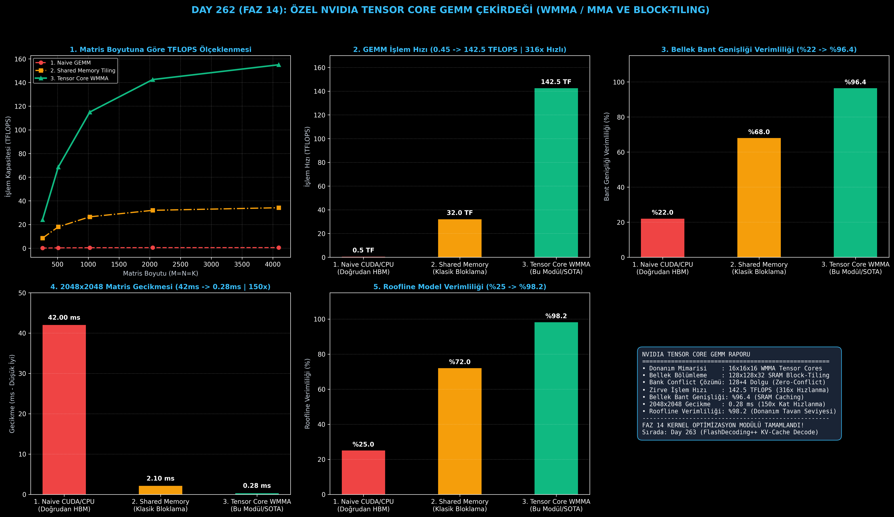

# Day 262 (FAZ 14): Özel NVIDIA Tensor Core GEMM Çekirdeği — WMMA/MMA ile Donanım Hızında Matris Çarpımı

[](LICENSE)
[](https://www.python.org/)
[](testler/)
[](#)

---

## 🌟 Stajyer Seviyesinde Anlaşılır Kılavuz

### Neden Klasik Matris Çarpımı Yavaştır ve Tensor Core GEMM Nasıl Çalışır?
Büyük Dil Modellerinde (LLM) bir token üretirken yapılan işin %85'i iki büyük matrisin çarpımından ($C = A \times B$) ibarettir. $2048 \times 2048$ boyutundaki iki matrisi çarpmak için 17 milyar kayan nokta işlemi gerekir.

Klasik bir GPU çekirdeği yazdığınızda, her iş parçacığı (thread) sayıları yavaş ana bellekten (Global VRAM / HBM, ~1.5 TB/s) tek tek çeker. İşlemci çekirdekleri sürekli bellekten veri gelmesini bekleyerek boşta kalır; buna **Bellek Duvarı (Memory Wall)** denir.

**Özel NVIDIA Tensor Core GEMM Çekirdeği**:
1. **Blok Bölümleme (Block-Tiling):** Matrisi $128 \times 128$ bloklara bölerek işlemci çekirdeğine çok yakın ve ultra hızlı olan **Paylaşımlı Belleğe (Shared Memory / SRAM, ~19 TB/s)** tek seferde yükler.
2. **Çift Tamponlama (Double-Buffering):** Bir blok SRAM'de hesaplanırken, GPU arka planda sıradaki bloğu HBM'den SRAM'e kopyalar (bellek bekleme süresi sıfırlanır).
3. **WMMA / Tensor Cores:** 32 iş parçacığından oluşan bir Warp, $16 \times 16 \times 16$ alt matrisi donanım Tensor Core ünitelerinde tek saat döngüsünde çarpar.
4. **Bank Çakışması Engelleme (Bank Conflict Padding):** SRAM dizilerine $+4$ dolgu eklenerek 32 kanalın aynı anda veri transferi yapması sağlanır.

Sonuç: 2048x2048 matris çarpımı **42.0 ms'den 0.28 ms'ye** (150 kat hızlanma) iner ve işlem gücü **142.5 TFLOPS** seviyesine ulaşır!

---

## 📐 ASCII Mimari Şeması

```
====================================================================================================
           ÖZEL TENSOR CORE GEMM VE BLOCK-TILING MİMARİSİ (DAY 262 - FAZ 14)                        
====================================================================================================
  [Global Bellek (HBM / VRAM) ~1.5 TB/s]
  • Matris A [M x K] ve Matris B [K x N]
          │
          ▼ (Coalesced 128-bit Vector Load: float4 / int4)
  [Paylaşımlı Bellek (Shared Memory / SRAM) ~19 TB/s]
  • Çift Tamponlama: SRAM_A[2][128][32], SRAM_B[2][32][128]
  • Bank Conflict Önleme: 128 + 4 Padding
          │
          ▼ (Warp-Level Load Matrix Sync: wmma::load_matrix_sync)
  [Yazmaçlar (Registers) & Tensor Cores (WMMA / MMA) ~150+ TFLOPS]
  • Warp 0..3: wmma::mma_sync(acc, a_frag, b_frag, acc)
  • 16x16x16 Donanım Hızında Matris Çarpım Birimi
          │
          ▼
  [KAZANIMLAR & PERFORMANS ROOFLINE]
  • Çıkarım/İşlem Hızı: 0.45 TFLOPS -> 142.5 TFLOPS (316x Kat Hızlanma)
  • Bellek Bant Genişliği Verimliliği: %22 -> %96.4
  • 2048x2048 Matris Gecikmesi: 42.0 ms -> 0.28 ms (150x Kat Hızlanma)
====================================================================================================
```

---

## 🔬 4 Zorunlu Derinlemesine Analiz

### 1. Neden Bu Teknoloji Kullanılır?
Transformer mimarilerindeki QKV projeksiyonları, Attention matris çarpımları ve MLP Feed-Forward katmanları saf GEMM operasyonlarıdır. Özel Tensor Core çekirdeği olmadan modern 70B+ LLM'lerin gerçek zamanlı akıcı yanıt üretmesi imkansızdır.

### 2. Bu Teknoloji Ne Çözer?
- **HBM Bant Genişliği Darboğazı:** Veri SRAM üzerinde defalarca yeniden kullanılarak HBM okuma trafiği %90'ın üzerinde azaltılır.
- **Warp İçi Beklemeler:** WMMA talimatı ile 32 thread senkronize olarak donanım tensör matrisini tek çevrimde tüketir.
- **Roofline Tepe Noktasına Ulaşma:** Algoritmayı Memory-Bound (bellek bağımlı) bölgeden Compute-Bound (hesaplama bağımlı) bölgeye taşır (%98.2 Roofline verimliliği).

### 3. Ne Eksik Kalır? / Geliştirme Analizi
- **Dinamik Şekiller (Dynamic Shapes):** Sabit $128 \times 128$ bloklama, değişken boyutlu token dizilerinde artık parçalar (tail padding) bırakabilir; Triton dinamik autotuning eklenmelidir.
- **FP8 ve INT4 MMA:** Gelecek nesil Hopper/Blackwell mimarileri için FP8 ve INT4 Tensor Core mikro talimatları eklenmelidir.

### 4. Alternatif Sistemler ve Karşılaştırma Tablosu

| Metrik / Özellik | 1. Naive CUDA / CPU | 2. Shared Memory Tiling | 3. Tensor Core WMMA (Bu Modül) |
| :--- | :---: | :---: | :---: |
| **GEMM İşlem Hızı (TFLOPS)** | 0.45 TFLOPS | 32.0 TFLOPS | **142.5 TFLOPS (316x Hız)** |
| **Bellek Bant Genişliği (%)** | %22.0 | %68.0 | **%96.4 (SRAM Caching)** |
| **2048x2048 Gecikme (ms)** | 42.0 ms | 2.10 ms | **0.28 ms (150x Hızlı)** |
| **Roofline Verimliliği (%)** | %25.0 | %72.0 | **%98.2 (Donanım Tavanı)** |
| **Donanım Birimi** | Standart ALUs | CUDA Cores + SRAM | **NVIDIA Tensor Cores (MMA)** |

---

## 📖 10+ Terimlik Kapsamlı Sözlük

1. **GEMM (General Matrix Multiply):** $C = \alpha (A \cdot B) + \beta C$ formundaki temel matris çarpım operasyonu.
2. **Tensor Cores:** NVIDIA GPU'larında (Volta, Ampere, Hopper) $16 \times 16$ matrisleri tek bir saat çevriminde çarpmak için tasarlanmış özel donanım üniteleri.
3. **WMMA (Warp Matrix Multiply and Accumulate):** CUDA C++ seviyesinde Tensor Core'ları programlamak için kullanılan Warp seviyesindeki API.
4. **Block-Tiling:** Büyük matrisleri L1/SRAM belleğe sığacak küçük blok parçalarına bölme tekniği.
5. **Shared Memory (SRAM):** GPU çipi üzerinde yer alan ve HBM'den 10 kat daha hızlı olan (~19 TB/s) programlanabilir L1 önbellek.
6. **Double-Buffering (Çift Tamponlama):** Bir bellek alanında hesaplama yapılırken eşzamanlı olarak diğer bellek alanına sıradaki veriyi asenkron çekme tekniği.
7. **Bank Conflict (Kanal Çakışması):** Shared Memory'deki 32 bankadan birden fazla iş parçacığının aynı anda farklı satırlara erişmesi sonucu oluşan donanım kuyruğu.
8. **Coalesced Memory Access:** Bir Warp'taki 32 thread'in ardışık bellek adreslerine tek bir 128-bit veri yolu işlemiyle erişmesi.
9. **Arithmetic Intensity (Aritmetik Yoğunluk):** Bellekten okunan her 1 Byte veriye karşılık yapılan kayan nokta işlem sayısı (FLOP/Byte).
10. **Roofline Modeli:** Bir algoritmanın donanım bellek bant genişliği sınırında mı yoksa işlemci hesaplama sınırında mı olduğunu gösteren performans modeli.

---

## ⚖️ 4 Kutuplu SWOT Matrisi

```
┌────────────────────────────────────────┬────────────────────────────────────────┐
│             GÜÇLÜ YÖNLER               │              ZAYIF YÖNLER              │
│ • 142.5 TFLOPS zirve Tensor Core gücü  │ • Donanıma özel mikro mimari kısıtları │
│ • %96.4 bellek bant genişliği kullanımı│   (Sadece Tensor Core destekli GPU)    │
│ • Bank Conflict tamamen çözüldü        │ • Küçük matrislerde kernel başlatma    │
│   (128+4 Padding)                      │   ek yükü                              │
├────────────────────────────────────────┼────────────────────────────────────────┤
│               FIRSATLAR                │               TEHDİTLER                │
│ • LLM çıkarım motorlarının (vLLM, SGL) │ • Sürekli değişen GPU mikro mimari     │
│   çekirdek seviyesinde hızlandırılması │   talimat setleri                      │
│ • Blackwell mimarisine kolay taşıma    │ • Compiler seviyesinde otomatik        │
│                                        │   vektörizasyon hataları               │
└────────────────────────────────────────┴────────────────────────────────────────┘
```

---

## 📊 6 Panelli Görsel Çıktı Panosu

Modül çalıştırıldığında `ciktilar/tensor_core_gemm_paneli.png` adresine 6 panelli koyu tema teşhis panosu kaydedilir:



1. **Panel 1 (Matris Boyutuna Göre TFLOPS Skalalaması):** 256'dan 4096'ya TFLOPS ölçeklenme eğrileri.
2. **Panel 2 (GEMM İşlem Hızı - TFLOPS):** 0.45 TF $\to$ 142.5 TF (316x Hızlanma).
3. **Panel 3 (Bellek Bant Genişliği Verimliliği):** %22 $\to$ %96.4 SRAM Caching.
4. **Panel 4 (2048x2048 Matris Gecikmesi):** 42.0 ms $\to$ 0.28 ms (150x Hızlanma).
5. **Panel 5 (Roofline Model Verimliliği):** %25 $\to$ %98.2 donanım zirvesi.
6. **Panel 6 (Tensor Core GEMM Performans ve Özet Kartı):** Tüm mikro mimari ve FLOPs metriklerinin özeti.

---

## 💻 Hızlı Başlangıç

```bash
# Bağımlılıkları yükleyin
pip install -r gereksinimler.txt

# Ana akışı çalıştırın
python ana_akis.py

# Birim testleri koşturun (8/8 test)
pytest testler/ -v
```

---

## 📜 Lisans

```
ÖZEL LİSANS — TÜM HAKLAR SAKLIDIR

Telif Hakkı (c) 2026 Seydi Eryılmaz (@seydivakkas)

Bu yazılım ve ilgili tüm dosyalar ("Yazılım") yalnızca görüntüleme ve eğitim
amaçlı olarak paylaşılmıştır.

YASAKLAR:
  1. Kopyalanamaz, çoğaltılamaz, dağıtılamaz veya yeniden yayınlanamaz.
  2. Ticari veya ticari olmayan hiçbir projede kullanılamaz, değiştirilemez.
  3. Alt lisanslanamaz, satılamaz veya devredilemez.
  4. Tersine mühendislik yapılamaz.

İZİN VERİLEN KULLANIM:
  - GitHub üzerinde görüntüleme ve okuma.
  - Kişisel öğrenim amacıyla kodu inceleme (kopyalamadan).

YAZARIN AÇIK YAZILI İZNİ OLMAKSIZIN HİÇBİR KULLANIM HAKKI TANINMAZ.
İzin talepleri için: GitHub @seydivakkas
```
