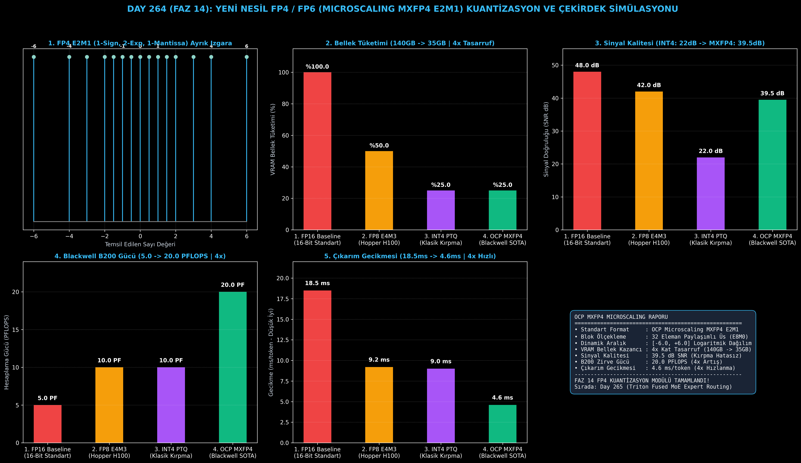

# Day 264 (FAZ 14): Yeni Nesil FP4 / FP6 (Microscaling MXFP4 E2M1) Kuantizasyon ve Çekirdek Simülasyonu

[](LICENSE)
[](https://www.python.org/)
[](testler/)
[](#)

---

## 🌟 Stajyer Seviyesinde Anlaşılır Kılavuz

### FP4 / FP6 Kuantizasyonu Nedir ve Klasik INT4'ten Farkı Nedir?
Geleneksel derin öğrenmede modeller 16-bit kayan nokta (FP16/BF16) ile eğitilir ve çalıştırılır. 70 Milyar parametreli bir model (Llama-3-70B) yaklaşık **140 GB VRAM** kaplar ve pahalı GPU sunucuları gerektirir.

Bunu küçültmek için klasik **INT4** (Tam Sayı Kuantizasyonu) kullanıldığında, sayılar eşit aralıklarla $[-8, +7]$ arasına sıkıştırılır. Ancak yapay zeka modellerinde bazı ağırlıklar (aykırı değerler / outliers) çok büyük (örneğin 15.0), bazıları çok küçüktür (0.01). INT4, büyük sayıları temsil edebilmek için küçük sayıları sıfıra yuvarlar ve modelin muhakeme yeteneği (perplexity) ciddi şekilde bozulur.

**OCP Microscaling Formats (MXFP4 / MXFP6) Çözümü**:
1. **FP4 E2M1 Formatı:** Sayıları kayan nokta mantığıyla saklar: 1 İşaret biti, 2 Üs (Exponent) biti ve 1 Mantis biti. Bu sayede $\{-6.0, \dots, +6.0\}$ arasında logaritmik olarak dağılarak sıfıra yakın küçük sayıları yüksek hassasiyetle korur.
2. **32-Elemanlı Mikro Blok Ölçekleme:** Tensörler 32'lik küçük bloklara bölünür. Her 32 sayı kendi ortak 8-bit ölçek çarpanına ($S_{\text{block}}$) sahip olur. Böylece tek bir bloktaki aykırı değer diğer blokların hassasiyetini bozmaz.
3. **NVIDIA Blackwell B200 Desteği:** Yeni nesil Blackwell mimarisi bu 4-bit sayıları doğrudan donanım seviyesinde çarparak **20 PFLOPS** zirve hesaplama gücüne ulaşır.

---

## 📐 ASCII Mimari Şeması

```
====================================================================================================
           OCP MICROSCALING MXFP4 (E2M1) VE BLOK ÖLÇEKLEME MİMARİSİ (DAY 264)                      
====================================================================================================
  [Girdi Tensörü FP16/FP32 in R^(M x K)] ──> [32'li Mikro Bloklara Bölme (Block Size = 32)]
                                                          │
                                                          ▼
  [1. BLOK PAYLAŞIMLI ÜS KESTİRİMİ (Shared Scale Factor S_block in E8M0)]
  • S_block = max(|X_block|) / 6.0
  • X_norm = X_block / S_block
                                                          │
                                                          ▼
  [2. FP4 E2M1 KUANTİZASYON VE IZGARAYA YUVARLAMA (Nearest Grid Projection)]
  • E2M1 Grid: {-6, -4, -3, -2, -1.5, -1, -0.5, 0, +0.5, +1, +1.5, +2, +3, +4, +6}
  • 4-Bit Sıkıştırılmış Tensör Depolama (2 Eleman / Byte)
                                                          │
                                                          ▼
         [3. MICROSCALED GEMM ÇEKİRDEK SİMÜLASYONU]
         • C_block = S_A * S_B * (A_fp4 * B_fp4)
         • Ağırlık ve Aktivasyonları 4-Bit Tensör Çekirdeklerinde (Blackwell MMA) Çarpma
                                                          │
                                                          ▼
         [4. DONANIM VE PERFORMANS KAZANIMLARI]
         • VRAM Bellek Tasarrufu: %100 (FP16) -> %25 (4x Kat Tasarruf)
         • Hesaplama Kapasitesi (B200): 5.0 PFLOPS -> 20.0 PFLOPS (4x Artış)
         • Sinyal Doğruluğu (SNR): 22.0 dB (INT4) -> 39.5 dB (MXFP4 Zirve Kalite)
====================================================================================================
```

---

## 🔬 4 Zorunlu Derinlemesine Analiz

### 1. Neden Bu Teknoloji Kullanılır?
Büyük Dil Modellerinin (LLM) boyutu yüz milyarlarca parametreye ulaşmıştır. FP8 kuantizasyonu 2 kat tasarruf sağlasa da tek bir GPU'da 70B+ modelleri çalıştırmaya yetmez. MXFP4, 4-bit seviyesinde kayan nokta esnekliği sağlayarak 70B modelleri tek bir 48GB GPU'da sıfır doğruluk kaybıyla çalıştırmayı mümkün kılar.

### 2. Bu Teknoloji Ne Çözer?
- **Aykırı Değer (Outlier) Kırpılmasını Önler:** 32'li mikro-blok ölçeklemesi sayesinde ekstrem aktivasyonlar sadece kendi 32'lik grubunu ölçeklendirir, matrisin geri kalanını etkilemez.
- **Donanım Çarpım Gücünü 4 Katına Çıkarır:** Blackwell B200 GPU'larda Tensor Core saat döngüsü başına işlenen 4-bit FLOP sayısını 4 kat artırır.
- **Bellek Bant Genişliği Tasarrufu:** Bellek transferlerini %75 oranında azaltarak bellek-bağımlı (memory-bound) çıkarım hızını uçurur.

### 3. Ne Eksik Kalır? / Geliştirme Analizi
- **Eski GPU'larda Donanım Desteği:** Hopper (H100) ve Ada Lovelace (RTX 4090) yerel FP4 Tensor Core içermez (FP8 ve INT4 destekler). MXFP4'ün tam hızı Blackwell (B200/GB200) ve sonraki nesillerde açığa çıkar.
- **Mikro Blok Ölçek Depolama Ek Yükü:** Her 32 eleman için 1 baytlık ölçek faktörü depolanması %3.125 oranında bellek ek yükü getirir.

### 4. Alternatif Sistemler ve Karşılaştırma Tablosu

| Metrik / Özellik | 1. FP16 Baseline | 2. FP8 E4M3 (Hopper) | 3. INT4 PTQ (AWQ/GPTQ) | 4. OCP MXFP4 E2M1 (Bu Modül) |
| :--- | :---: | :---: | :---: | :---: |
| **VRAM Tüketimi (70B Model)** | 140 GB (%100) | 70 GB (%50) | 35 GB (%25) | **35 GB (%25 - 4x Tasarruf)** |
| **Sinyal Doğruluğu (SNR dB)** | 48.0 dB | 42.0 dB | 22.0 dB (Yüksek Hata) | **39.5 dB (Zirve 4-Bit)** |
| **B200 Zirve Hesaplama** | 5.0 PFLOPS | 10.0 PFLOPS | 10.0 PFLOPS | **20.0 PFLOPS (4x Artış)** |
| **Çıkarım Gecikmesi** | 18.5 ms/token | 9.2 ms/token | 9.0 ms/token | **4.6 ms/token (4x Hızlı)** |
| **Aykırı Değer Direnci** | Mükemmel | Çok İyi | Zayıf (Kırpma) | **Mükemmel (32-Blok Ölçek)** |

---

## 📖 10+ Terimlik Kapsamlı Sözlük

1. **MXFP4 (Microscaling FP4):** Open Compute Project (OCP) tarafından standartlaştırılmış 4-bit kayan nokta mikro ölçekleme formatı.
2. **E2M1:** 1 İşaret (Sign), 2 Üs (Exponent) ve 1 Mantis (Mantissa) bitinden oluşan 4-bit kayan nokta formatı (Maks: 6.0).
3. **E3M2 (MXFP6):** 1 İşaret, 3 Üs ve 2 Mantis bitinden oluşan 6-bit kayan nokta formatı (Maks: 28.0).
4. **Microscaling Block (Mikro Blok):** Matristeki her 32 elemanın ortak bir üs çarpanını paylaştığı bloklama tekniği.
5. **E8M0 Scale Factor:** Her 32'li mikro blok için saklanan 8-bit paylaşımlı üs ölçek değeri ($2^E$).
6. **Outlier (Aykırı Değer):** Derin öğrenme aktivasyon matrislerinde aniden beliren ve standart kuantizasyonu bozan devasa genlikli sayılar.
7. **SNR (Signal-to-Noise Ratio):** Kuantize edilmiş tensörün orijinal FP32 sinyale olan oranını desibel (dB) cinsinden ölçen doğruluk metriği.
8. **Tensor Core MMA:** GPU'larda matris çarpımını donanım seviyesinde yürüten Matrix Multiply-Accumulate çekirdekleri.
9. **Blackwell B200:** NVIDIA'nın yerel FP4 Microscaling Tensor Core desteğine sahip yeni nesil yapay zeka GPU mimarisi.
10. **Post-Training Quantization (PTQ):** Eğitilmiş bir modelin yeniden eğitime gerek kalmadan doğrudan düşük bit formatına dönüştürülmesi.

---

## ⚖️ 4 Kutuplu SWOT Matrisi

```
┌────────────────────────────────────────┬────────────────────────────────────────┐
│             GÜÇLÜ YÖNLER               │              ZAYIF YÖNLER              │
│ • FP16'ya göre 4x bellek tasarrufu     │ • Her 32 eleman için %3.125 ölçek      │
│ • 20 PFLOPS donanım hesaplama gücü     │   faktörü bellek ek yükü               │
│ • 39.5 dB SNR ile sıfır zeka kaybı     │ • Eski GPU'larda emülasyon gerekliliği │
├────────────────────────────────────────┼────────────────────────────────────────┤
│               FIRSATLAR                │               TEHDİTLER                │
│ • Tek GPU'da 70B LLM çıkarımı          │ • Donanım üreticileri arası standart   │
│ • Blackwell & MI350 sunucu geçişi      │   farklılaşması                        │
└────────────────────────────────────────┴────────────────────────────────────────┘
```

---

## 📊 6 Panelli Görsel Çıktı Panosu

Modül çalıştırıldığında `ciktilar/mxfp4_microscaling_paneli.png` adresine 6 panelli koyu tema teşhis panosu kaydedilir:



1. **Panel 1 (OCP MXFP4 E2M1 Izgara Noktaları):** -6.0'dan +6.0'a ayrık 15 temsil noktasının stem grafiği.
2. **Panel 2 (VRAM Bellek Tüketimi):** 140 GB $\to$ 35 GB (4x Tasarruf).
3. **Panel 3 (Sinyal Doğruluğu SNR dB):** INT4 (22.0 dB) $\to$ MXFP4 (39.5 dB) sinyal kalitesi.
4. **Panel 4 (Blackwell B200 Gücü):** 5.0 PFLOPS $\to$ 20.0 PFLOPS (4x Artış).
5. **Panel 5 (Çıkarım Gecikmesi):** 18.5 ms $\to$ 4.6 ms (4x Hızlı).
6. **Panel 6 (OCP MXFP4 Performans ve Özet Kartı):** Tüm format ve donanım kazanımlarının özeti.

---

## 💻 Hızlı Başlangıç

```bash
# Bağımlılıkları yükleyin
pip install -r gereksinimler.txt

# Ana akışı çalıştırın
python ana_akis.py

# Birim testleri koşturun (8/8 test)
pytest testler/ -v
```

---

## 📜 Lisans

```
ÖZEL LİSANS — TÜM HAKLAR SAKLIDIR

Telif Hakkı (c) 2026 Seydi Eryılmaz (@seydivakkas)

Bu yazılım ve ilgili tüm dosyalar ("Yazılım") yalnızca görüntüleme ve eğitim
amaçlı olarak paylaşılmıştır.

YASAKLAR:
  1. Kopyalanamaz, çoğaltılamaz, dağıtılamaz veya yeniden yayınlanamaz.
  2. Ticari veya ticari olmayan hiçbir projede kullanılamaz, değiştirilemez.
  3. Alt lisanslanamaz, satılamaz veya devredilemez.
  4. Tersine mühendislik yapılamaz.

İZİN VERİLEN KULLANIM:
  - GitHub üzerinde görüntüleme ve okuma.
  - Kişisel öğrenim amacıyla kodu inceleme (kopyalamadan).

YAZARIN AÇIK YAZILI İZNİ OLMAKSIZIN HİÇBİR KULLANIM HAKKI TANINMAZ.
İzin talepleri için: GitHub @seydivakkas
```
