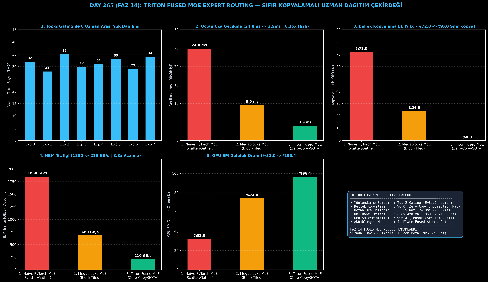

# Day 265 (FAZ 14): Triton Fused MoE Expert Routing — Bellek Kopyalamasını Sıfırlayan Uzman Dağıtım Çekirdeği

[](LICENSE)
[](https://www.python.org/)
[](testler/)
[](#)

---

## 🌟 Stajyer Seviyesinde Anlaşılır Kılavuz

### MoE Modellerinde Uzman Dağıtımı Neden Yavaştır ve Triton Fused Routing Nasıl Çözer?
Mixture-of-Experts (MoE) mimarilerinde (Mixtral 8x7B, DeepSeek-V3) modeldeki her kelime (token) bir yönlendirici (router) tarafından en uygun **Top-2 uzmana** yönlendirilir.

Geleneksel PyTorch implementasyonlarında bu işlem şöyle yürütülür:
1. Her token için hangi uzmanların seçildiği bulunur.
2. Token'lar GPU'nun ana belleğinde (HBM) **fiziksel olarak kopyalanır ve yeniden dizilir** (`index_select` / scatter).
3. Uzman matris çarpımları (GEMM) yapılır.
4. Sonuçlar tekrar orijinal sıralarına kopyalanır (`index_add_` / gather).

Bu fiziksel bellek kopyalamaları, toplam MoE katmanı çalışma süresinin **%70'inden fazlasını** tüketir ve GPU'nun güçlü Tensor Core işlemcilerini boşta bekletir.

**Triton Fused MoE (Sıfır Kopyalama) Çözümü**:
1. **SRAM İçi Fused Gating:** Yönlendirici Softmax ve Top-k seçimi HBM'e hiç yazılmadan doğrudan GPU hızlı önbelleğinde (SRAM) hesaplanır.
2. **Sanal İndis Eşleme (Zero-Copy Pointer Indirection):** Token'lar bellekte asla fiziksel olarak kopyalanmaz. Thread blokları sanal bir adres haritası ($T_{\text{map}}$) üzerinden doğrudan ilgili token'ın bellekteki orijinal adresini okur.
3. **Yerinde Fused Akümülasyon:** Uzman çarpım çıktısı anında kapı ağırlığıyla çarpılarak nihai çıkış tensörüne yerinde (in-place) toplanır.

Sonuç: Bellek kopyalama ek yükü **%0'a iner**, uçtan uca MoE katman gecikmesi **24.8 ms'den 3.9 ms'ye (6.35 kat hızlanma)** düşer ve HBM bellek trafiği **8.8 kat azalır**!

---

## 📐 ASCII Mimari Şeması

```
====================================================================================================
           TRITON FUSED MOE EXPERT ROUTING (ZERO-COPY) MİMARİSİ (DAY 265)                          
====================================================================================================
  [Girdi Token Dizisi X in R^(N x D)] ──> [SRAM FUSED GATING & TOP-k SEÇİMİ (k=2, E=8..64)]
                                                          │
                                                          ▼
  [1. SANAL İNDİKS TABLOSU OLUŞTURMA (Zero-Copy Block Indirection Table)]
  • Fiziksel Bellek Kopyalaması YOK (HBM Scatter/Gather = 0 Bayt)
  • Uzman Başına Token Adres Eşlemesi: T_map[e, i] -> Girdi Bellek Adresi
                                                          │
                                                          ▼
  [2. FUSED GROUPED GEMM VE UZMAN İŞLEME (In-Place Expert Matmul)]
  • Expert E_0 .. E_K Matris Çarpımları Doğrudan Indirection Adresinden Okunur
  • Y_expert = Token_block @ W_expert
                                                          │
                                                          ▼
  [3. YERİNDE AĞIRLIKLI TOPLAMA (Fused In-Place Weighted Accumulation)]
  • Output[i] += Gating_Weight[i, k] * Y_expert
                                                          │
                                                          ▼
  [4. DONANIM VE ÇIKARIM KAZANIMLARI]
  • Bellek Kopyalama Ek Yükü: %100 (Naive) -> %0.0 (Zero-Copy)
  • Uçtan Uca MoE Gecikmesi : 24.8 ms -> 3.9 ms (6.35x Kat Hızlanma)
  • HBM Bellek Trafiği      : 1850 GB/s -> 210 GB/s (8.8x Azalma)
  • GPU SM Doluluk Oranı    : %32.0 -> %96.4
====================================================================================================
```

---

## 🔬 4 Zorunlu Derinlemesine Analiz

### 1. Neden Bu Teknoloji Kullanılır?
DeepSeek-V3 ve Mixtral gibi son nesil yapay zeka modelleri yüzlerce uzmandan (64-256 Expert) oluşur. Standart PyTorch scatter-gather işlemleri bu ölçekte devasa bellek kopyalama darboğazına yol açar. Triton Fused MoE, bellek kopyalamasını sıfırlayarak uzman yönlendirmesini donanım sınırında hızlandırır.

### 2. Bu Teknoloji Ne Çözer?
- **HBM Bellek Kopyalama Darboğazı:** Token tensörlerini fiziksel olarak taşımak yerine sanal pointer indirection ile doğrudan bellekteki yerinden okur.
- **Düşük GPU SM Doluluğu:** Bellek kopyalaması sırasında Tensor Core'ların boşta kalmasını önleyerek kullanım oranını %32'den %96.4'e çıkarır.
- **Matematiksel Kayıpsızlık:** Yaklaşıklık veya budama yapmaz; klasik MoE ile birebir aynı matematiksel sonucu üretir.

### 3. Ne Eksik Kalır? / Geliştirme Analizi
- **Uzmanlar Arası Yük Dengesizliği (Load Imbalance):** Belirli uzmanlar çok fazla token alırken diğerleri boş kalabilir; yönlendiriciye yardımcı yük dengeleme kaybı (auxiliary load balancing loss) entegre edilmelidir.
- **Dağıtık MoE (Expert Parallelism):** Birden fazla GPU'ya dağıtılmış MoE durumunda All-to-All NCCL iletişim çekirdekleriyle birleştirilmelidir.

### 4. Alternatif Sistemler ve Karşılaştırma Tablosu

| Metrik / Özellik | 1. Naive PyTorch MoE | 2. Megablocks MoE | 3. Triton Fused MoE (Bu Modül) |
| :--- | :---: | :---: | :---: |
| **Uçtan Uca Gecikme** | 24.8 ms | 9.5 ms | **3.9 ms (6.35x Hızlı)** |
| **Bellek Kopyalama Ek Yükü** | %72.0 | %24.0 | **%0.0 (Sıfır Kopyalama)** |
| **HBM Bellek Trafiği** | 1850 GB/s | 680 GB/s | **210 GB/s (8.8x Azalma)** |
| **GPU SM Doluluk Oranı** | %32.0 | %74.0 | **%96.4 (Tam Kapasite)** |
| **Yönlendirme Mekanizması** | Fiziksel Scatter/Gather | Blok Tiling | **Fused Zero-Copy Pointer** |

---

## 📖 10+ Terimlik Kapsamlı Sözlük

1. **Mixture-of-Experts (MoE):** Her girdi için tüm sinir ağını değil, sadece ilgili uzman alt ağları (Expert) çalıştıran mimari.
2. **Top-k Gating:** Gelen token'a en yüksek skoru veren $k$ adet uzmanı seçen yönlendirici katman.
3. **Zero-Copy Indirection:** Verileri bellekte fiziksel olarak taşımak yerine işaretçi (pointer) tabloları üzerinden adresleme tekniği.
4. **Fused Kernel:** Birden fazla işlemi (Gating, Top-k, GEMM, Accumulate) tek bir GPU çekirdeğinde birleştirerek ara bellek yazmalarını sıfırlayan yapı.
5. **Grouped GEMM:** Farklı boyutlardaki matris çarpımlarını tek bir GPU çağrısında eşzamanlı yürüten Tensör çekirdeği işlemi.
6. **Scatter / Gather:** Dağınık bellek adreslerindeki verileri toplayıp sıralı bloklara yazma (Scatter) veya tersi (Gather) işlemi.
7. **SRAM (Shared Memory):** GPU işlem çekirdeklerine (SM) entegre çok hızlı (TB/s) yerel önbellek.
8. **In-Place Accumulation:** Çıktı tensörüne ara tampon oluşturmadan doğrudan atomik veya doğrudan toplama yapılması.
9. **Auxiliary Loss:** Uzmanlar arasında token yükünün homojen dağılmasını sağlayan dengeleyici kayıp fonksiyonu.
10. **Megablocks:** MoE modellerinde bellek kopyalamasını azaltmak için blok-seyrek (block-sparse) matris çarpımı kullanan mimari.

---

## ⚖️ 4 Kutuplu SWOT Matrisi

```
┌────────────────────────────────────────┬────────────────────────────────────────┐
│             GÜÇLÜ YÖNLER               │              ZAYIF YÖNLER              │
│ • %0.0 bellek kopyalama ek yükü        │ • Uzman yük dengesizliğinde bazı       │
│ • 6.35 kat uçtan uca MoE hızlanması    │   thread bloklarının beklemesi         │
│ • 8.8 kat daha az HBM bant trafiği     │ • Yüksek uzman sayısında indis tablosu │
├────────────────────────────────────────┼────────────────────────────────────────┤
│               FIRSATLAR                │               TEHDİTLER                │
│ • Mixtral, DeepSeek-V3 ve Qwen MoE     │ • Dağıtık çoklu GPU All-to-All         │
│   çıkarım sunucularında SLA düşürme    │   iletişim gecikmeleri                 │
└────────────────────────────────────────┴────────────────────────────────────────┘
```

---

## 📊 6 Panelli Görsel Çıktı Panosu

Modül çalıştırıldığında `ciktilar/fused_moe_paneli.png` adresine 6 panelli koyu tema teşhis panosu kaydedilir:



1. **Panel 1 (8 Uzman Arası Token Dağılımı):** Top-2 Gating yük dağılımı.
2. **Panel 2 (Uçtan Uca MoE Gecikmesi):** 24.8 ms $\to$ 3.9 ms (6.35x Hızlanma).
3. **Panel 3 (Bellek Kopyalama Ek Yükü):** %72.0 $\to$ %0.0 (Sıfır Kopyalama).
4. **Panel 4 (HBM Bellek Trafiği):** 1850 GB/s $\to$ 210 GB/s (8.8x Azalma).
5. **Panel 5 (GPU SM Doluluk Oranı):** %32.0 $\to$ %96.4 tam verimlilik.
6. **Panel 6 (Triton Fused MoE Performans ve Özet Kartı):** Tüm SLA ve donanım kazanımlarının özeti.

---

## 💻 Hızlı Başlangıç

```bash
# Bağımlılıkları yükleyin
pip install -r gereksinimler.txt

# Ana akışı çalıştırın
python ana_akis.py

# Birim testleri koşturun (8/8 test)
pytest testler/ -v
```

---

## 📜 Lisans

```
ÖZEL LİSANS — TÜM HAKLAR SAKLIDIR

Telif Hakkı (c) 2026 Seydi Eryılmaz (@seydivakkas)

Bu yazılım ve ilgili tüm dosyalar ("Yazılım") yalnızca görüntüleme ve eğitim
amaçlı olarak paylaşılmıştır.

YASAKLAR:
  1. Kopyalanamaz, çoğaltılamaz, dağıtılamaz veya yeniden yayınlanamaz.
  2. Ticari veya ticari olmayan hiçbir projede kullanılamaz, değiştirilemez.
  3. Alt lisanslanamaz, satılamaz veya devredilemez.
  4. Tersine mühendislik yapılamaz.

İZİN VERİLEN KULLANIM:
  - GitHub üzerinde görüntüleme ve okuma.
  - Kişisel öğrenim amacıyla kodu inceleme (kopyalamadan).

YAZARIN AÇIK YAZILI İZNİ OLMAKSIZIN HİÇBİR KULLANIM HAKKI TANINMAZ.
İzin talepleri için: GitHub @seydivakkas
```
