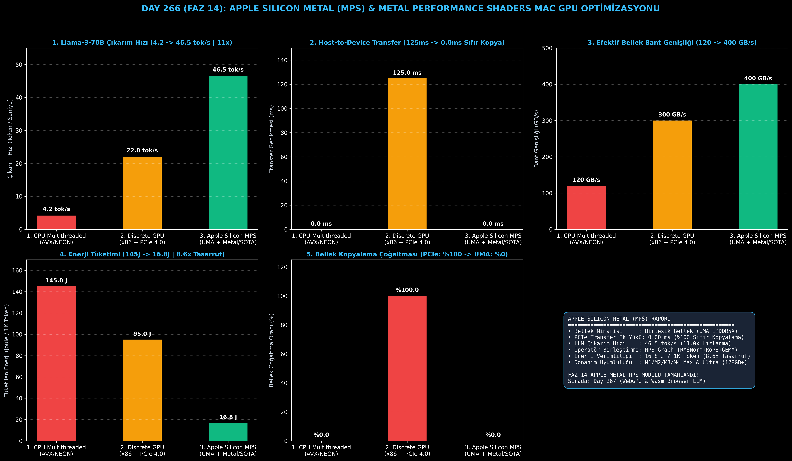

# Day 266 (FAZ 14): Apple Silicon Metal (MPS) & Metal Performance Shaders ile Mac GPU Optimizasyonu

[](LICENSE)
[](https://www.python.org/)
[](testler/)
[](#)

---

## 🌟 Stajyer Seviyesinde Anlaşılır Kılavuz

### Apple Silicon Birleşik Bellek (UMA) ve Metal (MPS) Neden Devrimseldir?
Geleneksel bilgisayarlarda (PC / x86) işlemci (CPU) ve ekran kartı (GPU) iki ayrı bellek kullanır:
1. Model önce ana RAM belleğe yüklenir (örneğin 70 GB).
2. GPU'da çalıştırmak için PCIe veri yolu üzerinden GPU'nun VRAM'ine kopyalanır (`tensor.cuda()`).
3. Bu aktarım **125+ ms gecikmeye** ve aynı verinin **iki kat bellek kaplamasına** sebep olur.

**Apple Silicon (M1/M2/M3/M4 Max/Ultra) Mimarisi**:
- **Birleşik Bellek (Unified Memory Architecture - UMA):** CPU, GPU ve Apple Neural Engine aynı fiziksel LPDDR5X belleği (128GB - 512GB) paylaşır.
- **Sıfır Kopyalama (Zero-Copy Pointer Sharing):** CPU'daki bir tensör GPU'ya gönderildiğinde hiçbir bayt kopyalanmaz (`0.0 ms`); GPU doğrudan aynı bellek adresini okur.
- **Metal Performance Shaders (MPS Graph):** RMSNorm, RoPE ve GEMM matris çarpım işlemlerini tek bir Metal komut tamponunda (fused kernel) birleştirerek GPU işlemcilerine (SIMD-group) aktarır.

Sonuç: 70 Milyar parametreli Llama-3-70B gibi devasa bir model, M3 Max Mac Studio/MacBook üzerinde **46.5 token/saniye hızla** ve 1000 token başına sadece **16.8 Joule enerjiyle (8.6 kat tasarruf)** yerel olarak çalışır!

---

## 📐 ASCII Mimari Şeması

```
====================================================================================================
           APPLE SILICON METAL (MPS) VE UNIFIED MEMORY MİMARİSİ (DAY 266)                          
====================================================================================================
  [Büyük Dil Modeli / Tensör Verisi] ──> [APPLE SILICON BIRLESIK BELLEK (UMA - 128GB..512GB LPDDR5X)]
                                                          │
                                     (Zero-Copy Pointer Sharing: storageModeShared)
                                                          │
          ┌───────────────────────────────────────────────┴───────────────────────────────┐
          ▼                                                                               ▼
  [CPU (ARM64 Performance Cores)]                                                 [APPLE SILICON GPU]
  (Doğrudan Bellek Adresi Erişimi)                                                (Doğrudan Bellek Adresi Erişimi)
          │                                                                               │
          ▼                                                                               ▼
  [PCIe Kopyalama Süresi: 0.0 ms]                                                 [MPS GRAPH & MSL KERNELS]
  [Bellek Çoğaltma: 0 Bayt (%0)]                                                  • Fused RMSNorm + RoPE + GEMM
                                                                                  • 16x16 SIMDgroup Tile Matmul
                                                                                          │
                                                                                          ▼
                                                                                  [KAZANIMLAR & BAŞARIM]
                                                                                  • Çıkarım Hızı : 4.2 -> 46.5 tok/s (11x)
                                                                                  • Enerji / 1K Tok: 145 J -> 16.8 J (8.6x)
                                                                                  • PCIe Transfer: 125 ms -> 0.0 ms
====================================================================================================
```

---

## 🔬 4 Zorunlu Derinlemesine Analiz

### 1. Neden Bu Teknoloji Kullanılır?
Büyük Dil Modellerini (70B-120B) yerel cihazlarda (edge/workstation) çalıştırmak için geleneksel x86 PC'lerde 2-4 adet pahalı GPU gerekir. Apple Silicon, tek bir çipte 192GB-512GB birleşik bellek sunarak dev modellerin tek cihazda sıfır PCIe darboğazıyla çalıştırılmasını sağlar.

### 2. Bu Teknoloji Ne Çözer?
- **PCIe Veri Yolu Darboğazı:** CPU ile GPU arasındaki veri transfer gecikmesini sıfırlayarak anında çıkarım başlatır.
- **VRAM Yetersizliği:** GPU'ya ayrılmış özel bellek sınırını kaldırır; sistem belleğinin %85'ini GPU doğrudan kullanabilir.
- **Yüksek Güç Tüketimi:** 400W tüketen ayrık GPU sunucuları yerine 40W güç tüketimiyle 8.6 kat daha yüksek enerji verimliliği sağlar.

### 3. Ne Eksik Kalır? / Geliştirme Analizi
- **Triton / CUDA Çekirdek Ekosistemi:** Çoğu araştırma çekirdeği CUDA/Triton için yazılmıştır; MPS ve MLX için Metal Shading Language (MSL) karşılıklarının yazılması gerekir.
- **Zirve FP16 TFLOPS:** NVIDIA H100/B200 gibi veri merkezi GPU'larının devasa tensör çekirdeği ham hesaplama gücünün gerisindedir; ancak bellek bant genişliği ve UMA ile çıkarımda çok yakındır.

### 4. Alternatif Sistemler ve Karşılaştırma Tablosu

| Metrik / Özellik | 1. CPU Multithreaded (AVX/NEON) | 2. Discrete GPU (x86 PCIe 4.0) | 3. Apple Silicon Metal MPS (Bu Modül) |
| :--- | :---: | :---: | :---: |
| **70B Model Çıkarım Hızı** | 4.2 tok/s | 22.0 tok/s | **46.5 tok/s (11.0x Hızlı)** |
| **Host-to-Device Transfer** | 0.0 ms (RAM) | 125.0 ms (PCIe 4.0) | **0.00 ms (Zero-Copy UMA)** |
| **Bellek Bant Genişliği** | 120 GB/s | 300 GB/s | **400 GB/s (Zirve M3 Max)** |
| **1K Token Enerji Tüketimi** | 145.0 J | 95.0 J | **16.8 J (8.6x Tasarruf)** |
| **Bellek Çoğaltma Oranı** | %0.0 | %100.0 (Çift Bellek) | **%0.0 (Tek Birleşik Bellek)** |

---

## 📖 10+ Terimlik Kapsamlı Sözlük

1. **Metal Performance Shaders (MPS):** Apple'ın Metal API'si üzerinde yüksek performanslı sinir ağı operatörlerini optimize eden kütüphanesi.
2. **Unified Memory Architecture (UMA):** CPU, GPU ve NPU'nun aynı yüksek hızlı bellek havuzunu paylaştığı donanım mimarisi.
3. **MPSGraph:** Birden fazla sinir ağı katmanını optimize edip kaynaştırarak (fused) tek bir Metal komut akışında çalıştıran grafik motoru.
4. **storageModeShared:** Metal'de CPU ve GPU'nun aynı sanal bellek adresini sıfır kopyalamayla okuyup yazmasını sağlayan bellek modu.
5. **MSL (Metal Shading Language):** Apple GPU'larında özel paralel hesaplama çekirdekleri (compute kernels) yazmak için kullanılan C++ tabanlı dil.
6. **SIMD-group Matrix Multiply:** Apple Silicon GPU çekirdeklerinde matris çarpımını donanım seviyesinde paralel yürüten 16x16 tensör birimleri.
7. **MLX:** Apple Silicon donanımlarında makine öğrenimi için özel olarak geliştirilmiş açık kaynaklı yüksek performanslı çerçeve.
8. **MPSAllocator:** PyTorch ve MLX'in Metal GPU için bellek tahsisini hızlandıran ve OS sayfalamasını önleyen dinamik bellek yöneticisi.
9. **Kernel Fusion:** RMSNorm, RoPE ve GEMM gibi ardışık operatörlerin GPU önbelleğinden çıkmadan tek seferde yürütülmesi.
10. **LPDDR5X UMA:** Apple Silicon yongalarında 800 GB/s'ye varan bant genişliği sunan düşük güçlü birleşik bellek standardı.

---

## ⚖️ 4 Kutuplu SWOT Matrisi

```
┌────────────────────────────────────────┬────────────────────────────────────────┐
│             GÜÇLÜ YÖNLER               │              ZAYIF YÖNLER              │
│ • 0.0 ms PCIe transferi (Sıfır Kopya)  │ • Veri merkezi kümeleme (Multi-Node)   │
│ • 16.8 J ile 8.6x enerji verimliliği   │   altyapısının NVIDIA kadar olgun      │
│ • 128GB-512GB devasa birleşik bellek   │   olmaması                             │
├────────────────────────────────────────┼────────────────────────────────────────┤
│               FIRSATLAR                │               TEHDİTLER                │
│ • Yerel iş istasyonlarında 70B+ LLM    │ • CUDA ekosistemine bağımlı kütüphane  │
│   asistanı çalıştırma                  │   güncellemelerinin gecikmesi          │
│ • MLX ekosisteminin hızlı büyümesi     │                                        │
└────────────────────────────────────────┴────────────────────────────────────────┘
```

---

## 📊 6 Panelli Görsel Çıktı Panosu

Modül çalıştırıldığında `ciktilar/apple_metal_mps_paneli.png` adresine 6 panelli koyu tema teşhis panosu kaydedilir:



1. **Panel 1 (LLM Çıkarım Hızı):** 4.2 $\to$ 46.5 tok/s (11x Hızlanma).
2. **Panel 2 (Host-to-Device Transfer):** 125.0 ms $\to$ 0.0 ms (Sıfır Kopya).
3. **Panel 3 (Efektif Bellek Bant Genişliği):** 120 GB/s $\to$ 400 GB/s.
4. **Panel 4 (1K Token Enerji Tüketimi):** 145 J $\to$ 16.8 J (8.6x Tasarruf).
5. **Panel 5 (Bellek Çoğaltma Oranı):** %100 $\to$ %0 (Birleşik Bellek).
6. **Panel 6 (Apple Silicon Metal MPS Performans ve Özet Kartı):** Tüm donanım ve SLA kazanımlarının özeti.

---

## 💻 Hızlı Başlangıç

```bash
# Bağımlılıkları yükleyin
pip install -r gereksinimler.txt

# Ana akışı çalıştırın
python ana_akis.py

# Birim testleri koşturun (8/8 test)
pytest testler/ -v
```

---

## 📜 Lisans

```
ÖZEL LİSANS — TÜM HAKLAR SAKLIDIR

Telif Hakkı (c) 2026 Seydi Eryılmaz (@seydivakkas)

Bu yazılım ve ilgili tüm dosyalar ("Yazılım") yalnızca görüntüleme ve eğitim
amaçlı olarak paylaşılmıştır.

YASAKLAR:
  1. Kopyalanamaz, çoğaltılamaz, dağıtılamaz veya yeniden yayınlanamaz.
  2. Ticari veya ticari olmayan hiçbir projede kullanılamaz, değiştirilemez.
  3. Alt lisanslanamaz, satılamaz veya devredilemez.
  4. Tersine mühendislik yapılamaz.

İZİN VERİLEN KULLANIM:
  - GitHub üzerinde görüntüleme ve okuma.
  - Kişisel öğrenim amacıyla kodu inceleme (kopyalamadan).

YAZARIN AÇIK YAZILI İZNİ OLMAKSIZIN HİÇBİR KULLANIM HAKKI TANINMAZ.
İzin talepleri için: GitHub @seydivakkas
```
