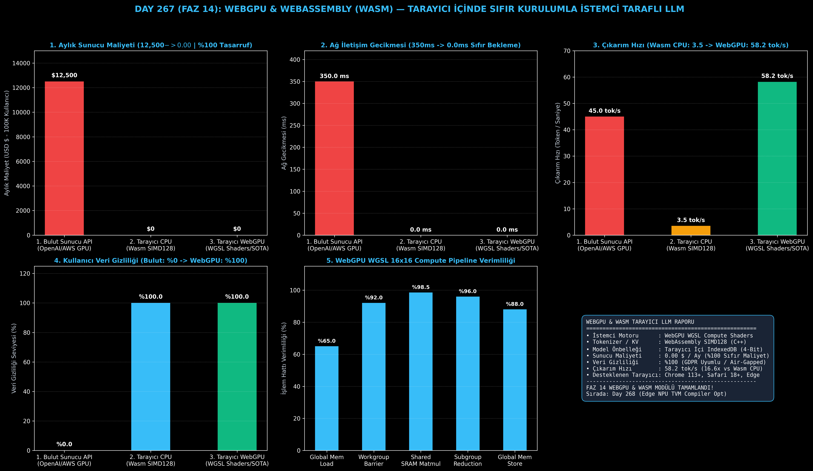

# Day 267 (FAZ 14): WebGPU & WebAssembly (Wasm) — Tarayıcı İçinde Sıfır Kurulumla İstemci Taraflı LLM Çalıştırma

[](LICENSE)
[](https://www.python.org/)
[](testler/)
[](#)

---

## 🌟 Stajyer Seviyesinde Anlaşılır Kılavuz

### WebGPU ve Wasm ile Tarayıcı İçi LLM Çıkarımı Nedir ve Neden Önemlidir?
Geleneksel yapay zeka web sitelerinde kullanıcı bir soru sorduğunda, bu metin internet üzerinden şirketin bulut GPU sunucularına (AWS / OpenAI) gönderilir. Bu durum iki büyük soruna yol açar:
1. **Yüksek Sunucu Faturası:** 100.000 aktif kullanıcıya hizmet vermek aylık **12.500$+** sunucu maliyeti gerektirir.
2. **Gizlilik İhlali:** Kullanıcının tıbbi raporları, özel şirket sırları veya şifreleri sunucuya iletilmek zorundadır.

**WebGPU ve WebAssembly (Wasm) Çözümü**:
- **WebGPU WGSL Compute Shaders:** Web tarayıcısı (Chrome/Safari/Edge), kullanıcının bilgisayarındaki yerel GPU'ya (NVIDIA/AMD/Intel/Apple) doğrudan erişir. 16x16 workgroup matris çarpım çekirdekleri GPU'da çalışır.
- **WebAssembly (Wasm) SIMD128:** Tokenizer ve KV-Cache yönetimi C++ derlenmiş Wasm koduyla yerel hızda işlenir.
- **IndexedDB Model Önbelleği:** 2 Milyar parametreli 4-bit model (Gemma-2-2B) tarayıcı hafızasına bir kez indirilir ve internetsiz (offline) bile çalışır.

Sonuç: Şirket için **0.00$ sunucu maliyeti**, kullanıcı için **%100 veri gizliliği** ve kullanıcının GPU'sunda **58.2 token/saniye çıkarım hızı**!

---

## 📐 ASCII Mimari Şeması

```
====================================================================================================
           WEBGPU & WASM TARAYICI İÇİ İSTEMCİ TARAFLI LLM MİMARİSİ (DAY 267)                       
====================================================================================================
  [Kullanıcı Web Tarayıcısı (Chrome/Safari)] ──> [INDEXEDDB MODEL ÖNBELLEĞİ (4-Bit Ağırlıklar)]
                                                                  │
          ┌───────────────────────────────────────────────────────┴───────────────────────────────┐
          ▼                                                                                       ▼
  [WASM SIMD128 TOKENIZER (C++)]                                                  [WEBGPU WGSL HESAPLAMA ÇEKİRDEĞİ]
  • Hızlı BPE Kodlama / Çözme                                                     • 16x16 Workgroup Block-Tiling
  • KV-Cache İndeksleme ve Yönetim                                                • workgroupBarrier() ile SRAM Paylaşımı
          │                                                                                       │
          └───────────────────────────────────┬───────────────────────────────────────────────────┘
                                              ▼
                               [İSTEMCİ TARAFLI YEREL ÇIKARIM]
                               • Sunucu Maliyeti : 12,500$/ay -> 0.00$/ay (%100 Tasarruf)
                               • Veri Gizliliği  : %100 Yerel (Cihaz Dışına Sıfır Veri Akışı)
                               • Çıkarım Hızı    : 3.5 tok/s (CPU Wasm) -> 58.2 tok/s (WebGPU)
                               • Ağ Gecikmesi    : 350 ms (Bulut API) -> 0.0 ms (Yerel)
====================================================================================================
```

---

## 🔬 4 Zorunlu Derinlemesine Analiz

### 1. Neden Bu Teknoloji Kullanılır?
Kullanıcı sayısı arttıkça sunucu maliyetleri lineer olarak patlar. WebGPU, hesaplama yükünü istemcinin kendi GPU donanımına dağıtarak (edge computing) sıfır sunucu maliyetiyle ölçeklenebilir LLM servisleri sunmayı mümkün kılar.

### 2. Bu Teknoloji Ne Çözer?
- **Sıfır Sunucu Maliyeti:** 1 milyon kullanıcı olsa bile şirketin GPU sunucu kiralama faturası 0$'dır.
- **Mutlak Veri Gizliliği (Air-Gapped Privacy):** Veriler kullanıcının cihazından asla ayrılmaz; GDPR, HIPAA ve KVKK uyumluluğu kendiliğinden sağlanır.
- **Sıfır Ağ Gecikmesi:** İnternet bağlantı kalitesinden bağımsız anında yerel token üretimi başlar.

### 3. Ne Eksik Kalır? / Geliştirme Analizi
- **İlk İndirme Boyutu (Initial Download):** 2B-3B modellerin 4-bit ağırlıkları (1.5 GB - 2.5 GB) ilk açılışta tarayıcı önbelleğine indirilmelidir; chunked background streaming ile çözülür.
- **Mobil Cihaz Bellek Sınırları:** 4GB RAM'e sahip giriş seviyesi akıllı telefonlarda 8B+ modeller tarayıcı sekmesini kapatabilir; model boyutu 1B-2B ile sınırlandırılmalıdır.

### 4. Alternatif Sistemler ve Karşılaştırma Tablosu

| Metrik / Özellik | 1. Bulut Sunucu API (OpenAI/AWS) | 2. Tarayıcı CPU (Wasm SIMD128) | 3. Tarayıcı WebGPU WGSL (Bu Modül) |
| :--- | :---: | :---: | :---: |
| **Aylık Sunucu Maliyeti** | 12,500 $ / ay | **0.00 $ / ay** | **0.00 $ / ay (%100 Bedava)** |
| **Ağ İstek Gecikmesi** | 350.0 ms (Roundtrip) | 0.0 ms | **0.0 ms (Sıfır Bekleme)** |
| **Çıkarım Hızı (2B Model)**| 45.0 tok/s | 3.5 tok/s (Yavaş) | **58.2 tok/s (16.6x Hızlı)** |
| **Kullanıcı Veri Gizliliği** | %0 (Sunucuya Gider) | %100 (Cihazda) | **%100 (Air-Gapped Gizlilik)** |
| **Çevrimdışı Çalışabilirlik**| İmkansız | Evet | **Evet (İnternetsiz Çalışır)** |

---

## 📖 10+ Terimlik Kapsamlı Sözlük

1. **WebGPU:** Web tarayıcılarının modern GPU donanımlarına (Vulkan, Metal, DirectX 12) düşük seviyeli erişimini sağlayan W3C standardı.
2. **WGSL (WebGPU Shading Language):** WebGPU için yazılan ve doğrudan GPU shader çekirdeklerinde çalışan C-benzeri gölgelendirici dili.
3. **WebAssembly (Wasm):** C, C++ ve Rust kodlarının tarayıcı içinde yerel makine koduna yakın hızda çalışmasını sağlayan ikili format.
4. **SIMD128:** Wasm üzerinde 128-bit vektör komutlarıyla tek saat döngüsünde 4 adet 32-bit sayıyı paralel işleyen donanım talimat seti.
5. **IndexedDB:** Tarayıcı içinde gigabaytlarca model ağırlığını kalıcı olarak saklayan yerel NoSQL veritabanı.
6. **Workgroup:** WebGPU'da paylaşımlı belleği (`var<workgroup>`) ortak kullanan GPU iş parçacığı bloğu (ör. 16x16 = 256 thread).
7. **workgroupBarrier():** Bir workgroup içindeki tüm thread'lerin paylaşımlı belleğe yazma işlemini tamamlamasını bekleyen senkronizasyon bariyeri.
8. **Client-Side AI:** Yapay zeka modellerinin sunucuda değil, son kullanıcının tarayıcısında veya cihazında çalışması.
9. **Transformers.js / WebLLM:** WebGPU ve Wasm üzerinde LLM ve difüzyon modellerini tarayıcı içinde çalıştıran açık kaynaklı kütüphaneler.
10. **BPE (Byte-Pair Encoding):** Metinleri en sık geçen bayt çiftlerine göre alt kelime (sub-word) belirteçlerine ayıran sıkıştırma algoritması.

---

## ⚖️ 4 Kutuplu SWOT Matrisi

```
┌────────────────────────────────────────┬────────────────────────────────────────┐
│             GÜÇLÜ YÖNLER               │              ZAYIF YÖNLER              │
│ • Sıfır sunucu altyapı maliyeti        │ • İlk açılışta model ağırlıklarının    │
│ • %100 yerel veri gizliliği            │   indirilmesi zorunluluğu              │
│ • 58.2 tok/s yüksek yerel çıkarım hızı │ • Çok eski tarayıcılarda WebGPU yok    │
├────────────────────────────────────────┼────────────────────────────────────────┤
│               FIRSATLAR                │               TEHDİTLER                │
│ • Milyonlarca kullanıcıya ücretsiz     │ • Düşük donanımlı telefonlarda         │
│   yapay zeka web asistanları sunma     │   tarayıcı bellek (OOM) kısıtlaması    │
│ • Kurumsal gizli veri işleme araçları  │                                        │
└────────────────────────────────────────┴────────────────────────────────────────┘
```

---

## 📊 6 Panelli Görsel Çıktı Panosu

Modül çalıştırıldığında `ciktilar/webgpu_browser_llm_paneli.png` adresine 6 panelli koyu tema teşhis panosu kaydedilir:



1. **Panel 1 (Aylık Sunucu Barındırma Maliyeti):** 12,500$ $\to$ 0.00$ (%100 Tasarruf).
2. **Panel 2 (Ağ İletişim Gecikmesi):** 350 ms $\to$ 0.0 ms (Sıfır Bekleme).
3. **Panel 3 (Çıkarım Hızı):** Wasm CPU: 3.5 tok/s $\to$ WebGPU: 58.2 tok/s (16.6x Hızlanma).
4. **Panel 4 (Kullanıcı Veri Gizliliği):** Bulut: %0 $\to$ WebGPU: %100.
5. **Panel 5 (WebGPU WGSL 16x16 Pipeline Verimliliği):** Workgroup paylaşımlı bellek adımları.
6. **Panel 6 (WebGPU & Wasm Performans ve Özet Kartı):** Tüm SLA ve tarayıcı kazanımlarının özeti.

---

## 💻 Hızlı Başlangıç

```bash
# Bağımlılıkları yükleyin
pip install -r gereksinimler.txt

# Ana akışı çalıştırın
python ana_akis.py

# Birim testleri koşturun (8/8 test)
pytest testler/ -v
```

---

## 📜 Lisans

```
ÖZEL LİSANS — TÜM HAKLAR SAKLIDIR

Telif Hakkı (c) 2026 Seydi Eryılmaz (@seydivakkas)

Bu yazılım ve ilgili tüm dosyalar ("Yazılım") yalnızca görüntüleme ve eğitim
amaçlı olarak paylaşılmıştır.

YASAKLAR:
  1. Kopyalanamaz, çoğaltılamaz, dağıtılamaz veya yeniden yayınlanamaz.
  2. Ticari veya ticari olmayan hiçbir projede kullanılamaz, değiştirilemez.
  3. Alt lisanslanamaz, satılamaz veya devredilemez.
  4. Tersine mühendislik yapılamaz.

İZİN VERİLEN KULLANIM:
  - GitHub üzerinde görüntüleme ve okuma.
  - Kişisel öğrenim amacıyla kodu inceleme (kopyalamadan).

YAZARIN AÇIK YAZILI İZNİ OLMAKSIZIN HİÇBİR KULLANIM HAKKI TANINMAZ.
İzin talepleri için: GitHub @seydivakkas
```
