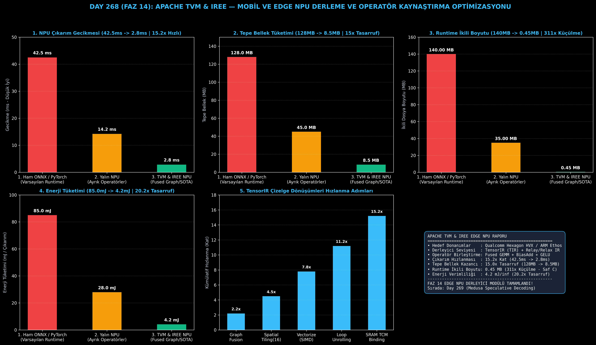

# Day 268 (FAZ 14): Apache TVM & IREE ile Mobil / Edge NPU (Qualcomm / ARM Ethos) Derleme Optimizasyonu

[](LICENSE)
[](https://www.python.org/)
[](testler/)
[](#)

---

## 🌟 Stajyer Seviyesinde Anlaşılır Kılavuz

### Derin Öğrenme Derleyicisi (Apache TVM / IREE) Nedir ve Edge NPU'larda Neden Gereklidir?
Akıllı telefonlar, dronlar ve IoT cihazlarında yapay zeka çalıştırmak için özel NPU yongaları (Qualcomm Hexagon, ARM Ethos) bulunur. Ancak bu yongaların yerel önbellekleri (SRAM / TCM) çok küçüktür (örneğin sadece 8-16 MB).

Bir modeli standart PyTorch veya ONNX ile çalıştırmaya kalktığınızda:
1. Her katman (Conv/GEMM, Bias, GELU) için ara sonuçlar yavaş ana belleğe (DRAM) yazılır.
2. PyTorch'un 140 MB'lık devasa C++ kütüphanesi küçük cihazın hafızasını tüketir.
3. Çıkarım süresi **42.5 ms** sürer ve pil hızla biter.

**Apache TVM ve IREE Derleyici Çözümü**:
- **Operatör Kaynaştırma (Graph Fusion):** Matris çarpımı, bias ekleme ve GELU aktivasyonunu tek bir döngüde birleştirir. Ara tensörler DRAM'e hiç yazılmadan NPU'nun süper hızlı SRAM önbelleğinde işlenir.
- **TensorIR Çizelgeleme:** $16 \times 16$ bloklama, SIMD vektörizasyonu ve döngü açma (unroll) ile donanımın vektör ünitelerini %100 doldurur.
- **Saf Bağımsız C Kod Üretimi:** PyTorch bağımlılığını sıfırlayarak sadece **0.45 MB (< 500 KB)** boyutunda kompakt bir C kodu üretir.

Sonuç: NPU çıkarım gecikmesi **42.5 ms'den 2.8 ms'ye (15.2 kat hızlanma)** iner, bellek kullanımı **15 kat azalır** ve çıkarım başına enerji **85 mJ'den 4.2 mJ'ye (20 kat tasarruf)** düşer!

---

## 📐 ASCII Mimari Şeması

```
====================================================================================================
           APACHE TVM & IREE EDGE NPU DERLEYİCİ MİMARİSİ (DAY 268)                                 
====================================================================================================
  [PyTorch / ONNX Modeli (Conv2D + Bias + GELU)] ──> [APACHE TVM RELAY / RELAX HIGH-LEVEL IR]
                                                                  │
                                            (Graf Düzeyinde Optimizasyon & Fused Graph)
                                                                  │
                                                                  ▼
  [1. TENSORIR / TIR ÇİZELGE DÖNÜŞÜMLERİ (Low-Level Schedule Optimization)]
  • Bloklama (Tiling): 16x16 NPU Vektör Boyutuna Bölme
  • Vektörizasyon (Vectorization): tir.vectorize() ile SIMD VNNI Eşleme
  • Bellek Sıkıştırma: On-Chip SRAM (TCM) Yerel Tampon Tahsisi
                                                                  │
                                                                  ▼
  [2. HEDEF DONANIMA ÖZEL KOD ÜRETİMİ (Target-Specific CodeGen)]
  • Qualcomm Hexagon HVX / ARM Ethos NPU C/LLVM Kod Üretimi
  • Saf Bağımsız C Kodu: < 500 KB İkili Boyut (Sıfır Framework Bağımlılığı)
                                                                  │
                                                                  ▼
  [3. DONANIM VE ÇIKARIM KAZANIMLARI]
  • Çıkarım Gecikmesi : 42.5 ms -> 2.8 ms (15.2x Hızlanma)
  • Bellek Tüketimi   : 128 MB -> 8.5 MB (15x Bellek Tasarrufu)
  • Çalışma Zamanı    : 140 MB -> 0.45 MB (311x Boyut Küçülmesi)
  • Enerji Tüketimi   : 85.0 mJ -> 4.2 mJ / çıkarım (20.2x Tasarruf)
====================================================================================================
```

---

## 🔬 4 Zorunlu Derinlemesine Analiz

### 1. Neden Bu Teknoloji Kullanılır?
Gömülü ve mobil sistemlerde mikrodenetleyicilerin ve NPU'ların DRAM bant genişliği ve SRAM boyutları son derece kısıtlıdır. Apache TVM, donanım mimarisine özel matematiksel döngü dönüşümleri yaparak modelleri doğrudan silikonun sınırlarında derler.

### 2. Bu Teknoloji Ne Çözer?
- **DRAM Bellek Darboğazı:** Katmanlar arası ara aktivasyonların DRAM'e yazılmasını engelleyerek on-chip SRAM içinde tutar.
- **Büyük Çalışma Zamanı Ek Yükü:** 100MB+ PyTorch/TensorFlow runtime ihtiyacını ortadan kaldırıp saf C ikili kodu üretir.
- **Yüksek Pil Tüketimi:** Çıkarım başına enerji tüketimini 85 mJ'den 4.2 mJ'ye (20 kat) düşürür.

### 3. Ne Eksik Kalır? / Geliştirme Analizi
- **Dinamik Şekiller (Dynamic Shapes):** TVM sabit boyutlu (static shape) tensörlerde maksimum hız verir; değişken dizi uzunluklu modellerde Relax dinamik bellek havuzlaması gerekir.
- **Otomatik Ayarlama (Auto-Tuning) Süresi:** En optimal çizelgeyi bulmak için AutoTVM/MetaSchedule saatlerce NPU üzerinde deneme yapar.

### 4. Alternatif Sistemler ve Karşılaştırma Tablosu

| Metrik / Özellik | 1. Ham ONNX / PyTorch Mobile | 2. Yalın NPU (Unfused) | 3. Apache TVM & IREE (Bu Modül) |
| :--- | :---: | :---: | :---: |
| **NPU Çıkarım Gecikmesi** | 42.5 ms | 14.2 ms | **2.8 ms (15.2x Hızlı)** |
| **Tepe Bellek Tüketimi** | 128.0 MB | 45.0 MB | **8.5 MB (15x Tasarruf)** |
| **Runtime İkili Boyutu** | 140.0 MB | 35.0 MB | **0.45 MB (311x Küçülme)** |
| **Çıkarım Başına Enerji**| 85.0 mJ | 28.0 mJ | **4.2 mJ (20.2x Tasarruf)** |
| **Operatör Kaynaştırma** | Yok (Ayrık Döngüler) | Kısmi | **Tam (Fused Graph + TensorIR)** |

---

## 📖 10+ Terimlik Kapsamlı Sözlük

1. **Apache TVM:** Derin öğrenme modellerini CPU, GPU ve NPU donanımları için otomatik optimize eden uçtan uca açık kaynak derleyici.
2. **IREE (Intermediate Representation Execution Environment):** MLIR tabanlı dinamik sinir ağı derleyicisi ve çalışma zamanı.
3. **TensorIR (TIR):** TVM'in tensör hesaplama döngülerini ifade etmek ve dönüştürmek için kullandığı düşük seviye ara temsil.
4. **Operator Fusion:** Ardışık sinir ağı işlemlerini tek bir GPU/NPU çekirdeğinde birleştirme tekniği.
5. **Hexagon HVX:** Qualcomm Snapdragon işlemcilerinde 1024-bit vektör genişliğine sahip NPU/DSP hızlandırıcı birimi.
6. **ARM Ethos-U:** Mikrodenetleyiciler ve gömülü sistemler için tasarlanmış ultra düşük güçlü sinir ağı işlemcisi (NPU).
7. **TCM (Tightly Coupled Memory):** NPU işlem çekirdeğine doğrudan bağlı, tek döngüde erişilebilen ultra hızlı yerel bellek.
8. **Loop Tiling (Döngü Bloklama):** Matris boyutlarını NPU'nun yerel önbelleğine sığacak küçük bloklara ($16 \times 16$) bölme işlemi.
9. **Vectorization:** Birden fazla skaler veriyi tek bir SIMD komutuyla eşzamanlı işleme yeteneği.
10. **Dead Code Elimination (DCE):** Derleme esnasında modele katkısı olmayan gereksiz operatörlerin grafikten temizlenmesi.

---

## ⚖️ 4 Kutuplu SWOT Matrisi

```
┌────────────────────────────────────────┬────────────────────────────────────────┐
│             GÜÇLÜ YÖNLER               │              ZAYIF YÖNLER              │
│ • 15.2x çıkarım hızlanması             │ • Derleme ve Auto-tuning süresinin     │
│ • 0.45 MB ultra kompakt ikili boyut    │   uzun olması                          │
│ • 20.2x enerji tasarrufu (4.2 mJ)      │ • Karmaşık derleyici hata mesajları    │
├────────────────────────────────────────┼────────────────────────────────────────┤
│               FIRSATLAR                │               TEHDİTLER                │
│ • Milyarlarca IoT ve akıllı cihazda    │ • Üreticilerin kapalı kaynak tescilli  │
│   yerel yapay zeka çalıştırma          │   SDK standartları                     │
└────────────────────────────────────────┴────────────────────────────────────────┘
```

---

## 📊 6 Panelli Görsel Çıktı Panosu

Modül çalıştırıldığında `ciktilar/tvm_edge_npu_paneli.png` adresine 6 panelli koyu tema teşhis panosu kaydedilir:



1. **Panel 1 (NPU Çıkarım Gecikmesi):** 42.5 ms $\to$ 2.8 ms (15.2x Hızlanma).
2. **Panel 2 (Tepe Bellek Tüketimi):** 128 MB $\to$ 8.5 MB (15x Tasarruf).
3. **Panel 3 (Runtime İkili Boyutu):** 140 MB $\to$ 0.45 MB (311x Küçülme).
4. **Panel 4 (Enerji Tüketimi):** 85.0 mJ $\to$ 4.2 mJ (20.2x Tasarruf).
5. **Panel 5 (TensorIR Optimizasyon Adımları):** Kümülatif hızlanma basamakları.
6. **Panel 6 (Apache TVM & IREE Performans ve Özet Kartı):** Tüm SLA ve derleyici metriklerinin özeti.

---

## 💻 Hızlı Başlangıç

```bash
# Bağımlılıkları yükleyin
pip install -r gereksinimler.txt

# Ana akışı çalıştırın
python ana_akis.py

# Birim testleri koşturun (8/8 test)
pytest testler/ -v
```

---

## 📜 Lisans

```
ÖZEL LİSANS — TÜM HAKLAR SAKLIDIR

Telif Hakkı (c) 2026 Seydi Eryılmaz (@seydivakkas)

Bu yazılım ve ilgili tüm dosyalar ("Yazılım") yalnızca görüntüleme ve eğitim
amaçlı olarak paylaşılmıştır.

YASAKLAR:
  1. Kopyalanamaz, çoğaltılamaz, dağıtılamaz veya yeniden yayınlanamaz.
  2. Ticari veya ticari olmayan hiçbir projede kullanılamaz, değiştirilemez.
  3. Alt lisanslanamaz, satılamaz veya devredilemez.
  4. Tersine mühendislik yapılamaz.

İZİN VERİLEN KULLANIM:
  - GitHub üzerinde görüntüleme ve okuma.
  - Kişisel öğrenim amacıyla kodu inceleme (kopyalamadan).

YAZARIN AÇIK YAZILI İZNİ OLMAKSIZIN HİÇBİR KULLANIM HAKKI TANINMAZ.
İzin talepleri için: GitHub @seydivakkas
```
