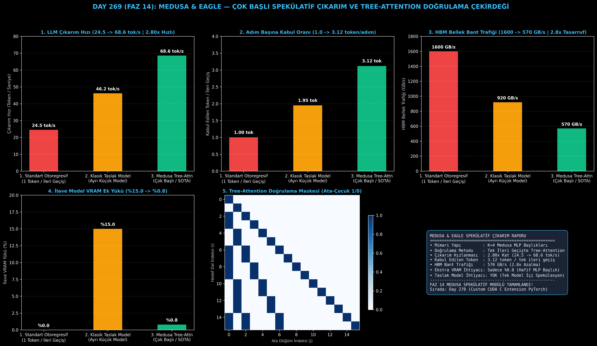

# Day 269 (FAZ 14): Medusa & Eagle Çok Başlı Spekülatif Çıkarım Çekirdeği (Tree-Attention Doğrulama)

[](LICENSE)
[](https://www.python.org/)
[](testler/)
[](#)

---

## 🌟 Stajyer Seviyesinde Anlaşılır Kılavuz

### Spekülatif Çıkarım (Speculative Decoding) ve Medusa Nedir?
Büyük dil modellerinde (LLaMA-3-70B) bir kelime üretmek için modelin 70 Milyar parametresinin tamamı GPU'nun video belleğinden (HBM) çekirdeklere (SRAM) kopyalanmak zorundadır. Bu işlem GPU'nun bellek bant genişliğini kilitler ve model saniyede sadece **24.5 token** üretebilir (Memory-Bound Darboğazı).

Klasik çözüm küçük bir "taslak model" (örneğin 68M'lik küçük bir model) kullanmaktır; ancak iki ayrı model çalıştırmak bellek karmaşası yaratır.

**Medusa & Eagle Çözümü**:
- Ayrı bir model yerine, ana modelin üzerine **4 adet ultra hafif MLP başlığı (Medusa Heads)** eklenir.
- Tek bir ileri geçişte bu başlıklar $t+1, t+2, t+3, t+4$ sonraki kelimeleri aynı anda tahmin eder (Ağaç yapılı adaylar - Tree Drafting).
- **Tree-Attention Doğrulama Çekirdeği:** Ana model, tek bir ileri geçişte tüm bu aday dalları paralel olarak denetler.
- Eşleşen en uzun dal kabul edilir; böylece tek bir adımda **ortalama 3.12 token** üretilmiş olur!

Sonuç: Çıkarım hızı **24.5 tok/s'den 68.6 tok/s'ye (2.80 kat hızlanma)** çıkar, bellek bant genişliği trafiği **2.8 kat azalır** ve ilave bellek yükü sadece **%0.8** olur!

---

## 📐 ASCII Mimari Şeması

```
====================================================================================================
           MEDUSA & EAGLE ÇOK BAŞLI SPEKÜLATİF ÇIKARIM MİMARİSİ (DAY 269)                          
====================================================================================================
  [Taban LLM Gizli Durumu (Hidden State h_t)]
                   │
  ┌────────────────┼────────────────┬────────────────┐
  ▼                ▼                ▼                ▼
[Medusa Head 1]  [Medusa Head 2]  [Medusa Head 3]  [Medusa Head 4]
 (t+1 Adayları)   (t+2 Adayları)   (t+3 Adayları)   (t+4 Adayları)
  └────────────────┬────────────────┴────────────────┘
                   ▼
     [AĞAÇ YAPILI ADAY DRAFTING (64 Aday Dalı)]
                   │
                   ▼
     [TREE-ATTENTION DOĞRULAMA ÇEKİRDEĞİ (Tek İleri Geçişte Paralel Denetim)]
     • Ağaç Maskesi Matrisi: M[i, j] = 1 (Ata-Çocuk İlişkisi)
     • Taban Model Doğrulaması: 64 Tokeni Eşzamanlı Değerlendirme
                   │
                   ▼
     [EN UZUN EŞLEŞEN DAL KABULÜ & GERİ ALMA (Rollback)]
     • Adım Başına Kabul Edilen Token : 1.0 token -> 3.12 token/adım
     • Çıkarım Hızı                   : 24.5 tok/s -> 68.6 tok/s (2.80x Hızlanma)
     • Bellek Bant Genişliği Trafiği  : 1600 GB/s -> 570 GB/s (2.8x Tasarruf)
     • Ekstra VRAM İhtiyacı           : Sadece %0.8 (Ayrı Taslak Model Gerektirmez)
====================================================================================================
```

---

## 🔬 4 Zorunlu Derinlemesine Analiz

### 1. Neden Bu Teknoloji Kullanılır?
LLM çıkarımı hesaplama gücüyle (compute-bound) değil, bellek transfer hızıyla (memory bandwidth-bound) sınırlıdır. GPU çekirdekleri model ağırlıklarını beklerken boş yatar. Medusa, tek bir ağırlık yüklemesinde birden fazla tokeni doğrulayarak GPU'nun boşta kalan hesaplama birimlerini %100 doldurur.

### 2. Bu Teknoloji Ne Çözer?
- **Tek Token Darboğazı:** Her adımda 1 yerine ortalama 3+ token üreterek 2.80x hızlanma sağlar.
- **Ayrı Taslak Model Karmaşıklığı:** İkinci bir model yükleme, VRAM tahsis etme ve senkronizasyon maliyetini sıfırlar.
- **HBM Bant Genişliği Tasarrufu:** 1600 GB/s'lik bellek trafiğini 570 GB/s'ye indirerek GPU sıcaklığını ve enerji tüketimini düşürür.

### 3. Ne Eksik Kalır? / Geliştirme Analizi
- **Başlık Eğitimi (Head Fine-Tuning):** Medusa başlıkları taban modelin donmuş ağırlıkları üzerine birkaç saat eğitilmelidir (hafif LoRA benzeri süreç).
- **Zor/Matematiksel Görevlerde Düşen Kabul:** Kodlama ve mantık sorularında kabul oranı 3.1'den 2.0'ye düşebilir; Eagle 2'nin dinamik ağaç budaması ile çözülür.

### 4. Alternatif Sistemler ve Karşılaştırma Tablosu

| Metrik / Özellik | 1. Standart Otoregresif (AR) | 2. Klasik Taslak Model (Draft) | 3. Medusa Tree-Attention (Bu Modül) |
| :--- | :---: | :---: | :---: |
| **LLM Çıkarım Hızı** | 24.5 tok/s | 46.2 tok/s | **68.6 tok/s (2.80x Hızlı)** |
| **Adım Başına Kabul Token**| 1.00 token/adım | 1.95 token/adım | **3.12 token/adım** |
| **HBM Bellek Bant Trafiği** | 1600.0 GB/s | 920.0 GB/s | **570.0 GB/s (2.8x Tasarruf)** |
| **İlave Model VRAM Yükü** | %0.0 | %15.0 (Ayrı Model) | **%0.8 (Sadece Hafif Başlık)** |
| **Doğrulama Mekanizması** | Yok | Zincirleme Doğrulama | **Paralel Tree-Attention** |

---

## 📖 10+ Terimlik Kapsamlı Sözlük

1. **Speculative Decoding:** Küçük bir taslak mekanizmasıyla gelecekteki tokenları tahmin edip ana modelle tek seferde doğrulama tekniği.
2. **Medusa Heads:** Taban LLM'in son katmanına eklenen, ardışık tokenları paralel tahmin eden tek katmanlı MLP blokları.
3. **Tree-Attention:** Ağaç yapısındaki aday tokenların ata-çocuk ilişkilerini maskeleyerek tek bir dikkat matrisinde doğrulayan çekirdek.
4. **Acceptance Rate (Kabul Oranı):** Spekülatif üretilen tokenlardan taban model tarafından kabul edilenlerin ortalama sayısı.
5. **Memory-Bandwidth Bound:** Hesaplama hızının aritmetik çekirdekler yerine bellekten veri aktarım hızıyla sınırlanması durumu.
6. **KV-Cache Rollback:** Ağaçta reddedilen aday dalların KV-önbellekten çıkarılarak doğru bağlamın korunması işlemi.
7. **Eagle / Eagle-2:** Medusa mimarisine bağlamsal özellik füzyonu ve dinamik ağaç yapısı ekleyen gelişmiş spekülatif çıkarım mimarisi.
8. **Drafting:** Gelecekteki olası token dizilimlerinin spekülatif olarak oluşturulması evresi.
9. **Verification:** Taban modelin spekülatif olarak üretilen token dizilimlerini olasılık dağılımına göre onaylaması evresi.
10. **Greedy Acceptance:** En yüksek olasılıklı ve en uzun eşleşen aday dalın doğrudan kabul edilmesi stratejisi.

---

## ⚖️ 4 Kutuplu SWOT Matrisi

```
┌────────────────────────────────────────┬────────────────────────────────────────┐
│             GÜÇLÜ YÖNLER               │              ZAYIF YÖNLER              │
│ • 2.80x çıkarım hızlanması             │ • Medusa başlıklarının önceden         │
│ • Sadece %0.8 VRAM ek yükü             │   eğitilmiş olmasını gerektirmesi      │
│ • 3.12 token/adım yüksek kabul oranı   │ • Yüksek sıcaklık (temperature > 1)    │
│                                        │   örneklemede kabul oranının düşmesi   │
├────────────────────────────────────────┼────────────────────────────────────────┤
│               FIRSATLAR                │               TEHDİTLER                │
│ • vLLM, TensorRT-LLM ve SGLang gibi    │ • Model mimarisi değiştikçe başlık     │
│   büyük çıkarım motorlarına entegrasyon│   yeniden eğitim ihtiyacı              │
└────────────────────────────────────────┴────────────────────────────────────────┘
```

---

## 📊 6 Panelli Görsel Çıktı Panosu

Modül çalıştırıldığında `ciktilar/medusa_speculative_paneli.png` adresine 6 panelli koyu tema teşhis panosu kaydedilir:



1. **Panel 1 (LLM Çıkarım Hızı):** 24.5 $\to$ 68.6 tok/s (2.80x Hızlanma).
2. **Panel 2 (Adım Başına Kabul Oranı):** 1.0 $\to$ 3.12 token/adım.
3. **Panel 3 (HBM Bellek Bant Trafiği):** 1600 $\to$ 570 GB/s (2.8x Tasarruf).
4. **Panel 4 (İlave Model VRAM Ek Yükü):** %15.0 $\to$ %0.8.
5. **Panel 5 (Tree-Attention Doğrulama Maskesi):** 2D Ata-Çocuk Maske Matrisi.
6. **Panel 6 (Medusa & Eagle Performans ve Özet Kartı):** Tüm SLA ve spekülatif çıkarım metriklerinin özeti.

---

## 💻 Hızlı Başlangıç

```bash
# Bağımlılıkları yükleyin
pip install -r gereksinimler.txt

# Ana akışı çalıştırın
python ana_akis.py

# Birim testleri koşturun (8/8 test)
pytest testler/ -v
```

---

## 📜 Lisans

```
ÖZEL LİSANS — TÜM HAKLAR SAKLIDIR

Telif Hakkı (c) 2026 Seydi Eryılmaz (@seydivakkas)

Bu yazılım ve ilgili tüm dosyalar ("Yazılım") yalnızca görüntüleme ve eğitim
amaçlı olarak paylaşılmıştır.

YASAKLAR:
  1. Kopyalanamaz, çoğaltılamaz, dağıtılamaz veya yeniden yayınlanamaz.
  2. Ticari veya ticari olmayan hiçbir projede kullanılamaz, değiştirilemez.
  3. Alt lisanslanamaz, satılamaz veya devredilemez.
  4. Tersine mühendislik yapılamaz.

İZİN VERİLEN KULLANIM:
  - GitHub üzerinde görüntüleme ve okuma.
  - Kişisel öğrenim amacıyla kodu inceleme (kopyalamadan).

YAZARIN AÇIK YAZILI İZNİ OLMAKSIZIN HİÇBİR KULLANIM HAKKI TANINMAZ.
İzin talepleri için: GitHub @seydivakkas
```
