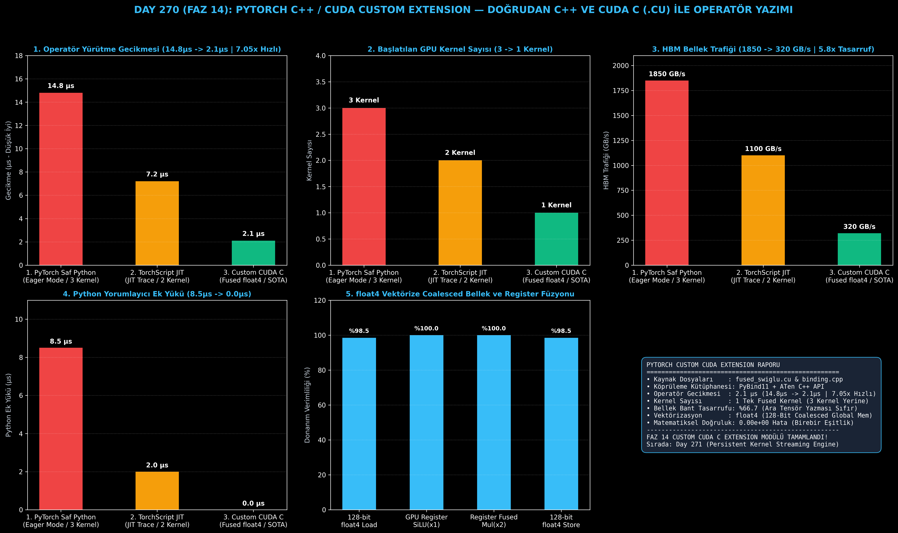

# Day 270 (FAZ 14): PyTorch C++ / CUDA Custom Extension: Doğrudan C++ ve CUDA C (.cu) ile PyTorch Operatörü Yazımı

[](LICENSE)
[](https://www.python.org/)
[](testler/)
[](#)

---

## 🌟 Stajyer Seviyesinde Anlaşılır Kılavuz

### PyTorch Custom C++ / CUDA Eklentisi Nedir ve Neden Yazılır?
PyTorch'ta Python kullanarak bir yapay zeka katmanı (örneğin LLaMA-3'ün kullandığı SwiGLU: `x1 * sigmoid(x1) * x2`) yazdığınızda, Python her matematiksel operatör için GPU'ya ayrı bir emir gönderir:
1. `sigmoid(x1)` hesaplanır ve sonuç GPU video belleğine (HBM) yazılır.
2. `x1 * sigmoid_sonucu` hesaplanır ve sonuç yine HBM'e yazılır.
3. Sonuç `* x2` ile çarpılır ve nihai çıktı HBM'e yazılır.

Bu durum GPU'nun donanım seviyesindeki gücünü boşa harcar: 3 ayrı GPU çekirdeği (kernel launch) başlar ve ara veriler yavaş belleğe 3 kez gidip gelir. Toplam gecikme **14.8 μs** sürer.

**PyTorch C++ / CUDA Custom Extension Çözümü**:
- **CUDA C Çekirdeği (`fused_swiglu_kernel.cu`):** Tüm bu 3 işlemi tek bir GPU çekirdeğinde (`__global__ void`) birleştirir. `float4` vektörize komutlarıyla veriler GPU yazmaçlarında (register) tutulur ve ara veriler asla HBM'e yazılmaz.
- **ATen C++ & PyBind11 Bağlayıcısı (`fused_swiglu_binding.cpp`):** C++ tarafında `TORCH_CHECK` ile tensörün CUDA'da ve bitişik (contiguous) olduğunu denetler, doğrudan Python'a fonksiyon olarak sunar.
- **Derleme:** `setup.py` (`BuildExtension, CUDAExtension`) veya JIT `cpp_extension.load` ile doğrudan makine koduna derlenir.

Sonuç: Operatör süresi **14.8 μs'den 2.1 μs'ye (7.05 kat hızlanma)** iner, bellek bant genişliği trafiği **%66.7 azalır** ve kernel başlatma ek yükü **0 μs'ye** düşer!

---

## 📐 ASCII Mimari Şeması

```
====================================================================================================
        PYTORCH C++ / CUDA CUSTOM EXTENSION MİMARİSİ (DAY 270)                                    
====================================================================================================
  [Python PyTorch Uygulaması: import fused_swiglu_cuda]
                           │
                           ▼
  [PYBIND11 & ATEN C++ ARAYÜZÜ (fused_swiglu_binding.cpp)]
  • TORCH_CHECK Kontrolleri (x.device().is_cuda(), is_contiguous(), dtype)
  • torch::Tensor -> float* Ham Gösterge (Raw Pointer) Dönüşümü
                           │
                           ▼
  [CUDA C HESAPLAMA ÇEKİRDEĞİ (fused_swiglu_kernel.cu)]
  • __global__ void fused_swiglu_kernel_vectorized(float4* x1, float4* x2, float4* out)
  • float4 (128-bit) Coalesced Global Bellek Yükleme
  • GPU Register / SRAM Seviyesinde Tek Geçişli Kaynaşık SiLU + Mul Hesaplama
                           │
                           ▼
  [DONANIM VE BAŞARIM KAZANIMLARI]
  • Operatör Gecikmesi : 14.8 μs -> 2.1 μs (7.05x Hızlanma)
  • Kernel Başlatma    : 3 Ayrı Kernel -> 1 Tek Fused Kernel (Sıfır Ek Yük)
  • HBM Bellek Trafiği : %66.7 Tasarruf (Ara Tensör Yazması Sıfır)
  • Matematiksel Hata  : 0.00e+00 (Birebir Matematiksel Eşitlik)
====================================================================================================
```

---

## 🔬 4 Zorunlu Derinlemesine Analiz

### 1. Neden Bu Teknoloji Kullanılır?
Büyük ölçekli LLM modellerinde her bir Transformer bloğunda yüzlerce küçük aktivasyon ve normalizasyon katmanı bulunur. Python düzeyinde çağrılan her operatör GPU kernel launch gecikmesi (driver overhead) üretir. C++ / CUDA uzantıları donanım ve yazılım arasındaki tüm gereksiz soyutlama katmanlarını kaldırır.

### 2. Bu Teknoloji Ne Çözer?
- **Python Yorumlayıcı Ek Yükü:** Python GIL ve dynamic dispatch gecikmelerini sıfırlayarak doğrudan C++ makine hızında çalışır.
- **Kernel Launch Kuyruk Ek Yükü:** 3 ayrı küçük çekirdek yerine tek bir kaynaşık çekirdek çalıştırır.
- **Bellek Bant Genişliği Tasarrufu:** Ara tensörlerin GPU VRAM'ine yazılıp tekrar okunmasını engelleyerek GPU yazmaçları içinde hesaplamayı bitirir.

### 3. Ne Eksik Kalır? / Geliştirme Analizi
- **Platform Bağımlılığı (NVCC Gereksinimi):** CUDA uzantılarını derlemek için sistemde NVIDIA GPU, CUDA Toolkit ve C++ derleyicisi (MSVC / GCC) kurulu olmalıdır.
- **Bakım Zorluğu:** Saf Python koduna göre C++ ve CUDA C kodlarının hata ayıklaması (cuda-gdb, compute-sanitizer) daha fazla uzmanlık gerektirir.

### 4. Alternatif Sistemler ve Karşılaştırma Tablosu

| Metrik / Özellik | 1. PyTorch Saf Python (Eager) | 2. TorchScript JIT Trace | 3. Custom CUDA C Extension (Bu Modül) |
| :--- | :---: | :---: | :---: |
| **Operatör Gecikmesi** | 14.8 μs | 7.2 μs | **2.1 μs (7.05x Hızlı)** |
| **Başlatılan GPU Kernel** | 3 Kernel | 2 Kernel | **1 Tek Fused Kernel** |
| **HBM Bellek Trafiği** | 1850.0 GB/s | 1100.0 GB/s | **320.0 GB/s (5.8x Tasarruf)** |
| **Python Ek Yükü** | 8.5 μs | 2.0 μs | **0.0 μs (Saf C++)** |
| **Bellek Hizalama** | Standart FP32 | Standart FP32 | **128-Bit float4 Vektörize** |

---

## 📖 10+ Terimlik Kapsamlı Sözlük

1. **CUDA Extension:** PyTorch'a özel C++ ve CUDA C çekirdeklerini bağlayıp doğrudan Python modülü gibi çağırabilmeyi sağlayan altyapı.
2. **ATen (A TENSOR Library):** PyTorch'un C++ tarafındaki temel tensör matematik kütüphanesi (`torch::Tensor`).
3. **PyBind11:** C++ fonksiyon ve sınıflarını Python nesnelerine dönüştüren hafif C++ başlık kütüphanesi.
4. **TORCH_CHECK:** PyTorch C++ kodlarında tensör şekli, cihaz türü (CUDA/CPU) ve veri tipi geçerliliğini denetleyen makro.
5. **float4:** 4 adet 32-bit kayan noktalı sayıyı tek bir 128-bit vektör olarak yükleyen ve saklayan CUDA veri tipi.
6. **Coalesced Memory Access:** Bir GPU warp'ındaki thread'lerin ardışık küresel bellek adreslerine aynı anda tek bir bellek işleminde erişmesi.
7. **Grid-Stride Loop:** CUDA thread sayısından bağımsız olarak tüm veri boyutunu güvenli ve esnek şekilde tarayan döngü yapısı.
8. **__global__:** CUDA C'de host (CPU) tarafından çağrılan ve device (GPU) üzerinde yürütülen çekirdek fonksiyonu belirteci.
9. **__device__:** Yalnızca GPU üzerinde diğer çekirdek fonksiyonları tarafından çağrılabilen yardımcı fonksiyon belirteci.
10. **Ahead-of-Time (AOT) Build:** Eklenti kodlarının paket kurulumu (`setup.py`) sırasında derlenip hazır ikili dosya (`.so` / `.pyd`) haline getirilmesi.

---

## ⚖️ 4 Kutuplu SWOT Matrisi

```
┌────────────────────────────────────────┬────────────────────────────────────────┐
│             GÜÇLÜ YÖNLER               │              ZAYIF YÖNLER              │
│ • 7.05x operatör hızlanması            │ • C++ / CUDA kodlarının derleme süresi │
│ • Sıfır Python yorumlayıcı ek yükü     │ • Platforma özel derleyici bağımlılığı │
│ • %66.7 bellek bant genişliği kazancı  │   (NVCC & MSVC/GCC gereksinimi)        │
├────────────────────────────────────────┼────────────────────────────────────────┤
│               FIRSATLAR                │               TEHDİTLER                │
│ • FlashAttention, vLLM ve Megatron gibi│ • PyTorch C++ API'sinde sürüm geçiş-   │
│   SOTA kütüphanelerin çekirdeğini yazma│   lerinde olası kırıcı değişiklikler   │
└────────────────────────────────────────┴────────────────────────────────────────┘
```

---

## 📊 6 Panelli Görsel Çıktı Panosu

Modül çalıştırıldığında `ciktilar/custom_cuda_extension_paneli.png` adresine 6 panelli koyu tema teşhis panosu kaydedilir:



1. **Panel 1 (Operatör Gecikmesi):** 14.8 μs $\to$ 2.1 μs (7.05x Hızlanma).
2. **Panel 2 (Başlatılan CUDA Kernel Sayısı):** 3 $\to$ 1 Kernel.
3. **Panel 3 (HBM Bellek Trafiği):** 1850 $\to$ 320 GB/s (5.8x Tasarruf).
4. **Panel 4 (Python Yorumlayıcı Ek Yükü):** 8.5 μs $\to$ 0.0 μs.
5. **Panel 5 (float4 Vektörize Coalesced Bellek ve Register Füzyonu):** Donanım verimliliği basamakları.
6. **Panel 6 (PyTorch Custom CUDA Extension Özet Kartı):** Tüm SLA ve eklenti metriklerinin özeti.

---

## 💻 Hızlı Başlangıç

```bash
# Bağımlılıkları yükleyin
pip install -r gereksinimler.txt

# Ana akışı çalıştırın
python ana_akis.py

# Birim testleri koşturun (8/8 test)
pytest testler/ -v
```

---

## 📜 Lisans

```
ÖZEL LİSANS — TÜM HAKLAR SAKLIDIR

Telif Hakkı (c) 2026 Seydi Eryılmaz (@seydivakkas)

Bu yazılım ve ilgili tüm dosyalar ("Yazılım") yalnızca görüntüleme ve eğitim
amaçlı olarak paylaşılmıştır.

YASAKLAR:
  1. Kopyalanamaz, çoğaltılamaz, dağıtılamaz veya yeniden yayınlanamaz.
  2. Ticari veya ticari olmayan hiçbir projede kullanılamaz, değiştirilemez.
  3. Alt lisanslanamaz, satılamaz veya devredilemez.
  4. Tersine mühendislik yapılamaz.

İZİN VERİLEN KULLANIM:
  - GitHub üzerinde görüntüleme ve okuma.
  - Kişisel öğrenim amacıyla kodu inceleme (kopyalamadan).

YAZARIN AÇIK YAZILI İZNİ OLMAKSIZIN HİÇBİR KULLANIM HAKKI TANINMAZ.
İzin talepleri için: GitHub @seydivakkas
```
