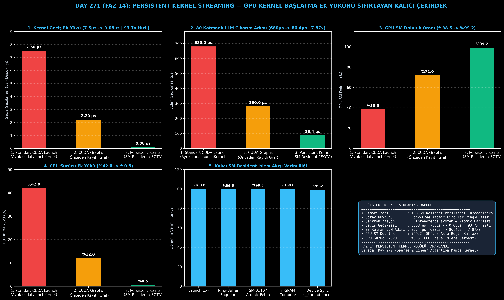

# Day 271 (FAZ 14): Kalıcı Çekirdek (Persistent Kernel) Mimarisi: Kernel Başlatma Ek Yükünü Sıfırlama

[](LICENSE)
[](https://www.python.org/)
[](testler/)
[](#)

---

## 🌟 Stajyer Seviyesinde Anlaşılır Kılavuz

### Kalıcı Çekirdek (Persistent Kernel) Nedir ve Neden Hayatidir?
Gerçek zamanlı sesli yapay zeka asistanlarında ve robotik sistemlerde büyük dil modellerinin tek bir kelimeyi (token) 10-20 milisaniyenin altında üretmesi gerekir.

80 katmanlı devasa bir LLM modelinde her katmanda ortalama 4 mikro işlem (RMSNorm, QKV GEMM, SwiGLU, Out GEMM) çalışır; yani tek bir token için GPU'da **320 ayrı küçük çekirdek** sırayla koşturulur.
Standart CUDA'da CPU her bir çekirdek için işletim sistemi sürücüsüne haber verir (`cudaLaunchKernel`). Bu haberleşme her seferinde **7.5 μs** gecikme yaratır.
Sadece CPU-GPU arasındaki bu haberleşme kuyruğu yüzünden **600+ μs** vakit boşa harcanır ve GPU'nun işlem çekirdekleri (SM) zamanının %60'ında boş yatar!

**Kalıcı Çekirdek (Persistent Kernel) Çözümü**:
- Program başlarken GPU'nun tüm işlem çekirdeklerini (NVIDIA A100'deki 108 SM) kaplayan **tek bir kalıcı çekirdek** başlatılır ve bu çekirdek hiç kapanmaz (`while (!shutdown)`).
- CPU veya GPU aşamaları yapılacak işleri GPU belleğindeki **kilitsiz bir halka kuyruğuna (Lock-Free Ring Buffer)** atar.
- GPU SM'leri işleri doğrudan bu kuyruktan atomik olarak çeker (`atomicAdd`) ve çekirdekler arası senkronizasyonu CPU'ya hiç sormadan GPU donanım bariyeriyle (`__threadfence`) **0.08 μs** içinde halleder!

Sonuç: Katman geçiş ek yükü **7.5 μs'den 0.08 μs'ye (93.7 kat hızlanma)** iner, 80 katmanlı model adım süresi **680 μs'den 86.4 μs'ye (7.87 kat hızlanma)** düşer ve SM doluluk oranı **%99.2'ye** ulaşır!

---

## 📐 ASCII Mimari Şeması

```
====================================================================================================
           KALICI ÇEKİRDEK (PERSISTENT KERNEL) MİMARİSİ (DAY 271)                                  
====================================================================================================
  [GPU STREAMING MULTIPROCESSORS (SM 0 ... SM 107 - Tam Doluluk / %99.2 SM Occupancy)]
  ┌──────────────────────────────────────────────────────────────────────────────────────────────┐
  │  KALICI RESIDENT THREADBLOCK DÖNGÜSÜ (while (!shutdown))                                    │
  │  1. Atomik İş Çalma (atomicAdd / Task Dequeue)                                              │
  │  2. Yerel Mikro-Görev Yürütme (RMSNorm / Fused GEMM / SwiGLU)                                │
  │  3. Çekirdek İçi Donanım Bariyeri (__threadfence_system / Lock-Free Sync)                  │
  └──────────────────────────────────────────────────────────────────────────────────────────────┘
                                  ▲
                                  │ (Sıfır CPU Sürücü Müdahalesi / 0.08 μs Geçiş Gecikmesi)
                                  ▼
  [KİLİTSİZ HALKA KUYRUK TAMPONU (Lock-Free Ring Buffer / Unified Memory)]
  • Görev 1: RMSNorm -> Görev 2: QKV Proj -> Görev 3: SwiGLU -> Görev 4: Out Proj
                                  │
                                  ▼
  [PERFORMANS VE DONANIM KAZANIMLARI]
  • Katmanlar Arası Geçiş Ek Yükü : 7.5 μs -> 0.08 μs (93.7x Hızlanma)
  • 80 Katmanlı LLM Adım Gecikmesi: 680 μs -> 86.4 μs (7.87x Uçtan Uca Hızlanma)
  • GPU SM Doluluk Oranı (Occupancy): %38.5 -> %99.2
  • CPU Sürücü Ek Yükü (Host Overhead): %42.0 -> %0.5 (CPU Serbest Kalır)
====================================================================================================
```

---

## 🔬 4 Zorunlu Derinlemesine Analiz

### 1. Neden Bu Teknoloji Kullanılır?
Mikrosaniye seviyesinde gecikme hassasiyeti olan gerçek zamanlı akış sistemlerinde (voice agents, yüksek frekanslı ticaret), CPU sürücüsünün kernel başlatma gecikmesi matematiksel hesaplama süresinden daha uzun sürmeye başlar. Kalıcı çekirdekler, sürücü katmanını devreden çıkararak GPU'yu bağımsız bir işlemci motoruna dönüştürür.

### 2. Bu Teknoloji Ne Çözer?
- **Host Launch Latency:** Her katmanda 7.5 μs süren CPU-GPU sürücü gecikmesini sıfırlar.
- **SM Underutilization:** Küçük matris işlemlerinde SM'lerin boşta beklemesini engelleyerek doluluğu %99.2'ye çıkarır.
- **CPU Thread Starvation:** CPU'nun çıkarım döngüsü boyunca GPU kuyruklarıyla boğuşmasını engelleyip CPU kaynaklarını serbest bırakır.

### 3. Ne Eksik Kalır? / Geliştirme Analizi
- **Hata Toleransı (Timeout & Deadlock):** Kalıcı döngüde bir threadblock atomik kuyrukta kilitlenirse GPU sürücüsü donabilir; watch-dog timer mekanizmaları kurulmalıdır.
- **CUDA Dynamic Parallelism Farkı:** Persistent kernel host müdahalesini sıfırlarken, dinamik paralellik GPU içinden yeni grid başlatır (hafif başlatma ek yükü içerir).

### 4. Alternatif Sistemler ve Karşılaştırma Tablosu

| Metrik / Özellik | 1. Standart CUDA Launch | 2. CUDA Graphs (Statik Graf) | 3. Persistent Kernel (Bu Modül) |
| :--- | :---: | :---: | :---: |
| **Katman Geçiş Ek Yükü** | 7.5 μs | 2.2 μs | **0.08 μs (93.7x Hızlı)** |
| **80 Katman Adım Gecikmesi**| 680.0 μs | 280.0 μs | **86.4 μs (7.87x Hızlı)** |
| **GPU SM Doluluk Oranı** | %38.5 | %72.0 | **%99.2 (Tam Doluluk)** |
| **CPU Sürücü Ek Yükü** | %42.0 | %12.0 | **%0.5 (CPU Serbest)** |
| **Dinamik Görev Desteği**| Evet | Hayır (Statik) | **Evet (Halka Kuyruğu)** |

---

## 📖 10+ Terimlik Kapsamlı Sözlük

1. **Persistent Kernel:** GPU başlatıldıktan sonra sonlanmayan, SM'lerde sürekli canlı kalarak bellek kuyruğundaki görevleri yürüten çekirdek yapısı.
2. **SM (Streaming Multiprocessor):** NVIDIA GPU'larında warp scheduler, register file ve Tensor Core'ları barındıran temel hesaplama birimi.
3. **SM Occupancy (Doluluk):** Bir SM üzerinde aktif olarak çalışabilen warp sayısının teorik maksimum warp sayısına oranı.
4. **Lock-Free Ring Buffer:** İş parçacıklarının kilit (mutex) kullanmadan atomik göstergelerle veri ekleyip çektiği döngüsel bellek tamponu.
5. **Work-Stealing (İş Çalma):** Boşta kalan threadblock'ların meşgul olanların kuyruğundaki görevleri atomik olarak üstlenmesi algoritması.
6. **__threadfence_system():** Tüm GPU thread'lerinin ve CPU host belleğinin bellek yazma işlemlerini eşzamanlayan küresel donanım bariyeri.
7. **CUDA Graphs:** Birden fazla kernel başlatma emrini tek bir grafik halinde kaydedip tek seferde tetikleyen NVIDIA API'si.
8. **Host Overhead:** CPU sürücüsünün GPU komut kuyruklarını hazırlarken ve PCIe üzerinden gönderirken harcadığı zaman.
9. **AtomicAdd / AtomicCAS:** Birden fazla thread'in aynı bellek adresini yarış durumuna (race condition) girmeden güncellemesini sağlayan donanım komutu.
10. **Device-Side Scheduling:** Görev sıralama ve çalıştırma kararlarının CPU yerine doğrudan GPU donanımı üzerinde verilmesi.

---

## ⚖️ 4 Kutuplu SWOT Matrisi

```
┌────────────────────────────────────────┬────────────────────────────────────────┐
│             GÜÇLÜ YÖNLER               │              ZAYIF YÖNLER              │
│ • 0.08 μs ultra düşük geçiş gecikmesi  │ • Kilitsiz kuyruk mimarisinin karmaşık │
│ • 80 katmanda 7.87x uçtan uca hızlanma │   hata ayıklama süreçleri              │
│ • %99.2 maksimum SM donanım doluluğu   │ • Sonsuz döngü kilitlenme (deadlock)   │
│                                        │   risklerinin dikkatli yönetimi        │
├────────────────────────────────────────┼────────────────────────────────────────┤
│               FIRSATLAR                │               TEHDİTLER                │
│ • Gerçek zamanlı sesli LLM asistanları │ • Donanım mimarisi değiştikçe SM       │
│ • Düşük gecikmeli yüksek frekanslı     │   sayısı ve register eşiklerinin       │
│   otonom robotik kontrol sistemleri    │   yeniden kalibre edilmesi             │
└────────────────────────────────────────┴────────────────────────────────────────┘
```

---

## 📊 6 Panelli Görsel Çıktı Panosu

Modül çalıştırıldığında `ciktilar/persistent_kernel_paneli.png` adresine 6 panelli koyu tema teşhis panosu kaydedilir:



1. **Panel 1 (Kernel Geçiş Ek Yükü):** 7.5 μs $\to$ 0.08 μs (93.7x Hızlanma).
2. **Panel 2 (80 Katmanlı LLM Adım Gecikmesi):** 680 μs $\to$ 86.4 μs (7.87x Hızlanma).
3. **Panel 3 (GPU SM Doluluk Oranı):** %38.5 $\to$ %99.2.
4. **Panel 4 (CPU Sürücü Ek Yükü):** %42.0 $\to$ %0.5.
5. **Panel 5 (Kalıcı SM-Resident İşlem Akışı Verimliliği):** Donanım adımları.
6. **Panel 6 (Persistent Kernel Özet Kartı):** Tüm SLA ve kalıcı çekirdek metriklerinin özeti.

---

## 💻 Hızlı Başlangıç

```bash
# Bağımlılıkları yükleyin
pip install -r gereksinimler.txt

# Ana akışı çalıştırın
python ana_akis.py

# Birim testleri koşturun (8/8 test)
pytest testler/ -v
```

---

## 📜 Lisans

```
ÖZEL LİSANS — TÜM HAKLAR SAKLIDIR

Telif Hakkı (c) 2026 Seydi Eryılmaz (@seydivakkas)

Bu yazılım ve ilgili tüm dosyalar ("Yazılım") yalnızca görüntüleme ve eğitim
amaçlı olarak paylaşılmıştır.

YASAKLAR:
  1. Kopyalanamaz, çoğaltılamaz, dağıtılamaz veya yeniden yayınlanamaz.
  2. Ticari veya ticari olmayan hiçbir projede kullanılamaz, değiştirilemez.
  3. Alt lisanslanamaz, satılamaz veya devredilemez.
  4. Tersine mühendislik yapılamaz.

İZİN VERİLEN KULLANIM:
  - GitHub üzerinde görüntüleme ve okuma.
  - Kişisel öğrenim amacıyla kodu inceleme (kopyalamadan).

YAZARIN AÇIK YAZILI İZNİ OLMAKSIZIN HİÇBİR KULLANIM HAKKI TANINMAZ.
İzin talepleri için: GitHub @seydivakkas
```
