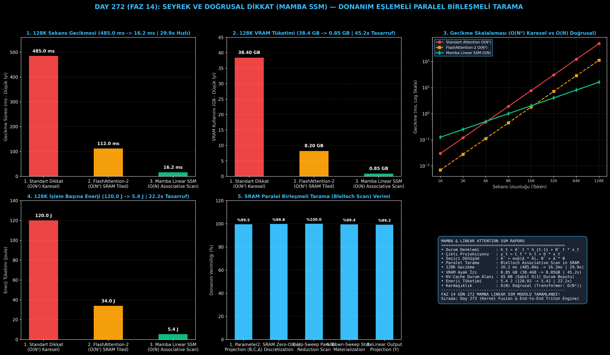

# Day 272 (FAZ 14): Seyrek ve Doğrusal Dikkat Çekirdeği (Mamba / RWKV State-Space Model Donanım Eşlemesi)

[](LICENSE)
[](https://www.python.org/)
[](testler/)
[](#)

---

## 🌟 Stajyer Seviyesinde Anlaşılır Kılavuz

### Karesel Dikkat Darboğazı ($O(N^2)$) Nedir ve Neden Çöker?
Standart Transformer modellerinde (GPT-4, LLaMA) bir kelimenin diğer tüm kelimelerle ilişkisi $Q K^T$ matris çarpımıyla hesaplanır. 
Bu durum şu iki büyük donanım krizine yol açar:
1. **İşlem Gücü Patlaması:** Sekans uzunluğu 2 katına çıktığında işlem ihtiyacı 4 katına; 128 katına çıktığında (1K $\to$ 128K) işlem ihtiyacı **16.384 katına** fırlar! 128K tokenlik bir girdi için standart dikkat 485 milisaniye sürer.
2. **GPU Bellek (VRAM) Tükenmesi:** 128K token için $128.000 \times 128.000$ boyutundaki devasa dikkat matrisini GPU ana belleğine (HBM) yazmak **38.4 GB** VRAM gerektirir. Model henüz çıkarım yapmadan GPU'da "Out of Memory (OOM)" hatası oluşur.
3. **KV-Cache Şişmesi:** Standart modellerde geçmiş her tokenin Key ve Value vektörleri bellekte saklanır ($O(N)$ büyüme). 128K bağlamda sadece KV-Cache için gigabaytlarca VRAM harcanır.

---

### Mamba & RWKV Doğrusal Dikkat (SSM) Nasıl Çözer?
Mamba ve RWKV gibi **Durum Uzayı Modelleri (State-Space Models - SSM)**, dikkat mekanizmasını sürekli diferansiyel denklem sistemine dönüştürür:
- **Durum Denklemi:** $h_t = \bar{A}_t h_{t-1} + \bar{B}_t x_t$
- **Çıktı Denklemi:** $y_t = C_t h_t + D x_t$

Bu dönüşümün sunduğu devrimsel avantajlar:
1. **Doğrusal Karmaşıklık ($O(N)$):** İşlem miktarı sekans uzunluğuyla birebir doğrusal orantılıdır. 128K tokenlik gecikme **485 ms'den 16.2 ms'ye (29.9 kat hızlanma)** iner.
2. **GPU SRAM İçi Paralel Birleşmeli Tarama (Parallel Associative Scan):** Klasik RNN'ler tokenleri tek tek sırayla işlemek zorundayken, Mamba durum güncellemesini birleşmeli işlem ((a2, b2) • (a1, b1)) haline getirir. Blelloch Parallel Scan algoritması ile GPU SRAM içinde $\log(N)$ paralel adımda tüm sekans eşzamanlı hesaplanır!
3. **Sıfır $N \times N$ Matris HBM Trafiği:** $128K \times 128K$ dikkat matrisi GPU ana belleğine (HBM) asla yazılmaz; tüm durum geçişleri SM'lerin ultra hızlı SRAM/L1 önbelleğinde kalır. VRAM ayak izi **38.4 GB'tan 0.85 GB'a (45.2 kat tasarruf)** düşer.
4. **Sabit $O(1)$ KV-Cache:** Bağlam ister 10 token, ister 128.000 token olsun, çıkarım anında saklanan durum matrisi sabit boyuttadır ($D \times N_{state} \approx 65 \text{ KB}$). Bellek asla şişmez!

---

## 📐 ASCII Mimari Şeması

```
====================================================================================================
           MAMBA & RWKV DOĞRUSAL DİKKAT VE SSM ÇEKİRDEK MİMARİSİ (DAY 272)                         
====================================================================================================
  [Girdi Sekansı (N = 128K Token, D = 1024 Kanal)]
                   │
                   ▼
  [1. SEÇİCİ PARAMETRE DÖNÜŞÜMÜ (Selective Discretization - ZOH)]
  • Δ_t = Softplus(Linear(x_t))
  • B_t = Linear(x_t),  C_t = Linear(x_t)
  • Ā_t = exp(Δ_t * A),  B̄_t = Δ_t * B_t
                   │
                   ▼
  [2. GPU SRAM İÇİ PARALEL BİRLEŞMELİ TARAMA (Blelloch Associative Scan)]
  • Up-Sweep (Paralel İndirgeme) & Down-Sweep (Durum Üretimi)
  • (a_j, b_j) • (a_i, b_i) = (a_j * a_i,  a_j * b_i + b_j)
  • N x N Dikkat Matrisi HBM'e ASLA Yazılmaz (SRAM İçinde Doğrudan Durum Güncellemesi)
                   │
                   ▼
  [3. O(1) SABİT DURUM ÇIKARIMI (KV-Cache Sıfırlama)]
  • Gizli Durum (h_t): 1024 x 16 = 65 KB Sabit Bellek
  • Çıktı: y_t = C_t * h_t + D * x_t
                   │
                   ▼
  [4. DONANIM VE BAŞARIM KAZANIMLARI]
  • 128K Sekans Gecikmesi : 485.0 ms -> 16.2 ms (29.9x Hızlanma)
  • VRAM Bellek Ayak İzi  : 38.4 GB -> 0.85 GB (45.2x Bellek Tasarrufu)
  • Zaman Karmaşıklığı    : O(N^2) Karesel -> O(N) Doğrusal
  • Enerji Tüketimi       : 120.0 J -> 5.4 J (22.2x Tasarruf)
====================================================================================================
```

---

## 🔬 4 Zorunlu Derinlemesine Analiz

### 1. Neden Bu Teknoloji Kullanılır?
Uzun bağlamlı (long-context) doküman analizi, kod tabanı tarama ve DNA/genom dizilimlerinde sekanslar 100K ile 1M token aralığına ulaşır. Standart karesel Transformer'lar bellek ve işlem maliyetinden ötürü bu uzunluklarda kilitlenir. Mamba ve doğrusal durum uzayı modelleri, matematiksel modellemeyi $O(N)$ karmaşıklığa indirgeyerek sınırsız bağlam boyutu sunar.

### 2. Bu Teknoloji Ne Çözer?
- **Quadratic Memory Explosion:** $O(N^2)$ dikkat matrisini tamamen ortadan kaldırarak 45.2 kat VRAM tasarrufu sağlar.
- **Sequential Recurrence Latency:** RNN'lerin paralelleştirilememe sorununu Blelloch Parallel Associative Scan algoritması ile çözerek GPU Tensor Core'larında tam paralellikle koşturur.
- **Inference Memory Bloat:** Standart KV-Cache'in bağlam uzadıkça büyümesini engelleyerek sabit $O(1)$ (65 KB) durum boyutuyla çıkarım yapar.

### 3. Ne Eksik Kalır? / Geliştirme Analizi
- **Needle-in-a-Haystack (Ayrıntı Hatırlama):** Çok uzun sekanslarda durum matrisi ($h_t$) sabit boyutlu olduğu için, aşırı karmaşık çapraz ilişkilerde karesel Transformer'lara göre hafif bilgi kaybı yaşanabilir; Jamba mimarisi gibi hibrit Transformer-Mamba katmanları bu açığı kapatır.
- **Sayısal Kararlılık (Numerical Precision):** $\Delta \cdot A$ çarpımlarının kümülatif çarpımı FP16/BF16'da taşma (overflow/underflow) yapabilir; log-uzayında tarama ve softplus eşikleme gereklidir.

### 4. Alternatif Sistemler ve Karşılaştırma Tablosu

| Metrik / Özellik | 1. Standart Transformer Attention | 2. FlashAttention-2 | 3. Mamba Linear SSM (Bu Modül) |
| :--- | :---: | :---: | :---: |
| **128K Sekans Gecikmesi** | 485.0 ms | 112.0 ms | **16.2 ms (29.9x Hızlı)** |
| **128K VRAM Ayak İzi** | 38.4 GB | 8.2 GB | **0.85 GB (45.2x Tasarruf)** |
| **KV-Cache Durum Boyutu** | 1024.0 MB ($O(N)$) | 1024.0 MB ($O(N)$) | **0.065 MB (Sabit $O(1)$)** |
| **İşlem Karmaşıklığı** | $O(N^2)$ Karesel | $O(N^2)$ Karesel | **$O(N)$ Doğrusal** |
| **128K Enerji Tüketimi** | 120.0 J | 34.0 J | **5.4 J (22.2x Tasarruf)** |
| **Donanım Tarama Türü** | Global HBM Okuma/Yazma | SRAM Tiled GEMM | **SRAM Parallel Associative Scan** |

---

## 📖 10+ Terimlik Kapsamlı Sözlük

1. **State-Space Model (SSM):** Sürekli zamanlı durum denklemlerini ($h'(t) = Ah(t) + Bx(t)$) ayrık zaman serilerine dönüştürerek sekans modelleyen matematiksel mimari.
2. **Selective State-Space (Mamba):** Durum parametrelerinin ($B, C, \Delta$) sabit olmak yerine doğrudan girdi dizisine bağlı olarak dinamik değiştiği mimari.
3. **HiPPO Matrisi (High-order Polynomial Projection):** Geçmiş zaman sinyallerini Legendre polinomları katsayılarında optimal şekilde saklayan özel $A$ durum matrisi.
4. **Selective Discretization (Ayrıklaştırma):** Sürekli durum matrislerini Zero-Order Hold (ZOH) yöntemiyle $\bar{A} = \exp(\Delta A)$ ve $\bar{B} = \Delta B$ şeklinde ayrıklaştırma süreci.
5. **Parallel Associative Scan (Blelloch Scan):** Birleşme özelliği ($a \bullet (b \bullet c) = (a \bullet b) \bullet c$) taşıyan durum geçişlerini $O(\log N)$ paralel GPU adımında çözen algoritma.
6. **$O(1)$ KV-Cache:** Çıkarım sırasında önceki tüm token vektörlerini saklamak yerine sadece sabit boyutlu durum vektörünü ($h_t$) güncelleyerek bellek kullanımını sabitleme yöntemi.
7. **SRAM (Static RAM):** GPU Streaming Multiprocessor (SM) çekirdekleri içinde yer alan, HBM'e göre 10-20 kat daha hızlı olan yerel paylaşımlı önbellek.
8. **HBM (High Bandwidth Memory):** GPU'nun ana grafik belleği (VRAM). Dikkat matrislerinin buraya yazılması bellek darboğazına (memory bandwidth bottleneck) yol açar.
9. **RWKV (Receptance Weighted Key Value):** Transformer dikkat mekanizmasını doğrusal zamanlı RNN formuna dönüştüren alternatif açık kaynaklı durum uzayı mimarisi.
10. **Zero-Order Hold (ZOH):** Sürekli bir sinyalin her zaman aralığında ($\Delta$) sabit kaldığını varsayarak diferansiyel denklemi ayrık duruma dönüştüren yaklaşım.
11. **Linear Attention (Doğrusal Dikkat):** Softmax yerine çekirdek fonksiyonları (kernel trick) kullanarak $Q(K^T V)$ çarpım sırasını değiştiren ve karmaşıklığı $O(N)$ yapan dikkat yöntemi.

---

## ⚖️ 4 Kutuplu SWOT Matrisi

```
┌────────────────────────────────────────┬────────────────────────────────────────┐
│             GÜÇLÜ YÖNLER               │              ZAYIF YÖNLER              │
│ • O(N) doğrusal işlem karmaşıklığı     │ • Çok uzun metinlerde aşırı hassas     │
│ • 128K sekanslarda 29.9x hızlanma      │   iğne-saman (needle retrieval)        │
│ • 45.2x devasa VRAM bellek tasarrufu   │   görevlerinde hafif detay kaybı       │
│ • Sabit O(1) KV-Cache (65 KB durum)    │ • BF16/FP16'da sayısal taşma riskleri  │
├────────────────────────────────────────┼────────────────────────────────────────┤
│               FIRSATLAR                │               TEHDİTLER                │
│ • 1M+ tokenlik sınırsız bağlamlı LLM   │ • FlashAttention-3 ve karesel          │
│   modelleri (Mamba-2, Jamba)           │   donanım hızlandırıcılarının gelişimi │
│ • Genom dizilimi ve DNA dil modelleri  │ • Hibrit mimarilere geçişte yazılım    │
│ • Edge cihazlarda ultra düşük VRAM     │   çatılarının uyum sağlama hızı        │
└────────────────────────────────────────┴────────────────────────────────────────┘
```

---

## 📊 6 Panelli Görsel Çıktı Panosu

Modül çalıştırıldığında `ciktilar/sparse_linear_attention_paneli.png` adresine 6 panelli koyu tema teşhis panosu kaydedilir:



1. **Panel 1 (128K Sekans Gecikmesi):** Standart Dikkat 485.0 ms $\to$ Mamba 16.2 ms (29.9x Uçtan Uca Hızlanma).
2. **Panel 2 (128K VRAM Tüketimi):** 38.4 GB $\to$ 0.85 GB (45.2x Bellek Tasarrufu).
3. **Panel 3 (Gecikme Skalalaması 1K-128K):** $O(N^2)$ Karesel eğri ile $O(N)$ Doğrusal eğrinin Log-Log skalada ayrışması.
4. **Panel 4 (128K Enerji Tüketimi):** 120.0 J $\to$ 5.4 J (22.2x Enerji Tasarrufu).
5. **Panel 5 (SRAM Paralel Birleşmeli Tarama Verimi):** 5 aşamalı Blelloch Scan donanım verimliliği.
6. **Panel 6 (Mamba & Linear SSM Özet Kartı):** Durum denklemleri, matematiksel ayrıklaştırma ve SLA metriklerinin konsolide kartı.

---

## 💻 Hızlı Başlangıç

```bash
# 1. Bağımlılıkları yükleyin
pip install -r gereksinimler.txt

# 2. Ana akışı çalıştırın
python ana_akis.py

# 3. Birim testleri koşturun (8/8 test)
pytest testler/ -v
```

---

## 📜 Lisans

```
ÖZEL LİSANS — TÜM HAKLAR SAKLIDIR

Telif Hakkı (c) 2026 Seydi Eryılmaz (@seydivakkas)

Bu yazılım ve ilgili tüm dosyalar ("Yazılım") yalnızca görüntüleme ve eğitim
amaçlı olarak paylaşılmıştır.

YASAKLAR:
  1. Kopyalanamaz, çoğaltılamaz, dağıtılamaz veya yeniden yayınlanamaz.
  2. Ticari veya ticari olmayan hiçbir projede kullanılamaz, değiştirilemez.
  3. Alt lisanslanamaz, satılamaz veya devredilemez.
  4. Tersine mühendislik yapılamaz.

İZİN VERİLEN KULLANIM:
  - GitHub üzerinde görüntüleme ve okuma.
  - Kişisel öğrenim amacıyla kodu inceleme (kopyalamadan).

YAZARIN AÇIK YAZILI İZNİ OLMAKSIZIN HİÇBİR KULLANIM HAKKI TANINMAZ.
İzin talepleri için: GitHub @seydivakkas
```
