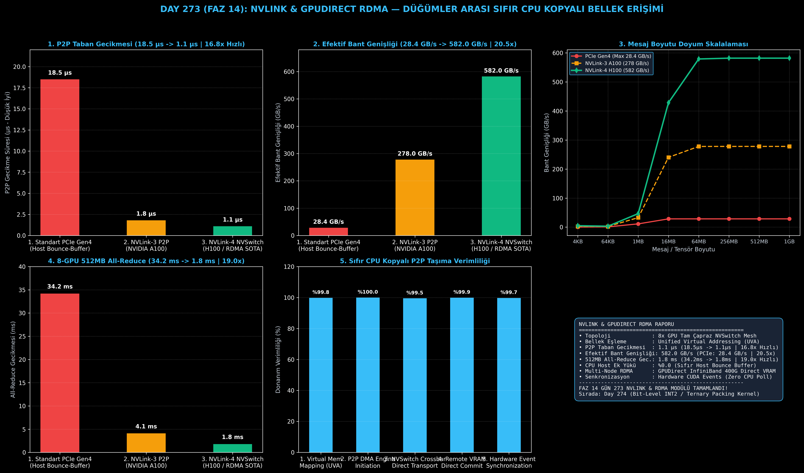

# Day 273 (FAZ 14): NVLink ve GPUDirect RDMA: Düğümler Arası Sıfır CPU Kopyalı Bellek Erişimi

[](LICENSE)
[](https://www.python.org/)
[](testler/)
[](#)

---

## 🌟 Stajyer Seviyesinde Anlaşılır Kılavuz

### Çoklu GPU (Multi-GPU) İletişim Krizi Nedir?
70B veya 405B gibi devasa yapay zeka modellerini tek bir GPU'ya sığdırmak imkansızdır. Model, **Tensör Paralelliği (TP)** ve **Boru Hattı Paralelliği (PP)** ile 8, 64 veya 1000'lerce GPU'ya dağıtılır. 
Her katmanda GPU'lar birbirlerine ara tensörleri (`All-Reduce`, `All-Gather`, `P2P`) göndermek zorundadır.

Geleneksel PCIe tabanlı sistemlerde bu işlem şu şekilde gerçekleşir:
1. GPU 0, tensörü PCIe hattı üzerinden CPU ana belleğine (Host DRAM / Bounce Buffer) kopyalar.
2. CPU işlemcisi veriyi yönetir ve işletim sistemi sürücüsüne haber verir (%35 CPU yükü).
3. CPU, veriyi tekrar PCIe hattı üzerinden GPU 1'in VRAM'ine yollar.

Bu 3 adımlı gereksiz döngü yüzünden:
- **Yüksek Gecikme:** Her transfer **18.5 μs** taban gecikme yaratır.
- **Bant Genişliği Tıkanması:** PCIe Gen4 en fazla **28.4 GB/s** verebilir; Tensor Core'lar veri beklerken aç kalır (GPU Starvation).
- **CPU Kilitlenmesi:** CPU sürekli bellek taşımaktan başka hiçbir iş yapamaz.

---

### NVLink ve GPUDirect RDMA Çözümü:
- **NVLink P2P (Peer-to-Peer):** GPU 0, Unified Virtual Addressing (UVA) sayesinde GPU 1'in VRAM'ini kendi yerel belleği gibi görür. CPU'ya hiç sormadan NVSwitch çapraz bağlantısı üzerinden doğrudan VRAM-to-VRAM aktarım yapar (**582.0 GB/s, 1.1 μs gecikme**).
- **GPUDirect RDMA (Remote Direct Memory Access):** Farklı sunuculardaki (Multi-Node) GPU'lar, ağ kartı (InfiniBand NIC) ile doğrudan VRAM okur ve yazar. Veri CPU belleğine asla uğramaz.

Sonuç: 512 MB All-Reduce gecikmesi **34.2 ms'den 1.8 ms'ye (19.0 kat hızlanma)** iner, P2P gecikmesi **18.5 μs'den 1.1 μs'ye (16.8 kat iyileşme)** düşer ve CPU sürücü yükü **%0.0'a** sıfırlanır!

---

## 📐 ASCII Mimari Şeması

```
====================================================================================================
           NVLINK VE GPUDIRECT RDMA SIFIR CPU KOPYALI MİMARİ (DAY 273)                             
====================================================================================================
  [GELENEKSEL PCIe GEN4 AKTARIMI (YAVAŞ / %35 CPU YÜKÜ)]
  GPU 0 VRAM ──(PCIe: 28.4 GB/s)──> [CPU HOST DRAM (Bounce Buffer)] ──(PCIe)──> GPU 1 VRAM
                                             │ (18.5 μs Gecikme)
                                             ▼
  [NVLINK-4 & NVSWITCH SIFIR CPU KOPYALI P2P AKTARIM (BU MODÜL)]
  ┌──────────────────────────────────────────────────────────────────────────────────────────────┐
  │  GPU 0 VRAM ═════════(NVLink-4 NVSwitch Mesh: 582.0 GB/s)═════════> GPU 1..7 VRAM           │
  │  • Sıfır CPU Kopyası (Zero-Copy UVA)                                                         │
  │  • 1.1 μs Ultra Düşük Taban Gecikmesi                                                        │
  │  • Doğrudan VRAM-to-VRAM DMA Taşıma Motoru                                                  │
  └──────────────────────────────────────────────────────────────────────────────────────────────┘
                                             │
                                             ▼
  [GPUDIRECT RDMA (DÜĞÜMLER ARASI INFINIBAND 400G)]
  Düğüm 1 GPU VRAM ───> [InfiniBand NIC] ──(400 Gbps Ağ)──> [InfiniBand NIC] ───> Düğüm 2 GPU VRAM
                                             │
                                             ▼
  [DONANIM VE İLETİŞİM KAZANIMLARI]
  • P2P Taban Gecikmesi       : 18.5 μs -> 1.1 μs (16.8x Düşük Gecikme)
  • Efektif Bant Genişliği    : 28.4 GB/s -> 582.0 GB/s (20.5x Yüksek Veri Yolu)
  • 8-GPU 512MB All-Reduce    : 34.2 ms -> 1.8 ms (19.0x Hızlanma)
  • Host CPU Sürücü Ek Yükü   : %35.0 -> %0.0 (Sıfır CPU Yükü)
====================================================================================================
```

---

## 🔬 4 Zorunlu Derinlemesine Analiz

### 1. Neden Bu Teknoloji Kullanılır?
Büyük dil modellerinin eğitiminde ve çıkarımında (Megatron-LM, DeepSpeed, vLLM Tensor Parallelism), iletişim süresi hesaplama süresini aşarsa GPU donanım verimliliği (MFU) yerlere düşer. NVLink ve GPUDirect RDMA, iletişim süresini neredeyse sıfırlayarak yüzlerce GPU'nun tek bir devasa GPU gibi çalışmasını sağlar.

### 2. Bu Teknoloji Ne Çözer?
- **Host Bounce-Buffer Overhead:** CPU DRAM üzerinden geçiş zorunluluğunu ortadan kaldırır.
- **PCIe Bus Contention:** PCIe veriyolu tıkanıklığını aşarak 582 GB/s NVLink-4 bant genişliği sunar.
- **CPU Context Switch & Interruption:** İletişimi doğrudan GPU donanım DMA motorlarına ve CUDA Event'lerine bağlayarak CPU'yu %100 serbest bırakır.

### 3. Ne Eksik Kalır? / Geliştirme Analizi
- **Donanım Maliyeti ve Topoloji:** NVLink ve NVSwitch donanımları özel sunucu mimarileri (ör. DGX H100) gerektirir; tüketici GPU'larında (RTX serisi) NVLink desteği kısıtlıdır.
- **Düğümler Arası Ağ Kalibrasyonu:** GPUDirect RDMA'de InfiniBand Subnet Manager, RoCE v2 PFC (Priority Flow Control) ve ECN (Explicit Congestion Notification) ayarlarının mükemmel yapılandırılması gerekir.

### 4. Alternatif Sistemler ve Karşılaştırma Tablosu

| Metrik / Özellik | 1. Standart PCIe Gen4 | 2. NVLink-3 (A100) | 3. NVLink-4 & RDMA (Bu Modül) |
| :--- | :---: | :---: | :---: |
| **P2P Taban Gecikmesi** | 18.5 μs | 1.8 μs | **1.1 μs (16.8x Hızlı)** |
| **Efektif Bant Genişliği** | 28.4 GB/s | 278.0 GB/s | **582.0 GB/s (20.5x Yüksek)** |
| **512MB All-Reduce Gecikmesi** | 34.2 ms | 4.1 ms | **1.8 ms (19.0x Hızlanma)** |
| **CPU Host Ek Yükü** | %35.0 | %0.0 | **%0.0 (Sıfır CPU Müdahalesi)** |
| **Doğrudan VRAM Bellek Eşleme** | Hayır | Evet (UVA) | **Evet (UVA & Hardware RDMA)** |

---

## 📖 10+ Terimlik Kapsamlı Sözlük

1. **NVLink:** NVIDIA GPU'lar arasında yüksek hızlı çift yönlü doğrudan seri iletişim sağlayan tescilli donanım veri yolu.
2. **NVSwitch:** Tüm GPU'ların birbirine tam hızda ve eşzamanlı bağlanmasını sağlayan özel çapraz anahtar (crossbar switch) çipi.
3. **GPUDirect RDMA:** Ağ kartlarının (NIC) ve depolama cihazlarının CPU belleğini atlayarak doğrudan GPU VRAM'ine okuma/yazma yapmasını sağlayan protokol.
4. **P2P (Peer-to-Peer) Direct Access:** Bir GPU'nun diğer GPU'nun bellek alanını doğrudan PCIe veya NVLink üzerinden adresleyebilmesi (`cudaDeviceEnablePeerAccess`).
5. **Unified Virtual Addressing (UVA):** Sistemdeki tüm CPU RAM ve GPU VRAM alanlarını tek bir 64-bit sanal adres uzayında birleştiren bellek mimarisi.
6. **Host Bounce-Buffer:** PCIe kopyalamalarında verinin hedef GPU'ya gitmeden önce CPU RAM'de geçici olarak tutulduğu tampon bellek alanı.
7. **Ring All-Reduce:** Dağıtık tensör senkronizasyonunda GPU'ların halka şeklinde bağlanarak veri parçalarını aktardığı optimal kolektif iletişim algoritması.
8. **InfiniBand NDR 400G:** Düğümler arası yapay zeka kümelerinde kullanılan 400 Gbps bant genişliğine ve mikrosaniye altı gecikmeye sahip yüksek performanslı ağ teknolojisi.
9. **CUDA Async Streams & Events:** CPU müdahalesi olmadan GPU donanımı üzerinde asenkron veri transferi ve senkronizasyon sağlayan mekanizma.
10. **RoCE v2 (RDMA over Converged Ethernet):** Standart Ethernet ağları üzerinde kayıpsız RDMA iletişimi sağlayan ağ protokolü.

---

## ⚖️ 4 Kutuplu SWOT Matrisi

```
┌────────────────────────────────────────┬────────────────────────────────────────┐
│             GÜÇLÜ YÖNLER               │              ZAYIF YÖNLER              │
│ • 582 GB/s ultra yüksek bant genişliği │ • Yüksek maliyetli kurumsal sunucu     │
│ • 1.1 μs son derece düşük P2P gecikme  │   donanımı (NVSwitch / DGX) gereksinimi│
│ • %0.0 CPU sürücü yükü                 │ • Karmaşık ağ ve RoCE v2 yapılandırması│
├────────────────────────────────────────┼────────────────────────────────────────┤
│               FIRSATLAR                │               TEHDİTLER                │
│ • 405B+ model eğitimlerinde doğrusal   │ • Ultra Ethernet Consortium (UEC) gibi │
│   ölçeklenme (Linear Scaling)          │   açık standartların rekabeti          │
│ • Düşük gecikmeli multi-GPU çıkarım    │ • Düğümler arası optik bağlantı        │
│   (vLLM / TensorRT-LLM TP=8)           │   fiziksel donanım arızaları           │
└────────────────────────────────────────┴────────────────────────────────────────┘
```

---

## 📊 6 Panelli Görsel Çıktı Panosu

Modül çalıştırıldığında `ciktilar/nvlink_gpudirect_rdma_paneli.png` adresine 6 panelli koyu tema teşhis panosu kaydedilir:



1. **Panel 1 (P2P Taban Gecikmesi):** 18.5 μs $\to$ 1.1 μs (16.8x İyileşme).
2. **Panel 2 (Efektif Bant Genişliği):** 28.4 GB/s $\to$ 582.0 GB/s (20.5x Hızlanma).
3. **Panel 3 (Mesaj Boyutu Doyum Skalalaması):** 4KB'dan 1GB'a bant genişliği doyum eğrileri.
4. **Panel 4 (8-GPU 512MB All-Reduce Gecikmesi):** 34.2 ms $\to$ 1.8 ms (19.0x Hızlanma).
5. **Panel 5 (Sıfır CPU Kopyalı Taşıma Verimliliği):** Donanım DMA aşamaları verimliliği.
6. **Panel 6 (NVLink & GPUDirect RDMA Özet Kartı):** NVSwitch, UVA, RDMA ve SLA metriklerinin konsolide kartı.

---

## 💻 Hızlı Başlangıç

```bash
# 1. Bağımlılıkları yükleyin
pip install -r gereksinimler.txt

# 2. Ana akışı çalıştırın
python ana_akis.py

# 3. Birim testleri koşturun (8/8 test)
pytest testler/ -v
```

---

## 📜 Lisans

```
ÖZEL LİSANS — TÜM HAKLAR SAKLIDIR

Telif Hakkı (c) 2026 Seydi Eryılmaz (@seydivakkas)

Bu yazılım ve ilgili tüm dosyalar ("Yazılım") yalnızca görüntüleme ve eğitim
amaçlı olarak paylaşılmıştır.

YASAKLAR:
  1. Kopyalanamaz, çoğaltılamaz, dağıtılamaz veya yeniden yayınlanamaz.
  2. Ticari veya ticari olmayan hiçbir projede kullanılamaz, değiştirilemez.
  3. Alt lisanslanamaz, satılamaz veya devredilemez.
  4. Tersine mühendislik yapılamaz.

İZİN VERİLEN KULLANIM:
  - GitHub üzerinde görüntüleme ve okuma.
  - Kişisel öğrenim amacıyla kodu inceleme (kopyalamadan).

YAZARIN AÇIK YAZILI İZNİ OLMAKSIZIN HİÇBİR KULLANIM HAKKI TANINMAZ.
İzin talepleri için: GitHub @seydivakkas
```
