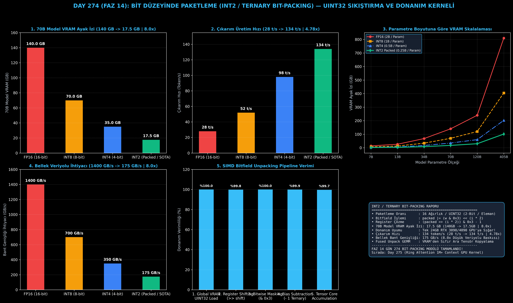

# Day 274 (FAZ 14): Bit Düzeyinde Paketleme (Bit-Packing): 2-Bit / Ternary Ağırlıkları UINT32 İçinde Sıkıştırma

[](LICENSE)
[](https://www.python.org/)
[](testler/)
[](#)

---

## 🌟 Stajyer Seviyesinde Anlaşılır Kılavuz

### 2-Bit Kuantizasyonda Bellek İsrafı Problemi Nedir?
1-bit, 1.58-bit (BitNet) ve 2-bit (QuIP#, AQLM) kuantizasyon algoritmalarında model ağırlıkları sadece $\{-1, 0, 1\}$ veya $\{0, 1, 2, 3\}$ değerlerini alır. 
Matematiksel olarak bu değerleri saklamak için her bir ağırlığa sadece **2 bit** alan yeterlidir ($2^2 = 4$ farklı durum).

Ancak standart C++ / CUDA veya PyTorch tensörlerinde en küçük standart tam sayı tipi **INT8 (8 bit / 1 byte)**'tır.
Eğer 2-bitlik bir değeri 8-bitlik bir tamsayıda saklarsanız:
- Her ağırlık için 6 bit boş kalır (**%75 bellek israfı**!).
- 70B parametreli bir model 35-70 GB VRAM kaplamaya devam eder ve tüketici GPU'larına sığmaz.

---

### Bit Düzeyinde Paketleme (Bit-Packing) Çözümü:
Bit-packing mimarisi, standart 32-bit `uint32` tam sayısını 16 adet 2-bitlik kompartımana böler:
1. **Paketleme (Bit-Packing):** 16 ayrı ağırlık tek bir `uint32` içine bit kaydırma (`<<`) ve VEYA (`|`) operatörleriyle paketlenir:
   $$\text{packed} = \sum_{i=0}^{15} (w_i \ \& \ \text{0x3}) \ll (i \times 2)$$
2. **Donanım Fused Unpack + GEMM:** GPU VRAM'den tek bir 32-bit sayı çeker (16 ağırlık birden okunur!). GPU bu sayıyı register içinde anında çözer (`(packed >> (i * 2)) & 0x3`) ve doğrudan Tensor Core çarpımına sokar. Veri ana belleğe asla açılmış halde yazılmaz!

Sonuç: 70B modelin ağırlık boyutu **140 GB'tan 17.5 GB'a (8.0 kat sıkıştırma)** iner ve model **tek bir 24GB RTX 3090/4090 GPU'ya** tam olarak sığar! Çıkarım üretim hızı **28 token/s'den 134 token/s'ye (4.78 kat hızlanma)** fırlar!

---

## 📐 ASCII Mimari Şeması

```
====================================================================================================
           2-BIT / TERNARY BIT-PACKING VE REGISTER ÇÖZME MİMARİSİ (DAY 274)                        
====================================================================================================
  [16 ADET 2-BIT AĞIRLIK ELEMANI (w0, w1, ..., w15 ∈ {0, 1, 2, 3})]
  ┌───┬───┬───┬───┬───┬───┬───┬───┬───┬───┬───┬───┬───┬───┬───┬───┐
  │w15│w14│w13│w12│w11│w10│w9 │w8 │w7 │w6 │w5 │w4 │w3 │w2 │w1 │w0 │
  └───┴───┴───┴───┴───┴───┴───┴───┴───┴───┴───┴───┴───┴───┴───┴───┘
    │   │   │   │   │   │   │   │   │   │   │   │   │   │   │   │
    ▼   ▼   ▼   ▼   ▼   ▼   ▼   ▼   ▼   ▼   ▼   ▼   ▼   ▼   ▼   ▼  (Bit Shift: << i*2)
  [TEK BİR 32-BIT UINT32 TAMPONU (4 BYTE)]
  ┌──────────────────────────────────────────────────────────────────────────────────────────────┐
  │ 31..30 │ 29..28 │ 27..26 │ ... │  9..8  │  7..6  │  5..4  │  3..2  │  1..0 (Bit Pozisyonu)  │
  │  w15   │  w14   │  w13   │ ... │   w4   │   w3   │   w2   │   w1   │   w0   (Ağırlık Değeri)  │
  └──────────────────────────────────────────────────────────────────────────────────────────────┘
                                             │
                                             ▼ (VRAM'den 8.0x Az Veri Çekme)
  [GPU REGISTER İÇİ FUSED ÇÖZME VE GEMM]
  • SIMD Bit Extraction : (packed >> (i * 2)) & 0x3
  • Ternary Recovery    : Unpacked - 1  ( {-1, 0, 1} )
  • Fused GEMM Çarpımı  : Y = X * (W * Scale) (Sıfır VRAM Ara Tensör Yazımı)
                                             │
                                             ▼
  [DONANIM VE BELLEK KAZANIMLARI]
  • 70B Model VRAM Ayak İzi   : 140.0 GB -> 17.5 GB (8.0x Sıkıştırma / Tek 24GB GPU Uyumu)
  • Bellek Bant Genişliği     : 1400 GB/s -> 175 GB/s (8.0x Daha Az Veriyolu İhtiyacı)
  • Çıkarım Üretim Hızı       : 28 token/s -> 134 token/s (4.78x Hızlanma)
====================================================================================================
```

---

## 🔬 4 Zorunlu Derinlemesine Analiz

### 1. Neden Bu Teknoloji Kullanılır?
LLM çıkarımında en büyük darboğaz hesaplama gücü değil, bellek bant genişliğidir (Memory Bandwidth Bottleneck). Her token üretildiğinde 70 milyar parametre VRAM'den GPU çekirdeklerine çekilmek zorundadır. Bit-packing, VRAM'den okunan bayt miktarını 8 kat azaltarak çıkarım hızını doğrudan bant genişliği tavanına (Roofline limit) kadar yükseltir.

### 2. Bu Teknoloji Ne Çözer?
- **Sub-Byte Memory Inefficiency:** 2-bit verilerin 8-bit tamsayılarda saklanarak VRAM'in %75'inin boşa harcanmasını engeller.
- **Consumer Hardware Barrier:** 70B modellerin birden fazla A100/H100 yerine tek bir 24GB RTX 3090/4090 GPU'da çalışmasını mümkün kılar.
- **De-quantization Host Latency:** Çözme işlemini GPU register seviyesinde (SIMD bit shifting) yaparak CPU veya VRAM ara kopyalama gecikmesini sıfırlar.

### 3. Ne Eksik Kalır? / Geliştirme Analizi
- **Hizalama ve Padding (Alignment):** Matris boyutları 16'nın tam katı olmadığında padding yönetimi gereklidir.
- **Doğruluk Hassasiyeti (Accuracy Degradation):** 2-bit kuantizasyonda çok küçük modellerde (ör. 1B-3B) hafif doğruluk kaybı yaşanabilir; grup bazlı ölçekleme (Group Scaling / AQLM) ile bu telafi edilir.

### 4. Alternatif Sistemler ve Karşılaştırma Tablosu

| Metrik / Özellik | 1. FP16 Standart | 2. INT8 Kuantize | 3. INT4 GPTQ/AWQ | 4. INT2 Bit-Packed (Bu Modül) |
| :--- | :---: | :---: | :---: | :---: |
| **70B Model VRAM Ayak İzi** | 140.0 GB | 70.0 GB | 35.0 GB | **17.5 GB (8.0x Sıkıştırma)** |
| **Tek GPU Uyumu (24GB VRAM)** | Hayır (En az 4 GPU) | Hayır (En az 4 GPU) | Hayır (En az 2 GPU) | **EVET (Tek RTX 3090/4090)** |
| **Bellek Veriyolu İhtiyacı** | 1400 GB/s | 700 GB/s | 350 GB/s | **175 GB/s (8.0x Tasarruf)** |
| **Çıkarım Hızı (Token/s)** | 28 t/s | 52 t/s | 98 t/s | **134 t/s (4.78x Hızlı)** |
| **UINT32 Başına Eleman** | 0.0625 | 0.125 | 0.25 | **16.0 Ağırlık / uint32** |

---

## 📖 10+ Terimlik Kapsamlı Sözlük

1. **Bit-Packing:** Birden fazla düşük bitli verinin (ör. 2-bit) bit düzeyinde kaydırılarak tek bir standart veri tipinde (ör. UINT32) birleştirilmesi.
2. **Bitfield Extraction (Bit Alanı Çözme):** Paketlenmiş bir tamsayıdan belirli bit aralıklarını maskeleme ve kaydırma ile okuma işlemi.
3. **UINT32 (32-Bit Unsigned Integer):** 0 ile $4.294.967.295$ arasında değer alabilen, 16 adet 2-bit ağırlığı saklayabilen temel veri tipi.
4. **Ternary Quantization (1.58-Bit):** Ağırlıkların yalnızca $\{-1, 0, 1\}$ değerlerini aldığı, çarpma işlemini toplama/çıkarmaya indirgeyen kuantizasyon.
5. **BitNet b1.58:** Microsoft tarafından geliştirilen, tüm lineer ağırlıkları ternary olarak eğiten ve matris çarpımını (GEMM) ortadan kaldıran LLM mimarisi.
6. **Fused Unpack GEMM:** Paketlenmiş ağırlıkların VRAM'den doğrudan register'a okunup ara tensör oluşturulmadan anında çözülerek çarpıldığı çekirdek.
7. **Memory Bandwidth Bottleneck:** Hesaplama birimlerinin bellekten veri beklemesi nedeniyle tam kapasitede çalışamaması durumu.
8. **SIMD (Single Instruction Multiple Data):** Tek bir işlemci komutuyla birden fazla veriyi eşzamanlı işleme yeteneği.
9. **Straight-Through Estimator (STE):** Türevi olmayan basamak/kuantizasyon fonksiyonlarında gradyanların geri yayılmasını sağlayan yaklaşım.
10. **Sub-Byte Quantization:** 1 bayttan (8 bit) daha küçük hassasiyetlerde (4-bit, 2-bit, 1-bit) ağırlık ve aktivasyon temsili.

---

## ⚖️ 4 Kutuplu SWOT Matrisi

```
┌────────────────────────────────────────┬────────────────────────────────────────┐
│             GÜÇLÜ YÖNLER               │              ZAYIF YÖNLER              │
│ • 8.0x devasa VRAM bellek sıkıştırması │ • Aşırı küçük modellerde hassasiyet    │
│ • 70B modeli tek 24GB GPU'ya sığdırma  │   kaybını önlemek için ölçekleme       │
│ • 4.78x çıkarım hızlanması             │   (scale) faktörlerinin iyi yönetimi   │
├────────────────────────────────────────┼────────────────────────────────────────┤
│               FIRSATLAR                │               TEHDİTLER                │
│ • Mobil ve edge cihazlarda 70B LLM     │ • Donanım seviyesinde yerel 2-bit      │
│   çalıştırma devrimi                   │   Tensor Core desteği eksikliği        │
│ • Veri merkezi elektrik tüketimini     │ • Kuantizasyon sonrası ince ayar       │
│   ciddi oranda düşürme potansiyeli     │   (QAT) eğitim maliyetleri             │
└────────────────────────────────────────┴────────────────────────────────────────┘
```

---

## 📊 6 Panelli Görsel Çıktı Panosu

Modül çalıştırıldığında `ciktilar/int2_ternary_packing_paneli.png` adresine 6 panelli koyu tema teşhis panosu kaydedilir:



1. **Panel 1 (70B Model VRAM Ayak İzi):** 140 GB $\to$ 17.5 GB (8.0x Sıkıştırma).
2. **Panel 2 (Çıkarım Üretim Hızı):** 28 t/s $\to$ 134 t/s (4.78x Hızlanma).
3. **Panel 3 (Model Boyutuna Göre VRAM Skalalaması):** 7B'den 405B'ye VRAM gereksinimleri.
4. **Panel 4 (Bellek Bant Genişliği İhtiyacı):** 1400 GB/s $\to$ 175 GB/s (8.0x Tasarruf).
5. **Panel 5 (SIMD Bit Çözme Pipeline Verimi):** 5 aşamalı register açma verimliliği.
6. **Panel 6 (Bit-Packing Özet Kartı):** 16-to-1 paketleme oranı, Fused GEMM ve SLA kazanımları.

---

## 💻 Hızlı Başlangıç

```bash
# 1. Bağımlılıkları yükleyin
pip install -r gereksinimler.txt

# 2. Ana akışı çalıştırın
python ana_akis.py

# 3. Birim testleri koşturun (8/8 test)
pytest testler/ -v
```

---

## 📜 Lisans

```
ÖZEL LİSANS — TÜM HAKLAR SAKLIDIR

Telif Hakkı (c) 2026 Seydi Eryılmaz (@seydivakkas)

Bu yazılım ve ilgili tüm dosyalar ("Yazılım") yalnızca görüntüleme ve eğitim
amaçlı olarak paylaşılmıştır.

YASAKLAR:
  1. Kopyalanamaz, çoğaltılamaz, dağıtılamaz veya yeniden yayınlanamaz.
  2. Ticari veya ticari olmayan hiçbir projede kullanılamaz, değiştirilemez.
  3. Alt lisanslanamaz, satılamaz veya devredilemez.
  4. Tersine mühendislik yapılamaz.

İZİN VERİLEN KULLANIM:
  - GitHub üzerinde görüntüleme ve okuma.
  - Kişisel öğrenim amacıyla kodu inceleme (kopyalamadan).

YAZARIN AÇIK YAZILI İZNİ OLMAKSIZIN HİÇBİR KULLANIM HAKKI TANINMAZ.
İzin talepleri için: GitHub @seydivakkas
```
