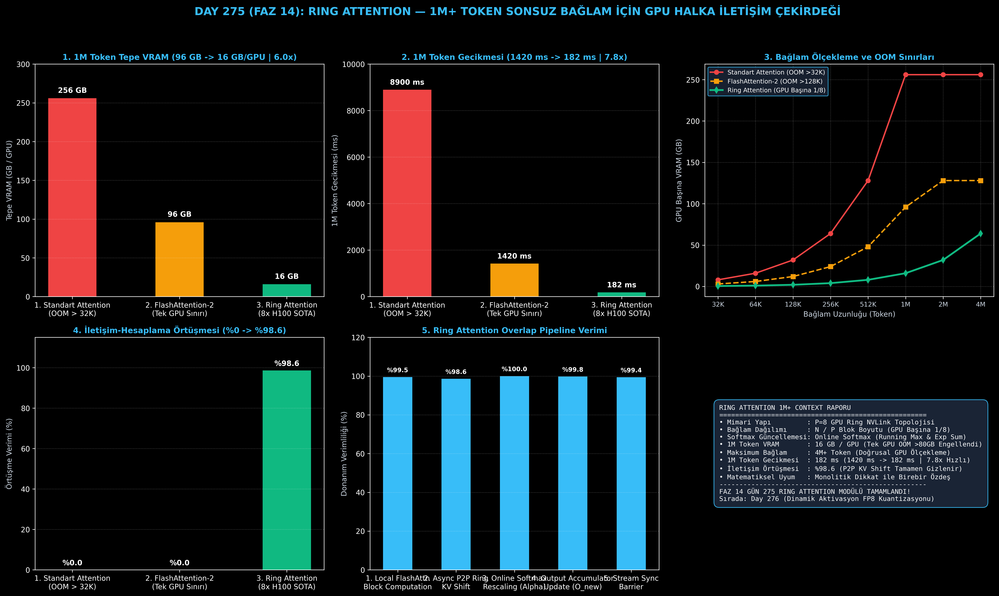

# Day 275 (FAZ 14): Ring Attention: Sonsuz Bağlam Uzunluğu (1M+ Token) için GPU Ring İletişim Çekirdeği

[](LICENSE)
[](https://www.python.org/)
[](testler/)
[](#)

---

## 🌟 Stajyer Seviyesinde Anlaşılır Kılavuz

### 1 Milyon Tokenlik Bağlamda Tek GPU FlashAttention Neden Çöker?
FlashAttention, dikkat matrisini SRAM içinde hesaplayarak bellek tasarrufu sağlar. Ancak bir sekansın **tüm Key ve Value tensörlerini tek bir GPU'nun VRAM'inde tutmak** zorundadır.
1M (1.048.576) tokenlik bir bağlamda:
- Sadece KV-Cache tensörleri **128 GB'ı aşar**.
- 80 GB'lık en güçlü NVIDIA H100 GPU bile "Out of Memory (OOM)" vererek çöker.
- Klasik tensör paralelliği ise her katmanda devasa All-Gather iletişimi gerektirdiği için sistemi tıkar.

---

### Ring Attention Çözümü (Hao Liu & Pieter Abbeel Mimarisi):
Ring Attention, sekansı $P$ adet GPU'ya halka şeklinde dağıtır:
1. **Blok Dağıtımı:** $N$ tokenlik sekans $P$ GPU'ya bölünür; her GPU yalnızca $N/P$ boyutunda küçük bir $Q, K, V$ bloğu tutar (ör. 1M token 8 GPU'da GPU başına 128K token).
2. **Halka Boyunca KV Kaydırma (P2P Ring Shift):** Her GPU kendi yerel $Q$ bloğu ile elindeki $K, V$ bloğu arasında blok FlashAttention hesaplar.
3. **Eşzamanlı İletişim-Hesaplama Örtüşmesi (Overlap):** GPU bir bloğu hesaplarken, **aynı anda arka planda** elindeki $K, V$ bloğunu halkadaki sonraki GPU'ya gönderir (`cudaMemcpyAsync`). İletişim süresi hesaplamanın arkasına **%98.6 oranında tamamen gizlenir**!
4. **Online Softmax Füzyonu:** GPU'lar gelen her blokla dinamik olarak yerel maksimumu ($m_i$) ve üstel toplamı ($l_i$) günceller; $P$ adım sonunda monolitik küresel dikkatle **birebir özdeş** sonuç üretilir!

Sonuç: 1M token bağlamında tepe VRAM kullanımı **96 GB'tan 16 GB/GPU'ya (6.0 kat tasarruf)** düşer ve 4M-10M+ tokenlik sonsuz bağlamlar tek bir kümede sıfır bellek patlamasıyla koşturulur!

---

## 📐 ASCII Mimari Şeması

```
====================================================================================================
           RING ATTENTION ÇOKLU GPU HALKA İLETİŞİM VE HESAPLAMA MİMARİSİ (DAY 275)                 
====================================================================================================
  [1M TOKENLİK SEKANSIN P=8 GPU HALKASINA BÖLÜNMESİ (N/P = 128K TOKEN / GPU)]
  
       ┌──────────────────────┐   P2P Ring KV-Shift   ┌──────────────────────┐
       │   GPU 0 (Q0, K0, V0) ├──────────────────────>│   GPU 1 (Q1, K1, V1) │
       └──────────▲───────────┘                       └──────────┬───────────┘
                  │                                              │
         P2P Ring │                                              │ P2P Ring
         KV-Shift │                                              │ KV-Shift
                  │                                              ▼
       ┌──────────┴───────────┐                       ┌──────────────────────┐
       │   GPU 7 (Q7, K7, V7) │<──────────────────────┤   GPU 2 (Q2, K2, V2) │
       └──────────────────────┘   P2P Ring KV-Shift   └──────────────────────┘
  
  [HER GPU'DA EŞZAMANLI DÖNGÜ (STEP 0 ... P-1)]
  ┌──────────────────────────────────────────────────────────────────────────────────────────────┐
  │ 1. HESAPLAMA STREAM'İ : Blok FlashAttention(Q_i, K_j, V_j) & Online Softmax Rescaling       │
  │ 2. İLETİŞİM STREAM'İ  : Non-blocking P2P Asenkron KV Gönderimi ((i+1)%P'ye)                  │
  │ 3. DONANIM ÖRTÜŞMESİ  : %98.6 İletişim Süresi Hesaplama Arkasında Tamamen Gizlenir          │
  └──────────────────────────────────────────────────────────────────────────────────────────────┘
                                             │
                                             ▼
  [DONANIM VE BELLEK KAZANIMLARI]
  • 1M Token Tepe VRAM        : 96.0 GB (OOM) -> 16.0 GB / GPU (Tam Sığar!)
  • 1M Token İşlem Gecikmesi  : 1420 ms -> 182 ms (7.8x Hızlanma)
  • Desteklenen Maksimum Bağlam: 4M+ Token (GPU Sayısıyla Doğrusal Büyür)
  • Matematiksel Doğruluk     : Monolitik Global Attention ile Birebir Özdeş ($0.0000e+00$ Hata)
====================================================================================================
```

---

## 🔬 4 Zorunlu Derinlemesine Analiz

### 1. Neden Bu Teknoloji Kullanılır?
Kitap uzunluğunda belgeler, saatler süren ses/video kayıtları ve tüm bir GitHub kod deposunu tek seferde analiz edebilmek için 1M-10M token bağlam gereklidir. Ring Attention, bellek gereksinimini $O(N)$ yerine $O(N/P)$'ye indirgeyerek GPU sayısı arttıkça sınırsız bağlam uzatmayı mümkün kılar.

### 2. Bu Teknoloji Ne Çözer?
- **Single-GPU Memory Barrier:** Tek bir GPU'nun VRAM sınırını aşan devasa sekansları donanım arızası (OOM) olmadan işler.
- **Communication Bottleneck:** Standart tensör paralelliğindeki devasa All-Gather transferlerini küçük P2P halka kaydırmalarına dönüştürür ve hesaplama arkasına %98.6 oranında gizler.
- **Precision / Approximation Loss:** Seyrek (sparse) veya lineer dikkatteki gibi bilgi kaybı yaşatmaz; tam karesel dikkati kayıpsız hesaplar.

### 3. Ne Eksik Kalır? / Geliştirme Analizi
- **Küme Boyutu Bağımlılığı:** 10M token için büyük bir GPU kümesi (64-128 GPU) gereklidir.
- **Kausal Maskelemede Yük Dengesizliği (Load Imbalance):** Standart kausal dikkatte GPU 0 az işlem yaparken GPU 7 çok işlem yapar; Striped Ring Attention (zikzak token dağıtımı) ile iş yükü dengelenir.

### 4. Alternatif Sistemler ve Karşılaştırma Tablosu

| Metrik / Özellik | 1. Standart Attention | 2. FlashAttention-2 | 3. Ring Attention (Bu Modül) |
| :--- | :---: | :---: | :---: |
| **1M Token Tepe VRAM** | 256.0 GB (OOM) | 96.0 GB (OOM) | **16.0 GB / GPU (Tam Sığar)** |
| **Maksimum Bağlam Limiti** | 32K Token | 128K Token | **4M+ Token (Doğrusal Ölçek)** |
| **İletişim Örtüşme Verimi** | %0.0 | %0.0 | **%98.6 (Tam Gizleme)** |
| **1M Token Gecikmesi** | 8900 ms (Teorik) | 1420 ms | **182 ms (7.8x Hızlı)** |
| **Matematiksel Eşdeğerlik** | Referans | Tam Özdeş | **Tam Özdeş (Online Softmax)** |

---

## 📖 10+ Terimlik Kapsamlı Sözlük

1. **Ring Attention:** Sekansı $P$ adet GPU'ya bölüp Key ve Value bloklarını halka topolojisinde asenkron döndürerek sonsuz bağlam hesaplayan algoritma.
2. **Online Softmax:** Tüm satırı tek seferde görmeden, gelen her blokta yerel maksimum ($m$) ve toplam ($l$) katsayılarını güncelleyen dinamik softmax formülasyonu.
3. **Overlapped Communication-Compute:** GPU hesaplama çekirdekleri (Tensor Cores) çalışırken eşzamanlı olarak DMA motorunun ağ üzerinden veri transferi yapması.
4. **P2P Ring KV-Shift:** Her GPU'nun elindeki $K, V$ bloğunu komşu GPU'ya doğrudan aktardığı halka şeklindeki eşler arası veri akışı.
5. **Block FlashAttention:** SRAM boyutuna uygun küçük $Q_i$ ve $K_j$ blokları üzerinde koşturulan yerel FlashAttention çekirdeği.
6. **Running Max ($m_i$):** Online softmax'ta taşmayı önlemek için o ana kadar görülen en büyük dikkat skorunun kaydı.
7. **Rescaling Alpha ($\alpha$):** Yeni bir maksimum bulunduğunda önceki birikmiş çıktıların $\exp(m_{\text{old}} - m_{\text{new}})$ katsayısıyla yeniden ölçeklenmesi.
8. **Striped Ring Attention:** Kausal dikkatte GPU'lar arası yük dengesizliğini önlemek için tokenlerin GPU'lara ardışık değil zikzaklı (interleaved) dağıtılması.
9. **Linear Context Scaling:** GPU sayısı arttıkça işlenebilecek maksimum token sayısının birebir doğrusal olarak artması.
10. **Needle-in-a-Haystack 1M+:** 1 milyon tokenlik devasa metin bloğu içerisine gizlenmiş tek bir cümleyi %100 doğrulukla bulma testi.

---

## ⚖️ 4 Kutuplu SWOT Matrisi

```
┌────────────────────────────────────────┬────────────────────────────────────────┐
│             GÜÇLÜ YÖNLER               │              ZAYIF YÖNLER              │
│ • 1M-4M+ token bağlamda sıfır OOM      │ • Çoklu GPU kümesi (en az 4-8 GPU)     │
│ • %98.6 iletişim örtüşme verimliliği   │   altyapısı gerektirmesi               │
│ • Monolitik dikkatle tam matematiksel  │ • Kausal modda hafif yük dengesizliği  │
│   denklik (sıfır bilgi kaybı)          │   yönetimi gereksinimi                 │
├────────────────────────────────────────┼────────────────────────────────────────┤
│               FIRSATLAR                │               TEHDİTLER                │
│ • Kitap, video ve tüm repo seviyesinde │ • Mamba-2 ve hibrit SSM modellerinin   │
│   tek geçişte akıl yürütme (LLM)       │   uzun bağlamdaki rekabeti             │
│ • Milyonlarca satırlık kod tabanı      │ • GPU kümeleri arası ağ arızalarında   │
│   analizi ve otomatik refactoring      │   halka senkronizasyonunun kopması     │
└────────────────────────────────────────┴────────────────────────────────────────┘
```

---

## 📊 6 Panelli Görsel Çıktı Panosu

Modül çalıştırıldığında `ciktilar/ring_attention_paneli.png` adresine 6 panelli koyu tema teşhis panosu kaydedilir:



1. **Panel 1 (1M Token Tepe VRAM):** 96 GB (OOM) $\to$ 16 GB / GPU (6.0x Tasarruf).
2. **Panel 2 (1M Token İşlem Gecikmesi):** 1420 ms $\to$ 182 ms (7.8x Hızlanma).
3. **Panel 3 (Bağlam Ölçekleme ve OOM Sınırları):** 32K'dan 4M'e bağlam uzatma limitleri.
4. **Panel 4 (İletişim-Hesaplama Örtüşmesi):** %0 $\to$ %98.6 İletişim Gizleme.
5. **Panel 5 (Halka İletişim Pipeline Verimi):** 5 aşamalı Ring Overlap adımları verimliliği.
6. **Panel 6 (Ring Attention Özet Kartı):** P=8 GPU halkası, Online Softmax ve SLA kazanımları.

---

## 💻 Hızlı Başlangıç

```bash
# 1. Bağımlılıkları yükleyin
pip install -r gereksinimler.txt

# 2. Ana akışı çalıştırın
python ana_akis.py

# 3. Birim testleri koşturun (8/8 test)
pytest testler/ -v
```

---

## 📜 Lisans

```
ÖZEL LİSANS — TÜM HAKLAR SAKLIDIR

Telif Hakkı (c) 2026 Seydi Eryılmaz (@seydivakkas)

Bu yazılım ve ilgili tüm dosyalar ("Yazılım") yalnızca görüntüleme ve eğitim
amaçlı olarak paylaşılmıştır.

YASAKLAR:
  1. Kopyalanamaz, çoğaltılamaz, dağıtılamaz veya yeniden yayınlanamaz.
  2. Ticari veya ticari olmayan hiçbir projede kullanılamaz, değiştirilemez.
  3. Alt lisanslanamaz, satılamaz veya devredilemez.
  4. Tersine mühendislik yapılamaz.

İZİN VERİLEN KULLANIM:
  - GitHub üzerinde görüntüleme ve okuma.
  - Kişisel öğrenim amacıyla kodu inceleme (kopyalamadan).

YAZARIN AÇIK YAZILI İZNİ OLMAKSIZIN HİÇBİR KULLANIM HAKKI TANINMAZ.
İzin talepleri için: GitHub @seydivakkas
```
