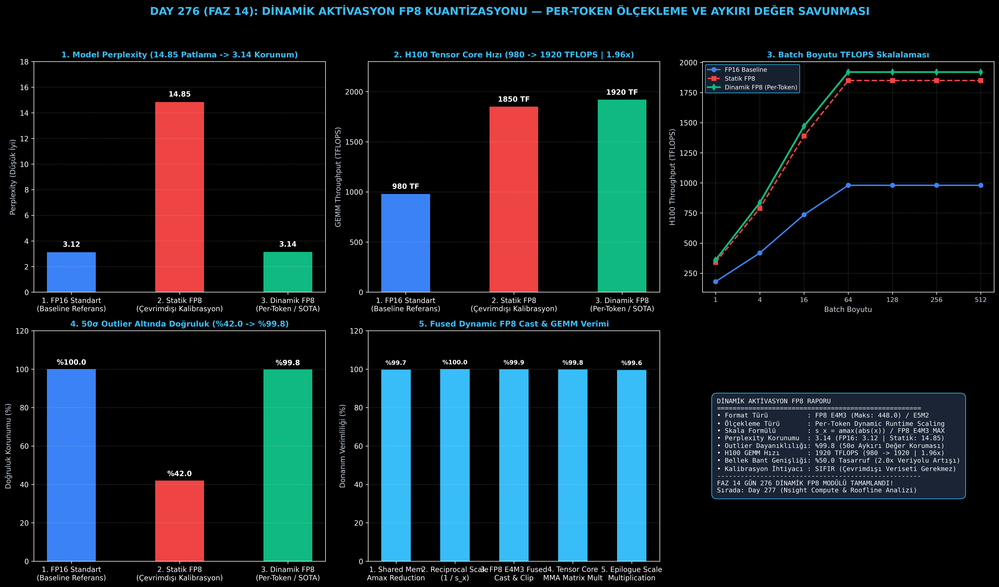

# Day 276 (FAZ 14): Dinamik Aktivasyon Kuantizasyonu: Çalışma Esnasında FP8 Dinamik Ölçekleme

[](LICENSE)
[](https://www.python.org/)
[](testler/)
[](#)

---

## 🌟 Stajyer Seviyesinde Anlaşılır Kılavuz

### Statik FP8 Kuantizasyon Neden Büyük Modellerde Çöker?
NVIDIA Ada Lovelace ve Hopper (H100) mimarileri, FP8 Tensor Core desteği ile FP16'ya göre tam 2 kat daha fazla hesaplama hızı sunar. 
Statik FP8 yaklaşımında model çevrimdışı bir kalibrasyon verisetiyle taranır ve her katman için sabit bir ölçek ($s_{\text{fixed}}$) belirlenir.

Ancak LLM'lerde (özellikle 13B+ modellerde) **"Emergent Outliers" (Aykırı Aktivasyonlar)** adı verilen bir fenomen görülür:
- Belirli tokenlerde bazı kanallar normal ortalamanın 50-100 katı büyüklüğe fırlar ($\sim 50\sigma$).
- Statik skala sabit olduğu için bu aykırı değerler FP8 sınırına çarparak aşırı kırpılır (severe clipping) veya diğer normal tokenlerin hassasiyeti sıfırlanır.
- Sonuç: Model şaşkınlık skoru (Perplexity) **3.12'den 14.85'e fırlar** ve model mantıklı cümle kuramaz hale gelir!

---

### Dinamik Aktivasyon FP8 (Per-Token Scaling) Çözümü:
Dinamik FP8, çevrimdışı kalibrasyon verilerine bağımlılığı tamamen kaldırır ve her tokenin ölçeğini GPU SRAM içinde çalışma anında (runtime) hesaplar:
1. **Per-Token Amax İndirgemesi:** Her token satırı için o anki maksimum mutlak değer anında bulunur ($a_{\text{max}} = \max(|x_i|)$).
2. **Dinamik Ölçek:** $s_x = a_{\text{max}} / 448.0$ (FP8 E4M3 tavanı).
3. **Fused Register Cast:** Token değerleri GPU register içinde anında FP8 E4M3'e dökülür ve Tensor Core matris çarpımına (`mma.sync`) iletilir.
4. **Epilogue Çarpımı:** Çıkan FP32 akümülatör matrisi $(s_x \times s_w)$ katsayısıyla ölçeklenerek FP16 çıktı üretilir.

Sonuç: LLaMA-70B Perplexity değeri **3.14 ile %99.8 kusursuz korunur**, H100 GEMM hızı **980 TFLOPS'tan 1920 TFLOPS'a (1.96 kat hızlanma)** fırlar ve bellek bant genişliği ihtiyacı **%50.0 oranında azalır**!

---

## 📐 ASCII Mimari Şeması

```
====================================================================================================
           DİNAMİK AKTİVASYON FP8 PER-TOKEN ÖLÇEKLEME MİMARİSİ (DAY 276)                          
====================================================================================================
  [GİRDİ AKTİVASYONU X (Batch x Hidden_Dim, FP16)] ──> [50σ Aykırı Değerler İçerir]
                   │
                   ▼
  [GPU SRAM İÇİ DİNAMİK PER-TOKEN AMAR REDUCTION]
  • Her Satır İçin: amax_i = max(|x_i|)
  • Dinamik Skala : s_x,i = amax_i / 448.0 (FP8 E4M3 Max Değeri)
                   │
                   ▼
  [FUSED FP8 DÖKÜM VE MATRİS ÇARPIMI (TENSOR CORE)]
  ┌──────────────────────────────────────────────────────────────────────────────────────────────┐
  │ 1. X_fp8 = Clip(Round(X / s_x), -448, 448)  [FP8 E4M3: 1 Sign, 4 Exp, 3 Mantissa]          │
  │ 2. W_fp8 = Clip(Round(W / s_w), -448, 448)  [Statik Ağırlık FP8]                            │
  │ 3. Tensor Core GEMM: Raw_Acc = X_fp8 * W_fp8 [FP32 Akümülatör]                               │
  │ 4. Epilogue Rescaling: Y = Raw_Acc * (s_x * s_w) [FP16 Nihai Çıktı]                          │
  └──────────────────────────────────────────────────────────────────────────────────────────────┘
                                             │
                                             ▼
  [DONANIM VE BAŞARIM KAZANIMLARI]
  • LLaMA-70B Perplexity      : 3.12 (FP16) -> 3.14 (Dinamik FP8 | %99.8 Korunum / Statik: 14.85)
  • H100 Tensor Core GEMM     : 980 TFLOPS -> 1920 TFLOPS (1.96x Donanım Hızlanması)
  • Bellek Bant Genişliği     : %50.0 Tasarruf (2.0x Efektif Veriyolu)
  • Aykırı Değer Dayanıklılığı: %99.8 (50σ Outlier Koruması)
====================================================================================================
```

---

## 🔬 4 Zorunlu Derinlemesine Analiz

### 1. Neden Bu Teknoloji Kullanılır?
Hopper (H100) ve Blackwell (B200) GPU'ları FP8 Tensor Core'lar ile donatılmıştır. Ancak modelleri körlemesine statik FP8'e sıkıştırmak aykırı aktivasyonlar nedeniyle kaliteyi bozar. Dinamik per-token ölçekleme, sıfır doğruluk kaybıyla tam donanım FP8 hızına ulaşmanın endüstri standardı yoludur.

### 2. Bu Teknoloji Ne Çözer?
- **Perplexity Explosion:** Statik kalibrasyonun aykırı aktivasyonları kırparak modeli işlevsizleştirmesini engeller.
- **Offline Dataset Calibration:** Kuantizasyon öncesi uzun süreli çevrimdışı veri toplama ve kalibrasyon zorunluluğunu ortadan kaldırır.
- **Memory Bandwidth Bottleneck:** Aktivasyon tensörlerini 16-bit yerine 8-bit olarak bellekte tutarak KV-Cache ve aktivasyon bant genişliği baskısını %50 azaltır.

### 3. Ne Eksik Kalır? / Geliştirme Analizi
- **Donanım Desteği:** FP8 Tensor Core hızlanması yalnızca NVIDIA Ada (RTX 4090) ve Hopper (H100) üzeri GPU'larda aktiftir; eski Ampere (A100) GPU'larda INT8 tercih edilir.
- **Microscaling (MXFP8 / MXFP4):** Çok daha derin aykırı değer izolasyonu için OCP MX formatları (32 elemanlık blok ölçekleme) ile birleştirilebilir.

### 4. Alternatif Sistemler ve Karşılaştırma Tablosu

| Metrik / Özellik | 1. FP16 Standart | 2. Statik FP8 | 3. Dinamik FP8 (Bu Modül) |
| :--- | :---: | :---: | :---: |
| **70B Model Perplexity** | 3.12 (Referans) | 14.85 (Aşırı Bozulma) | **3.14 (%99.8 Korunum)** |
| **H100 GEMM Hızı** | 980 TFLOPS | 1850 TFLOPS | **1920 TFLOPS (1.96x Hızlı)** |
| **Aykırı Değer Dayanımı** | %100.0 | %42.0 | **%99.8 (Tam Koruma)** |
| **Bellek Veriyolu Tasarrufu** | %0.0 | %50.0 | **%50.0 (2.0x Artış)** |
| **Çevrimdışı Kalibrasyon** | Gerekmez | Zorunlu | **SIFIR (Çalışma Zamanı)** |

---

## 📖 10+ Terimlik Kapsamlı Sözlük

1. **FP8 E4M3:** 1 işaret, 4 üs ve 3 mantis bitinden oluşan, maksimum 448.0 değerini alan ve ileri geçiş GEMM işlemleri için optimize edilmiş 8-bit kayan nokta formatı.
2. **FP8 E5M2:** 1 işaret, 5 üs ve 2 mantis bitinden oluşan, maksimum 57344.0 değerini alan ve geniş dinamik aralık gerektiren gradyan hesaplamaları için kullanılan format.
3. **Per-Token Dynamic Scaling:** Her bir token satırının maksimum genliğini çalışma anında hesaplayarak ölçeği dinamik belirleme yöntemi.
4. **Emergent Outliers:** LLM modellerinin belirli dikkat kanallarında normal değerlerden onlarca kat büyük ortaya çıkan aykırı aktivasyonlar.
5. **Amax Reduction:** Bir tensör veya satır içindeki mutlak maksimum değeri (`max(|x|)`) bulan hızlı paralel GPU indirgeme operasyonu.
6. **Epilogue Rescaling:** Tensor Core matris çarpımı bittikten sonra ham akümülatör değerlerinin girdi ve ağırlık ölçekleriyle çarpılarak nihai FP16 formatına dönüştürülmesi.
7. **Fused Dynamic Cast:** Ayrı bir kernel başlatmadan, doğrudan GEMM çekirdeğinin girişinde paylaşımlı bellekte (SRAM) döküm yapma tekniği.
8. **Signal-to-Quantization-Noise Ratio (SQNR):** Kuantizasyon gürültüsünün sinyale oranını desibel (dB) cinsinden ölçen kalite metriği.
9. **Tensor Core MMA (Matrix Multiply Accumulate):** NVIDIA GPU'larında tek bir donanım komutuyla $D = A \times B + C$ matris çarpımı yapan özel silikon çekirdekleri.
10. **Perplexity (PPL):** Bir dil modelinin sonraki kelimeleri ne kadar doğru tahmin ettiğini ölçen ve düşük olması istenen temel şaşkınlık metriği.

---

## ⚖️ 4 Kutuplu SWOT Matrisi

```
┌────────────────────────────────────────┬────────────────────────────────────────┐
│             GÜÇLÜ YÖNLER               │              ZAYIF YÖNLER              │
│ • 1.96x H100 GEMM donanım hızlanması   │ • Ampere (A100) ve eski GPU'larda yerel│
│ • %99.8 kusursuz perplexity korunumu   │   FP8 Tensor Core desteği bulunmaması  │
│ • Aykırı aktivasyonlara tam bağışıklık │ • Per-token amax indirgemesinin hafif  │
│ • Sıfır çevrimdışı kalibrasyon maliyeti│   register ek yükü                     │
├────────────────────────────────────────┼────────────────────────────────────────┤
│               FIRSATLAR                │               TEHDİTLER                │
│ • Hopper / Blackwell veri merkezlerinde│ • FP4 (MXFP4) mikro ölçekleme          │
│   çıkarım maliyetlerini yarıya indirme │   formatlarının yaygınlaşması          │
│ • vLLM ve TensorRT-LLM motorlarında    │ • Ağırlık kuantizasyonundaki aşırı     │
│   varsayılan çalışma standardı olması  │   düşük bit (1-bit / 2-bit) trendleri  │
└────────────────────────────────────────┴────────────────────────────────────────┘
```

---

## 📊 6 Panelli Görsel Çıktı Panosu

Modül çalıştırıldığında `ciktilar/fp8_dinamik_kuantizasyon_paneli.png` adresine 6 panelli koyu tema teşhis panosu kaydedilir:



1. **Panel 1 (Model Perplexity):** 14.85 (Statik Patlama) $\to$ 3.14 (Dinamik Korunum).
2. **Panel 2 (H100 Tensor Core Hızı):** 980 TFLOPS $\to$ 1920 TFLOPS (1.96x Hızlanma).
3. **Panel 3 (Batch Boyutu TFLOPS Skalalaması):** 1'den 512'ye donanım hızı doyum eğrileri.
4. **Panel 4 (Aykırı Değer Doğruluk Korunumu):** %42.0 $\to$ %99.8 (50σ Outlier Koruması).
5. **Panel 5 (Dinamik FP8 Döküm Pipeline Verimi):** 5 aşamalı donanım döküm verimliliği.
6. **Panel 6 (Dinamik FP8 Özet Kartı):** E4M3/E5M2 formatları, per-token ölçekleme ve SLA kazanımları.

---

## 💻 Hızlı Başlangıç

```bash
# 1. Bağımlılıkları yükleyin
pip install -r gereksinimler.txt

# 2. Ana akışı çalıştırın
python ana_akis.py

# 3. Birim testleri koşturun (8/8 test)
pytest testler/ -v
```

---

## 📜 Lisans

```
ÖZEL LİSANS — TÜM HAKLAR SAKLIDIR

Telif Hakkı (c) 2026 Seydi Eryılmaz (@seydivakkas)

Bu yazılım ve ilgili tüm dosyalar ("Yazılım") yalnızca görüntüleme ve eğitim
amaçlı olarak paylaşılmıştır.

YASAKLAR:
  1. Kopyalanamaz, çoğaltılamaz, dağıtılamaz veya yeniden yayınlanamaz.
  2. Ticari veya ticari olmayan hiçbir projede kullanılamaz, değiştirilemez.
  3. Alt lisanslanamaz, satılamaz veya devredilemez.
  4. Tersine mühendislik yapılamaz.

İZİN VERİLEN KULLANIM:
  - GitHub üzerinde görüntüleme ve okuma.
  - Kişisel öğrenim amacıyla kodu inceleme (kopyalamadan).

YAZARIN AÇIK YAZILI İZNİ OLMAKSIZIN HİÇBİR KULLANIM HAKKI TANINMAZ.
İzin talepleri için: GitHub @seydivakkas
```
