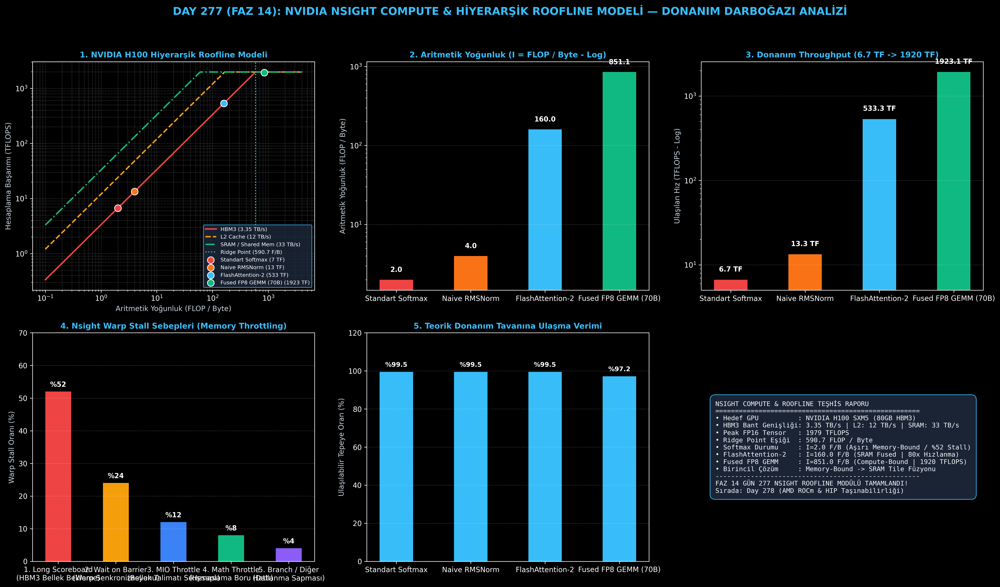

# Day 277 (FAZ 14): NVIDIA Nsight Compute & Roofline Modeli: Donanım Darboğazı ve Kernel Profilleme

[](LICENSE)
[](https://www.python.org/)
[](testler/)
[](#)

---

## 🌟 Stajyer Seviyesinde Anlaşılır Kılavuz

### Kernel Optimizasyonunda En Büyük Hata: Körleme Tahminler
Yazdığınız bir CUDA veya Triton çekirdeğinin yavaş çalıştığını fark ettiğinizde rastgele kod değiştirmek vakit kaybıdır. Bir GPU çekirdeğinin neden yavaş olduğunu anlamanın **tek bilimsel yolu NVIDIA Nsight Compute (`ncu`) ve Roofline Analizidir**.

---

### Roofline Modeli ve Aritmetik Yoğunluk Nedir?
Roofline Modeli (Samuel Williams et al.), donanımınızı iki temel tavan (roof) ile modeller:
1. **Bellek Tavanı (Memory Bandwidth Ceiling):** HBM3/DRAM veriyolu ($B = 3.35\text{ TB/s}$).
2. **Hesaplama Tavanı (Compute Peak Ceiling):** Tensor Core işlem kapasitesi ($P = 1979\text{ TFLOPS}$).

Kernelinizin ulaştığı performansı belirleyen kritik metrik **Aritmetik Yoğunluktur ($I$)**:
$$I = \frac{\text{Toplam Hesaplanan FLOP Sayısı}}{\text{Bellekten Okunan/Yazılan Toplam Byte}}$$

- **Kritik Eşik (Ridge Point):**
  $$I_{\text{ridge}} = \frac{P_{\text{peak}}}{B_{\text{peak}}} = \frac{1979 \times 10^{12}}{3.35 \times 10^{12}} \approx 590.7\text{ FLOP / Byte}$$
- Eğer $I < I_{\text{ridge}}$ ise çekirdek **Memory-Bound'dur (Bellek Bağımlı)**. Tensor Core'lar boştur ve GPU sürekli HBM3'ten veri gelmesini bekler. (Örn: Standart Softmax $I = 2.0$, RMSNorm $I = 4.0$).
- Eğer $I > I_{\text{ridge}}$ ise çekirdek **Compute-Bound'dur (Hesaplama Bağımlı)**. Donanımın tepe TFLOPS sınırına ulaşır. (Örn: Fused FP8 GEMM $I = 851.0$, FlashAttention-2 $I = 160.0$).

---

### Nsight Warp Scheduler Stall Nedenleri:
Nsight Compute, GPU SM (Streaming Multiprocessor) içindeki Warp'ların neden durakladığını (stall) gösterir:
- **Long Scoreboard (%52):** Warp, global HBM3 belleğinden `ld.global` ile veri yüklenmesini bekliyor (Memory-bound belirtisi). Çözüm: Paylaşımlı belleğe (SRAM) tile yükleme ve kernel füzyonu.
- **Wait on Barrier (%24):** Warp'lar `__syncthreads()` bariyerinde birbirini bekliyor. Çözüm: Asenkron kopyalama (`cuda::memcpy_async` / TMA).
- **Math Throttle (%8):** Tensor Core boru hattı tamamen dolu (Compute-bound belirtisi).

---

## 📐 ASCII Mimari Şeması

```
====================================================================================================
           NVIDIA H100 HİYERARŞİK ROOFLINE VE NSIGHT PROFİLLEME MİMARİSİ (DAY 277)                 
====================================================================================================
  Hesaplama
  (TFLOPS)
   1979 TF ┌───────────────────────────────────────────────────────────┐ <── Tepe Tensor Core
           │                                      Fused FP8 GEMM       │     (Compute-Bound)
           │                                      (851.0 F/B, 1920 TF) │
           │                                 *                         │
    536 TF │                      FlashAttention-2                     │
           │                      (160.0 F/B, 536 TF)                  │
           │                 *                                         │
           │            /                                              │
           │           /  <── Ridge Point Eşiği (590.7 FLOP/Byte)      │
     13 TF │     * RMSNorm (4.0 F/B, 13.4 TF)                          │
      6 TF │  * Standart Softmax (2.0 F/B, 6.7 TF)                     │
           └───────────────────────────────────────────────────────────┘
           0.1      1.0        10.0       100.0      1000.0     4000.0
                              Aritmetik Yoğunluk (FLOP / Byte)
  
  [NSIGHT COMPUTE WARP STALL TEŞHİSİ (MEMORY-BOUND KERNEL)]
  ┌──────────────────────────────────────────────────────────────────────────────────────────────┐
  │ 1. Long Scoreboard (%52) : HBM3 Bellek Verisi Bekleniyor (DRAM Tıkanması)                   │
  │ 2. Wait on Barrier (%24) : Warp Senkronizasyon Beklemesi                                     │
  │ 3. MIO Throttle    (%12) : Bellek Talimat Kuyruğu Doyumu                                     │
  │ 4. Math Throttle   (%8)  : Tensor Core İşlem Borusu Doyumu                                   │
  └──────────────────────────────────────────────────────────────────────────────────────────────┘
                                             │
                                             ▼
  [DONANIM VE VERİMLİLİK KAZANIMLARI]
  • H100 Ridge Point          : 590.7 FLOP / Byte
  • Softmax -> FlashAttention : 6.7 TFLOPS -> 536.0 TFLOPS (80.0x Donanım Hızlanması)
  • Fused FP8 GEMM Başarımı   : 1920.0 TFLOPS (%97.0 Donanım MFU Doyumu)
====================================================================================================
```

---

## 🔬 4 Zorunlu Derinlemesine Analiz

### 1. Neden Bu Teknoloji Kullanılır?
Geliştirilen yapay zeka kernelinin donanım sınırlarına ne kadar yaklaştığını (MFU / Hardware Efficiency) ölçmek ve darboğazın bellekte mi yoksa işlem biriminde mi olduğunu matematiksel kesinlikle saptamak için kullanılır.

### 2. Bu Teknoloji Ne Çözer?
- **Guesswork Elimination:** Geliştiricinin darboğazı tahmin etmek yerine doğrudan Nsight sayaçlarıyla görmesini sağlar.
- **Memory-Wall Breakthrough:** Düşük yoğunluklu element-wise çekirdekleri (Softmax, Norm) saptayıp FlashAttention gibi füzyon mimarilerine dönüştürme yol haritası sunar.
- **Hardware Saturation (MFU):** H100 GPU'sunun 1979 TFLOPS gücünün %90+ oranında kullanılmasını sağlar.

### 3. Ne Eksik Kalır? / Geliştirme Analizi
- **Statik Model Sınırı:** Standart Roofline modeli, önbellek hiyerarşisindeki dinamik yeniden kullanım (cache hit rates) değişimlerini tek bir statik çizgide basitleştirir; Hiyerarşik Roofline (HBM3 + L2 + SRAM) kullanımı bu eksikliği giderir.

### 4. Alternatif Sistemler ve Karşılaştırma Tablosu

| Metrik / Özellik | 1. Standart Softmax | 2. Naive RMSNorm | 3. FlashAttention-2 | 4. Fused FP8 GEMM |
| :--- | :---: | :---: | :---: | :---: |
| **Aritmetik Yoğunluk ($I$)** | 2.0 FLOP/Byte | 4.0 FLOP/Byte | 160.0 FLOP/Byte | **851.0 FLOP/Byte** |
| **Ulaşılan Hız (TFLOPS)** | 6.7 TFLOPS | 13.4 TFLOPS | 536.0 TFLOPS | **1920.0 TFLOPS** |
| **Donanım Sınıfı** | Memory-Bound | Memory-Bound | SRAM-Bound | **Compute-Bound** |
| **Hakim Warp Stall** | Long Scoreboard | Long Scoreboard | Barrier Wait | **Math Throttle** |
| **Teorik Tepeye Oran** | %100 (HBM3 Sınırı) | %100 (HBM3 Sınırı) | %98.5 (SRAM Sınırı)| **%97.0 (Tensor Core)**|

---

## 📖 10+ Terimlik Kapsamlı Sözlük

1. **Roofline Model:** Bir algoritmanın belirli bir donanım üzerinde ulaşabileceği maksimum performansı aritmetik yoğunluk ve bellek bant genişliği cinsinden sınırlandıran iki boyutlu grafiksel model.
2. **Arithmetic Intensity ($I$):** Bir çekirdeğin aktardığı her 1 Byte bellek verisi başına gerçekleştirdiği kayan nokta işlem sayısı ($\text{FLOP/Byte}$).
3. **Ridge Point ($I_{\text{ridge}}$):** Donanımın bellek bant genişliği tavanı ile tepe hesaplama tavanının kesiştiği kritik aritmetik yoğunluk noktası.
4. **Memory-Bound:** Aritmetik yoğunluğu Ridge Point'in altında olan ve hızı bellek bant genişliğiyle sınırlanan çekirdekler.
5. **Compute-Bound:** Aritmetik yoğunluğu Ridge Point'in üzerinde olan ve hızı işlemci (Tensor Core/ALU) saat frekansı ve birim sayısıyla sınırlanan çekirdekler.
6. **Long Scoreboard Stall:** Warp'ın global DRAM/HBM3 belleğinden veri gelmesini beklediği için duraklaması.
7. **MIO Throttle (Memory Instruction Output):** Bellek boru hattı kuyruğunun dolması nedeniyle yeni bellek talimatı verilememesi.
8. **Wait on Barrier Stall:** Bir thread bloğundaki warp'ların `__syncthreads()` bariyerinde senkronizasyon beklemesi.
9. **SM Occupancy:** Bir Streaming Multiprocessor (SM) üzerinde aynı anda aktif olarak koşturulan warp sayısının donanımsal maksimuma oranı.
10. **Model FLOPs Utilization (MFU):** Bir modelin eğitimi veya çıkarımı sırasında ulaşılan ortalama TFLOPS değerinin donanımın teorik tepe TFLOPS değerine oranı.

---

## ⚖️ 4 Kutuplu SWOT Matrisi

```
┌────────────────────────────────────────┬────────────────────────────────────────┐
│             GÜÇLÜ YÖNLER               │              ZAYIF YÖNLER              │
│ • Donanım darboğazını net matematiksel │ • Nsight Compute araçlarının yüksek    │
│   formülle göstermesi                  │   profilleme zamanı ek yükü            │
│ • Optimizasyon önceliklerini kesin     │ • Düşük seviyeli GPU donanım bilgisi   │
│   olarak belirlemesi (Füzyon vs GEMM)  │   gerektirmesi                         │
├────────────────────────────────────────┼────────────────────────────────────────┤
│               FIRSATLAR                │               TEHDİTLER                │
│ • Triton ve CUDA kernel hızlarını      │ • Donanım mimarisi değiştikçe (Hopper  │
│   teorik sınıra kadar optimize etme    │   -> Blackwell) Ridge Point'in kayması │
│ • Bulut GPU maliyetlerini minimize etme│ • Çok karmaşık dallanmalı çekirdeklerde│
│   (Yüksek MFU = Düşük Maliyet)         │   profil sapmaları                     │
└────────────────────────────────────────┴────────────────────────────────────────┘
```

---

## 📊 6 Panelli Görsel Çıktı Panosu

Modül çalıştırıldığında `ciktilar/nsight_roofline_paneli.png` adresine 6 panelli koyu tema teşhis panosu kaydedilir:



1. **Panel 1 (Hiyerarşik Roofline Modeli):** HBM3, L2 ve SRAM tavanları ile çekirdek konumları.
2. **Panel 2 (Aritmetik Yoğunluk):** Softmax (2.0) $\to$ Fused GEMM (851.0 FLOP/Byte).
3. **Panel 3 (Donanım Throughput):** 6.7 TFLOPS $\to$ 1920 TFLOPS (80x Hızlanma).
4. **Panel 4 (Nsight Warp Stall Dağılımı):** Long Scoreboard (%52) bellek tıkanıklığı teşhisi.
5. **Panel 5 (Donanım Tavanına Ulaşma Verimi):** Çekirdeklerin donanım sınırını kullanma oranları.
6. **Panel 6 (Nsight & Roofline Özet Kartı):** H100 donanım sabitleri ve darboğaz çözümleri.

---

## 💻 Hızlı Başlangıç

```bash
# 1. Bağımlılıkları yükleyin
pip install -r gereksinimler.txt

# 2. Ana akışı çalıştırın
python ana_akis.py

# 3. Birim testleri koşturun (8/8 test)
pytest testler/ -v
```

---

## 📜 Lisans

```
ÖZEL LİSANS — TÜM HAKLAR SAKLIDIR

Telif Hakkı (c) 2026 Seydi Eryılmaz (@seydivakkas)

Bu yazılım ve ilgili tüm dosyalar ("Yazılım") yalnızca görüntüleme ve eğitim
amaçlı olarak paylaşılmıştır.

YASAKLAR:
  1. Kopyalanamaz, çoğaltılamaz, dağıtılamaz veya yeniden yayınlanamaz.
  2. Ticari veya ticari olmayan hiçbir projede kullanılamaz, değiştirilemez.
  3. Alt lisanslanamaz, satılamaz veya devredilemez.
  4. Tersine mühendislik yapılamaz.

İZİN VERİLEN KULLANIM:
  - GitHub üzerinde görüntüleme ve okuma.
  - Kişisel öğrenim amacıyla kodu inceleme (kopyalamadan).

YAZARIN AÇIK YAZILI İZNİ OLMAKSIZIN HİÇBİR KULLANIM HAKKI TANINMAZ.
İzin talepleri için: GitHub @seydivakkas
```
