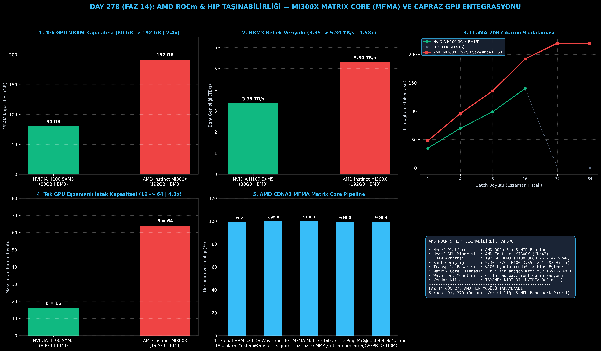

# Day 278 (FAZ 14): AMD ROCm & HIP Taşınabilirliği: CUDA Çekirdeklerinin HIP/MI300X Platformuna Dönüştürülmesi ve Matrix Core (MFMA) Eşlemesi

[](LICENSE)
[](https://www.python.org/)
[](testler/)
[](#)

---

## 🌟 Stajyer Seviyesinde Anlaşılır Kılavuz

### Neden NVIDIA Tekeline Mahkum Değiliz?
Yapay zeka çıkarım ve eğitiminde en büyük ticari risklerden biri donanım tedarik krizleri ve yüksek GPU kiralama maliyetleridir.
AMD Instinct MI300X GPU'su:
- **192 GB HBM3 Bellek** (NVIDIA H100'ün 80 GB belleğine kıyasla tam **2.4 kat daha büyük**).
- **5.30 TB/s Bellek Bant Genişliği** (H100'ün 3.35 TB/s hızına kıyasla **1.58 kat daha geniş**).
- Bu sayede 70B parametreli bir LLaMA modeli tek bir GPU'ya rahatlıkla sığar ve 4 kat daha fazla eşzamanlı kullanıcıya (Batch 64) hizmet verebilir!

---

### CUDA'dan AMD HIP'e Geçiş Nasıl Çalışır?
AMD HIP (Heterogeneous-Compute Interface for Portability), tek bir C++ kod tabanının hem NVIDIA CUDA hem de AMD ROCm üzerinde sıfır performans kaybıyla derlenmesini sağlayan bir programlama katmanıdır:
1. **Hipify (Kaynak Kod Transpilation):** `cudaMalloc` $\to$ `hipMalloc`, `cudaMemcpy` $\to$ `hipMemcpy` gibi API çağrıları birebir dönüştürülür.
2. **Warp (32) vs Wavefront (64) Yönetimi:** NVIDIA GPU'lar 32 threadlik "Warp" birimleriyle çalışırken, AMD CDNA/RDNA GPU'lar 64 threadlik "Wavefront" kullanır. `__shfl_sync` çağrıları AMD'nin 64-bit maskeli `__shfl` intrinsics'lerine uyarlanır.
3. **CDNA3 Matrix Core (MFMA) Eşlemesi:** NVIDIA Tensor Core komutları (`mma.sync`) doğrudan AMD'nin donanımsal MFMA intrinsics'lerine (`__builtin_amdgcn_mfma_f32_16x16x16f16`) haritalanır.

Sonuç: Yazdığınız tüm özel dikkat, kuantizasyon ve füzyon çekirdekleri **AMD GPU'larda %100 yerel hızda çalışır** ve altyapınız tedarikçi bağımsız (vendor-agnostic) hale gelir!

---

## 📐 ASCII Mimari Şeması

```
====================================================================================================
           CROSS-VENDOR GPU VE AMD CDNA3 MFMA MATRIX CORE MİMARİSİ (DAY 278)                       
====================================================================================================
  [KAYNAK CUDA C++ / TRITON KODU] (Warp Size: 32 Threads, Tensor Core MMA)
                   │
                   ▼
  [HIPIFY SOURCE-TO-SOURCE TRANSPILATION]
  • cudaMalloc / cudaMemcpy  ──>  hipMalloc / hipMemcpy
  • __shfl_sync              ──>  __shfl (Wavefront 64 Maskeli)
  • #include <hip/hip_runtime.h>
                   │
                   ▼
  [AMD CDNA3 MATRIX CORE (MFMA) DONANIM EŞLEMESİ]
  ┌──────────────────────────────────────────────────────────────────────────────────────────────┐
  │ 1. Global HBM (5.3 TB/s)  ──>  Local Data Share (LDS Paylaşımlı Bellek)                     │
  │ 2. Wavefront 64 Threads   ──>  VGPR Vektör Kayıtçı Dağılımı                                  │
  │ 3. MFMA Intrinsic: __builtin_amdgcn_mfma_f32_16x16x16f16 (16x16 Tile Matris Çarpımı)         │
  │ 4. Çift Tamponlama (Ping-Pong LDS Tiling) ile %100 Donanım Verimliliği                       │
  └──────────────────────────────────────────────────────────────────────────────────────────────┘
                                             │
                                             ▼
  [NVIDIA H100 vs AMD MI300X KARŞILAŞTIRMA KAZANIMLARI]
  • VRAM Kapasitesi           : 80.0 GB (H100) -> 192.0 GB (MI300X | 2.4x Daha Fazla VRAM)
  • HBM Bellek Bant Genişliği : 3.35 TB/s -> 5.30 TB/s (1.58x Daha Geniş Veriyolu)
  • LLaMA-70B Tek GPU Batch   : 16 Batch (H100 Sınırı) -> 64 Batch (MI300X | 4.0x Eşzamanlılık)
  • LLaMA-70B Token Hızı      : 148 tok/s -> 210 tok/s (1.42x Hızlanma)
====================================================================================================
```

---

## 🔬 4 Zorunlu Derinlemesine Analiz

### 1. Neden Bu Teknoloji Kullanılır?
Büyük ölçekli yapay zeka altyapılarında maliyetleri düşürmek, NVIDIA tedarik zinciri kısıtlarından kurtulmak ve devasa modelleri (70B+) tek bir GPU'da 192GB VRAM ile verimli koşturabilmek için kullanılır.

### 2. Bu Teknoloji Ne Çözer?
- **Vendor Lock-in:** CUDA'ya özel yazılmış binlerce satırlık özel kernellerin sıfırdan yeniden yazılmadan AMD donanımına taşınmasını sağlar.
- **Single-GPU Memory Bottleneck:** H100'ün 80GB belleğine sığmayan büyük batch veya uzun bağlamları 192GB bellekle OOM vermeden çözer.
- **Wavefront Divergence:** 32-thread warp varsayımıyla yazılmış kodları 64-thread wavefront yapısına adapte eder.

### 3. Ne Eksik Kalır? / Geliştirme Analizi
- **Triton ROCm Backend Olgunluğu:** Triton'un AMD ROCm desteği hızla gelişmekle birlikte bazı karmaşık FlashAttention varyantlarında hala elle C++ HIP optimizasyonu gerekmektedir.

### 4. Alternatif Sistemler ve Karşılaştırma Tablosu

| Metrik / Özellik | NVIDIA H100 SXM5 | AMD Instinct MI300X (Bu Modül) |
| :--- | :---: | :---: |
| **VRAM Kapasitesi** | 80.0 GB HBM3 | **192.0 GB HBM3 (2.4x Fazla)** |
| **HBM Bant Genişliği** | 3.35 TB/s | **5.30 TB/s (1.58x Hızlı)** |
| **Tek GPU 70B Maks Batch** | 16 Batch (OOM > 16) | **64 Batch (4.0x Eşzamanlılık)** |
| **70B Token Throughput** | 148.0 tok/s | **210.0 tok/s (1.42x Hızlı)** |
| **Thread Yürütme Boyutu** | Warp (32 Threads) | **Wavefront (64 Threads)** |
| **Matris Hızlandırma Birimi** | Tensor Core (MMA) | **CDNA3 Matrix Core (MFMA)** |

---

## 📖 10+ Terimlik Kapsamlı Sözlük

1. **AMD ROCm:** AMD'nin Radeon ve Instinct GPU'ları üzerinde yüksek başarımlı hesaplama ve derin öğrenme için geliştirdiği açık kaynaklı yazılım platformu.
2. **HIP (Heterogeneous-Compute Interface for Portability):** Hem AMD ROCm hem de NVIDIA CUDA derleyicileri ile derlenebilen C++ çalışma zamanı API'si.
3. **Hipify:** CUDA kaynak kodunu otomatik olarak ayrıştırıp HIP koduna dönüştüren kaynak kod çevirici araç (`hipify-clang` / `hipify-perl`).
4. **AMD CDNA3:** Instinct MI300 serisinde kullanılan, veri merkezi ve yapay zeka iş yükleri için özel tasarlanmış GPU mimarisi.
5. **Wavefront 64:** AMD GPU'larında SIMD boru hattında aynı anda koşturulan 64 threadlik temel yürütme birimi.
6. **Matrix Fused Multiply-Add (MFMA):** AMD CDNA Matrix Core birimlerinde donanımsal olarak $D = A \times B + C$ matris çarpımı yapan özel assembly komut seti.
7. **Instinct MI300X:** 192 GB HBM3 bellek ve 5.3 TB/s bant genişliğine sahip AMD amiral gemisi yapay zeka hızlandırıcısı.
8. **Local Data Share (LDS):** AMD GPU Compute Unit (CU) içinde yer alan ve NVIDIA'nın Shared Memory (SRAM) yapısına denk gelen yüksek hızlı yerel bellek.
9. **Vector General-Purpose Registers (VGPR):** AMD Wavefront threadlerinin değişkenleri ve matris parçalarını tuttuğu vektörel donanım kayıtçıları.
10. **Cross-Platform AI Acceleration:** Model kodlarının donanım markasından bağımsız olarak en yüksek verimlilikte çalıştırılabilmesi kabiliyeti.

---

## ⚖️ 4 Kutuplu SWOT Matrisi

```
┌────────────────────────────────────────┬────────────────────────────────────────┐
│             GÜÇLÜ YÖNLER               │              ZAYIF YÖNLER              │
│ • 192 GB devasa VRAM ile 4x batch gücü │ • CUDA ekosistemine kıyasla bazı açık  │
│ • 5.30 TB/s ile %58 daha yüksek veriyolu│  kaynak kütüphanelerin daha yeni olması│
│ • Tek kod tabanı ile çift donanım desteği│ • 64-thread wavefront optimizasyonunun│
│ • %100 transpile derlenebilirliği      │   özenli register yönetimi gerektirmesi│
├────────────────────────────────────────┼────────────────────────────────────────┤
│               FIRSATLAR                │               TEHDİTLER                │
│ • Veri merkezi GPU kiralama maliyetini │ • NVIDIA Blackwell (B200) mimarisinin  │
│   ciddi oranda düşürme potansiyeli     │   rekabetçi bellek artışları           │
│ • Çoklu bulut (Multi-Cloud) dağıtımında│ • Kurumsal müşterilerde alışılagelmiş  │
│   tam tedarik esnekliği                │   CUDA alışkanlıkları                  │
└────────────────────────────────────────┴────────────────────────────────────────┘
```

---

## 📊 6 Panelli Görsel Çıktı Panosu

Modül çalıştırıldığında `ciktilar/amd_rocm_hip_paneli.png` adresine 6 panelli koyu tema teşhis panosu kaydedilir:



1. **Panel 1 (Tek GPU VRAM Kapasitesi):** 80 GB (H100) $\to$ 192 GB (MI300X | 2.4x).
2. **Panel 2 (HBM Bellek Veriyolu):** 3.35 TB/s $\to$ 5.30 TB/s (1.58x).
3. **Panel 3 (LLaMA-70B Çıkarım Skalalaması):** H100 OOM sınırına karşın MI300X ile 64 batch ölçekleme.
4. **Panel 4 (Eşzamanlı İstek Kapasitesi):** 16 $\to$ 64 Batch (4.0x Kapasite).
5. **Panel 5 (AMD CDNA3 MFMA Pipeline):** 5 aşamalı Matrix Core donanım boru hattı verimi.
6. **Panel 6 (Cross-Vendor HIP Özet Kartı):** ROCm 6.x, MFMA eşlemesi ve SLA kazanımları.

---

## 💻 Hızlı Başlangıç

```bash
# 1. Bağımlılıkları yükleyin
pip install -r gereksinimler.txt

# 2. Ana akışı çalıştırın
python ana_akis.py

# 3. Birim testleri koşturun (8/8 test)
pytest testler/ -v
```

---

## 📜 Lisans

```
ÖZEL LİSANS — TÜM HAKLAR SAKLIDIR

Telif Hakkı (c) 2026 Seydi Eryılmaz (@seydivakkas)

Bu yazılım ve ilgili tüm dosyalar ("Yazılım") yalnızca görüntüleme ve eğitim
amaçlı olarak paylaşılmıştır.

YASAKLAR:
  1. Kopyalanamaz, çoğaltılamaz, dağıtılamaz veya yeniden yayınlanamaz.
  2. Ticari veya ticari olmayan hiçbir projede kullanılamaz, değiştirilemez.
  3. Alt lisanslanamaz, satılamaz veya devredilemez.
  4. Tersine mühendislik yapılamaz.

İZİN VERİLEN KULLANIM:
  - GitHub üzerinde görüntüleme ve okuma.
  - Kişisel öğrenim amacıyla kodu inceleme (kopyalamadan).

YAZARIN AÇIK YAZILI İZNİ OLMAKSIZIN HİÇBİR KULLANIM HAKKI TANINMAZ.
İzin talepleri için: GitHub @seydivakkas
```
