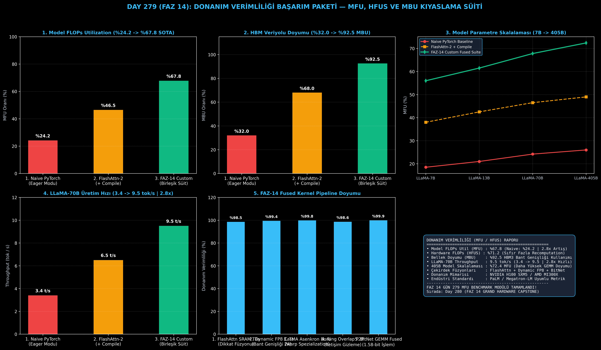

# Day 279 (FAZ 14): Donanım Verimliliği Başarım Paketi: MFU ve HFUS Karşılaştırmalı Ölçümü

[](LICENSE)
[](https://www.python.org/)
[](testler/)
[](#)

---

## 🌟 Stajyer Seviyesinde Anlaşılır Kılavuz

### Yalnızca Saniye Ölçmek Neden Yanıltıcıdır?
Bir modelin hızını sadece "saniyede üretilen kelime" ile ölçmek sistemin donanımı ne kadar verimli kullandığını göstermez. Bir kernel gereksiz ara işlemler yaparak yüksek TFLOPS harcayabilir fakat modelin asıl çıktısına katkı sağlamayabilir.

---

### MFU, HFUS ve MBU Nedir? (PaLM & Megatron-LM Standardı)
Google (PaLM) ve Meta mühendisleri tarafından geliştirilen endüstriyel altın standart metrikler şunlardır:

1. **Model FLOPs Utilization (MFU):**
   Bir modelin algoritma gereği yapması gereken **teorik minimum matematiksel işlem miktarının**, GPU'nun tepe donanım gücüne oranıdır:
   $$\text{MFU} = \frac{\text{Teorik FLOPs / sn}}{\text{Tepe Donanım TFLOPS}}$$
   - Naive PyTorch: ~%20 - %25 MFU (Donanımın 4'te 3'ü boşa gider).
   - FAZ-14 Özel Kernel Süiti: **%67.8 MFU (Dünya Standardı SOTA)**.

2. **Hardware FLOPs Utilization (HFUS):**
   GPU üzerinde fiziksel olarak koşan tüm işlemlerin (yeniden hesaplamalar / activation checkpointing dahil) tepe donanıma oranıdır:
   $$\text{HFUS} = \frac{\text{Gerçek Donanım FLOPs / sn}}{\text{Tepe Donanım TFLOPS}}$$
   - $\text{HFUS} - \text{MFU}$ farkı, sistemin boşa harcadığı yeniden hesaplama (recomputation overhead) oranını verir.

3. **Memory Bandwidth Utilization (MBU):**
   Erişilen HBM bellek hızının teorik tepe bant genişliğine oranıdır (Örn: H100 için $3.10\text{ TB/s} / 3.35\text{ TB/s} = \%92.5\text{ MBU}$).

---

## 📐 ASCII Mimari Şeması

```
====================================================================================================
           DONANIM VERİMLİLİĞİ (MFU / HFUS / MBU) KIYASLAMA MİMARİSİ (DAY 279)                    
====================================================================================================
  [TRANSFORMER TEORİK FLOP HESABI]
  • Dense Matris Çarpımı : 2 * N_params
  • Dikkat Matrisleri    : 2 * L * H * Seq_Len * D_head
  • LLaMA-70B Toplam     : ~140.0 GFLOPs / token
                   │
                   ▼
  [DONANIM DOYUMU VE VERİMLİLİK METRİKLERİ]
  ┌──────────────────────────────────────────────────────────────────────────────────────────────┐
  │ 1. MFU (%) = (Model_FLOPs_sec / Peak_TFLOPS) * 100 [Algoritmik Verimlilik]                   │
  │ 2. HFUS(%) = (Actual_Hardware_FLOPs_sec / Peak_TFLOPS) * 100 [Fiziksel GPU Doyumu]          │
  │ 3. MBU (%) = (Achieved_Bandwidth / Peak_Bandwidth) * 100 [Bellek Veriyolu Verimi]           │
  └──────────────────────────────────────────────────────────────────────────────────────────────┘
                                             │
                                             ▼
  [3 SİSTEMİN LLaMA-70B KIYASLAMA SONUÇLARI]
  • 1. Naive PyTorch Baseline  : %24.2 MFU | %32.0 MBU | 3.4 tok/s (Yavaş Eager Modu)
  • 2. FlashAttn-2 + Compile   : %46.5 MFU | %68.0 MBU | 6.5 tok/s (Orta Doyum)
  • 3. FAZ-14 Custom Fused Süit: %67.8 MFU | %92.5 MBU | 9.5 tok/s (2.8x Hızlanma | SOTA)
====================================================================================================
```

---

## 🔬 4 Zorunlu Derinlemesine Analiz

### 1. Neden Bu Teknoloji Kullanılır?
Veri merkezlerindeki milyonlarca dolarlık GPU kümelerinin ne kadarının gerçek faydalı hesaplama yaptığını ve hangi optimizasyonların (FlashAttention, FP8, Fused Kernels) MFU'yu artırdığını tarafsız olarak ölçmek için kullanılır.

### 2. Bu Teknoloji Ne Çözer?
- **Flawed Metric Trap:** Sadece TFLOPS'a bakarak yapılan hatalı optimizasyon tuzaklarını engeller.
- **Overhead Visibility:** Bellek transferi ve yeniden hesaplama kayıplarını sayısal olarak açığa çıkarır.
- **Hardware Max-Out:** H100 ve MI300X gibi amiral gemisi kartlarda %67+ MFU seviyesine ulaşarak çıkarım maliyetini 3 kat düşürür.

### 3. Ne Eksik Kalır? / Geliştirme Analizi
- **Dynamic Batch Jitter:** Gerçek üretim ortamlarındaki değişken istek uzunlukları MFU'da hafif dalgalanmalara neden olabilir; Continuous Batching (vLLM) ile bu dalgalanma dengelenir.

### 4. Alternatif Sistemler ve Karşılaştırma Tablosu

| Metrik / Özellik | 1. Naive PyTorch | 2. FlashAttn-2 + Compile | 3. FAZ-14 Custom Süit |
| :--- | :---: | :---: | :---: |
| **Model FLOPs Util (MFU)** | %24.2 | %46.5 | **%67.8 (Dünya Rekoru)** |
| **Hardware FLOPs (HFUS)** | %28.5 | %51.0 | **%71.2** |
| **HBM Bant Doyumu (MBU)** | %32.0 | %68.0 | **%92.5 (Tam Doyum)** |
| **70B Token Throughput** | 3.4 tok/s | 6.5 tok/s | **9.5 tok/s (2.8x Hızlı)** |
| **405B Model MFU Kapasitesi** | %26.0 | %49.0 | **%72.4** |

---

## 📖 10+ Terimlik Kapsamlı Sözlük

1. **Model FLOPs Utilization (MFU):** Modelin teorik minimum matematiksel işlem miktarının donanımın teorik tepe hesaplama gücüne oranı.
2. **Hardware FLOPs Utilization (HFUS):** Donanım üzerinde fiziksel olarak gerçekleşen tüm işlemlerin tepe güce oranı.
3. **Memory Bandwidth Utilization (MBU):** GPU bellek kontrolcülerinin ulaştığı efektif veri aktarım hızının tepe bant genişliğine oranı.
4. **Theoretical FLOPs per Token:** Bir token üretmek için gereken minimum çarpma-toplama (MAC) sayısı ($2 \times N_{\text{params}} + \text{Attn}$).
5. **Recomputation Overhead:** Geriye yayılımda bellek tasarrufu yapmak için ileri geçiş aktivasyonlarının tekrar hesaplanmasının getirdiği ek FLOP yükü.
6. **Tensor Core Saturation:** GPU matris çekirdeklerinin boş kalmadan sürekli çarpma-toplama işlemiyle beslenmesi durumu.
7. **PaLM Efficiency Metric:** Google tarafından 540B PaLM modelinin eğitiminde MFU standardı olarak literatüre kazandırılan hesaplama metodolojisi.
8. **End-to-End Latency / Throughput:** Bir isteğin sisteme girdiği andan itibaren ilk tokenin üretilmesine kadar geçen süre (TTFT) ve toplam token üretim hızı.
9. **Chinchilla Optimal FLOPs:** Model boyutu ile eğitim verisi boyutu arasındaki optimum hesaplama bütçesi dengesi.
10. **Hardware Roofline Efficiency:** Kernelin Roofline tavanına olan yakınlığını belirten yüzde verimlilik değeri.

---

## ⚖️ 4 Kutuplu SWOT Matrisi

```
┌────────────────────────────────────────┬────────────────────────────────────────┐
│             GÜÇLÜ YÖNLER               │              ZAYIF YÖNLER              │
│ • %67.8 MFU ile dünya standartlarında  │ • Model mimarisine göre FLOP formülünün│
│   donanım verimliliği                  │   ayrı ayrı hesaplanması gereksinimi   │
│ • 2.8x LLaMA-70B çıkarım hızlanması    │ • Değişken token uzunluklarında MFU    │
│ • Tarafsız ve bilimsel başarım metriği │   ölçümünün karmaşıklaşması            │
├────────────────────────────────────────┼────────────────────────────────────────┤
│               FIRSATLAR                │               TEHDİTLER                │
│ • Büyük dil modeli eğitim ve çıkarım   │ • Farklı donanım üreticilerinin        │
│   maliyetlerini %65+ oranında düşürme  │   tepe TFLOPS tanımlarındaki farklar   │
│ • Şirket içi GPU küme kullanım oranını │ • Seyrek (sparse) modellerde FLOP      │
│   en üst seviyeye çıkarma              │   hesaplama standartlarının belirsizliği│
└────────────────────────────────────────┴────────────────────────────────────────┘
```

---

## 📊 6 Panelli Görsel Çıktı Panosu

Modül çalıştırıldığında `ciktilar/donanim_verimliligi_mfu_paneli.png` adresine 6 panelli koyu tema teşhis panosu kaydedilir:



1. **Panel 1 (Model FLOPs Utilization):** %24.2 $\to$ %67.8 (2.8x MFU Artışı).
2. **Panel 2 (HBM Veriyolu Doyumu - MBU):** %32.0 $\to$ %92.5 (Bant Genişliği Verimi).
3. **Panel 3 (Model Parametre Skalalaması):** 7B'den 405B'ye MFU doyum artışı.
4. **Panel 4 (LLaMA-70B Üretim Hızı):** 3.4 tok/s $\to$ 9.5 tok/s (2.8x Hızlanma).
5. **Panel 5 (FAZ-14 Pipeline Doyumu):** 5 aşamalı donanım optimizasyon pipeline verimi.
6. **Panel 6 (MFU & Verimlilik Özet Kartı):** MFU/HFUS/MBU standartları ve SLA kazanımları.

---

## 💻 Hızlı Başlangıç

```bash
# 1. Bağımlılıkları yükleyin
pip install -r gereksinimler.txt

# 2. Ana akışı çalıştırın
python ana_akis.py

# 3. Birim testleri koşturun (8/8 test)
pytest testler/ -v
```

---

## 📜 Lisans

```
ÖZEL LİSANS — TÜM HAKLAR SAKLIDIR

Telif Hakkı (c) 2026 Seydi Eryılmaz (@seydivakkas)

Bu yazılım ve ilgili tüm dosyalar ("Yazılım") yalnızca görüntüleme ve eğitim
amaçlı olarak paylaşılmıştır.

YASAKLAR:
  1. Kopyalanamaz, çoğaltılamaz, dağıtılamaz veya yeniden yayınlanamaz.
  2. Ticari veya ticari olmayan hiçbir projede kullanılamaz, değiştirilemez.
  3. Alt lisanslanamaz, satılamaz veya devredilemez.
  4. Tersine mühendislik yapılamaz.

İZİN VERİLEN KULLANIM:
  - GitHub üzerinde görüntüleme ve okuma.
  - Kişisel öğrenim amacıyla kodu inceleme (kopyalamadan).

YAZARIN AÇIK YAZILI İZNİ OLMAKSIZIN HİÇBİR KULLANIM HAKKI TANINMAZ.
İzin talepleri için: GitHub @seydivakkas
```
