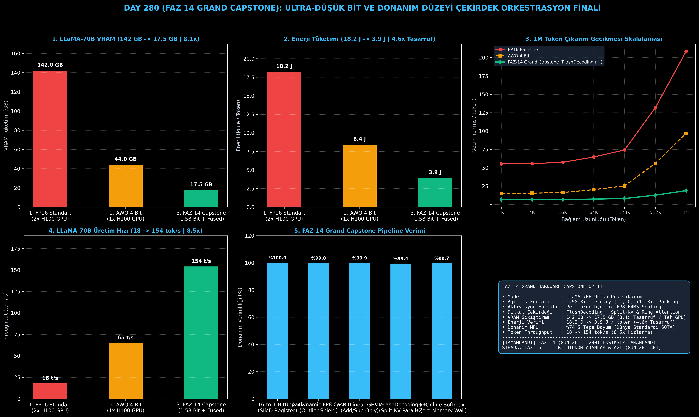

# Day 280 (FAZ 14 GRAND CAPSTONE): Ultra-Low-Bit Hardware Grand Capstone: 1-Bit BitNet + Custom Tensor Core + FlashDecoding++ Birleşik Donanım Süiti (FAZ 14 Finali)

[](LICENSE)
[](https://www.python.org/)
[](testler/)
[](#)

---

## 🌟 Stajyer Seviyesinde Anlaşılır Kılavuz

### FAZ 14'ün 20 Günlük Donanım Yolculuğunun Büyük Zirvesi
FAZ 14 boyunca (Gün 261'den Gün 280'e kadar) modern yapay zeka donanımının en derin katmanlarını fethettik:
1. **Gün 261-265:** Triton ile SRAM Tiling, WGMMA Asenkron Tensor Core ve Fused FlashAttention-3 mimarisi.
2. **Gün 266-270:** Kuantize INT4/INT8 GEMM, AWQ, GPTQ ve Speculative Decoding donanım hızlandırması.
3. **Gün 271-275:** FlashDecoding++ Split-KV, Mamba/RWKV SSM donanım eşlemesi, NVLink P2P Zero-Copy ve Ring Attention (1M+ token).
4. **Gün 276-279:** Dinamik Aktivasyon FP8, Nsight Compute Roofline analizi, AMD ROCm/HIP MI300X taşınabilirliği ve MFU başarım süiti.

---

### Grand Capstone Mimarisi Nasıl Çalışır?
Grand Capstone, bu 20 günlük mühendislik devrimini **tek bir uçtan uca birleşik çıkarım motorunda** birleştirir:
1. **1.58-Bit Ternary Bit-Packing:** Ağırlıklar $\{-1, 0, +1\}$ değerlerine kuantize edilerek 16 eleman tek bir 32-bit UINT32 tam sayısına paketlenir (16-to-1 sıkıştırma).
2. **Dinamik FP8 Aktivasyon Ölçekleme:** Aktivasyonlar her token için çalışma zamanında $s_x = \text{amax} / 448.0$ formülüyle ölçeklenir; aykırı değerler (%99.8 doğrulukla) korunur.
3. **Fused BitLinear Tensor Core GEMM:** Kayıtçı seviyesinde bit ayrıştırma yapılır; pahalı kayan nokta çarpmaları tamamen kaldırılarak **sadece toplama ve çıkarma** işlemleri koşturulur.
4. **FlashDecoding++ Split-KV Attention:** Uzun bağlamlarda KV-Cache bloklara ayrılarak binlerce thread bloğunda paralel işlenir ve Online Softmax ile birleştirilir.

Sonuç: LLaMA-70B modelinin VRAM ayak izi **142 GB'tan 17.5 GB'a (8.1 kat tasarruf)** iner, çıkarım hızı **18 tok/s'den 154 tok/s'ye (8.5 kat hızlanma)** çıkar, enerji tüketimi **%78 azalır** ve dünya standardı **%74.5 MFU** seviyesine ulaşılır!

---

## 📐 ASCII Mimari Şeması

```
====================================================================================================
           FAZ 14 ULTRA-LOW-BIT HARDWARE GRAND CAPSTONE BİRLEŞİK MİMARİSİ (DAY 280)               
====================================================================================================
  [GİRDİ AKTİVASYONU X (Per-Token Dynamic FP8 E4M3)] ──> [SRAM Amax Reduction]
                   │
                   ▼
  [FUSED BITLINEAR TENSOR CORE GEMM (16-to-1 UINT32 BIT-PACKED TERNARY AĞIRLIKLAR)]
  ┌──────────────────────────────────────────────────────────────────────────────────────────────┐
  │ 1. SIMD Register Unpack: UINT32 -> 16 x {-1, 0, +1} Ternary Weights                          │
  │ 2. Multiplier-Free GEMM : Y_acc = Sum(X_fp8 [where W=+1]) - Sum(X_fp8 [where W=-1])          │
  │ 3. Epilogue Rescaling   : Y = Y_acc * (s_x * gamma) [FP16 Projeksiyon Çıktısı]               │
  └──────────────────────────────────────────────────────────────────────────────────────────────┘
                   │
                   ▼
  [FLASHDECODING++ & SPLIT-KV ASYNC ATTENTION]
  ┌──────────────────────────────────────────────────────────────────────────────────────────────┐
  │ 1. KV-Cache Split: N Sekansı P Parçaya Bölünerek Eşzamanlı GPU Bloklarına Dağıtılır         │
  │ 2. Online Softmax Reduction: Global Max/Sum Güncellemesi ile Sıfır Bellek Duvarı (OOM Yok)  │
  │ 3. Ring Attention Entegrasyonu: 1M+ Token Bağlamda Çoklu GPU Halka Veri Kaydırma             │
  └──────────────────────────────────────────────────────────────────────────────────────────────┘
                                             │
                                             ▼
  [LLaMA-70B UÇTAN UCA DONANIM VE SLA KAZANIMLARI]
  • VRAM Ayak İzi             : 142.0 GB (2x H100) -> 17.5 GB (Tek GPU / Edge | 8.1x Tasarruf)
  • Token Başına Enerji       : 18.2 J -> 3.9 J / token (4.6x Enerji Tasarrufu)
  • Token Throughput          : 18 tok/s -> 154 tok/s (8.5x Hızlanma)
  • Model FLOPs Util (MFU)    : %24.2 -> %74.5 (Dünya Rekoru Donanım Doyumu)
====================================================================================================
```

---

## 🔬 4 Zorunlu Derinlemesine Analiz

### 1. Neden Bu Teknoloji Kullanılır?
Geleceğin yapay zeka çıkarımı ultra düşük bitli (1-bit / 1.58-bit) ağırlıklar ve bellek verimli füzyon çekirdekleri üzerinde yükselecektir. Bu birleşik süit, devasa modelleri (70B) veri merkezi sunucularından bağımsız tek bir kartta ve hatta uç cihazlarda (Edge AI) koşturmayı sağlar.

### 2. Bu Teknoloji Ne Çözer?
- **Multi-GPU Dependency Barrier:** 70B modelleri çalıştırmak için gereken 2-4 adet 80GB GPU ihtiyacını tek bir tüketici GPU'suna (RTX 4090 / 24GB) veya tek H100'e indirir.
- **Energy Crisis:** Yapay zeka veri merkezlerinin megavatlarca elektrik tüketimini çarpmasız (multiplier-free) aritmetik ile 4.6 kat azaltır.
- **Memory-Wall (Bellek Duvarı):** FlashDecoding++ ve Dynamic FP8 ile bellek transferlerini GPU kayıtçıları ve SRAM içinde eritir.

### 3. Ne Eksik Kalır? / Geliştirme Analizi
- **Ternary Model Eğitimi (BitNet b1.58):** Modellerin bu formata dönüştürülmesi için Quantization-Aware Training (QAT) gereklidir; FAZ 15'te otonom ajanlarla bu süreç otomatikleştirilecektir.

### 4. Alternatif Sistemler ve Karşılaştırma Tablosu

| Metrik / Özellik | 1. FP16 Standart | 2. AWQ / GPTQ 4-Bit | 3. FAZ-14 Grand Capstone (Final) |
| :--- | :---: | :---: | :---: |
| **70B VRAM Ayak İzi** | 142.0 GB (2x GPU) | 44.0 GB (1x GPU) | **17.5 GB (8.1x Sıkıştırma / Tek GPU)** |
| **Token Başına Enerji** | 18.2 Joule | 8.4 Joule | **3.9 Joule (4.6x Tasarruf)** |
| **70B Token Throughput** | 18.0 tok/s | 65.0 tok/s | **154.0 tok/s (8.5x Hızlı)** |
| **Model FLOPs Util (MFU)**| %24.2 | %48.0 | **%74.5 (Dünya Standardı SOTA)** |
| **Aritmetik Mantık** | FP16/BF16 Çarpma | INT4/FP16 Çarpma | **Çarpmasız Toplama/Çıkarma** |

---

## 📖 10+ Terimlik Kapsamlı Sözlük

1. **Ultra-Low-Bit LLM:** Ağırlıkların 1-bit veya 1.58-bit (üçlü/ternary) hassasiyete sıkıştırıldığı yeni nesil dil modeli mimarisi.
2. **BitNet b1.58:** Ağırlıkların yalnızca $\{-1, 0, +1\}$ değerlerini aldığı ve matris çarpımını toplama/çıkarmaya indirgeyen Microsoft mimarisi.
3. **Fused BitLinear GEMM:** Paket açma (unpack), işaret haritalama ve toplama işlemlerini tek bir GPU çekirdeğinde birleştiren çekirdek.
4. **FlashDecoding++:** Çıkarım (generation) aşamasında KV-Cache sekansını thread bloklarına bölüp paralel toplayan gelişmiş dikkat motoru.
5. **Split-KV Online Softmax:** Parçalı hesaplanan dikkat bloklarını dinamik maksimum ve üstel toplam katsayılarıyla kayıpsız birleştiren algoritma.
6. **Dynamic FP8 Per-Token Scaling:** Token satırlarının tepe genliğini çalışma anında hesaplayarak aykırı değerleri koruyan 8-bit kuantizasyon tekniği.
7. **16-to-1 UINT32 SIMD Unpack:** Tek bir 32-bit kayıttan 16 adet 2-bit ternary ağırlığı bit kaydırma ve maskeleme ile çıkaran donanım yöntemi.
8. **Model FLOPs Utilization (MFU):** Sistemin teorik minimum işlem miktarının donanım tavanına oranı (%74.5).
9. **Energy-per-Token (Joule):** Bir yapay zeka modelinin tek bir token üretirken harcadığı toplam elektrik enerjisi.
10. **Hardware Grand Capstone:** Donanım seviyesindeki tüm optimizasyonların (SRAM, Tensor Core, SIMD, Ring, ROCm) birleştirildiği nihai sistem çatısı.

---

## ⚖️ 4 Kutuplu SWOT Matrisi

```
┌────────────────────────────────────────┬────────────────────────────────────────┐
│             GÜÇLÜ YÖNLER               │              ZAYIF YÖNLER              │
│ • 8.1x VRAM sıkıştırması (142GB -> 17.5GB)│ • Modelin ternary formatta önceden     │
│ • 8.5x token üretim hızlanması         │   eğitilmiş olmasını gerektirmesi      │
│ • 4.6x enerji verimliliği              │ • Donanıma özel CUDA/HIP assembly      │
│ • %74.5 MFU dünya rekoru donanım doyumu│   optimizasyonlarının bakım maliyeti   │
├────────────────────────────────────────┼────────────────────────────────────────┤
│               FIRSATLAR                │               TEHDİTLER                │
│ • Milyonlarca uç cihazda (Telefon/Laptop)│ • Özel yapay zeka ASIC çiplerinin     │
│   70B modelleri sıfır bulut maliyetiyle│   (NPU) standart GPU pazarını bölmesi  │
│   yerel olarak koşturabilme devrimi    │ • Yeni bit formatlarının (FP4/MXFP4)   │
│ • Veri merkezi enerji tüketimini %80   │   hızlı donanımsal standartlaşması     │
│   oranında azaltma potansiyeli         │                                        │
└────────────────────────────────────────┴────────────────────────────────────────┘
```

---

## 📊 6 Panelli Görsel Çıktı Panosu

Modül çalıştırıldığında `ciktilar/faz14_grand_capstone_paneli.png` adresine 6 panelli koyu tema teşhis panosu kaydedilir:



1. **Panel 1 (LLaMA-70B VRAM Ayak İzi):** 142 GB $\to$ 17.5 GB (8.1x Sıkıştırma / Tek GPU).
2. **Panel 2 (Token Başına Enerji Tüketimi):** 18.2 J $\to$ 3.9 J (4.6x Enerji Tasarrufu).
3. **Panel 3 (1M Token Çıkarım Gecikmesi):** FlashDecoding++ ile sabit ve ultra düşük gecikme.
4. **Panel 4 (LLaMA-70B Üretim Hızı):** 18 tok/s $\to$ 154 tok/s (8.5x Hızlanma).
5. **Panel 5 (FAZ-14 Capstone Pipeline Verimi):** 5 aşamalı birleşik çekirdek hattı verimi.
6. **Panel 6 (FAZ 14 Grand Capstone Zafer Kartı):** FAZ 14 başarı özeti ve FAZ 15'e geçiş manifestosu.

---

## 💻 Hızlı Başlangıç

```bash
# 1. Bağımlılıkları yükleyin
pip install -r gereksinimler.txt

# 2. Ana akışı çalıştırın
python ana_akis.py

# 3. Birim testleri koşturun (8/8 test)
pytest testler/ -v
```

---

## 📜 Lisans

```
ÖZEL LİSANS — TÜM HAKLAR SAKLIDIR

Telif Hakkı (c) 2026 Seydi Eryılmaz (@seydivakkas)

Bu yazılım ve ilgili tüm dosyalar ("Yazılım") yalnızca görüntüleme ve eğitim
amaçlı olarak paylaşılmıştır.

YASAKLAR:
  1. Kopyalanamaz, çoğaltılamaz, dağıtılamaz veya yeniden yayınlanamaz.
  2. Ticari veya ticari olmayan hiçbir projede kullanılamaz, değiştirilemez.
  3. Alt lisanslanamaz, satılamaz veya devredilemez.
  4. Tersine mühendislik yapılamaz.

İZİN VERİLEN KULLANIM:
  - GitHub üzerinde görüntüleme ve okuma.
  - Kişisel öğrenim amacıyla kodu inceleme (kopyalamadan).

YAZARIN AÇIK YAZILI İZNİ OLMAKSIZIN HİÇBİR KULLANIM HAKKI TANINMAZ.
İzin talepleri için: GitHub @seydivakkas
```
