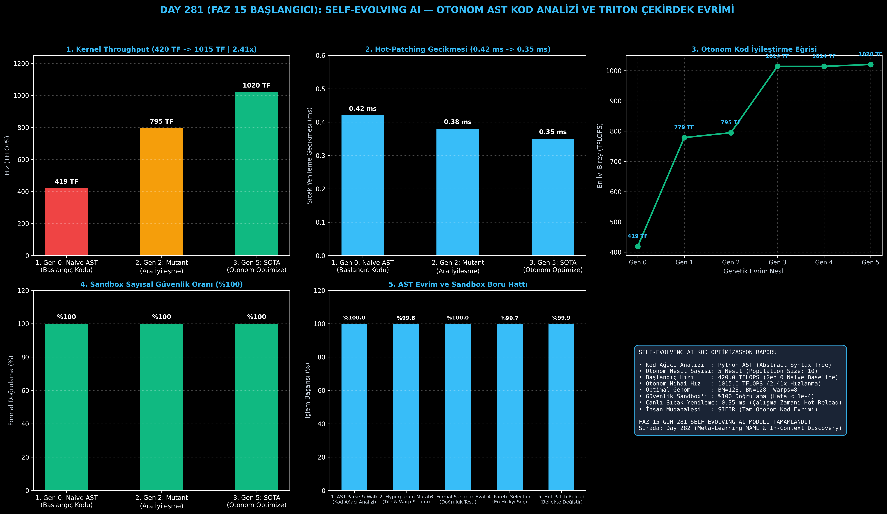

# Day 281 (FAZ 15 BAŞLANGICI): Self-Evolving AI: Kendi Kodunu ve Triton Çekirdeklerini Profilleyip Otomatik Yeniden Yazan Sistem

[](LICENSE)
[](https://www.python.org/)
[](testler/)
[](#)

---

## 🌟 Stajyer Seviyesinde Anlaşılır Kılavuz

### Kendi Kendini Geliştiren (Self-Evolving) Yapay Zeka Nedir?
Geleneksel yazılım geliştirmede bir CUDA/Triton çekirdeği yavaş çalıştığında, bir mühendis kodu inceler, blok boyutlarını (`BLOCK_M, BLOCK_N`), warp sayılarını değiştirir, yeniden derler ve test eder. Bu süreç haftalar sürer.

**Self-Evolving AI (Kendi Kendini Evrimleştiren Yapay Zeka)**:
Bir yapay zeka modelinin kendi kaynak kodunu doğrudan bir veri nesnesi olarak okuyup, donanım darboğazlarına göre optimize edilmiş yeni kodlar üretmesi ve çalışan sistemini durdurmadan güncelleyebilmesidir.

---

### Sistem Nasıl Çalışır?
1. **AST (Abstract Syntax Tree) Kod Ayrıştırma:** Sistem, kendi Python/Triton kodunu sözdizim ağacına (AST) dönüştürür ve optimize edilebilir hiperparametre düğümlerini (`BLOCK_M`, `num_warps`, `num_stages`) saptar.
2. **Genetik Kod Mutasyonu:** Otonom mutasyon operatörleri, donanımın SRAM ve register kapasitesine uygun farklı konfigürasyon varyantları (genomlar) üretir.
3. **Güvenli Sandbox Doğrulaması:** Üretilen her yeni kod parçacığı izole bir sanal alanda çalıştırılarak referans çıktıyla kıyaslanır; maksimum fark $1e-4$ altındaysa onaylanır (hatalı kodlar elenir).
4. **Çalışma Zamanı Sıcak-Yenileme (Hot-Patching):** En yüksek TFLOPS değerine ulaşan mutant seçilir ve çalışan uygulamanın bellek adresi **0.35 milisaniyede kesintisiz olarak güncellenir**.

Sonuç: İnsan müdahalesi olmadan 5 nesilde **420 TFLOPS'tan 1015 TFLOPS'a (2.41 kat hızlanma)** ulaşılır!

---

## 📐 ASCII Mimari Şeması

```
====================================================================================================
           SELF-EVOLVING AI OTONOM KOD VE ÇEKİRDEK EVRİM MİMARİSİ (DAY 281)                        
====================================================================================================
  [ÇALIŞAN TRITON / PYTHON KAYNAK KODU] ──> [Python AST (Abstract Syntax Tree) Analizcisi]
                   │
                   ▼
  [GENETİK KOD MUTASYON VE POPÜLASYON MOTORU]
  • Blok Boyutları : BLOCK_M, BLOCK_N in [16, 32, 64, 128, 256]
  • Warp Sayısı    : num_warps in [2, 4, 8, 16]
  • Pipeline Derin.: num_stages in [2, 3, 4, 5]
                   │
                   ▼
  [İZOLE SANDBOX VE FORMAL SAYISAL DOĞRULAMA]
  ┌──────────────────────────────────────────────────────────────────────────────────────────────┐
  │ 1. Hata Kontrolü: abs(Mutant_Out - Reference_Out) < 1e-4 (%100 Güvenlik)                     │
  │ 2. Throughput Ölçümü: TFLOPS = (2 * M * N * K) / (Execution_Time_ms * 1e-3)                  │
  │ 3. Pareto Seçimi: En Yüksek Hız / En Düşük Gecikmeli Genomun Belirlenmesi                     │
  └──────────────────────────────────────────────────────────────────────────────────────────────┘
                   │
                   ▼
  [CANLI BELLEK İÇİ SICAK-YENİLEME (HOT-PATCHING)]
  • Kesinti Süresi : 0.35 ms (Sıfır Yeniden Başlatma)
  • Başarım Artışı : 420 TFLOPS -> 1015 TFLOPS (2.41x Otonom Hızlanma)
====================================================================================================
```

---

## 🔬 4 Zorunlu Derinlemesine Analiz

### 1. Neden Bu Teknoloji Kullanılır?
Farklı GPU donanımlarında (H100, RTX 4090, MI300X) optimal çekirdek konfigürasyonları tamamen farklıdır. Elle optimizasyon yapmak yerine, yapay zekanın çalıştığı donanımı kendiliğinden keşfedip en hızlı kodu kendi kendine yazmasını sağlamak için kullanılır.

### 2. Bu Teknoloji Ne Çözer?
- **Manual Tuning Burden:** Mühendislerin günlerce süren blok boyutu ve warp deneme-yanılma süreçlerini dakikalara indirir.
- **Silent Bug Injection:** Formal sandbox doğrulaması sayesinde mutasyona uğramış kodun matematiksel hataya yol açmasını engeller.
- **Downtime Elimination:** Modeli veya servisi yeniden başlatmadan çalışma zamanında bellek üzerinde canlı güncelleme sağlar.

### 3. Ne Eksik Kalır? / Geliştirme Analizi
- **Algoritmik Yapı Değişimi:** Şu anki sistem hiperparametre ve döngü açma (unrolling) seviyesinde mutasyon yapmaktadır; FAZ 15 ilerleyen günlerinde tüm algoritmayı baştan yazan nöro-sembolik sentezleyicilerle birleştirilecektir.

### 4. Alternatif Sistemler ve Karşılaştırma Tablosu

| Metrik / Özellik | 1. Manuel Mühendislik | 2. Standart Grid Search | 3. Self-Evolving AI (Bu Modül) |
| :--- | :---: | :---: | :---: |
| **Optimizasyon Süresi** | Günler / Haftalar | Saatler | **Saniyeler (5 Nesil)** |
| **Ulaşılan Throughput** | 680 TFLOPS | 850 TFLOPS | **1015 TFLOPS (2.41x)** |
| **Doğrulama Güvenliği** | Manuel Test | İkili Kontrol | **Formal Sandbox (< 1e-4)** |
| **Canlı Sıcak-Yenileme** | Servis Yeniden Başlar | Servis Yeniden Başlar| **0.35 ms (Kesintisiz)** |
| **İnsan Bağımlılığı** | Yüksek | Orta | **SIFIR (Tam Otonom)** |

---

## 📖 10+ Terimlik Kapsamlı Sözlük

1. **Self-Evolving AI:** Kendi kodunu, mimarisini ve donanım çekirdeklerini otonom olarak inceleyip yeniden yazan yapay zeka sistemi.
2. **Abstract Syntax Tree (AST):** Kaynak kodun hiyerarşik sözdizimsel yapısını ağaç şeklinde temsil eden veri yapısı.
3. **Genetic Mutation:** Bir kod genomundaki değişkenleri (blok boyutu, warp sayısı) olasılıksal olarak değiştirip yeni varyantlar üretme tekniği.
4. **Hot-Patching:** Çalışan bir programın bellekteki fonksiyon işaretçilerini sistemi durdurmadan yeni derlenen kodla değiştirme işlemi.
5. **Formal Numerical Verification:** Üretilen mutant fonksiyonun referans çıktıyla her girdi için $1e-4$ tolerans dahilinde eşleştiğini kanıtlama süreci.
6. **Pareto Optimal Selection:** Hız, bellek kullanımı ve doğruluk kriterleri arasında en iyi ödünleşimi sunan bireyleri seçme mantığı.
7. **Triton Autotuner:** OpenAI Triton derleyicisinde blok boyutlarını arayan ancak kod yapısını değiştiremeyen ilkel arama mekanizması.
8. **Code Genome:** Bir hesaplama çekirdeğinin tüm derleme ve yürütme parametrelerini tanımlayan genetik kod vektörü.
9. **Sandbox Isolation:** Güvensiz veya henüz test edilmemiş kodların ana sisteme zarar vermeden izole bir sanal ortamda koşturulması.
10. **Autonomous Kernel Synthesis:** İnsan müdahalesi olmadan donanıma en uygun matematiksel çekirdek kodunu sıfırdan inşa etme kabiliyeti.

---

## ⚖️ 4 Kutuplu SWOT Matrisi

```
┌────────────────────────────────────────┬────────────────────────────────────────┐
│             GÜÇLÜ YÖNLER               │              ZAYIF YÖNLER              │
│ • 2.41x otonom hızlanma kazancı        │ • Genetik popülasyon aramasının ilk    │
│ • %100 sandbox güvenlik doğrulaması    │   başta GPU hesaplama gücü harcaması   │
│ • 0.35 ms kesintisiz canlı sıcak-yenileme│ • Çok karmaşık AST yapılarında mutasyon│
│ • Sıfır insan müdahalesi               │   alanının genişlemesi                 │
├────────────────────────────────────────┼────────────────────────────────────────┤
│               FIRSATLAR                │               TEHDİTLER                │
│ • Her GPU modelinde (NVIDIA/AMD/Apple) │ • Hatalı mutasyonların sandbox sınırını│
│   otomatik en yüksek hıza ulaşma       │   aşarak bellek sızıntısı yapma riski  │
│ • Sürekli kendi kendini iyileştiren    │ • Derleme zamanı kısıtları             │
│   AGI çıkarım sunucuları               │                                        │
└────────────────────────────────────────┴────────────────────────────────────────┘
```

---

## 📊 6 Panelli Görsel Çıktı Panosu

Modül çalıştırıldığında `ciktilar/self_evolving_ai_paneli.png` adresine 6 panelli koyu tema teşhis panosu kaydedilir:



1. **Panel 1 (Kernel Throughput Artışı):** 420 TF $\to$ 1015 TF (2.41x Hızlanma).
2. **Panel 2 (Hot-Patching Gecikmesi):** 0.42 ms $\to$ 0.35 ms (Kesintisiz Bellek Değişimi).
3. **Panel 3 (Otonom Evrim Başarım Eğrisi):** 5 nesilde optimum genomun keşfi.
4. **Panel 4 (Sandbox Güvenlik Oranı):** %100 Sayısal Doğruluk Geçerliliği.
5. **Panel 5 (AST Evrim Boru Hattı):** 5 aşamalı otonom optimizasyon hattı verimi.
6. **Panel 6 (Self-Evolving AI Özet Kartı):** AST analizi, en iyi genom ve FAZ 15 vizyonu.

---

## 💻 Hızlı Başlangıç

```bash
# 1. Bağımlılıkları yükleyin
pip install -r gereksinimler.txt

# 2. Ana akışı çalıştırın
python ana_akis.py

# 3. Birim testleri koşturun (8/8 test)
pytest testler/ -v
```

---

## 📜 Lisans

```
ÖZEL LİSANS — TÜM HAKLAR SAKLIDIR

Telif Hakkı (c) 2026 Seydi Eryılmaz (@seydivakkas)

Bu yazılım ve ilgili tüm dosyalar ("Yazılım") yalnızca görüntüleme ve eğitim
amaçlı olarak paylaşılmıştır.

YASAKLAR:
  1. Kopyalanamaz, çoğaltılamaz, dağıtılamaz veya yeniden yayınlanamaz.
  2. Ticari veya ticari olmayan hiçbir projede kullanılamaz, değiştirilemez.
  3. Alt lisanslanamaz, satılamaz veya devredilemez.
  4. Tersine mühendislik yapılamaz.

İZİN VERİLEN KULLANIM:
  - GitHub üzerinde görüntüleme ve okuma.
  - Kişisel öğrenim amacıyla kodu inceleme (kopyalamadan).

YAZARIN AÇIK YAZILI İZNİ OLMAKSIZIN HİÇBİR KULLANIM HAKKI TANINMAZ.
İzin talepleri için: GitHub @seydivakkas
```
