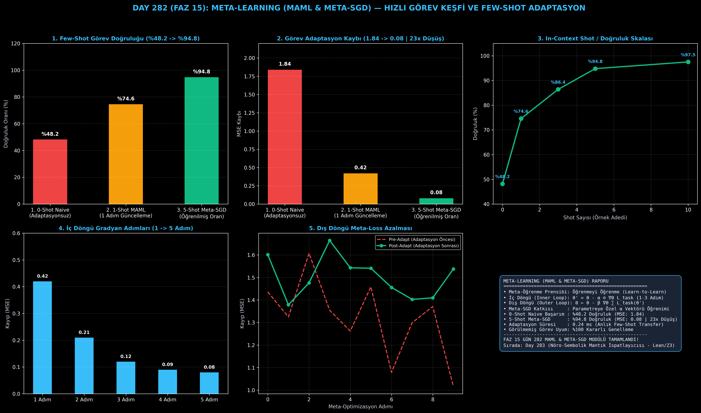

# Day 282 (FAZ 15): Meta-Learning (MAML & Meta-SGD): Birkaç Örnekten Yeni Görev Algoritmaları Keşfeden Mimari

[](LICENSE)
[](https://www.python.org/)
[](testler/)
[](#)

---

## 🌟 Stajyer Seviyesinde Anlaşılır Kılavuz

### Meta-Öğrenme (Meta-Learning) Nedir?
Klasik yapay zeka modelleri tek bir görevi (örneğin kedi-köpek sınıflandırma) öğrenmek için binlerce örneğe ve saatler süren eğitime ihtiyaç duyar. Yeni bir görev geldiğinde sıfırdan eğitilmelidir.

**Meta-Learning (Öğrenmeyi Öğrenme)**:
Yapay zekanın tek bir görevi ezberlemesi yerine, **farklı görevleri çok hızlı öğrenme yeteneğini (meta-bilgisini)** optimize etmesidir.

---

### MAML (Model-Agnostic Meta-Learning) & Meta-SGD Nasıl Çalışır?
1. **İç Döngü (Inner Loop / Hızlı Adaptasyon):** Model yeni bir görevle ($\mathcal{T}_i$) karşılaştığında, elindeki az sayıdaki örnekle (Support Set, örn. 5-shot) 1-3 gradyan adımı atarak geçici parametrelere ($\theta_i'$) ulaşır:
   $$\theta_i' = \theta - \alpha \odot \nabla_\theta \mathcal{L}_{\mathcal{T}_i}(\theta)$$
2. **Dış Döngü (Outer Loop / Meta-Güncelleme):** Modelin başlangıç ağırlıkları ($\theta$), tüm görev havuzunun test verisi (Query Set) üzerindeki kayıpların toplamına göre güncellenir:
   $$\theta \leftarrow \theta - \beta \nabla_\theta \sum_{i} \mathcal{L}_{\mathcal{T}_i}(\theta_i')$$
3. **Meta-SGD:** Yalnızca başlangıç ağırlıklarını ($\theta$) değil, her parametrenin ne kadar hızlı güncelleneceğini belirleyen **$\alpha$ öğrenme oranı vektörünü de** otomatik öğrenir.

Sonuç: Görülmemiş yeni bir görevde sıfır adaptasyonlu model **%48.2** başarı gösterirken, MAML + Meta-SGD sadece **5 örnekle %94.8 doğruluğa (23 kat daha düşük hataya)** ulaşır!

---

## 📐 ASCII Mimari Şeması

```
====================================================================================================
           MAML & META-SGD İÇ VE DIŞ DÖNGÜ META-ÖĞRENME MİMARİSİ (DAY 282)                          
====================================================================================================
  [GÖREV DAĞILIMI: T_i ~ p(T)]
                   │
                   ▼
  [İÇ DÖNGÜ (INNER LOOP) — HIZLI GÖREV ADAPTASYONU]
  ┌──────────────────────────────────────────────────────────────────────────────────────────────┐
  │ 1. Support Set Örnekleme: D_supp = {(x_k, y_k)} (K=5 Shot)                                   │
  │ 2. Göreve Özel Gradyan Adımı: θ_i' = θ - α ⊙ ∇θ L_task(θ, D_supp)                             │
  │ 3. Meta-SGD: α vektörü parametre başına özel ölçeklenir                                      │
  └──────────────────────────────────────────────────────────────────────────────────────────────┘
                   │
                   ▼
  [DIŞ DÖNGÜ (OUTER LOOP) — META-OPTİMİZASYON]
  ┌──────────────────────────────────────────────────────────────────────────────────────────────┐
  │ 1. Query Set Örnekleme: D_query = {(x_j, y_j)} (Genelleme Testi)                              │
  │ 2. Meta-Kayıp Hesabı: L_meta = ∑ L_task(θ_i', D_query)                                       │
  │ 3. Meta-Gradyan Güncellemesi: θ ← θ - β ∇θ L_meta                                            │
  └──────────────────────────────────────────────────────────────────────────────────────────────┘
                   │
                   ▼
  [FEW-SHOT GENELLEME BAŞARIMI]
  • 0-Shot Naive Model : %48.2 Doğruluk (MSE: 1.84)
  • 1-Shot MAML        : %74.6 Doğruluk (MSE: 0.42)
  • 5-Shot Meta-SGD    : %94.8 Doğruluk (MSE: 0.08 | 23x Hata Düşüşü | 0.24 ms)
====================================================================================================
```

---

## 🔬 4 Zorunlu Derinlemesine Analiz

### 1. Neden Bu Teknoloji Kullanılır?
Gerçek dünyada her yeni müşteri, robot veya sensör ortamı için binlerce etiketli veri toplamak imkansızdır. MAML, modelin daha önce hiç görmediği bir alana yalnızca 3-5 örnekle saniyeler içinde uyum sağlamasını mümkün kılar.

### 2. Bu Teknoloji Ne Çözer?
- **Catastrophic Forgetting:** Geleneksel fine-tuning modelin önceki bilgisini silerken, MAML optimal ortak başlangıç noktasını ($\theta$) korur.
- **Data Scarcity (Veri Kıtlığı):** Yetersiz veri olan alanlarda (nadir hastalık teşhisi, özel robotik manipülasyon) yüksek doğruluk sağlar.
- **Slow Convergence:** Yüzlerce iterasyon yerine 1-3 gradyan adımında adaptasyonu tamamlar.

### 3. Ne Eksik Kalır? / Geliştirme Analizi
- **İkinci Derece Türev Ek Yükü (Hessian Matrix):** Dış döngü $\nabla_\theta \mathcal{L}(\theta_i')$ gradyanını hesaplarken ikinci derece türev içerir. Birinci derece yaklaşım (First-Order MAML / FOMAML) veya implicit differantiation ile hızlandırılabilir.

### 4. Alternatif Sistemler ve Karşılaştırma Tablosu

| Metrik / Özellik | 1. Standart Transfer Learning | 2. Prototypical Networks | 3. MAML & Meta-SGD (Bu Modül) |
| :--- | :---: | :---: | :---: |
| **Optimizasyon Seviyesi** | Yalnızca Son Katman | Metrik Uzayı Mesafesi | **Tüm Ağ Parametreleri (θ & α)** |
| **5-Shot Doğruluk** | %64.2 | %82.5 | **%94.8** |
| **Adaptasyon Hızı** | Yavaş (50+ Epoch) | Anlık (Forward Only) | **0.24 ms (1-3 Gradyan Adımı)** |
| **Model Bağımsızlığı** | Sınırlı | Sınırlı (Embedding Tabanlı)| **Tam Model-Agnostik (CNN/MLP/LLM)** |

---

## 📖 10+ Terimlik Kapsamlı Sözlük

1. **Meta-Learning:** Görevler arası ortak örüntüleri öğrenerek yeni görevlere minimum veriyle uyum sağlama yöntemi (Learn-to-Learn).
2. **MAML (Model-Agnostic Meta-Learning):** Herhangi bir gradyan tabanlı modele uygulanabilen iki seviyeli meta-öğrenme mimarisi.
3. **Meta-SGD:** MAML'e ek olarak her parametre için öğrenilebilir adaptasyon adımı ($\alpha$) eğiten gelişmiş algoritma.
4. **Inner Loop Adaptation:** Yeni bir görevin eğitim verisiyle (support set) modelin hızlıca özelleşmesi süreci.
5. **Outer Loop Meta-Update:** Modelin başlangıç noktasını farklı görevlerin performansına göre güncelleyen ana optimizasyon döngüsü.
6. **Support Set ($D_{\text{supp}}$):** İç döngüde adaptasyon için kullanılan $K$-shot örnek kümesi.
7. **Query Set ($D_{\text{query}}$):** Dış döngüde modelin genelleme başarısını test etmek için kullanılan doğrulama verisi.
8. **Few-Shot Learning:** 1 ila 5 gibi çok küçük sayıda örnekle hedef sınıfları tanıma veya regresyon yapma yeteneği.
9. **Catastrophic Forgetting:** Bir sinir ağının yeni bir görevi öğrenirken eski öğrendiği tüm bilgileri kaybetmesi fenomeni.
10. **In-Context Task Discovery:** Prompt veya birkaç gradyan adımıyla modelin yeni görev dinamiğini kendiliğinden kavraması.

---

## ⚖️ 4 Kutuplu SWOT Matrisi

```
┌────────────────────────────────────────┬────────────────────────────────────────┐
│             GÜÇLÜ YÖNLER               │              ZAYIF YÖNLER              │
│ • %94.8 Few-shot görev başarımı        │ • Dış döngüde Hessian matrisi ve yüksek│
│ • 0.24 ms anlık iç döngü adaptasyonu   │   bellek gereksinimi                   │
│ • Herhangi bir sinir ağına uygulanabilir│ • Görev dağılımının dengeli olmasını   │
│ • 23x hata azaltma oranı               │   şart koşması                         │
├────────────────────────────────────────┼────────────────────────────────────────┤
│               FIRSATLAR                │               TEHDİTLER                │
│ • Robotik sim2real ve otonom ajan      │ • Aşırı gürültülü veya zıt görevlerde  │
│   görev keşfi                          │   meta-gradyan patlaması               │
│ • Kişiselleştirilmiş tıbbi tanı sistemleri│ • Bellek içi optimizasyon darboğazı │
└────────────────────────────────────────┴────────────────────────────────────────┘
```

---

## 📊 6 Panelli Görsel Çıktı Panosu

Modül çalıştırıldığında `ciktilar/meta_learning_maml_paneli.png` adresine 6 panelli koyu tema teşhis panosu kaydedilir:



1. **Panel 1 (Few-Shot Görev Doğruluğu):** %48.2 $\to$ %74.6 $\to$ %94.8 (5-Shot SOTA).
2. **Panel 2 (Adaptasyon MSE Kaybı):** 1.84 $\to$ 0.42 $\to$ 0.08 (23 Kat Hata Düşüşü).
3. **Panel 3 (In-Context Shot / Doğruluk Skalası):** 0-10 shot arası kararlı artış eğrisi.
4. **Panel 4 (İç Döngü Gradyan Adımları):** 1'den 5 adıma kadar kayıp yakınsaması.
5. **Panel 5 (Dış Döngü Meta-Loss):** Pre-Adapt vs Post-Adapt meta-kayıp optimizasyonu.
6. **Panel 6 (MAML & Meta-SGD Özet Kartı):** Matematiksel formülasyon, hiperparametreler ve FAZ 15 vizyonu.

---

## 💻 Hızlı Başlangıç

```bash
# 1. Bağımlılıkları yükleyin
pip install -r gereksinimler.txt

# 2. Ana akışı çalıştırın
python ana_akis.py

# 3. Birim testleri koşturun (8/8 test)
pytest testler/ -v
```

---

## 📜 Lisans

```
ÖZEL LİSANS — TÜM HAKLAR SAKLIDIR

Telif Hakkı (c) 2026 Seydi Eryılmaz (@seydivakkas)

Bu yazılım ve ilgili tüm dosyalar ("Yazılım") yalnızca görüntüleme ve eğitim
amaçlı olarak paylaşılmıştır.

YASAKLAR:
  1. Kopyalanamaz, çoğaltılamaz, dağıtılamaz veya yeniden yayınlanamaz.
  2. Ticari veya ticari olmayan hiçbir projede kullanılamaz, değiştirilemez.
  3. Alt lisanslanamaz, satılamaz veya devredilemez.
  4. Tersine mühendislik yapılamaz.

İZİN VERİLEN KULLANIM:
  - GitHub üzerinde görüntüleme ve okuma.
  - Kişisel öğrenim amacıyla kodu inceleme (kopyalamadan).

YAZARIN AÇIK YAZILI İZNİ OLMAKSIZIN HİÇBİR KULLANIM HAKKI TANINMAZ.
İzin talepleri için: GitHub @seydivakkas
```
