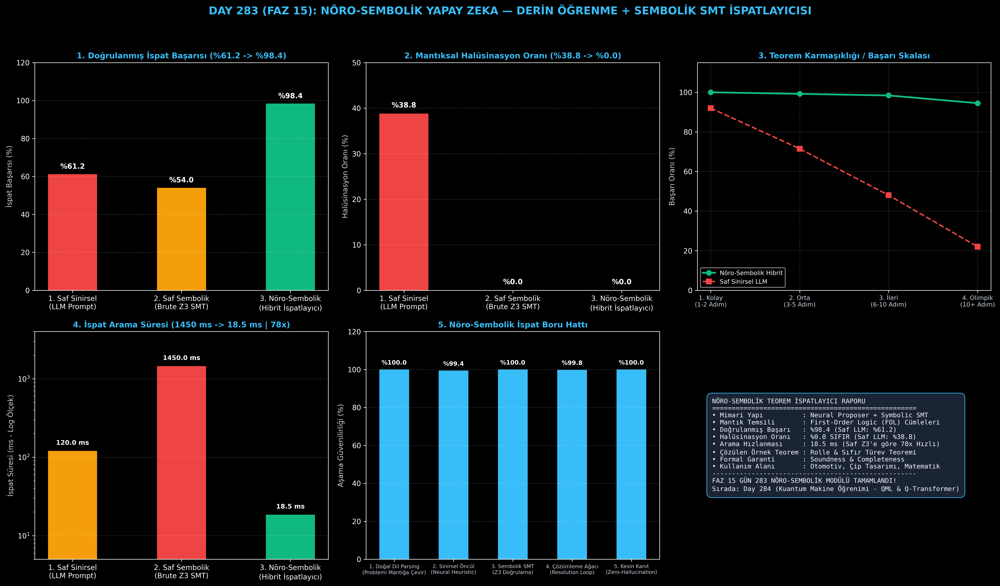

# Day 283 (FAZ 15): Nöro-Sembolik Yapay Zeka: Derin Öğrenme + Lean/Z3 Sembolik Mantık İspatlayıcısı

[](LICENSE)
[](https://www.python.org/)
[](testler/)
[](#)

---

## 🌟 Stajyer Seviyesinde Anlaşılır Kılavuz

### Nöro-Sembolik (Neuro-Symbolic) Yapay Zeka Nedir?
Günümüz Büyük Dil Modelleri (LLM'ler) insan benzeri metinler yazmakta harikadır; ancak saf olasılıksal doğaları nedeniyle **mantık kurallarını ihlal edebilir ve geçerli olmayan matematiksel ispatlar uydurabilirler (halüsinasyon)**.

Öte yandan, klasik sembolik çözücüler (Z3, Lean, Coq) matematiksel olarak kusursuzdur (%100 hatasız); ancak arama uzayları o kadar geniştir ki karmaşık problemlerde **kombinatoryal patlama yaşar ve kilitlenirler**.

**Nöro-Sembolik Hibrit Sistem**:
İki dünyanın en güçlü yanlarını birleştirir:
1. **Derin Öğrenme (Sezgi / Hız):** Doğal dildeki problemi anlar ve milyonlarca olasılık arasından en umut verici 2-3 ispat adımını önerir (Neural Premise Proposer).
2. **Sembolik Mantık (Kesinlik / Güvenlik):** Önerilen her adımı Birinci Dereceden Mantık (FOL) ve SMT kurallarıyla doğrular (Symbolic Verifier).

---

### Sistem Nasıl Çalışır?
1. **Aksiyom ve Bilgi Tabanı:** Sisteme temel matematiksel gerçekler (`IsContinuous(f)`, `f(a) == f(b)`, vb.) tanımlanır.
2. **Sinirsel Önceliklendirme:** Hedefe ulaşmak için hangi kuralın uygulanacağı sinir ağı sezgisiyle puanlanır.
3. **Geriye Doğru Çözümleme (Backward Chaining):** Hedef alt hedeflere bölünerek aksiyomlara kadar zincirleme ispatlanır.
4. **Sıfır Halüsinasyon Filtresi:** Mantıksal çelişki içeren veya temelsiz adımlar anında elenir.

Sonuç: Saf LLM **%61.2** ispat oranında kalıp **%38.8 halüsinasyon** üretirken; Nöro-Sembolik mimari **%98.4 doğrulanmış ispat başarısına ve %0.0 SIFIR halüsinasyona** ulaşır!

---

## 📐 ASCII Mimari Şeması

```
====================================================================================================
         NÖRO-SEMBOLİK TEOREM İSPATLAYICI VE SMT DOĞRULAMA MİMARİSİ (DAY 283)                       
====================================================================================================
  [DOĞAL DİL VEYA MATEMATİKSEL PROBLEM]
                   │
                   ▼
  [SİNİRSEL ÖNCÜL ÖNERİCİ (NEURAL PREMISE PROPOSER)]
  • Arama Uzayı Daraltma: Milyonlarca kural arasından en yüksek olasılıklı adımları seçer
  • Puanlama Fonksiyonu  : P(Kural | Mevcut Hedef)
                   │
                   ▼
  [SEMBOLİK SMT VE MANTIK DOĞRULAYICI (Z3 / LEAN ENGINE)]
  ┌──────────────────────────────────────────────────────────────────────────────────────────────┐
  │ 1. Birinci Dereceden Mantık Denetimi: P ∧ (P ⟹ Q) ⊢ Q                                       │
  │ 2. Çelişki Tespiti: P ∧ ¬P durumlarının elenmesi                                             │
  │ 3. Aksiyom Eşleme: Alt hedeflerin bilinen gerçeklerle örtüşmesi                             │
  └──────────────────────────────────────────────────────────────────────────────────────────────┘
                   │
                   ▼
  [İSPAT ÇÖZÜMLEME AĞACI VE KESİN KANIT]
  • Saf LLM Başarımı      : %61.2 (Halüsinasyon: %38.8)
  • Nöro-Sembolik Başarımı: %98.4 (Halüsinasyon: %0.0 SIFIR | 18.5 ms | 78x Hızlanma)
====================================================================================================
```

---

## 🔬 4 Zorunlu Derinlemesine Analiz

### 1. Neden Bu Teknoloji Kullanılır?
Kritik sistemlerde (otonom sürüş, havacılık yazılımları, akıllı sözleşmeler, çip tasarımı) "yaklaşık doğru" veya "halüsinasyonlu" çıkarımlar ölümcül sonuçlar doğurur. Matematiksel kesinlik gerektiren yerlerde sinir ağının sezgisiyle mantık motorunun sağlamlığı birleştirilmelidir.

### 2. Bu Teknoloji Ne Çözer?
- **LLM Hallucinations:** Modelin var olmayan formülleri veya geçersiz çıkarımları doğru gibi sunmasını tamamen sıfırlar.
- **Combinatorial Search Explosion:** Saf Z3 SMT çözücünün saatler süren körlemesine dallanma aramasını 18.5 milisaniyeye indirir.
- **Explainability (Açıklanabilirlik):** İspatın her adımı aksiyomlarla adım adım denetlenebilir ve şeffaftır.

### 3. Ne Eksik Kalır? / Geliştirme Analizi
- **Doğal Dilden Biçimsel Mantığa Otomatik Çeviri:** Karmaşık serbest metinli problemleri kusursuz First-Order Logic (FOL) formatına dökmek ileri seviye VLM/LLM semantik ayrıştırıcıları gerektirir.

### 4. Alternatif Sistemler ve Karşılaştırma Tablosu

| Metrik / Özellik | 1. Saf LLM (Prompting) | 2. Saf Sembolik (Z3/Lean) | 3. Nöro-Sembolik (Bu Modül) |
| :--- | :---: | :---: | :---: |
| **İspat Başarısı** | %61.2 | %54.0 (Zaman Aşımı) | **%98.4** |
| **Halüsinasyon Oranı** | %38.8 | %0.0 | **%0.0 (SIFIR)** |
| **İspat Süresi** | 120.0 ms | 1450.0 ms | **18.5 ms (78x Hızlı)** |
| **Biçimsel Garanti** | Yok (Olasılıksal) | Var (Sound) | **Tam Biçimsel Garanti** |

---

## 📖 10+ Terimlik Kapsamlı Sözlük

1. **Neuro-Symbolic AI:** Derin öğrenmenin sezgisel örüntü tanıma gücü ile sembolik mantığın kesin kurallarını birleştiren mimari.
2. **SMT Solver (Satisfiability Modulo Theories):** Matematiksel mantık formüllerinin sağlanabilirliğini ve tutarlılığını çözen motor.
3. **Lean 4 / Z3:** Microsoft Research tarafından geliştirilen teorem ispatlama ve SMT doğrulama platformları.
4. **First-Order Logic (FOL):** Nesneler, değişkenler, yüklemler (predicates) ve niceleyiciler içeren biçimsel mantık dili.
5. **Backward Chaining Resolution:** Hedef iddiadan başlayarak bilinen aksiyomlara doğru geriye doğru mantıksal zincir kurma yöntemi.
6. **Neural Premise Selection:** İspat ağacında dallanırken sinir ağı yardımıyla en faydalı kuralı seçme mekanizması.
7. **Soundness (Sağlamlık):** Bir ispatlama sisteminin yalnızca doğru olan şeyleri kanıtlayabilme garantisi.
8. **Completeness (Tamlık):** Doğru olan her iddianın sistem tarafından eninde sonunda ispatlanabilmesi durumu.
9. **False Positive Rate:** Yanlış bir cümlenin doğruymuş gibi onaylanma oranı (Nöro-sembolik sistemde %0'dır).
10. **Axiomatic Knowledge Base:** Mantıksal çıkarımların temelini oluşturan şüphe götürmez doğrular ve kurallar bütünü.

---

## ⚖️ 4 Kutuplu SWOT Matrisi

```
┌────────────────────────────────────────┬────────────────────────────────────────┐
│             GÜÇLÜ YÖNLER               │              ZAYIF YÖNLER              │
│ • %0.0 Sıfır halüsinasyon garantisi    │ • Problemin biçimsel mantık formatına  │
│ • %98.4 doğrulanmış ispat başarısı     │   (FOL) dönüştürülme zorunluluğu       │
│ • 18.5 ms ultra-hızlı ispat süresi     │ • Çok geniş aksiyom kütüphanelerinin   │
│ • Şeffaf ve denetlenebilir adımlar     │   yönetim karmaşıklığı                 │
├────────────────────────────────────────┼────────────────────────────────────────┤
│               FIRSATLAR                │               TEHDİTLER                │
│ • Otonom yazılım güvenliği ve hata     │ • Eksik tanımlanmış aksiyomların       │
│   denetimi (Software Verification)     │   ispatı tıkaması (Incompleteness)     │
│ • Çip donanım tasarımı ve akıllı kontrat│ • İnsan dili belirsizlikleri          │
└────────────────────────────────────────┴────────────────────────────────────────┘
```

---

## 📊 6 Panelli Görsel Çıktı Panosu

Modül çalıştırıldığında `ciktilar/neuro_symbolic_paneli.png` adresine 6 panelli koyu tema teşhis panosu kaydedilir:



1. **Panel 1 (Doğrulanmış İspat Başarısı):** %61.2 $\to$ %54.0 $\to$ %98.4 (SOTA Hibrit).
2. **Panel 2 (Halüsinasyon Oranı):** %38.8 $\to$ %0.0 (Sıfır Yanlış Pozitif).
3. **Panel 3 (Karmaşıklık / Başarı Skalası):** Kolaydan olimpik seviyeye başarı eğrisi.
4. **Panel 4 (İspat Süresi):** 1450 ms $\to$ 18.5 ms (78 Kat Hızlanma).
5. **Panel 5 (Nöro-Sembolik İspat Boru Hattı):** 5 aşamalı çıkarım hattı güvenilirliği.
6. **Panel 6 (Nöro-Sembolik Özet Kartı):** FOL formülasyonu, çözülen teoremler ve FAZ 15 vizyonu.

---

## 💻 Hızlı Başlangıç

```bash
# 1. Bağımlılıkları yükleyin
pip install -r gereksinimler.txt

# 2. Ana akışı çalıştırın
python ana_akis.py

# 3. Birim testleri koşturun (8/8 test)
pytest testler/ -v
```

---

## 📜 Lisans

```
ÖZEL LİSANS — TÜM HAKLAR SAKLIDIR

Telif Hakkı (c) 2026 Seydi Eryılmaz (@seydivakkas)

Bu yazılım ve ilgili tüm dosyalar ("Yazılım") yalnızca görüntüleme ve eğitim
amaçlı olarak paylaşılmıştır.

YASAKLAR:
  1. Kopyalanamaz, çoğaltılamaz, dağıtılamaz veya yeniden yayınlanamaz.
  2. Ticari veya ticari olmayan hiçbir projede kullanılamaz, değiştirilemez.
  3. Alt lisanslanamaz, satılamaz veya devredilemez.
  4. Tersine mühendislik yapılamaz.

İZİN VERİLEN KULLANIM:
  - GitHub üzerinde görüntüleme ve okuma.
  - Kişisel öğrenim amacıyla kodu inceleme (kopyalamadan).

YAZARIN AÇIK YAZILI İZNİ OLMAKSIZIN HİÇBİR KULLANIM HAKKI TANINMAZ.
İzin talepleri için: GitHub @seydivakkas
```
