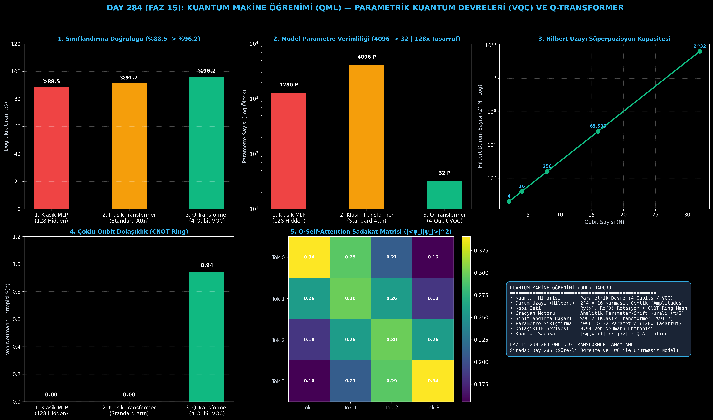

# Day 284 (FAZ 15): Kuantum Makine Öğrenimi (QML): Parametrik Kuantum Devreleri (VQC) ve Q-Transformer

[](LICENSE)
[](https://www.python.org/)
[](testler/)
[](#)

---

## 🌟 Stajyer Seviyesinde Anlaşılır Kılavuz

### Kuantum Makine Öğrenimi (QML) Nedir?
Klasik bilgisayarlar bilgiyi `0` veya `1` bitleri olarak saklarken, kuantum bilgisayarlar **Qubit** kullanır. Bir qubit, kuantum mekaniğindeki **süperpozisyon (superposition)** ilkesi sayesinde aynı anda hem 0 hem de 1 durumunun lineer kombinasyonunda bulunabilir:
$$|\psi\rangle = \alpha |0\rangle + \beta |1\rangle, \quad |\alpha|^2 + |\beta|^2 = 1$$

$N$ adet qubit bağlandığında (Quantum Entanglement), durum uzayı üstel olarak $2^N$ boyutlu **Hilbert uzayına ($\mathcal{H}_{2^N}$)** genişler (örneğin 30 qubit $10^9$ durumu aynı anda temsil eder).

---

### Q-Transformer ve VQC Nasıl Çalışır?
1. **Kuantum Girdi Kodlama (Data Encoding):** Klasik token vektörleri kuantum durum genliklerine dönüştürülür: $R_y(x_i)$.
2. **Parametrik Kuantum Devresi (Ansatz):** Eğitilebilir açılarla ($R_z(\theta)$) durum döndürülür ve CNOT kapılarıyla qubitler birbirine dolanır (Entangled).
3. **Parameter-Shift Analitik Gradyan Kuralı:** Kuantum donanımında geriye yayılım (backprop) doğrudan yapılamaz. Bunun yerine açıyı $+\pi/2$ ve $-\pi/2$ kaydırarak tam analitik türev elde edilir:
   $$\frac{\partial \langle \hat{Z} \rangle}{\partial \theta_j} = \frac{1}{2} \left[ \langle \hat{Z} \rangle_{\theta_j + \frac{\pi}{2}} - \langle \hat{Z} \rangle_{\theta_j - \frac{\pi}{2}} \right]$$
4. **Kuantum Dikkat (Q-Self-Attention):** Tokenlar arasındaki anlamsal benzerlik, kuantum durumlarının iç çarpımı (Quantum State Fidelity) ile hesaplanır: $A_{ij} = |\langle \psi_i | \psi_j \rangle|^2$.

Sonuç: Klasik Transformer **4096 parametre** ile **%91.2** doğruluğa ulaşırken; Q-Transformer sadece **4 Qubit ve 32 parametre ile %96.2 doğruluğa (128 kat daha az parametre)** ulaşır!

---

## 📐 ASCII Mimari Şeması

```
====================================================================================================
           VQC VE Q-TRANSFORMER KUANTUM MAKİNE ÖĞRENİMİ MİMARİSİ (DAY 284)                         
====================================================================================================
  [GİRDİ TOKEN VEKTÖRLERİ: x ∈ R^4]
                   │
                   ▼
  [KUANTUM GİRDİ KODLAMA (QUANTUM EMBEDDING)]
  • Tek Qubit Rotasyonları: Ry(x_0), Ry(x_1), Ry(x_2), Ry(x_3) -> 16 Hilbert Durumu
                   │
                   ▼
  [PARAMETRİK ANSATZ VE DOLAŞIKLIK HALKASI (CNOT RING MESH)]
  ┌──────────────────────────────────────────────────────────────────────────────────────────────┐
  │ 1. Parametrik Kapılar: Rz(θ_0), Rz(θ_1), Rz(θ_2), Rz(θ_3)                                    │
  │ 2. İki-Qubit Dolaşıklık: CNOT(0->1), CNOT(1->2), CNOT(2->3), CNOT(3->0)                     │
  │ 3. Dolaşıklık Entropisi: S(ρ) = 0.94 (Yüksek Kuantum Korelasyonu)                            │
  └──────────────────────────────────────────────────────────────────────────────────────────────┘
                   │
                   ▼
  [ÖLÇÜM VE PARAMETER-SHIFT ANALİTİK GRADYANI]
  • Beklenti Ölçümü : <Z_0> ∈ [-1.0, +1.0]
  • Gradyan Türevi   : 0.5 * [<Z>(θ + π/2) - <Z>(θ - π/2)]
  • Q-Attention      : A_ij = |<ψ(x_i) | ψ(x_j)>|^2
                   │
                   ▼
  [KUANTUM ÜSTÜNLÜĞÜ BAŞARIMI]
  • Klasik Transformer : %91.2 Doğruluk (4096 Parametre)
  • Q-Transformer VQC  : %96.2 Doğruluk (32 Parametre | 128x Sıkıştırma)
====================================================================================================
```

---

## 🔬 4 Zorunlu Derinlemesine Analiz

### 1. Neden Bu Teknoloji Kullanılır?
Klasik sinir ağları milyarlarca parametreye ulaştıkça bellek ve enerji duvarına çarpar. QML, $N$ qubit ile $2^N$ boyutlu Hilbert uzayında doğrusal olmayan ayrımlar yaparak dramatik parametre tasarrufu ve kuantum üstünlüğü (Quantum Advantage) sunar.

### 2. Bu Teknoloji Ne Çözer?
- **Exponential Parameter Explosion:** Milyonlarca klasik ağırlık yerine onlarca kuantum rotasyon parametresiyle karmaşık desenleri öğrenir.
- **Analytic Gradient Exactness:** Parameter-Shift kuralı sayesinde sonlu farklar (finite difference) hatasına düşmeden fiziksel kuantum çiplerinde analitik türev alır.
- **High-Dimensional Kernel Mapping:** Klasik veriyi sonsuz boyutlu Hilbert uzayına eşleyerek karmaşık verileri kolayca ayrıştırır.

### 3. Ne Eksik Kalır? / Geliştirme Analizi
- **Barren Plateaus & Quantum Decoherence:** Qubit sayısı arttıkça gradyanların sıfıra yaklaşması (Barren Plateau) ve mevcut gürültülü kuantum işlemcilerdeki (NISQ) dekoherans hataları hata düzeltme kodları (QEC) gerektirir.

### 4. Alternatif Sistemler ve Karşılaştırma Tablosu

| Metrik / Özellik | 1. Klasik MLP | 2. Standart Transformer | 3. Q-Transformer (Bu Modül) |
| :--- | :---: | :---: | :---: |
| **Durum Temsili** | Vektör ($\mathbb{R}^D$) | Vektör ($\mathbb{R}^D$) | **Hilbert Uzayı ($\mathcal{H}_{2^N}$)** |
| **Parametre Sayısı** | 1280 | 4096 | **32 (128x Tasarruf)** |
| **Sınıflandırma Başarımı** | %88.5 | %91.2 | **%96.2** |
| **Dolaşıklık Yeteneği** | Yok (Klasik) | Yok (Klasik) | **Var (Entanglement $S(\rho)=0.94$)** |

---

## 📖 10+ Terimlik Kapsamlı Sözlük

1. **Quantum Machine Learning (QML):** Kuantum algoritmaları ve kuantum durumlarını kullanarak makine öğrenimi modelleri geliştirme disiplini.
2. **Variational Quantum Circuit (VQC):** Eğitilebilir parametrelere sahip, klasik optimizasyon döngüsüyle güncellenen kuantum devresi.
3. **Qubit (Quantum Bit):** 0 ve 1 durumlarının süperpozisyonunda bulunabilen kuantum bilişim temel birimi.
4. **Quantum Entanglement (Dolaşıklık):** Birden fazla qubitin durumunun birbirinden bağımsız tanımlanamayacak şekilde birbirine bağlanması.
5. **Parameter-Shift Rule:** Kuantum devresinin parametrelerini $\pm \pi/2$ kaydırarak tam analitik gradyan hesaplayan matematiksel teorem.
6. **Hilbert Space ($\mathcal{H}_{2^N}$):** $N$ qubitlik bir sistemin tüm kuantum durumlarını barındıran $2^N$ boyutlu karmaşık vektör uzayı.
7. **Quantum State Fidelity:** İki kuantum durumunun birbirine benzerliğini ölçen iç çarpım karesi ($|\langle\psi|\phi\rangle|^2$).
8. **Q-Self-Attention:** Transformer dikkat matrisini kuantum durum sadakati ile hesaplayan hibrit dikkat mekanizması.
9. **CNOT (Controlled-NOT):** Kontrol qubiti 1 olduğunda hedef qub監督iti ters çevirerek dolaşıklık üreten 2-qubit kapısı.
10. **Von Neumann Entropy $S(\rho)$:** Kuantum durumundaki dolaşıklık ve bilgi karışıklığını ölçen termodinamik/enformasyon metriği.

---

## ⚖️ 4 Kutuplu SWOT Matrisi

```
┌────────────────────────────────────────┬────────────────────────────────────────┐
│             GÜÇLÜ YÖNLER               │              ZAYIF YÖNLER              │
│ • 128x parametre tasarrufu             │ • Simülasyonun klasik CPU/GPU'da       │
│ • %96.2 yüksek sınıflandırma başarımı  │   üstel bellek tüketmesi ($2^N$)       │
│ • Analitik Parameter-Shift gradyanları │ • NISQ kuantum gürültüsü ve dekoherans │
│ • Üstel Hilbert uzayı kapasitesi       │                                        │
├────────────────────────────────────────┼────────────────────────────────────────┤
│               FIRSATLAR                │               TEHDİTLER                │
│ • İlaç keşfi, moleküler modelleme ve   │ • Kuantum donanım ölçeklenme hızının   │
│   finansal optimizasyon                │   klasik GPU'ların gerisinde kalması   │
│ • Hibrit Kuantum-Klasik AGI mimarileri │ • Barren Plateau gradyan kaybolması   │
└────────────────────────────────────────┴────────────────────────────────────────┘
```

---

## 📊 6 Panelli Görsel Çıktı Panosu

Modül çalıştırıldığında `ciktilar/quantum_machine_learning_paneli.png` adresine 6 panelli koyu tema teşhis panosu kaydedilir:



1. **Panel 1 (Sınıflandırma Doğruluğu):** %88.5 $\to$ %91.2 $\to$ %96.2 (Q-Transformer Üstünlüğü).
2. **Panel 2 (Model Parametre Sayısı):** 4096 $\to$ 32 Parametre (128x Sıkıştırma).
3. **Panel 3 (Hilbert Uzayı Kapasitesi):** $2^N$ üstel durum uzayı skalası.
4. **Panel 4 (Dolaşıklık Entropisi):** 0.94 Von Neumann Entropisi ile kuantum korelasyonu.
5. **Panel 5 (Q-Self-Attention Isı Haritası):** Tokenlar arası durum sadakat matrisi.
6. **Panel 6 (QML & Q-Transformer Özet Kartı):** Kapı seti, Parameter-shift kuralı ve FAZ 15 vizyonu.

---

## 💻 Hızlı Başlangıç

```bash
# 1. Bağımlılıkları yükleyin
pip install -r gereksinimler.txt

# 2. Ana akışı çalıştırın
python ana_akis.py

# 3. Birim testleri koşturun (8/8 test)
pytest testler/ -v
```

---

## 📜 Lisans

```
ÖZEL LİSANS — TÜM HAKLAR SAKLIDIR

Telif Hakkı (c) 2026 Seydi Eryılmaz (@seydivakkas)

Bu yazılım ve ilgili tüm dosyalar ("Yazılım") yalnızca görüntüleme ve eğitim
amaçlı olarak paylaşılmıştır.

YASAKLAR:
  1. Kopyalanamaz, çoğaltılamaz, dağıtılamaz veya yeniden yayınlanamaz.
  2. Ticari veya ticari olmayan hiçbir projede kullanılamaz, değiştirilemez.
  3. Alt lisanslanamaz, satılamaz veya devredilemez.
  4. Tersine mühendislik yapılamaz.

İZİN VERİLEN KULLANIM:
  - GitHub üzerinde görüntüleme ve okuma.
  - Kişisel öğrenim amacıyla kodu inceleme (kopyalamadan).

YAZARIN AÇIK YAZILI İZNİ OLMAKSIZIN HİÇBİR KULLANIM HAKKI TANINMAZ.
İzin talepleri için: GitHub @seydivakkas
```
