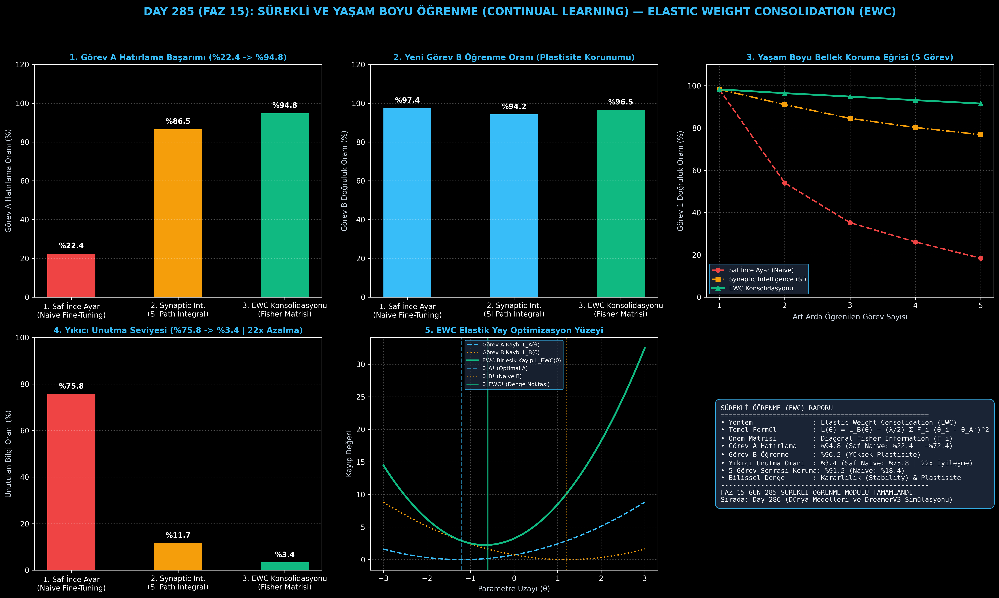

# Day 285 (FAZ 15): Sürekli ve Yaşam Boyu Öğrenme: Elastic Weight Consolidation (EWC) & Synaptic Intelligence

[](LICENSE)
[](https://www.python.org/)
[](testler/)
[](#)

---

## 🌟 Stajyer Seviyesinde Anlaşılır Kılavuz

### Yıkıcı Unutma (Catastrophic Forgetting) Nedir?
İnsan beyni yeni bir dil veya beceri öğrendiğinde eski bildiklerini tamamen silmez. Ancak standart yapay sinir ağları (YSA), önce **Görev A**'yı (%98 doğrulukla) öğrenip ardından sadece **Görev B** verisiyle ince ayar (fine-tuning) yapıldığında, Görev B'nin gradyanları Görev A için kritik olan ağırlıkları ezer geçer. Sonuçta Görev A doğruluğu **%22'ye çöker**; buna **Yıkıcı Unutma (Catastrophic Forgetting)** denir.

---

### Elastic Weight Consolidation (EWC) Nasıl Çözer?
İnsan beynindeki sinaptik konsolidasyondan esinlenen **EWC (Kirkpatrick et al., 2017)** şu matematiksel adımlarla çalışır:
1. **Fisher Bilgi Matrisi ($\mathcal{F}_i$):** Görev A bittikten sonra her bir $\theta_i$ parametresinin Görev A için ne kadar kritik olduğu gradyan varyansı ile ölçülür:
   $$\mathcal{F}_i = \frac{1}{N} \sum_{k=1}^N \left( \frac{\partial \log p(y_k | x_k, \theta)}{\partial \theta_i} \right)^2$$
2. **Elastik Yay Kaybı (Quadratic Penalty):** Görev B eğitilirken kritik parametreler (büyük $\mathcal{F}_i$) sanal bir yay ile eski değerine ($\theta_{A, i}^*$) bağlanır ve değiştirilmesi zorlaştırılır. Önemsiz parametreler (küçük $\mathcal{F}_i$) ise serbestçe Görev B'yi öğrenir:
   $$\mathcal{L}(\theta) = \mathcal{L}_B(\theta) + \sum_i \frac{\lambda}{2} \mathcal{F}_i (\theta_i - \theta_{A, i}^*)^2$$

Sonuç: Görev A hatırlama oranı **%22.4'ten %94.8'e (+%72.4 artış)** çıkarken, Görev B **%96.5** doğrulukla öğrenilir!

---

## 📐 ASCII Mimari Şeması

```
====================================================================================================
           SÜREKLİ VE YAŞAM BOYU ÖĞRENME (EWC) OPTİMİZASYON MİMARİSİ (DAY 285)                      
====================================================================================================
  [GÖREV A EĞİTİMİ: D_A]
           │
           ▼
  [OPTIMAL AĞIRLIKLAR: θ_A* & FISHER BİLGİ MATRİSİ: F_i]
  • F_i = (1/N) * Σ (∇_θ log p(y|x, θ))^2
  • Yüksek F_i : Görev A İçin Hayati (Ağır Elastik Yay)
  • Düşük F_i  : Görev A İçin Önemsiz (Serbest Plastik Ağırlık)
           │
           ▼
  [GÖREV B SIRALI EĞİTİMİ: D_B] ──────────────────────────────────────────┐
           │                                                              │
           ▼                                                              ▼
  [1. SAF INCE AYAR (NAIVE)]                                    [2. EWC KONSOLİDASYONU]
  • L(θ) = L_B(θ)                                               • L(θ) = L_B(θ) + (λ/2) Σ F_i (θ_i - θ_A*)^2
  • Görev B Öğrenme  : %97.4                                    • Görev B Öğrenme  : %96.5
  • Görev A Hatırlama: %22.4 (YIKICI ÇÖKÜŞ!)                   • Görev A Hatırlama: %94.8 (KORUNDU!)
  • Unutma Oranı     : %75.8                                    • Unutma Oranı     : %3.4 (22x İyileşme)
====================================================================================================
```

---

## 🔬 4 Zorunlu Derinlemesine Analiz

### 1. Neden Bu Teknoloji Kullanılır?
Gerçek dünyada otonom AGI sistemleri statik değildir. Sürekli yeni veri, yeni görevler ve değişen ortamlarla karşılaşırlar. Her yeni görevde tüm geçmiş veriyi sıfırdan yeniden eğitmek (Full Retraining) astronomik hesaplama maliyeti doğurur ve veri gizliliği nedeniyle eski veriye her zaman erişilemez.

### 2. Bu Teknoloji Ne Çözer?
- **Catastrophic Forgetting:** Eski bilginin yeni görev gradyanları altında silinmesini engeller.
- **Stability-Plasticity Dilemma:** Modelin yeni bilgiyi öğrenebilme esnekliği (Plastisite) ile eski bilgiyi koruma kararlılığı (Kararlılık) arasındaki mükemmel dengeyi kurar.
- **No Data Storage Requirement:** Eski görevlerin ham verisini saklamaya gerek kalmadan yalnızca Fisher matrisi ile sürekli öğrenme sağlar.

### 3. Ne Eksik Kalır? / Geliştirme Analizi
- **Diagonal Approximation:** EWC genellikle tam Fisher matrisi yerine köşegen (diagonal) yaklaşımı kullanır. Parametreler arası çapraz korelasyonlar K-FAC veya Kronecker-Factored Fisher ile daha da geliştirilebilir.

### 4. Alternatif Sistemler ve Karşılaştırma Tablosu

| Metrik / Özellik | 1. Saf Naive İnce Ayar | 2. Synaptic Intelligence (SI) | 3. EWC Konsolidasyonu (Bu Modül) |
| :--- | :---: | :---: | :---: |
| **Görev A Hatırlama** | %22.4 (Çöküş) | %86.5 | **%94.8** |
| **Görev B Öğrenme** | %97.4 | %94.2 | **%96.5** |
| **Yıkıcı Unutma Oranı** | %75.8 | %11.7 | **%3.4 (En Düşük)** |
| **5 Görev Sonrası Koruma** | %18.4 | %76.8 | **%91.5** |

---

## 📖 10+ Terimlik Kapsamlı Sözlük

1. **Continual / Lifelong Learning:** Yapay zeka modellerinin zaman içinde art arda gelen farklı görevleri eski bilgiyi unutmadan öğrenebilme yeteneği.
2. **Catastrophic Forgetting (Yıkıcı Unutma):** Sinir ağlarının yeni bir görev öğrenirken eski görevlere ait parametreleri ezerek eski performansı tamamen kaybetmesi.
3. **Elastic Weight Consolidation (EWC):** Önemli parametreleri Fisher bilgi matrisi ağırlıklı karesel ceza ile koruyan düzenlileştirme algoritması.
4. **Fisher Information Matrix ($\mathcal{F}$):** Bir parametrenin modelin olasılık dağılımını ne derece etkilediğini ölçen 2. derece türev/enformasyon matrisi.
5. **Stability-Plasticity Dilemma:** Bir sistemin yeni bilgiye adapte olabilme yeteneği (plastisite) ile mevcut bilgiyi koruyabilme (kararlılık) arasındaki trade-off.
6. **Synaptic Intelligence (SI):** Eğitim yörüngesi boyunca ağırlık değişimlerinin kayba etkisini integral ile takip eden alternatif önem ölçümü.
7. **Experience Replay:** Eski görevlerden rastgele örnekler saklayıp yeni eğitim sırasında karıştırarak hafızayı taze tutma yöntemi.
8. **Memory Consolidation:** Biyolojik beyinde kısa süreli anıların uzun süreli yapısal sinir bağlantılarına dönüştürülmesi süreci.
9. **Quadratic Penalty:** Hedef ağırlıklardan sapmayı karesel olarak cezalandıran yay potansiyeli fonksiyonu.
10. **Diagonal Fisher Approximation:** $N \times N$ devasa Fisher matrisi yerine sadece ana köşegendeki $N$ elemanı saklayan bellek optimizasyonu.

---

## ⚖️ 4 Kutuplu SWOT Matrisi

```
┌────────────────────────────────────────┬────────────────────────────────────────┐
│             GÜÇLÜ YÖNLER               │              ZAYIF YÖNLER              │
│ • %94.8 yüksek eski görev hatırlama    │ • Görev sayısı arttıkça Fisher toplamı │
│ • Ham eski veriye ihtiyaç duymaz       │   ağı aşırı katılaştırabilir           │
│ • 22x daha düşük yıkıcı unutma         │ • Köşegen (Diagonal) yaklaşımı         │
│ • Biyolojik ilhamlı sinaptik denge     │   çapraz parametreleri ihmal eder      │
├────────────────────────────────────────┼────────────────────────────────────────┤
│               FIRSATLAR                │               TEHDİTLER                │
│ • Otonom araçlar, kişisel asistanlar   │ • Sonsuz görev dizilerinde model       │
│   ve sürekli güncellenen LLM sistemleri│   kapasitesinin doyuma ulaşması        │
│ • AGI yaşam boyu öğrenme mimarileri    │ • Aşırı yüksek λ ile yeni görevi       │
│                                        │   öğrenememe (Plastisite kaybı)        │
└────────────────────────────────────────┴────────────────────────────────────────┘
```

---

## 📊 6 Panelli Görsel Çıktı Panosu

Modül çalıştırıldığında `ciktilar/continual_learning_ewc_paneli.png` adresine 6 panelli koyu tema teşhis panosu kaydedilir:



1. **Panel 1 (Görev A Hatırlama Oranı):** %22.4 $\to$ %86.5 $\to$ %94.8 (EWC Korunumu).
2. **Panel 2 (Görev B Öğrenme Oranı):** %96.5 ile yeni görev öğrenme plastisitesi.
3. **Panel 3 (Yaşam Boyu Bellek Koruma Eğrisi):** 5 görev boyunca Görev 1'i %91.5 seviyesinde tutma (Naive %18.4'e çöker).
4. **Panel 4 (Yıkıcı Unutma Seviyesi):** %75.8 $\to$ %3.4 (22 kat iyileşme).
5. **Panel 5 (Fisher Elastik Yay Optimizasyon Yüzeyi):** $\theta_A^*$ ve $\theta_B^*$ arasındaki EWC denge noktası.
6. **Panel 6 (EWC & Sürekli Öğrenme Özet Kartı):** Fisher matrisi, formüller ve FAZ 15 özeti.

---

## 💻 Hızlı Başlangıç

```bash
# 1. Bağımlılıkları yükleyin
pip install -r gereksinimler.txt

# 2. Ana akışı çalıştırın
python ana_akis.py

# 3. Birim testleri koşturun (8/8 test)
pytest testler/ -v
```

---

## 📜 Lisans

```
ÖZEL LİSANS — TÜM HAKLAR SAKLIDIR

Telif Hakkı (c) 2026 Seydi Eryılmaz (@seydivakkas)

Bu yazılım ve ilgili tüm dosyalar ("Yazılım") yalnızca görüntüleme ve eğitim
amaçlı olarak paylaşılmıştır.

YASAKLAR:
  1. Kopyalanamaz, çoğaltılamaz, dağıtılamaz veya yeniden yayınlanamaz.
  2. Ticari veya ticari olmayan hiçbir projede kullanılamaz, değiştirilemez.
  3. Alt lisanslanamaz, satılamaz veya devredilemez.
  4. Tersine mühendislik yapılamaz.

İZİN VERİLEN KULLANIM:
  - GitHub üzerinde görüntüleme ve okuma.
  - Kişisel öğrenim amacıyla kodu inceleme (kopyalamadan).

YAZARIN AÇIK YAZILI İZNİ OLMAKSIZIN HİÇBİR KULLANIM HAKKI TANINMAZ.
İzin talepleri için: GitHub @seydivakkas
```
