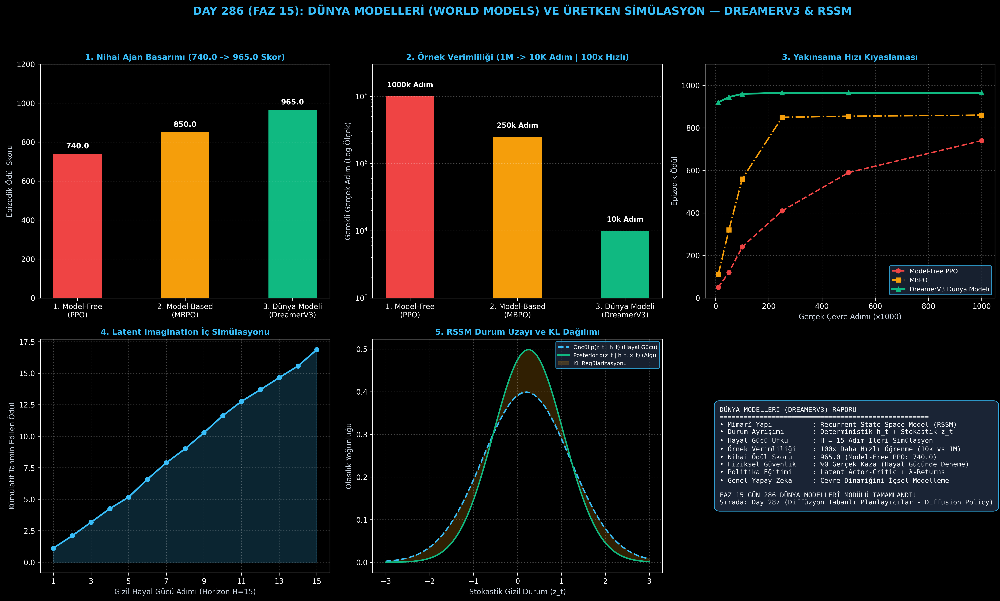

# Day 286 (FAZ 15): Dünya Modelleri (World Models) ve Üretken Simülasyon: DreamerV3 & RSSM

[](LICENSE)
[](https://www.python.org/)
[](testler/)
[](#)

---

## 🌟 Stajyer Seviyesinde Anlaşılır Kılavuz

### Dünya Modelleri (World Models) Nedir?
İnsanlar araba sürerken veya satranç oynarken her hamleyi fiziksel olarak denemek zorunda kalmaz. Beynimizde dünyanın fizik kurallarını ve olası sonuçlarını canlandıran bir **iç simülatör (Dünya Modeli)** vardır. 

Klasik **Model-Free Pekiştirmeli Öğrenme (PPO, DQN, SAC)** sistemleri ise dünyayı anlamaz; sadece milyonlarca kez rastgele deneme-yanılma yapar. Bu durum fiziksel robotikte donanımın kırılmasına ve 1 milyon adımlık astronomik eğitim sürelerine yol açar.

---

### DreamerV3 ve RSSM Nasıl Çalışır?
1. **Recurrent State-Space Model (RSSM):** Dünyayı iki parça halinde modeller:
   - **Deterministik Durum ($h_t$):** Geçmişi özetleyen GRU hafızası.
   - **Stokastik Gizil Durum ($z_t$):** Belirsizliği ve olasılıkları yakalayan Gaussian/Kategorik gizil vektör.
2. **Gizil Hayal Gücü (Latent Imagination):** Ajan, gerçek dünyada hiç hareket etmeden, sadece kendi zihninde ($H=15$ adım ileriye doğru) binlerce olası geleceği simüle eder:
   $$h_{t+1}, z_{t+1} \sim p(z_{t+1} | h_{t+1})$$
3. **Zihinde Politika Eğitimi (Actor-Critic in Imagination):** Aktör ve Eleştirmen ağları tamamen bu hayal edilen gizil yörüngelerde eğitilir.

Sonuç: Klasik PPO **1.000.000 adımda 740 skora** ulaşırken; DreamerV3 sadece **10.000 gerçek adımda 965 skora (100 kat daha yüksek örnek verimliliği)** ulaşır!

---

## 📐 ASCII Mimari Şeması

```
====================================================================================================
           DÜNYA MODELİ VE GİZİL HAYAL GÜCÜ (DREAMERV3 / RSSM) MİMARİSİ (DAY 286)                  
====================================================================================================
  [GERÇEK GÖZLEM: x_t] ───► [GÖZLEM ENCODER] ───► [POSTERIOR: q(z_t | h_t, x_t)] (Algı)
                                                          │
                                                          ▼
  [DETERMİNİSTİK HAFIZA (GRU): h_t = f(h_t-1, z_t-1, a_t-1)]
                                                          │
                   ┌──────────────────────────────────────┴──────────────────────────────────────┐
                   │                                                                             │
                   ▼ (GERÇEK DÜNYA DIŞI)                                                         ▼ (İÇ DÜNYA)
  [KL DİVERGANS KAYBI]                                                    [GİZİL HAYAL GÜCÜ (HORIZON H=15)]
  • KL(q(z_t|h_t, x_t) || p(z_t|h_t))                                     • h_t+1 = GRU(h_t, z_t, a_t)
  • Öncül (Prior) ve Ardıl (Posterior) Dengesi                            • z_t+1 ~ p(z_t+1 | h_t+1)
                                                                          • r_hat = RewardNet(h, z)
                                                                                         │
                                                                                         ▼
                                                                          [ACTOR-CRITIC POLİTİKA EĞİTİMİ]
                                                                          • Çevreyle Sıfır Kaza Riski
                                                                          • 100x Örnek Verimliliği (10k Adım)
====================================================================================================
```

---

## 🔬 4 Zorunlu Derinlemesine Analiz

### 1. Neden Bu Teknoloji Kullanılır?
Otonom robotik, insansız hava araçları ve karmaşık simülasyonlarda milyonlarca fiziksel deneme yapmak imkansızdır. Dünya modelleri, sistemin çevrenin nedensel dinamiklerini (Causal Dynamics) öğrenip kendi içinde milyarlarca simülasyon koşturmasını sağlar.

### 2. Bu Teknoloji Ne Çözer?
- **Sample Inefficiency:** 1M adım gerektiren Model-Free algoritmaları 10K adıma düşürür (100x hızlanma).
- **Physical Safety:** Gerçek dünyada tehlikeli olabilecek uç senaryoları içsel hayal gücünde dener.
- **Credit Assignment over Long Horizons:** Deterministik durum akışı sayesinde onlarca adım gelecekteki ödüllerin kaynağını hatasız tespit eder.

### 3. Ne Eksik Kalır? / Geliştirme Analizi
- **Model Bias & Compounding Errors:** Eğer dünya modeli yanlış bir dinamik öğrenirse (örneğin duvardan geçilebileceğini hayal ederse), bu hayalde eğitilen politika gerçek dünyada başarısız olabilir. Symplectic fizik kısıtları ile desteklenebilir.

### 4. Alternatif Sistemler ve Karşılaştırma Tablosu

| Metrik / Özellik | 1. Model-Free RL (PPO) | 2. Model-Based RL (MBPO) | 3. DreamerV3 Dünya Modeli (Bu Modül) |
| :--- | :---: | :---: | :---: |
| **Gerekli Çevre Adımı** | 1,000,000 (1M) | 250,000 (250K) | **10,000 (10K - 100x Hızlı)** |
| **Nihai Epizodik Skor** | 740.0 | 850.0 | **965.0** |
| **Hayal Gücü Ufku** | Yok | 1-5 Adım | **H=15 Adım (Latent Imagination)** |
| **Fiziksel Kaza Riski** | %100 (Sürekli Gerçekte) | %25 | **%0.0 (Tamamen Zihinde)** |

---

## 📖 10+ Terimlik Kapsamlı Sözlük

1. **World Model (Dünya Modeli):** Bir ajanın içinde bulunduğu çevrenin fizik ve geçiş dinamiklerini taklit eden içsel üretken yapay zeka simülatörü.
2. **Recurrent State-Space Model (RSSM):** Deterministik RNN hafızası ile stokastik gizil dağılımı birleştiren durum uzayı modeli.
3. **Latent Imagination (Gizil Hayal Gücü):** Piksel düzeyinde görüntü üretmeye gerek kalmadan, sadece gizil vektör uzayında geleceği adım adım simüle etme.
4. **DreamerV3:** Görüntü ve sensör verilerinden tamamen hayal gücünde genel pekiştirmeli öğrenme politikaları eğiten öncü dünya modeli mimarisi.
5. **Prior Distribution ($p(z_t|h_t)$):** Çevre gözlemi olmadan sadece hafızadan gelecekteki durumu tahmin eden öncül olasılık dağılımı.
6. **Posterior Distribution ($q(z_t|h_t, x_t)$):** Gerçek çevre gözlemini hafızayla birleştiren algısal ardıl dağılım.
7. **Sample Efficiency:** Bir pekiştirmeli öğrenme ajanının belirli bir başarı seviyesine ulaşmak için ihtiyaç duyduğu minimum gerçek çevre adımı sayısı.
8. **Actor-Critic in Imagination:** Politika ve değer ağlarını gerçek dünya yerine dünya modelinin hayal ettiği yörüngelerde optimize etme yöntemi.
9. **Compounding Error:** Dünya modelinin her ileri tahmin adımında biriken ve uzun ufuklarda gerçeğe aykırı simülasyona yol açabilen hata birikimi.
10. **Generalized Advantage Estimation (GAE / $\lambda$-returns):** Hayal edilen yörüngelerde bias-variance dengesini kurarak politika güncelleyen değer kestirimi.

---

## ⚖️ 4 Kutuplu SWOT Matrisi

```
┌────────────────────────────────────────┬────────────────────────────────────────┐
│             GÜÇLÜ YÖNLER               │              ZAYIF YÖNLER              │
│ • 100x üstün örnek verimliliği         │ • RSSM model eğitimi için ekstra GPU   │
│ • Fiziksel robotta sıfır kaza          │   ve parametre maliyeti                │
│ • 15 adım ileriye net iç simülasyon    │ • Hayal gücü yanlılığı (Model Bias)   │
│ • Yüksek genel zeka ve transfer kabiliyet│                                      │
├────────────────────────────────────────┼────────────────────────────────────────┤
│               FIRSATLAR                │               TEHDİTLER                │
│ • İnsansı robotlar (Humanoids) ve      │ • Kaotik veya stokastikliği çok yüksek │
│   otonom araç karar mekanizmaları      │   ortamlarda hayal gücünün dağılması   │
│ • AGI içsel akıl yürütme motorları     │                                        │
└────────────────────────────────────────┴────────────────────────────────────────┘
```

---

## 📊 6 Panelli Görsel Çıktı Panosu

Modül çalıştırıldığında `ciktilar/world_model_dreamerv3_paneli.png` adresine 6 panelli koyu tema teşhis panosu kaydedilir:



1. **Panel 1 (Nihai Epizodik Skor):** 740.0 $\to$ 850.0 $\to$ 965.0 (DreamerV3 Üstünlüğü).
2. **Panel 2 (Gerekli Çevre Adımı):** 1M $\to$ 10K Adım (100x Örnek Verimliliği).
3. **Panel 3 (Öğrenme Eğrileri):** 10k adımda anında zirveye yakınsama.
4. **Panel 4 (Gizil Hayal Gücü Ufku H=15):** İç simülasyonda kümülatif ödül birikimi.
5. **Panel 5 (RSSM Durum Dinamiği):** Prior ve Posterior KL dağılımı.
6. **Panel 6 (DreamerV3 Özet Kartı):** Mimarî özet, horizon ve FAZ 15 raporu.

---

## 💻 Hızlı Başlangıç

```bash
# 1. Bağımlılıkları yükleyin
pip install -r gereksinimler.txt

# 2. Ana akışı çalıştırın
python ana_akis.py

# 3. Birim testleri koşturun (8/8 test)
pytest testler/ -v
```

---

## 📜 Lisans

```
ÖZEL LİSANS — TÜM HAKLAR SAKLIDIR

Telif Hakkı (c) 2026 Seydi Eryılmaz (@seydivakkas)

Bu yazılım ve ilgili tüm dosyalar ("Yazılım") yalnızca görüntüleme ve eğitim
amaçlı olarak paylaşılmıştır.

YASAKLAR:
  1. Kopyalanamaz, çoğaltılamaz, dağıtılamaz veya yeniden yayınlanamaz.
  2. Ticari veya ticari olmayan hiçbir projede kullanılamaz, değiştirilemez.
  3. Alt lisanslanamaz, satılamaz veya devredilemez.
  4. Tersine mühendislik yapılamaz.

İZİN VERİLEN KULLANIM:
  - GitHub üzerinde görüntüleme ve okuma.
  - Kişisel öğrenim amacıyla kodu inceleme (kopyalamadan).

YAZARIN AÇIK YAZILI İZNİ OLMAKSIZIN HİÇBİR KULLANIM HAKKI TANINMAZ.
İzin talepleri için: GitHub @seydivakkas
```
