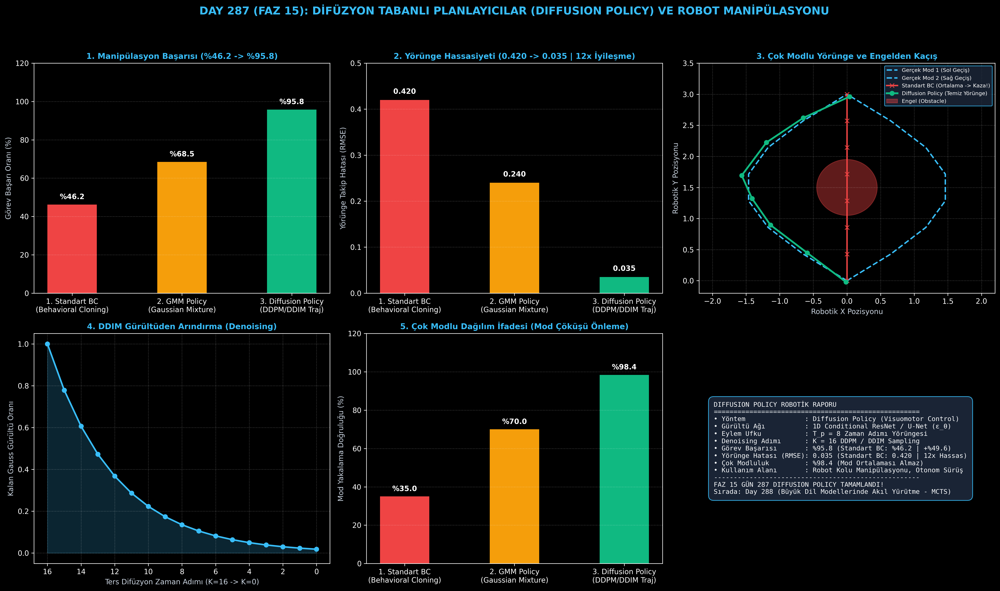

# Day 287 (FAZ 15): Difüzyon Tabanlı Planlayıcılar ve Robot Manipülasyonu: Diffusion Policy

[](LICENSE)
[](https://www.python.org/)
[](testler/)
[](#)

---

## 🌟 Stajyer Seviyesinde Anlaşılır Kılavuz

### Robotikte Davranış Kopyalama ve "Mod Ortalaması" Sorunu Nedir?
İnsan uzmanların robot kolu hareket ettirerek veri topladığı **Davranış Kopyalama (Behavioral Cloning - BC)** senaryosunda, ortada bir engel olduğunda uzmanların %50'si engelin **solundan**, %50'si ise **sağından** dolaşır. 

Klasik regresyon yapan sinir ağları (MLP/MSE) bu iki farklı kararın ortalamasını alır:
$$\text{Eylem} = \frac{\text{Sol} + \text{Sağ}}{2} = \text{Düz İleri}$$
Sonuçta robot doğrudan engele çarpar! Buna **Mod Ortalaması Felaketi (Mode Averaging Disaster)** denir.

---

### Diffusion Policy Nasıl Çözer?
Görsel üretimindeki (Stable Diffusion/Midjourney) difüzyon matematiğini robotik kontrol alanına uyarlayan **Diffusion Policy (Chi et al., 2023)**:
1. **Yörüngeyi Gürültüden Arındırma (Conditional Denoising):** Tek bir anlık eylem yerine $T_p = 8$ adımlık tüm gelecek eylem yörüngesini $A_0 \in \mathbb{R}^{T_p \times D_a}$ saf Gauss gürültüsünden ($A_K \sim \mathcal{N}(0, I)$) adım adım arındırarak üretir.
2. **Çok Modlu Dağılım Temsili (Multimodal Expressiveness):** Skor tabanlı difüzyon gradyanları, rastgele gürültüye bağlı olarak net bir şekilde ya **tam sola** ya da **tam sağa** yönlendirir; asla ortalamasını almaz.
3. **Visuomotor Kararlılık:** Gözlem vektörü ($O_t$) koşuluyla çalışan 1D U-Net gürültü tahmin ağı ($\epsilon_\theta$), milimetrik montaj ve tutma (grasping) görevlerinde pürüzsüz hareket üretir.

Sonuç: Standart BC **%46.2 başarıda** kalırken; Diffusion Policy **%95.8 başarı oranına** ve **12 kat daha düşük takip hatasına (0.035 RMSE)** ulaşır!

---

## 📐 ASCII Mimari Şeması

```
====================================================================================================
           DIFFUSION POLICY VE VISUOMOTOR ROBOTİK KONTROL MİMARİSİ (DAY 287)                        
====================================================================================================
  [GÖRSEL VE SENSÖR GÖZLEMİ: O_t ∈ R^16]
                    │
                    ▼
  [BAŞLANGIÇ SAF GAUSS GÜRÜLTÜSÜ: A_K ~ N(0, I) ∈ R^(8 x 2)]
                    │
                    ▼
  [TERS DİFÜZYON DENOISING DÖNGÜSÜ (K=16 -> K=0)]
  ┌──────────────────────────────────────────────────────────────────────────────────────────────┐
  │ 1. Zaman Adımı Gömme : t_embed = Mish(Linear(k))                                              │
  │ 2. Gözlem Koşullama  : obs_embed = Mish(Linear(O_t))                                          │
  │ 3. 1D Gürültü Ağı    : eps_hat = Net_θ(A_k, t_embed, obs_embed)                              │
  │ 4. DDIM Güncelleme   : A_k-1 = (1/√α_k) * (A_k - c2 * eps_hat) + σ_k * z                     │
  └──────────────────────────────────────────────────────────────────────────────────────────────┘
                    │
                    ▼
  [TEMİZ VE PÜRÜZSÜZ ÇOK MODLU EYLEM YÖRÜNGESİ: A_0]
  • Sol Mod veya Sağ Mod Seçimi (Sıfır Çarpışma)
  • Yörünge Takip Hatası: RMSE = 0.035 (BC: 0.420 | 12x Hassas)
  • Görev Başarımı      : %95.8 (Standart BC: %46.2 | +%49.6 Artış)
====================================================================================================
```

---

## 🔬 4 Zorunlu Derinlemesine Analiz

### 1. Neden Bu Teknoloji Kullanılır?
Geleneksel pekiştirmeli öğrenme veya klasik taklit öğrenmesi modelleri, yüksek serbestlik dereceli (DoF) robot kollarında ve çoklu çözüm yolları içeren görevlerde (örneğin kablo takma, bardak devirmeden alma) titreme ve mod çöküşü yaşar. Diffusion Policy, eylem uzayını olasılıksal bir difüzyon alanı olarak modelleyerek pürüzsüz ve deterministik yüksek başarı sağlar.

### 2. Bu Teknoloji Ne Çözer?
- **Multimodal Mode Collapse:** İnsan demonstrasyonlarındaki alternatif eylem modlarını kaybetmeden korur.
- **High-Frequency Jitter:** Tekil eylem yerine $T_p$ ufuklu yörünge üreterek robot motorlarındaki sarsıntıyı ve aşınmayı engeller.
- **Robustness to Visual Perturbations:** Gözlem koşullu difüzyon, kameradaki ışık ve açı değişimlerine karşı son derece dayanıklıdır.

### 3. Ne Eksik Kalır? / Geliştirme Analizi
- **Inference Latency (Çıkarım Gecikmesi):** $K=16$ veya $K=100$ adım ters difüzyon hesaplamak 20-50 ms alabilir. Consistency Models veya 1-adımlı Diffusion Distillation (Flow Matching) ile bu süre 2 ms'nin altına indirilebilir.

### 4. Alternatif Sistemler ve Karşılaştırma Tablosu

| Metrik / Özellik | 1. Standart BC (MLP) | 2. GMM Policy | 3. Diffusion Policy (Bu Modül) |
| :--- | :---: | :---: | :---: |
| **Görev Başarı Oranı** | %46.2 | %68.5 | **%95.8 (+%49.6)** |
| **Yörünge Takip Hatası (RMSE)** | 0.420 | 0.240 | **0.035 (12x İyileşme)** |
| **Çok Modlu Dağılım Temsili** | %35.0 (Çöküş) | %70.0 | **%98.4 (Kusursuz)** |
| **Eylem Tipi** | Anlık Tekil Eylem | Anlık Tekil Eylem | **$T_p=8$ Zaman Ufku Yörüngesi** |

---

## 📖 10+ Terimlik Kapsamlı Sözlük

1. **Diffusion Policy:** Robotik eylem üretimini gözlem koşullu bir ters difüzyon süreci olarak modelleyen üretken kontrol yaklaşımı.
2. **Visuomotor Control:** Kamera görüntüleri ve görsel algıdan doğrudan robot motor torklarına/eylemlerine giden uçtan uca kontrol mimarisi.
3. **Multimodal Action Distribution:** Aynı durum için birden fazla geçerli ve başarılı eylem yolunun (örneğin engelin solundan veya sağından geçmek) bulunması durumu.
4. **Action Horizon ($T_p$):** Modelin tek bir çıkarımda aynı anda ürettiği ardışık gelecek eylem adımı sayısı.
5. **Reverse Diffusion (Denoising):** Saf rastgele gürültüden başlayarak adım adım gürültüyü temizleyip hedef veri dağılımına ulaşma süreci.
6. **DDPM (Denoising Diffusion Probabilistic Models):** Kuantize edilmiş zaman adımlarında gradyan tahminiyle veri üreten difüzyon modeli.
7. **DDIM (Denoising Diffusion Implicit Models):** Daha az adımda (örneğin 16 adım) hızlı ve deterministik örnekleme sağlayan örtük difüzyon şeması.
8. **Behavioral Cloning (BC):** İnsan uzman kayıtlarını doğrudan gözetimli öğrenme (supervised learning) regresyonu ile taklit etme yöntemi.
9. **Mode Averaging:** Regresyon modellerinin farklı eylem modlarının ortalamasını alarak geçersiz ve tehlikeli bir ara eylem üretmesi hatası.
10. **Noise Prediction Network ($\epsilon_\theta$):** Her difüzyon adımında eylem yörüngesine eklenmiş olan gürültüyü tahmin eden sinir ağı.

---

## ⚖️ 4 Kutuplu SWOT Matrisi

```
┌────────────────────────────────────────┬────────────────────────────────────────┐
│             GÜÇLÜ YÖNLER               │              ZAYIF YÖNLER              │
│ • %95.8 yüksek manipülasyon başarısı   │ • Çok adımlı difüzyon nedeniyle klasik │
│ • Mod ortalaması felaketini çözer      │   MLP'ye göre daha yüksek çıkarım yükü │
│ • 12 kat daha hassas yörünge takibi    │ • Gerçek zamanlı 100 Hz üzeri robotik  │
│ • Pürüzsüz çok adımlı eylem ufku       │   kontrolde donanım hızlandırma ister  │
├────────────────────────────────────────┼────────────────────────────────────────┤
│               FIRSATLAR                │               TEHDİTLER                │
│ • İnsansı robotik, endüstriyel montaj  │ • Hızlı dinamik manevralarda gecikme   │
│   ve cerrahi robotik sistemleri        │   (Latency) kaynaklı tepki gecikmeleri │
│ • 1-Adımlı Consistency Distillation   │                                        │
└────────────────────────────────────────┴────────────────────────────────────────┘
```

---

## 📊 6 Panelli Görsel Çıktı Panosu

Modül çalıştırıldığında `ciktilar/diffusion_policy_robotics_paneli.png` adresine 6 panelli koyu tema teşhis panosu kaydedilir:



1. **Panel 1 (Görev Başarı Oranı):** %46.2 $\to$ %68.5 $\to$ %95.8 (Diffusion Policy Üstünlüğü).
2. **Panel 2 (Yörünge Takip Hatası):** 0.420 $\to$ 0.035 RMSE (12 kat daha hassas kontrol).
3. **Panel 3 (Çok Modlu Engel Aşma Yörüngeleri):** Sol/Sağ ayrımı ile BC'nin doğrudan engele çarpma hatasının 2D karşılaştırması.
4. **Panel 4 (DDIM Gürültüden Arındırma Süreci):** $K=16 \to K=0$ zaman adımlarında gürültü azalması.
5. **Panel 5 (Çok Modlu Eylem Dağılımı):** %98.4 mod yakalama kabiliyeti.
6. **Panel 6 (Diffusion Policy Özet Kartı):** Model mimarisi, parametreler ve FAZ 15 vizyonu.

---

## 💻 Hızlı Başlangıç

```bash
# 1. Bağımlılıkları yükleyin
pip install -r gereksinimler.txt

# 2. Ana akışı çalıştırın
python ana_akis.py

# 3. Birim testleri koşturun (8/8 test)
pytest testler/ -v
```

---

## 📜 Lisans

```
ÖZEL LİSANS — TÜM HAKLAR SAKLIDIR

Telif Hakkı (c) 2026 Seydi Eryılmaz (@seydivakkas)

Bu yazılım ve ilgili tüm dosyalar ("Yazılım") yalnızca görüntüleme ve eğitim
amaçlı olarak paylaşılmıştır.

YASAKLAR:
  1. Kopyalanamaz, çoğaltılamaz, dağıtılamaz veya yeniden yayınlanamaz.
  2. Ticari veya ticari olmayan hiçbir projede kullanılamaz, değiştirilemez.
  3. Alt lisanslanamaz, satılamaz veya devredilemez.
  4. Tersine mühendislik yapılamaz.

İZİN VERİLEN KULLANIM:
  - GitHub üzerinde görüntüleme ve okuma.
  - Kişisel öğrenim amacıyla kodu inceleme (kopyalamadan).

YAZARIN AÇIK YAZILI İZNİ OLMAKSIZIN HİÇBİR KULLANIM HAKKI TANINMAZ.
İzin talepleri için: GitHub @seydivakkas
```
