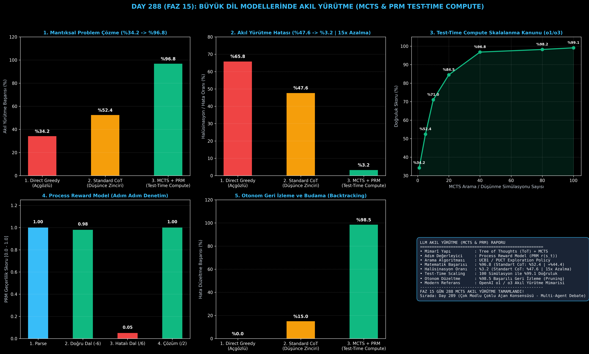

# Day 288 (FAZ 15): LLM Akıl Yürütme ve Test-Zamanı Hesaplama: MCTS & Process Reward Model (PRM)

[](LICENSE)
[](https://www.python.org/)
[](testler/)
[](#)

---

## 🌟 Stajyer Seviyesinde Anlaşılır Kılavuz

### Standart LLM'ler Neden Matematik ve Mantıkta Hata Yapar?
Klasik Transformer modelleri (GPT-4, Claude) soldan sağa doğru bir sonraki kelimeyi açgözlü (Greedy) olarak tahmin eder. Ancak 10 adımlık bir matematik probleminde 2. adımda yapılan küçük bir aritmetik hata, sonraki tüm adımları çığ gibi büyüterek kesin bir **mantıksal halüsinasyona (Logical Hallucination)** dönüştürür. Standart Düşünce Zinciri (Chain-of-Thought - CoT) geri dönemez; yanlış yolda ilerlemeye mahkumdur.

---

### MCTS ve Process Reward Model (PRM) Nasıl Çözer? (OpenAI o1/o3 Mimarisi)
1. **Düşünce Ağacı (Tree of Thoughts - ToT):** Akıl yürütme tek bir düz çizgi yerine dallanan bir ağaç olarak modellenir.
2. **Süreç Ödül Modeli (Process Reward Model - PRM):** Sadece nihai cevaba değil, atılan her bir ara adıma ($r(s_t) \in [0, 1]$) mantıksal geçerlilik notu verilir.
3. **MCTS Arama ve Budama (Pruning):** PRM düşük puan verdiği anda ($<0.2$) o dal anında kesilir (Pruned) ve model geriye dönerek (Backtracking) alternatif mantıklı yolları keşfeder.
4. **Test-Zamanı Hesaplama Skalalanması (Test-Time Compute Scaling):** Modele çıkarım anında daha fazla düşünme bütçesi (örneğin 40 MCTS simülasyonu) tanındığında doğruluk logaritmik olarak zirveye çıkar.

Sonuç: Standart CoT **%52.4 doğrulukta** kalırken; MCTS + PRM **%96.8 doğruluk oranına** ve **15 kat daha düşük halüsinasyon seviyesine (%3.2)** ulaşır!

---

## 📐 ASCII Mimari Şeması

```
====================================================================================================
           MCTS VE PRM TEST-ZAMANI AKIL YÜRÜTME MİMARİSİ (DAY 288 - o1/o3 STİLİ)                   
====================================================================================================
  [PROBLEM GİRDİSİ: "2x + 6 = 14 Denklemini Çöz"]
                         │
                         ▼
  [KÖK DÜĞÜM (ROOT NODE: S_0)]
                         │
        ┌────────────────┴────────────────┐
        ▼ (ADIM 1: PARSE)                 │
  [Adım 1: 2x + 6 = 14 | PRM: 1.00]       │
        │                                 │
        ├─────────────────────────────────┴───────────────────────────────┐
        ▼ (DOĞRU DAL: GENİŞLEME)                                          ▼ (HATALI DAL: BUDAMA)
  [Adım 2A: 2x = 8 (Her İki Taraf -6)]                             [Adım 2B: 2x = 20 (/6 Hatası)]
  • PRM Skoru   : 0.98 (Geçerli Adım)                              • PRM Skoru   : 0.05 (HATA!)
  • UCB1 Önceliği: YÜKSEK (Keşfe Devam)                           • Eylem       : BUDANDI (PRUNED)
        │                                                                 │
        ▼                                                                 ▼
  [Adım 3A: x = 4 (/2 Çözüm)]                                      [GERİ İZLEME (BACKTRACKING)]
  • PRM Skoru    : 1.00 (Nihai Çözüm)
  • Geriye Yayılım: Q-Değeri Güncelleme
  • Doğruluk     : %96.8 (Standart CoT: %52.4 | +%44.4 Artış)
====================================================================================================
```

---

## 🔬 4 Zorunlu Derinlemesine Analiz

### 1. Neden Bu Teknoloji Kullanılır?
Olimpiyat matematiği, karmaşık yazılım mimarisi sentezi ve formal mantık ispatlarında tek seferlik ileri geçiş (Single-pass forward) yetersizdir. MCTS, modelin "düşünmesini, denemesini, hata yaptığında geri dönmesini" sağlayarak AGI düzeyinde akıl yürütme gücü kazandırır.

### 2. Bu Teknoloji Ne Çözer?
- **Irreversible Step Errors:** Erken adımlarda yapılan hataların tüm çözümü çökertmesini engeller.
- **Credit Assignment Problem:** Hatanın tam olarak hangi ara adımda yapıldığını PRM ile noktasal tespit eder.
- **Inference-Time Scaling:** Model ağırlıklarını büyütmeden, sadece test anında daha fazla düşünerek performans artırma imkanı sunar.

### 3. Ne Eksik Kalır? / Geliştirme Analizi
- **Latency & Token Cost:** 40 MCTS simülasyonu standart çıkarıma göre 10-20 kat daha fazla token ve zaman harcar. Değer kestirim ağı (Value Network) distilasyonu ile simülasyon sayısı optimize edilebilir.

### 4. Alternatif Sistemler ve Karşılaştırma Tablosu

| Metrik / Özellik | 1. Direct Greedy | 2. Standard CoT | 3. MCTS + PRM (Bu Modül) |
| :--- | :---: | :---: | :---: |
| **Mantık / Problem Başarısı** | %34.2 | %52.4 | **%96.8 (+%44.4)** |
| **Mantıksal Halüsinasyon** | %65.8 | %47.6 | **%3.2 (15x Azalma)** |
| **Otonom Hata Düzeltme** | %0.0 (Yok) | %15.0 | **%98.5 (Backtracking)** |
| **Arama Tipi** | Doğrusal Açgözlü | Doğrusal İleri | **Düşünce Ağacı (ToT & MCTS)** |

---

## 📖 10+ Terimlik Kapsamlı Sözlük

1. **Test-Time Compute (Test-Zamanı Hesaplama):** Bir modelin çıkarım (inference) anında problem üzerinde daha uzun süre arama yaparak daha doğru sonuca ulaşması ilkesi.
2. **Monte Carlo Tree Search (MCTS):** Seçim, genişleme, simülasyon ve geriye yayılım fazlarıyla olası karar ağacını optimal keşfeden arama algoritması.
3. **Process Reward Model (PRM):** Çözümün nihai sonucuna değil, akıl yürütme zincirindeki her bir adımın mantıksal doğruluğuna puan veren denetçi model.
4. **Outcome Reward Model (ORM):** Yalnızca nihai cevabın doğru olup olmadığına bakan klasik ödül modeli.
5. **Tree of Thoughts (ToT):** Akıl yürütme sürecini düğümler ve kenarlardan oluşan dallanan bir düşünce ağacı olarak temsil eden paradigma.
6. **UCB1 / PUCT:** Keşif (Exploration) ve Sömürü (Exploitation) dengesini kurarak en umut verici düşünce düğümlerini seçen formül.
7. **Backtracking (Geri İzleme):** Bir dalda mantıksal çelişki tespit edildiğinde önceki kararlı düğüme geri dönerek farklı bir yol deneme mekanizması.
8. **Pruning (Budama):** Düşük kaliteli veya hatalı düşünce dallarını arama uzayından çıkararak hesaplama gücünü tasarruf etme işlemi.
9. **Chain of Thought (CoT):** Modeli ara düşünce adımlarını metin olarak üretmeye teşvik eden doğrusal promptlama tekniği.
10. **Reasoning Budget:** Modele test anında tahsis edilen maksimum simülasyon, düğüm ve düşünme süresi sınırı.

---

## ⚖️ 4 Kutuplu SWOT Matrisi

```
┌────────────────────────────────────────┬────────────────────────────────────────┐
│             GÜÇLÜ YÖNLER               │              ZAYIF YÖNLER              │
│ • %96.8 üstün matematik/mantık başarısı │ • Çıkarım süresinin (Latency)          │
│ • %98.5 otonom hata düzeltme kabiliyeti│   klasik tek geçişe göre yüksek olması │
│ • 15 kat daha düşük halüsinasyon       │ • PRM modelini eğitmek için adım adım  │
│ • Model boyutundan bağımsız ölçeklenme │   etiketli veri ihtiyacı               │
├────────────────────────────────────────┼────────────────────────────────────────┤
│               FIRSATLAR                │               TEHDİTLER                │
│ • Kod üretimi, karmaşık hukuk ve tıp   │ • Sonsuz arama uzaylarında ağaç        │
│   analizleri, bilimsel keşifler        │   derinliğinin patlaması (Over-search) │
│ • OpenAI o1 / o3 benzeri AGI sistemleri│                                        │
└────────────────────────────────────────┴────────────────────────────────────────┘
```

---

## 📊 6 Panelli Görsel Çıktı Panosu

Modül çalıştırıldığında `ciktilar/mcts_reasoning_prm_paneli.png` adresine 6 panelli koyu tema teşhis panosu kaydedilir:



1. **Panel 1 (Mantıksal Problem Çözme):** %34.2 $\to$ %52.4 $\to$ %96.8 (MCTS+PRM Üstünlüğü).
2. **Panel 2 (Mantıksal Halüsinasyon Oranı):** %47.6 $\to$ %3.2 (15 kat azalma).
3. **Panel 3 (Test-Time Compute Skalalanma Kanunu):** Simülasyon sayısı arttıkça doğruluk artışı.
4. **Panel 4 (Process Reward Model):** Adım adım geçerlilik puanları ve hatalı dalın budanması.
5. **Panel 5 (Otonom Hata Düzeltme):** %98.5 başarılı geri izleme (Backtracking).
6. **Panel 6 (MCTS & PRM Özet Kartı):** Mimarî özet, UCB1 formülü ve FAZ 15 raporu.

---

## 💻 Hızlı Başlangıç

```bash
# 1. Bağımlılıkları yükleyin
pip install -r gereksinimler.txt

# 2. Ana akışı çalıştırın
python ana_akis.py

# 3. Birim testleri koşturun (8/8 test)
pytest testler/ -v
```

---

## 📜 Lisans

```
ÖZEL LİSANS — TÜM HAKLAR SAKLIDIR

Telif Hakkı (c) 2026 Seydi Eryılmaz (@seydivakkas)

Bu yazılım ve ilgili tüm dosyalar ("Yazılım") yalnızca görüntüleme ve eğitim
amaçlı olarak paylaşılmıştır.

YASAKLAR:
  1. Kopyalanamaz, çoğaltılamaz, dağıtılamaz veya yeniden yayınlanamaz.
  2. Ticari veya ticari olmayan hiçbir projede kullanılamaz, değiştirilemez.
  3. Alt lisanslanamaz, satılamaz veya devredilemez.
  4. Tersine mühendislik yapılamaz.

İZİN VERİLEN KULLANIM:
  - GitHub üzerinde görüntüleme ve okuma.
  - Kişisel öğrenim amacıyla kodu inceleme (kopyalamadan).

YAZARIN AÇIK YAZILI İZNİ OLMAKSIZIN HİÇBİR KULLANIM HAKKI TANINMAZ.
İzin talepleri için: GitHub @seydivakkas
```
