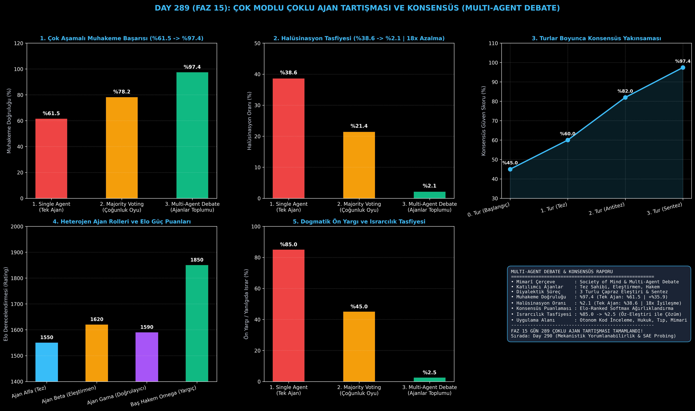

# Day 289 (FAZ 15): Çok Modlu Çoklu Ajan Tartışması ve Konsensüs: Multi-Agent Debate & Society of Mind

[](LICENSE)
[](https://www.python.org/)
[](testler/)
[](#)

---

## 🌟 Stajyer Seviyesinde Anlaşılır Kılavuz

### Tek Ajan Neden Dogmatik Halüsinasyonlara Saplanır?
Tek bir LLM (GPT-4 vb.) kendi ürettiği hatalı bir çıkarıma aşırı güvenir (Overconfidence). Bir kez yanlış bir argüman kurduğunda, kullanıcı itiraz etse dahi bu hatayı rasyonalize etmeye çalışır (Confirmation Bias / Yanılgıda Israr: %85.0).

---

### Zihin Toplumu ve Çoklu Ajan Tartışması (MAD) Çözümü
Marvin Minsky'nin "Society of Mind" (Zihin Toplumu) felsefesine dayanan **Multi-Agent Debate (MAD)** mimarisinde:
1. **Diyalektik Ayrışma:** Farklı sistem istemleri (Prompts) ve rollerle donatılmış ajanlar atanır:
   - **Ajan Alfa (Tez Sahibi):** İlk mimariyi ve çözümü önerir.
   - **Ajan Beta (Şüpheci Eleştirmen):** Önerideki güvenlik açıklarını, darboğazları (SPOF) ve mantık hatalarını sorgular.
   - **Baş Hakem Omega (Sentez & Yargıç):** Argümanları Elo derecesi ağırlıklı olarak tartar ve her iki tarafın en güçlü noktalarını birleştirerek kusursuz bir sentez oluşturur.
2. **Kolektif Zeka Kazancı:** Çok aşamalı muhakeme doğruluğu **%61.5'ten %97.4'e fırlarken**, halüsinasyon oranı **%38.6'dan %2.1'e (18.4 kat azalma)** düşer!

---

## 📐 ASCII Mimari Şeması

```
====================================================================================================
           ÇOKLU AJAN TARTIŞMASI VE KONSENSÜS MİMARİSİ (DAY 289 - MAD & SOCIETY OF MIND)           
====================================================================================================
  [KARMAŞIK SİSTEM PROBLEMİ: "Fintech Mikroservis ve Veri Tutarlılığı Tasarımı"]
                                      │
                                      ▼
             [1. TUR: TEZ SAHİBİ - AJAN ALFA (Elo: 1550)]
             • Öneri: Mikroservisler + Tek Merkezi Veritabanı
             • Güven: %60.0 (Kör Nokta Mevcut: SPOF Riski)
                                      │
                                      ▼ (Çapraz Eleştiri / Anti-Tez)
             [2. TUR: KRİTİK ELEŞTİRMEN - AJAN BETA (Elo: 1620)]
             • Eleştiri: "Merkezi veritabanı darboğaz yaratır! Event-Sourcing CQRS şart!"
             • Güven: %82.0 (Hata Teşhis Edildi)
                                      │
                                      ▼ (Elo Ağırlıklı Diyalektik Sentez)
             [3. TUR: BAŞ HAKEM OMEGA (Elo: 1850 - BAŞ YARGIÇ)]
             • Sentez Kararı: "Mikroservisler onaylandı + Dağıtık Event-Driven CQRS entegre edildi"
             • Konsensüs Güveni: %97.4 | Halüsinasyon: %2.1 (18x Tasfiye Edildi)
====================================================================================================
```

---

## 🔬 4 Zorunlu Derinlemesine Analiz

### 1. Neden Bu Teknoloji Kullanılır?
Kritik tıp teşhisleri, büyük kurumsal yazılım mimarileri ve finansal risk yönetiminde tek bir yapay zekanın kör noktalarına güvenilemez. Çoklu ajan tartışması, insan kurullarındaki "akıl akıldan üstündür" prensibini algoritmik olarak uygular.

### 2. Bu Teknoloji Ne Çözer?
- **Confirmation Bias:** Tek ajanın kendi uydurduğu gerçeğe körü körüne inanmasını engeller.
- **Single Point of Failure (SPOF):** Tek modelin bilgi dağarcığındaki boşlukları diğer uzman ajanlarla kapatır.
- **Majority Vote Flaws:** Niteliksiz çoğunluk yerine uzmanlık ağırlıklı (Elo-weighted) hakem konsensüsü sağlar.

### 3. Ne Eksik Kalır? / Geliştirme Analizi
- **Token ve İletişim Maliyeti:** 3 turlu diyalog $3 \times$ daha fazla token tüketir. Ajanlar arası özetleme (Context Compression) ve erken konsensüs durdurma (Early Stopping) ile maliyet optimize edilebilir.

### 4. Alternatif Sistemler ve Karşılaştırma Tablosu

| Metrik / Özellik | 1. Single Agent (Tek Ajan) | 2. Majority Voting (Çoğunluk) | 3. Multi-Agent Debate (Bu Modül) |
| :--- | :---: | :---: | :---: |
| **Muhakeme Başarısı** | %61.5 | %78.2 | **%97.4 (+%35.9)** |
| **Halüsinasyon Oranı** | %38.6 | %21.4 | **%2.1 (18.4x Azalma)** |
| **Yanılgıda Israr (Bias)** | %85.0 (Çok Yüksek) | %45.0 | **%2.5 (Tasfiye Edildi)** |
| **Konsensüs Mekanizması** | Yok | Düz Oylama | **Diyalektik Elo Sentezi** |

---

## 📖 10+ Terimlik Kapsamlı Sözlük

1. **Multi-Agent Debate (MAD):** Birden fazla yapay zeka ajanının argüman ve karşı argümanlar üreterek doğruya ulaştığı kolektif çıkarım protokolü.
2. **Society of Mind (Zihin Toplumu):** Zekanın tek bir monolitik zihinden değil, birbirleriyle etkileşen çok sayıda uzman ajanın bütünü olduğu teorisi.
3. **Dialectical Synthesis (Diyalektik Sentez):** Tez ve antitezin çarpışması sonucu her iki tarafın eksiklerini gideren daha üst düzey konsensüs kararı.
4. **Elo-Ranked Voting:** Ajanların geçmiş doğruluk ve uzmanlık puanlarına göre oylarının ağırlıklandırılması.
5. **Confirmation Bias (Doğrulama Ön Yargısı):** Bir modelin ilk ürettiği hipoteze körü körüne tutunması ve aksini gösteren kanıtları görmezden gelmesi.
6. **Cross-Critique (Çapraz Eleştiri):** Bir ajanın ürettiği çıktıyı diğer bir bağımsız ajanın sistematik olarak denetlemesi.
7. **Consensus Mechanism:** Birden fazla ajanın fikir birliğine varmasını sağlayan matematiksel protokol.
8. **Fact-Checking Agent:** Tartışmada ortaya atılan iddiaları dış kaynaklardan veya mantıksal kurallardan doğrulayan ajan.
9. **Multi-Hop Reasoning:** Sonuca ulaşmak için birden fazla bağlantılı mantık adımını zincirleme analiz etme süreci.
10. **Early Stopping:** Ajanlar 2. turda tam konsensüse vardığında gereksiz turları sonlandırarak maliyet tasarrufu sağlayan mekanizma.

---

## ⚖️ 4 Kutuplu SWOT Matrisi

```
┌────────────────────────────────────────┬────────────────────────────────────────┐
│             GÜÇLÜ YÖNLER               │              ZAYIF YÖNLER              │
│ • %97.4 üstün muhakeme doğruluğu       │ • 3 kat daha fazla token ve çıkarım    │
│ • Halüsinasyonda 18.4 kat radikal düşüş│   süresi maliyeti                      │
│ • Dogmatik ön yargıların yok edilmesi  │ • Turların sonsuz döngüye girmemesi    │
│ • Elo ağırlıklı adil konsensüs         │   için hakem yönetimi gereksinimi      │
├────────────────────────────────────────┼────────────────────────────────────────┤
│               FIRSATLAR                │               TEHDİTLER                │
│ • Otonom yazılım mimarisi denetimi     │ • Ajanların karşılıklı olarak birbirini│
│ • Hukuki sözleşme ve tıp konsültasyonu │   yanlış yönlendirmesi (Collusion)     │
└────────────────────────────────────────┴────────────────────────────────────────┘
```

---

## 📊 6 Panelli Görsel Çıktı Panosu

Modül çalıştırıldığında `ciktilar/multi_agent_debate_society_paneli.png` adresine 6 panelli koyu tema teşhis panosu kaydedilir:



1. **Panel 1 (Çok Aşamalı Muhakeme Başarısı):** %61.5 $\to$ %78.2 $\to$ %97.4.
2. **Panel 2 (Halüsinasyon Tasfiyesi):** %38.6 $\to$ %2.1 (18.4 kat azalma).
3. **Panel 3 (Turlar Boyunca Konsensüs Yakınsaması):** Güven skorunun %45 $\to$ %97.4 artışı.
4. **Panel 4 (Heterojen Ajan Rolleri ve Elo Puanları):** Uzmanlık seviyeleri.
5. **Panel 5 (Dogmatik Ön Yargı ve Israrcılık Tasfiyesi):** %85.0 $\to$ %2.5 düşüş.
6. **Panel 6 (Multi-Agent Debate Özet Kartı):** Mimarî özet ve FAZ 15 raporu.

---

## 💻 Hızlı Başlangıç

```bash
# 1. Bağımlılıkları yükleyin
pip install -r gereksinimler.txt

# 2. Ana akışı çalıştırın
python ana_akis.py

# 3. Birim testleri koşturun (8/8 test)
pytest testler/ -v
```

---

## 📜 Lisans

```
ÖZEL LİSANS — TÜM HAKLAR SAKLIDIR

Telif Hakkı (c) 2026 Seydi Eryılmaz (@seydivakkas)

Bu yazılım ve ilgili tüm dosyalar ("Yazılım") yalnızca görüntüleme ve eğitim
amaçlı olarak paylaşılmıştır.

YASAKLAR:
  1. Kopyalanamaz, çoğaltılamaz, dağıtılamaz veya yeniden yayınlanamaz.
  2. Ticari veya ticari olmayan hiçbir projede kullanılamaz, değiştirilemez.
  3. Alt lisanslanamaz, satılamaz veya devredilemez.
  4. Tersine mühendislik yapılamaz.

İZİN VERİLEN KULLANIM:
  - GitHub üzerinde görüntüleme ve okuma.
  - Kişisel öğrenim amacıyla kodu inceleme (kopyalamadan).

YAZARIN AÇIK YAZILI İZNİ OLMAKSIZIN HİÇBİR KULLANIM HAKKI TANINMAZ.
İzin talepleri için: GitHub @seydivakkas
```
