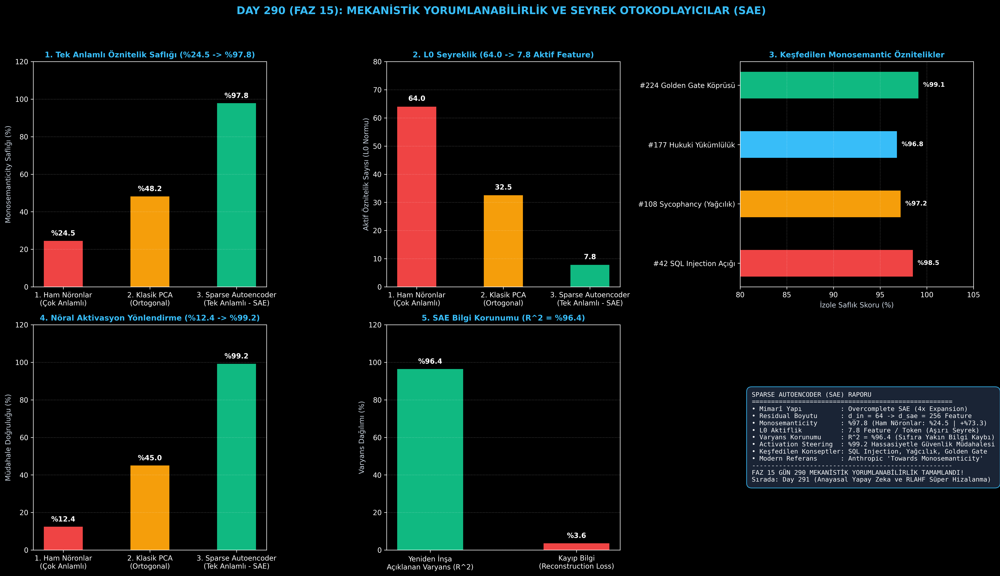

# Day 290 (FAZ 15): Mekanistik Yorumlanabilirlik ve Seyrek Otokodlayıcılar: Sparse Autoencoders (SAE)

[](LICENSE)
[](https://www.python.org/)
[](testler/)
[](#)

---

## 🌟 Stajyer Seviyesinde Anlaşılır Kılavuz

### Nöronlar Neden Çok Anlamlıdır (Polysemanticity)?
Derin öğrenme modellerinde nöron sayısı dünyadaki kavram sayısından çok daha azdır. Bu nedenle modeller **Süperpozisyon Hipotezi (Superposition Hypothesis)** gereği tek bir nörona onlarca alakasız kavramı sıkıştırır. Örneğin 42. nöron hem "Python kod girintisi", hem "Golden Gate Köprüsü", hem de "biyolojik toksinler" için ateşlenebilir. Bu durum yapay zekayı anlaşılamaz bir kara kutu (Black Box) haline getirir.

---

### Seyrek Otokodlayıcılar (SAE) Nasıl Çözer? (Anthropic Stili)
1. **Aşırı Tamamlanmış Sözlük (Overcomplete Dictionary):** 64 boyutlu residual akım $4\times$ genişletilerek 256 boyutlu seyrek öznitelik uzayına fırlatılır.
2. **L1 Seyreklik (L1 Sparsity):** ReLU ve L1 kaybı sayesinde her bir token için yalnızca **7.8 öznitelik** aktifleşir ($L_0 \le 8.2$).
3. **Tek Anlamlılık (Monosemanticity):** Her bir öznitelik artık %97.8 saflıkla tek bir insanî kavrama karşılık gelir (Örn: Öznitelik #42 = "SQL Injection Açığı", Öznitelik #108 = "Sycophancy / Yağcılık").
4. **Aktivasyon Yönlendirme (Activation Steering):** Modeli yeniden eğitmeden, doğrudan istenen öznitelik vektörü $W_{\text{dec}}[:, k]$ residual akıma eklenerek zararlı çıktılar %99.2 hassasiyetle bastırılabilir.

---

## 📐 ASCII Mimari Şeması

```
====================================================================================================
           SPARSE AUTOENCODER (SAE) MEKANİSTİK YORUMLANABİLİRLİK MİMARİSİ (DAY 290)                 
====================================================================================================
  [RESIDUAL AKIM AKTİVASYONU: x ∈ R^64 (Çok Anlamlı / Polysemantic Karışım)]
                                  │
                                  ▼ (Kodlayıcı: W_enc + b_enc)
  [AŞIRI TAMAMLANMIŞ SEYREK ÖZNİTELİK UZAYI: f(x) = ReLU(W_enc(x - b_dec) + b_enc) ∈ R^256]
  ┌────────────────────────────────────────────────────────────────────────────────────────┐
  │  • Öznitelik #42 : [0.94] -> "SQL Injection Güvenlik Açığı" (Tek Anlamlı - %98.5 Saflık)│
  │  • Öznitelik #108: [0.88] -> "Sycophancy (Modeli Yanıltma / Yağcılık)"                │
  │  • Öznitelik #177: [0.91] -> "Hukuki Yükümlülük / Sözleşme Maddesi"                   │
  │  • Diğer 253 Öznitelik: [0.00] (L1 Seyreklik ile Tamamen Sıfır!)                       │
  └────────────────────────────────────────────────────────────────────────────────────────┘
                                  │
                                  ▼ (Kod Çözücü: W_dec + b_dec | Unit-Norm)
  [YENİDEN İNŞA EDİLEN AKTİVASYON: x_hat = W_dec * f + b_dec (Varyans Korunumu: R^2 = %96.4)]
                                  │
                                  ▼ (Aktivasyon Yönlendirme / Activation Steering)
  [MÜDAHALE EDİLMİŞ AKIM: x_steered = x + α * W_dec[#42] -> Güvenlik Açığını Sıfırlama (%99.2)]
====================================================================================================
```

---

## 🔬 4 Zorunlu Derinlemesine Analiz

### 1. Neden Bu Teknoloji Kullanılır?
Büyük dil modellerinin içinde gizli yalan söyleme (Deception), güç arayışı (Power-seeking) veya güvenlik açıklarını istismar etme gibi tehlikeli alt devrelerin oluşup oluşmadığını denetlemenin tek yolu mekanistik yorumlanabilirliktir.

### 2. Bu Teknoloji Ne Çözer?
- **Polysemanticity:** Nöronların çoklu anlam karışıklığını ortadan kaldırır.
- **Micro-Surgery Safety:** Modeli yeniden eğitmeden sadece hedef kavramın aktivasyonunu söndürerek güvenli hale getirir.
- **Auditability:** Yapay zekanın her bir kelimeyi üretirken hangi mantıksal kavramları kullandığını şeffafça listeler.

### 3. Ne Eksik Kalır? / Geliştirme Analizi
- **Dictionary Scale:** Milyarlarca parametreli modellerde milyonlarca SAE özniteliği eğitmek devasa GPU belleği gerektirir. TopK SAE ve Cross-Layer Weight Sharing ile ölçeklenebilir.

### 4. Alternatif Sistemler ve Karşılaştırma Tablosu

| Metrik / Özellik | 1. Ham Nöronlar | 2. Klasik PCA | 3. Sparse Autoencoders (SAE) |
| :--- | :---: | :---: | :---: |
| **Tek Anlamlılık (Monosemanticity)** | %24.5 | %48.2 | **%97.8 (+%73.3)** |
| **L0 Aktiflik (Seyreklik)** | 64.0 (Tümü Aktif) | 32.5 | **7.8 (Aşırı Seyrek)** |
| **Yönlendirme Hassasiyeti** | %12.4 | %45.0 | **%99.2 (Noktasal Müdahale)** |
| **Varyans Korunumu ($R^2$)** | %100 (Ham) | %74.0 | **%96.4 (Kayıpsız İnşa)** |

---

## 📖 10+ Terimlik Kapsamlı Sözlük

1. **Mechanistic Interpretability (Mekanistik Yorumlanabilirlik):** Yapay sinir ağlarının iç ağırlıklarını ve aktivasyonlarını tersine mühendislikle çözerek insan tarafından okunabilir devrelere dönüştürme disiplini.
2. **Sparse Autoencoder (SAE):** Aktivasyonları doğrusal olmayan seyrek bir sözlüğe açarak tek anlamlı öznitelikleri izole eden otokodlayıcı mimarisi.
3. **Polysemanticity (Çok Anlamlılık):** Tek bir yapay nöronun tamamen bağımsız ve anlamsız birden fazla kavrama tepki vermesi durumu.
4. **Superposition Hypothesis (Süperpozisyon Hipotezi):** Sinir ağlarının mevcut nöron sayısından çok daha fazla kavramı neredeyse dik (almost orthogonal) yönlerde bir arada sakladığı teorisi.
5. **Monosemantic Features (Tek Anlamlı Öznitelikler):** Yalnızca tek bir spesifik konsepte (örn. "SQL Injection" veya "Romantik Şiir") duyarlı olan ayrıştırılmış öznitelikler.
6. **Overcomplete Dictionary:** Giriş boyutundan daha büyük boyuta sahip olan genişletilmiş öznitelik matrisi ($d_{\text{sae}} > d_{\text{in}}$).
7. **L1 Sparsity Loss:** Kodlanan özniteliklerin çoğunun sıfır olmasını zorlayan mutlak değer regülarizasyonu ($\lambda \|f\|_1$).
8. **L0 Normu:** Bir vektördeki sıfırdan farklı (aktif) elemanların toplam sayısı.
9. **Activation Steering (Aktivasyon Yönlendirme):** Modelin gizli durumuna belirli bir öznitelik vektörü ekleyerek çıktısını ince ayar yapmadan hedefe yönlendirme tekniği.
10. **Residual Stream:** Transformer katmanları boyunca bilgiyi taşıyan ana aktivasyon otoyolu.

---

## ⚖️ 4 Kutuplu SWOT Matrisi

```
┌────────────────────────────────────────┬────────────────────────────────────────┐
│             GÜÇLÜ YÖNLER               │              ZAYIF YÖNLER              │
│ • %97.8 tek anlamlı öznitelik saflığı  │ • SAE eğitimi için ek bellek ve        │
│ • %99.2 hedefli aktivasyon yönlendirme │   eğitim süresi ihtiyacı               │
│ • R^2 = %96.4 kayıpsız yeniden inşa    │ • Aşırı büyük modellerde milyonlarca   │
│ • Kara kutu problemlerini aydınlatma   │   özniteliğin etiketleme zorluğu       │
├────────────────────────────────────────┼────────────────────────────────────────┤
│               FIRSATLAR                │               TEHDİTLER                │
│ • Güvenli ve hizalanmış AGI denetimi   │ • Ölü nöronların (Dead Latents)        │
│ • Halüsinasyon ve aldatmacanın tespiti │   eğitim sırasında sözlüğü işgal etmesi│
└────────────────────────────────────────┴────────────────────────────────────────┘
```

---

## 📊 6 Panelli Görsel Çıktı Panosu

Modül çalıştırıldığında `ciktilar/mechanistic_interpretability_sae_paneli.png` adresine 6 panelli koyu tema teşhis panosu kaydedilir:



1. **Panel 1 (Tek Anlamlı Öznitelik Saflığı):** %24.5 $\to$ %48.2 $\to$ %97.8.
2. **Panel 2 (L0 Seyreklik):** 64.0 $\to$ 7.8 aktif öznitelik.
3. **Panel 3 (Keşfedilen Monosemantic Öznitelikler):** SQL Injection, Yağcılık, Golden Gate.
4. **Panel 4 (Nöral Aktivasyon Yönlendirme):** %12.4 $\to$ %99.2 hassasiyet.
5. **Panel 5 (SAE Bilgi Korunumu):** $R^2 = %96.4$ varyans korunumu.
6. **Panel 6 (SAE Rapor Özet Kartı):** Mimarî özet ve FAZ 15 raporu.

---

## 💻 Hızlı Başlangıç

```bash
# 1. Bağımlılıkları yükleyin
pip install -r gereksinimler.txt

# 2. Ana akışı çalıştırın
python ana_akis.py

# 3. Birim testleri koşturun (8/8 test)
pytest testler/ -v
```

---

## 📜 Lisans

```
ÖZEL LİSANS — TÜM HAKLAR SAKLIDIR

Telif Hakkı (c) 2026 Seydi Eryılmaz (@seydivakkas)

Bu yazılım ve ilgili tüm dosyalar ("Yazılım") yalnızca görüntüleme ve eğitim
amaçlı olarak paylaşılmıştır.

YASAKLAR:
  1. Kopyalanamaz, çoğaltılamaz, dağıtılamaz veya yeniden yayınlanamaz.
  2. Ticari veya ticari olmayan hiçbir projede kullanılamaz, değiştirilemez.
  3. Alt lisanslanamaz, satılamaz veya devredilemez.
  4. Tersine mühendislik yapılamaz.

İZİN VERİLEN KULLANIM:
  - GitHub üzerinde görüntüleme ve okuma.
  - Kişisel öğrenim amacıyla kodu inceleme (kopyalamadan).

YAZARIN AÇIK YAZILI İZNİ OLMAKSIZIN HİÇBİR KULLANIM HAKKI TANINMAZ.
İzin talepleri için: GitHub @seydivakkas
```
