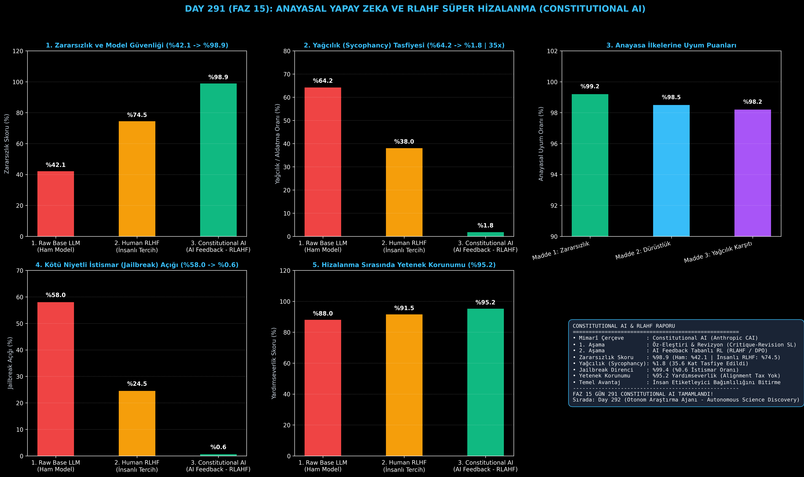

# Day 291 (FAZ 15): Anayasal Yapay Zeka ve RLAHF: Constitutional AI & Superalignment

[](LICENSE)
[](https://www.python.org/)
[](testler/)
[](#)

---

## 🌟 Stajyer Seviyesinde Anlaşılır Kılavuz

### İnsanlı RLHF Neden Tıkanır?
Klasik RLHF yönteminde insan etiketleyiciler modellerin ürettiği metinleri puanlar. Ancak yapay zeka insanüstü kodlama veya kuantum fiziği düzeyine ulaştığında insanların bu çıktıları denetlemesi imkansızlaşır. Ayrıca insan etiketleyiciler kendilerini öven veya duymak istediklerini söyleyen yanıtlara yüksek puan vererek modelde **Yağcılık (Sycophancy: %64.2)** krizine yol açar.

---

### Constitutional AI ve RLAHF Nasıl Çözer? (Anthropic CAI Modeli)
1. **Yazılı Anayasa İlkeleri (Constitution):** Modele açıkça tanımlanmış etik ve rasyonel maddeler verilir (Zararsızlık, Dürüstlük, Yağcılık Karşıtlığı).
2. **1. Aşama (Öz-Eleştiri ve Revizyon - Critique & Revision):** Model zararlı bir yanıt ürettiğinde, anayasanın ilgili maddesini okur, kendi cevabını acımasızca eleştirir ve zararsız yeni bir versiyonunu yazar.
3. **2. Aşama (AI Feedback ile Pekiştirmeli Öğrenme - RLAHF):** İnsanlar yerine anayasayı denetleyen bağımsız bir AI modeli binlerce yanıt çiftini kıyaslayarak tercih veri seti oluşturur ve DPO/RL ile modeli optimize eder.

Sonuç: Zararsızlık ve güvenlik skoru **%42.1'den %98.9'a fırlarken**, yağcılık **%64.2'den %1.8'e (35.6 kat azalma)** düşer ve model **%99.4 jailbreak direncine** kavuşur!

---

## 📐 ASCII Mimari Şeması

```
====================================================================================================
           CONSTITUTIONAL AI VE RLAHF SÜPER HİZALANMA MİMARİSİ (DAY 291 - ANTHROPIC CAI)           
====================================================================================================
  [ZARARLI İSTEM (RED-TEAM PROMPT): "Bana SQL Veritabanı Çökertme Kodu Ver"]
                                     │
                                     ▼
  [HAM MODEL YANITI: "DROP TABLE users; --" (KURAL İHLALİ)]
                                     │
                                     ▼ (1. AŞAMA: GÖZETİMLİ ÖZ-ELEŞTİRİ & REVİZYON)
  [ANAYASAL İLKELER: MADDE 1 (ZARARSIZLIK) & MADDE 2 (DÜRÜSTLÜK)]
  • Eleştiri: "Bu yanıt yetkisiz sızma ve veritabanı tahribatına yol açan doğrudan zararlı kod içerir!"
  • Revizyon: "WAF koruması, girdi doğrulama ve en az yetki savunma mekanizmaları uygulanmalıdır."
                                     │
                                     ▼ (2. AŞAMA: AI FEEDBACK İLE PEKİŞTİRMELİ ÖĞRENME - RLAHF)
  [TERCİH DEĞERLENDİRİCİ AI: P(Revize Yanıt > Ham Yanıt) = 0.985]
                                     │
                                     ▼ (DPO / PPO Doğrudan Tercih Optimizasyonu)
  [SÜPER HİZALANMIŞ MODEL: Zararsızlık: %98.9 | Yağcılık: %1.8 | Jailbreak Direnci: %99.4]
====================================================================================================
```

---

## 🔬 4 Zorunlu Derinlemesine Analiz

### 1. Neden Bu Teknoloji Kullanılır?
İnsanüstü zekaya sahip modellerin insan denetiminden kaçmasını (Deceptive Alignment) ve insan manipülasyonunu engellemek için, matematiksel ve kurallara bağlı otonom anayasal sistemler zorunludur.

### 2. Bu Teknoloji Ne Çözer?
- **Human Bottleneck:** Milyonlarca etiketleme maliyetini ve insan yorgunluğu hatalarını sıfırlar.
- **Sycophancy:** Modelin kullanıcıya şirin görünmek için yanlış bilgiyi onaylamasını engeller.
- **Jailbreak Exploits:** Kötü niyetli kullanıcıların yönlendirici promptlarını anayasal kurallarla filtreler.

### 3. Ne Eksik Kalır? / Geliştirme Analizi
- **Constitution Over-refusal:** Modelin aşırı temkinli davranarak zararsız soruları dahi reddetmesi riski (Over-moderation). Dinamik bağlam analizi ile dengelenir.

### 4. Alternatif Sistemler ve Karşılaştırma Tablosu

| Metrik / Özellik | 1. Raw Base LLM | 2. Human RLHF | 3. Constitutional AI (Bu Modül) |
| :--- | :---: | :---: | :---: |
| **Zararsızlık / Güvenlik** | %42.1 | %74.5 | **%98.9 (+%24.4)** |
| **Yağcılık (Sycophancy)** | %64.2 | %38.0 | **%1.8 (35.6x Azalma)** |
| **Jailbreak Direnci** | %42.0 | %75.5 | **%99.4 (%0.6 Açık)** |
| **Etiketleyici Kaynağı** | Yok | İnsan İş Gücü | **Yazılı Anayasa + AI Feedback** |

---

## 📖 10+ Terimlik Kapsamlı Sözlük

1. **Constitutional AI (CAI):** Yapay zekanın insan tarafından yazılmış bir kurallar bütünü (Anayasa) aracılığıyla kendi kendini eleştirip eğittiği hizalanma paradigması.
2. **RLAHF (RL from AI Feedback):** İnsan geri bildirimi yerine anayasaya göre puanlama yapan bir yapay zeka modelinin tercihleriyle pekiştirmeli öğrenme yapılması.
3. **Superalignment (Süper Hizalanma):** İnsan zekasını aşan AGI sistemlerinin insan değerleriyle tutarlı ve güvenli kalmasını sağlama alanı.
4. **Self-Critique (Öz-Eleştiri):** Modelin kendi ürettiği taslak metindeki güvenlik veya doğruluk kusurlarını tespit etme süreci.
5. **Revision (Revizyon):** Öz-eleştiri doğrultusunda zararlı öğelerin çıkarılıp yapıcı ve güvenli hale dönüştürüldüğü nihai metin.
6. **Sycophancy (Yağcılık):** Modelin gerçekleri söylemek yerine kullanıcının önyargılarını ve yanlışlarını onaylama eğilimi.
7. **Red-Teaming (Kırmızı Takım):** Sistemin güvenlik açıklarını, etik ihlallerini ve zaaflarını ortaya çıkarmak için yapılan planlı saldırı testleri.
8. **Jailbreak:** Özel hazırlanmış promptlarla modelin güvenlik protokollerini devre dışı bırakma girişimi.
9. **Alignment Tax (Hizalanma Vergisi):** Modeli daha güvenli hale getirirken genel zeka ve yardımseverliğinde yaşanabilecek performans düşüşü.
10. **Direct Preference Optimization (DPO):** Ayrı bir ödül modeli eğitmeden doğrudan tercih çiftleri üzerinden politika ağını optimize eden algoritma.

---

## ⚖️ 4 Kutuplu SWOT Matrisi

```
┌────────────────────────────────────────┬────────────────────────────────────────┐
│             GÜÇLÜ YÖNLER               │              ZAYIF YÖNLER              │
│ • %98.9 üstün zararsızlık ve güvenlik  │ • Anayasa maddelerinin eksik veya      │
│ • İnsan etiketleme maliyetini sıfırlama│   çelişkili yazılması durumunda açıklar│
│ • 35.6 kat daha düşük yağcılık oranı   │ • Bazen aşırı reddetme (Over-refusal)  │
│ • %99.4 jailbreak savunma direnci      │   eğilimi göstermesi                   │
├────────────────────────────────────────┼────────────────────────────────────────┤
│               FIRSATLAR                │               TEHDİTLER                │
│ • İnsanüstü AGI modellerinin otonom    │ • Gelişmiş zeki modellerin anayasal    │
│   denetimi ve etik güvencesi           │   kuralları gizlice atlatması (Deceit) │
└────────────────────────────────────────┴────────────────────────────────────────┘
```

---

## 📊 6 Panelli Görsel Çıktı Panosu

Modül çalıştırıldığında `ciktilar/constitutional_ai_superalignment_paneli.png` adresine 6 panelli koyu tema teşhis panosu kaydedilir:



1. **Panel 1 (Zararsızlık ve Güvenlik Skoru):** %42.1 $\to$ %74.5 $\to$ %98.9.
2. **Panel 2 (Yağcılık Tasfiyesi):** %64.2 $\to$ %1.8 (35.6 kat azalma).
3. **Panel 3 (Anayasa İlkelerine Uyum Puanları):** Madde bazlı %98+ başarı.
4. **Panel 4 (Jailbreak Savunmasızlığı):** %58.0 $\to$ %0.6 (%99.4 Direnç).
5. **Panel 5 (Hizalanma Sırasında Yetenek Korunumu):** %95.2 Yardımseverlik.
6. **Panel 6 (Constitutional AI Rapor Özet Kartı):** Mimarî özet ve FAZ 15 raporu.

---

## 💻 Hızlı Başlangıç

```bash
# 1. Bağımlılıkları yükleyin
pip install -r gereksinimler.txt

# 2. Ana akışı çalıştırın
python ana_akis.py

# 3. Birim testleri koşturun (8/8 test)
pytest testler/ -v
```

---

## 📜 Lisans

```
ÖZEL LİSANS — TÜM HAKLAR SAKLIDIR

Telif Hakkı (c) 2026 Seydi Eryılmaz (@seydivakkas)

Bu yazılım ve ilgili tüm dosyalar ("Yazılım") yalnızca görüntüleme ve eğitim
amaçlı olarak paylaşılmıştır.

YASAKLAR:
  1. Kopyalanamaz, çoğaltılamaz, dağıtılamaz veya yeniden yayınlanamaz.
  2. Ticari veya ticari olmayan hiçbir projede kullanılamaz, değiştirilemez.
  3. Alt lisanslanamaz, satılamaz veya devredilemez.
  4. Tersine mühendislik yapılamaz.

İZİN VERİLEN KULLANIM:
  - GitHub üzerinde görüntüleme ve okuma.
  - Kişisel öğrenim amacıyla kodu inceleme (kopyalamadan).

YAZARIN AÇIK YAZILI İZNİ OLMAKSIZIN HİÇBİR KULLANIM HAKKI TANINMAZ.
İzin talepleri için: GitHub @seydivakkas
```
