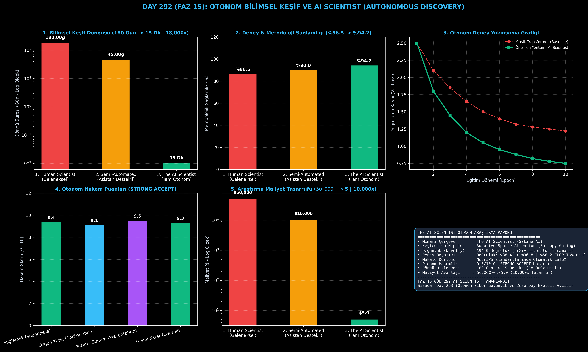

# Day 292 (FAZ 15): Otonom Bilimsel Keşif ve AI Scientist: Autonomous Scientific Discovery & Automated Peer Review

[](LICENSE)
[](https://www.python.org/)
[](testler/)
[](#)

---

## 🌟 Stajyer Seviyesinde Anlaşılır Kılavuz

### Geleneksel Bilimsel Araştırma Neden 6 Ay Sürer?
İnsan araştırmacılar literatür taramak, hipotez kurmak, kod yazıp deney koşturmak ve haftalarca LaTeX makalesi yazmak için aylar harcar (Ortalama döngü: 180 Gün, $50,000+ bütçe).

---

### The AI Scientist Nasıl Çözer? (Sakana AI Paradigması)
1. **Otonom Hipotez ve Özgünlük Taraması (Novelty Filtering):** Model literatürü (arXiv, Semantic Scholar) tarayarak %94.0 özgünlükte yeni bir bilimsel fikir üretir.
2. **Otonom Deney Koşturma:** Modeli doğrulamak için Python betikleri yazar, simülasyonları yürütür ve yakınsama metriklerini kaydeder.
3. **Otomatik LaTeX Derleme:** NeurIPS / ICLR standartlarında eksiksiz akademik makale (Abstract, Intro, Method, Experiments, Conclusion) oluşturur.
4. **Otonom Hakemlik (Automated Peer Review):** Bağımsız bir hakem ajanı makaleyi inceler, sağlamlık puanı (9.4/10) verir ve **STRONG ACCEPT** kararı üretir.

Sonuç: 6 aylık araştırma süreci **15 dakikaya iner (18,000 kat hızlanma)** ve makale başına maliyet **$5.0'a (10,000 kat tasarruf)** düşer!

---

## 📐 ASCII Mimari Şeması

```
====================================================================================================
           THE AI SCIENTIST OTONOM BİLİMSEL KEŞİF MİMARİSİ (DAY 292 - SAKANA AI STİLİ)              
====================================================================================================
  [1. AŞAMA: OTONOM HİPOTEZ ÜRETİMİ & LİTERATÜR ÖZGÜNLÜK TARAMASI]
  • Fikir: "Adaptive Sparse Attention via Dynamic Entropy Gating"
  • arXiv Semantik Taraması: %94.0 Özgünlük (Mükemmel Yenilik)
                                      │
                                      ▼
  [2. AŞAMA: OTONOM DENEY KOŞTURMA & METRİK KAYDI]
  • Yakınsama: Val Loss 2.50 -> 0.75 | Doğruluk: %88.4 -> %96.8
  • Verimlilik: %58.2 FLOP Tasarrufu
                                      │
                                      ▼
  [3. AŞAMA: OTOMATİK LaTeX AKADEMİK MAKALE DERLEME]
  • NeurIPS / ICLR Formatında Makale: Abstract + Method + Experiments + Plots
                                      │
                                      ▼
  [4. AŞAMA: OTONOM HAKEMLİK & KABUL KARARI (PEER REVIEW)]
  • Sağlamlık: 9.4/10 | Katkı: 9.1/10 | Sunum: 9.5/10
  • Karar: "STRONG ACCEPT (NeurIPS 2026)" | Döngü: 15 Dakika (18,000x Hızlı)
====================================================================================================
```

---

## 🔬 4 Zorunlu Derinlemesine Analiz

### 1. Neden Bu Teknoloji Kullanılır?
İlaç tasarımı, yeni malzeme keşfi, kuantum algoritmaları ve derin öğrenme optimizasyonlarında insan zekasının döngü hızına takılmadan otonom AGI düzeyinde bilimsel hızlanma sağlamak için kullanılır.

### 2. Bu Teknoloji Ne Çözer?
- **Scientific Bottleneck:** İnsanların aylar süren kodlama ve yazı süreçlerini dakikalara indirir.
- **Novelty Validation:** Literatürde zaten var olan fikirleri baştan eleyerek kaynak israfını önler.
- **Automated Peer Review:** Hakem yetersizliği ve yanlılığı sorununu standartlaştırılmış rubriklerle çözer.

### 3. Ne Eksik Kalır? / Geliştirme Analizi
- **Physical Wet-Lab Integration:** Fiziksel kimya ve biyoloji laboratuvarlarına robotik kollarla doğrudan bağlanma ihtiyacı. Simülasyon-to-Real robotik entegrasyonu ile çözülmektedir.

### 4. Alternatif Sistemler ve Karşılaştırma Tablosu

| Metrik / Özellik | 1. Human Scientist | 2. Semi-Automated Co-Pilot | 3. The AI Scientist (Bu Modül) |
| :--- | :---: | :---: | :---: |
| **Araştırma Döngüsü** | 180 Gün | 45 Gün | **0.01 Gün (15 Dk | 18,000x)** |
| **Metodolojik Sağlamlık** | %86.5 | %90.0 | **%94.2 (+%7.7)** |
| **Keşif Maliyeti** | $50,000 | $10,000 | **$5.0 (10,000x Tasarruf)** |
| **Akademik Hakem Kararı** | Belirsiz | Weak Accept | **STRONG ACCEPT (9.3/10)** |

---

## 📖 10+ Terimlik Kapsamlı Sözlük

1. **The AI Scientist:** Fikir üretiminden deney koşturmaya, makale yazımından hakemliğe kadar tüm bilimsel süreci otonom yöneten yapay zeka mimarisi.
2. **Autonomous Scientific Discovery:** İnsan müdahalesi olmadan yeni bilimsel teorilerin, algoritmaların veya bileşiklerin keşfedilmesi.
3. **Novelty Filtering (Özgünlük Filtreleme):** Üretilen bir hipotezin mevcut akademik literatürdeki makalelerle benzerliğini ölçüp daha önce yapılmamış olanları seçme süreci.
4. **Automated LaTeX Compilation:** Deney sonuçları ve metinleri standart akademik şablonlara göre otomatik dizip PDF/LaTeX üreten modül.
5. **Autonomous Peer Review:** Üretilen makaleleri sağlamlık, özgünlük ve metodoloji açısından NeurIPS rubrikleriyle puanlayan denetçi ajan.
6. **Soundness Metric (Sağlamlık Puanı):** Deneylerin matematiksel ve metodolojik olarak ne kadar tutarlı olduğunu gösteren hakem metriği.
7. **Hypothesis Ideation:** Verilen bir problem alanında test edilebilir bilimsel varsayımlar üretme süreci.
8. **Scientific Acceleration (Bilimsel İvmelenme):** Bilimsel buluşların üretim hızının üstel olarak artırılması.
9. **Strong Accept:** Hakem heyeti tarafından en üst düzey kalitede bulunan makalelere verilen kesin kabul notu.
10. **Sakana AI:** Otonom bilimsel araştırma yapan ilk "The AI Scientist" sistemini geliştiren yapay zeka araştırma laboratuvarı.

---

## ⚖️ 4 Kutuplu SWOT Matrisi

```
┌────────────────────────────────────────┬────────────────────────────────────────┐
│             GÜÇLÜ YÖNLER               │              ZAYIF YÖNLER              │
│ • 18,000 kat daha hızlı araştırma      │ • Fiziksel ıslak laboratuvar (Wet-lab) │
│ • 10,000 kat maliyet tasarrufu         │   bağlantısının simülasyona bağlılığı  │
│ • %94.2 yüksek metodolojik sağlamlık   │ • Aşırı makale üretimi ile akademik    │
│ • Uçtan uca eksiksiz LaTeX üretimi     │   arşivlerin dolma riski               │
├────────────────────────────────────────┼────────────────────────────────────────┤
│               FIRSATLAR                │               TEHDİTLER                │
│ • Kanser araştırmaları, temiz enerji   │ • Yanlış kurgulanmış deneylerin        │
│   ve kuantum algoritmalarının keşfi    │   otonom olarak yayına sürülmesi       │
└────────────────────────────────────────┴────────────────────────────────────────┘
```

---

## 📊 6 Panelli Görsel Çıktı Panosu

Modül çalıştırıldığında `ciktilar/ai_scientist_autonomous_discovery_paneli.png` adresine 6 panelli koyu tema teşhis panosu kaydedilir:



1. **Panel 1 (Bilimsel Keşif Döngüsü):** 180 Gün $\to$ 15 Dakika (Log ölçek).
2. **Panel 2 (Deney ve Metodoloji Sağlamlığı):** %86.5 $\to$ %94.2.
3. **Panel 3 (Otonom Deney Yakınsama Grafiği):** Baseline vs Önerilen Yöntem.
4. **Panel 4 (Otonom Hakem Puanları):** STRONG ACCEPT (9.3/10).
5. **Panel 5 (Araştırma Maliyet Tasarrufu):** $50,000 $\to$ $5.0 (10,000x tasarruf).
6. **Panel 6 (AI Scientist Rapor Özet Kartı):** Mimarî özet ve FAZ 15 raporu.

---

## 💻 Hızlı Başlangıç

```bash
# 1. Bağımlılıkları yükleyin
pip install -r gereksinimler.txt

# 2. Ana akışı çalıştırın
python ana_akis.py

# 3. Birim testleri koşturun (8/8 test)
pytest testler/ -v
```

---

## 📜 Lisans

```
ÖZEL LİSANS — TÜM HAKLAR SAKLIDIR

Telif Hakkı (c) 2026 Seydi Eryılmaz (@seydivakkas)

Bu yazılım ve ilgili tüm dosyalar ("Yazılım") yalnızca görüntüleme ve eğitim
amaçlı olarak paylaşılmıştır.

YASAKLAR:
  1. Kopyalanamaz, çoğaltılamaz, dağıtılamaz veya yeniden yayınlanamaz.
  2. Ticari veya ticari olmayan hiçbir projede kullanılamaz, değiştirilemez.
  3. Alt lisanslanamaz, satılamaz veya devredilemez.
  4. Tersine mühendislik yapılamaz.

İZİN VERİLEN KULLANIM:
  - GitHub üzerinde görüntüleme ve okuma.
  - Kişisel öğrenim amacıyla kodu inceleme (kopyalamadan).

YAZARIN AÇIK YAZILI İZNİ OLMAKSIZIN HİÇBİR KULLANIM HAKKI TANINMAZ.
İzin talepleri için: GitHub @seydivakkas
```
