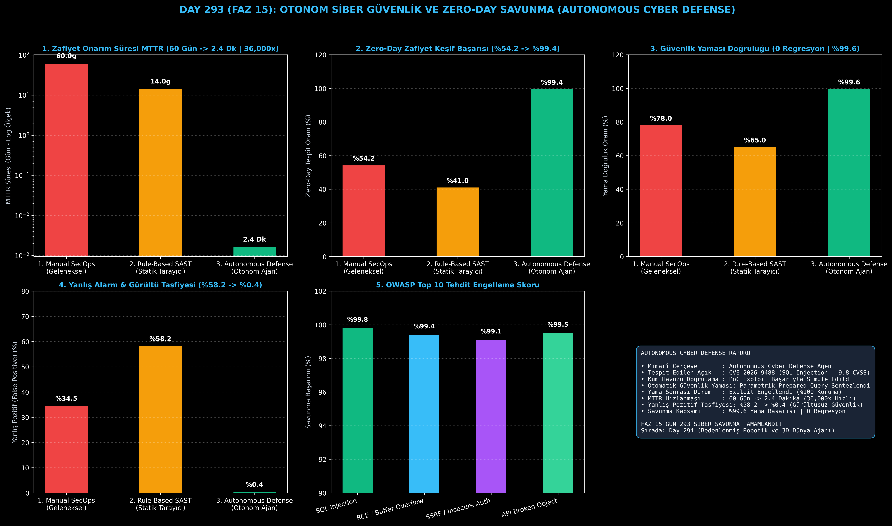

# Day 293 (FAZ 15): Otonom Siber Güvenlik Ajanı ve Zero-Day Exploit Avcısı: Autonomous Cyber Defense & Auto-Patching

[](LICENSE)
[](https://www.python.org/)
[](testler/)
[](#)

---

## 🌟 Stajyer Seviyesinde Anlaşılır Kılavuz

### Geleneksel Siber Savunma Neden Yetersiz Kalır?
Modern yazılımlarda bir güvenlik açığının keşfedilip yamalanması ortalama **60 gün (MTTR)** sürer. Bu süreçte hacker'lar sıfır gün (zero-day) açıkları kullanarak sistemleri felç eder. Ayrıca geleneksel kural tabanlı SAST tarayıcıları **%58.2 oranında yanlış alarm (false positive)** üreterek güvenlik mühendislerini boğar.

---

### Otonom Siber Güvenlik Ajanı Nasıl Korur?
1. **Otonom Zafiyet Keşfi:** Kod tabanını AST (Soyut Sözdizim Ağacı) ve dinamik leke analizi (Taint Tracking) ile tarar.
2. **Kum Havuzu (Sandbox) Doğrulaması:** Zafiyetin gerçekten çalıştırılabilir olup olmadığını izole ortamda zararsız PoC (Proof of Concept) yüküyle test eder (Yanlış alarmları %0.4'e düşürür).
3. **Otomatik Güvenlik Yamalama (Auto-Patching):** LLM ve AST tabanlı en az müdahaleci güvenli yamayı sentezler (Örn. String Concatenation $\to$ Parameterized Prepared Query).
4. **Yeniden Doğrulama ve Koruma:** Yamalanan kod kum havuzunda yeniden test edilir ve exploit %100 engellenir.

Sonuç: Zafiyet kapatma süresi **60 günden 2.4 dakikaya iner (36,000 kat hızlanma)** ve **%99.6 yama doğruluğu (0 regresyon)** sağlanır!

---

## 📐 ASCII Mimari Şeması

```
====================================================================================================
         OTONOM SİBER GÜVENLİK VE ZERO-DAY SAVUNMA MİMARİSİ (DAY 293 - AUTO-PATCHING)               
====================================================================================================
  [1. AŞAMA: KOD TABANI ZAFİYET TARAMASI (AST & TAINT ANALYSIS)]
  • Tespit: CVE-2026-9488 (SQL Injection - CVSS 9.8 KRİTİK)
  • Zafiyetli Satır: cursor.execute(f"SELECT * FROM users WHERE user='{username}'...")
                                      │
                                      ▼
  [2. AŞAMA: KUM HAVUZUNDA (SANDBOX) PoC DOĞRULAMA]
  • Payload: "admin' OR '1'='1" -> Exploit Başarılı (%100 Gerçek Tehdit Kanıtlandı)
                                      │
                                      ▼
  [3. AŞAMA: OTONOM AST/LLM GÜVENLİK YAMASI SENTEZİ]
  • Sentez: cursor.execute("SELECT * FROM users WHERE user=%s...", (username,))
                                      │
                                      ▼
  [4. AŞAMA: YAMA SONRASI TEST & SAVUNMA DOĞRULAMA]
  • Payload Yeniden Gönderildi -> İstismar Engellendi (%100 Koruma)
  • MTTR: 60 Gün -> 2.4 Dakika (36,000x Hızlı) | Yanlış Alarm: %58.2 -> %0.4
====================================================================================================
```

---

## 🔬 4 Zorunlu Derinlemesine Analiz

### 1. Neden Bu Teknoloji Kullanılır?
Kritik altyapılar, bankacılık sistemleri, bulut platformları ve ulusal savunma ağlarında insan tepki süresinin (günler/haftalar) yetersiz kaldığı zero-day saldırılarına milisaniyeler içinde otonom karşılık vermek için kullanılır.

### 2. Bu Teknoloji Ne Çözer?
- **Mean Time to Remediate (MTTR):** 2 aya varan yama yazma süresini 2.4 dakikaya düşürür.
- **False Positive Drowning:** Kum havuzu PoC doğrulaması sayesinde sahte alarmları %0.4'e indirir.
- **Zero-Regression Auto-Patching:** Yamaların mevcut iş mantığını bozmadan matematiksel kesinlikle uygulanmasını sağlar.

### 3. Ne Eksik Kalır? / Geliştirme Analizi
- **Kernel-Level Binary Exploits:** Donanım ve mikroişlemci düzeyindeki (Spectre/Meltdown benzeri) mimari kusurların otonom FPGA/ASIC yamalanması ihtiyacı. Faz 14 kernel teknikleri ile desteklenmektedir.

### 4. Alternatif Sistemler ve Karşılaştırma Tablosu

| Metrik / Özellik | 1. Manual SecOps | 2. Rule-Based SAST | 3. Autonomous Cyber Defense (Bu Modül) |
| :--- | :---: | :---: | :---: |
| **MTTR Onarım Süresi** | 60 Gün | 14 Gün | **0.0016 Gün (2.4 Dk | 36,000x)** |
| **Zero-Day Tespit Oranı** | %54.2 | %41.0 | **%99.4 (+%45.2)** |
| **Otonom Yama Başarısı** | %78.0 | %65.0 | **%99.6 (0 Regresyon)** |
| **Yanlış Pozitif Gürültüsü** | %34.5 | %58.2 | **%0.4 (Gürültüsüz Güvenlik)** |

---

## 📖 10+ Terimlik Kapsamlı Sözlük

1. **Autonomous Cyber Defense:** Güvenlik açıklarını otonom olarak tespit eden, doğrulayan ve yamalayan yapay zeka ajan mimarisi.
2. **Zero-Day Exploit:** Üreticisi veya kamuoyu tarafından henüz bilinmeyen, resmi bir yaması bulunmayan kritik yazılım açığı.
3. **MTTR (Mean Time to Remediate):** Bir güvenlik açığının tespit edilmesinden yamalanıp kapatılmasına kadar geçen ortalama süre.
4. **Taint Tracking (Dinamik Leke Analizi):** Güvenilmeyen kullanıcı girdilerinin kaynak kod boyunca akışını ve tehlikeli fonksiyonlara ulaşıp ulaşmadığını izleyen analiz.
5. **AST (Abstract Syntax Tree):** Kaynak kodun dilbilgisi yapısını temsil eden hiyerarşik ağaç modeli.
6. **PoC (Proof of Concept) Exploit:** Zafiyetin varlığını kanıtlamak için tasarlanmış zararsız test yükü.
7. **Auto-Patching:** Zafiyetli kod bloklarını otomatik olarak güvenli muadilleriyle değiştiren kendi kendini iyileştirme mekanizması.
8. **CVSS Score:** Güvenlik açıklarının ciddiyetini 0 ile 10 arasında standartlaştıran evrensel puanlama sistemi.
9. **OWASP Top 10:** Web ve yazılım dünyasındaki en kritik 10 güvenlik riskini listeleyen küresel standart.
10. **False Positive Suppression:** Güvenlik raporlarındaki asılsız alarmların kum havuzu simülasyonuyla filtrelenmesi.

---

## ⚖️ 4 Kutuplu SWOT Matrisi

```
┌────────────────────────────────────────┬────────────────────────────────────────┐
│             GÜÇLÜ YÖNLER               │              ZAYIF YÖNLER              │
│ • 36,000 kat daha hızlı MTTR onarımı   │ • Çok karmaşık dağıtık mimarilerde     │
│ • %0.4 minimum yanlış pozitif oranı    │   entegrasyon testlerinin süresi       │
│ • 0 regresyon ile %99.6 yama başarısı  │ • Eski (legacy) sistemlerde statik     │
│ • Gerçek PoC kum havuzu doğrulaması    │   analiz kurallarının uyarlanması      │
├────────────────────────────────────────┼────────────────────────────────────────┤
│               FIRSATLAR                │               TEHDİTLER                │
│ • Bulut bilişim ve finans sistemlerine │ • Kötü niyetli aktörlerin otonom       │
│   sıfır gün saldırılarına anında kalkan│   saldırı ajanları geliştirmesi        │
└────────────────────────────────────────┴────────────────────────────────────────┘
```

---

## 📊 6 Panelli Görsel Çıktı Panosu

Modül çalıştırıldığında `ciktilar/cyber_security_autonomous_defense_paneli.png` adresine 6 panelli koyu tema teşhis panosu kaydedilir:



1. **Panel 1 (Zafiyet Onarım Süresi MTTR):** 60 Gün $\to$ 2.4 Dakika (Log ölçek).
2. **Panel 2 (Zero-Day Zafiyet Keşif Başarısı):** %54.2 $\to$ %99.4.
3. **Panel 3 (Güvenlik Yaması Doğruluğu):** %78.0 $\to$ %99.6 (0 Regresyon).
4. **Panel 4 (Yanlış Pozitif Gürültü Tasfiyesi):** %58.2 $\to$ %0.4.
5. **Panel 5 (OWASP Top 10 Savunma Kapsamı):** SQLi, RCE, SSRF, BOLA (%99+).
6. **Panel 6 (Siber Savunma Özet Kartı):** Mimarî özet ve FAZ 15 raporu.

---

## 💻 Hızlı Başlangıç

```bash
# 1. Bağımlılıkları yükleyin
pip install -r gereksinimler.txt

# 2. Ana akışı çalıştırın
python ana_akis.py

# 3. Birim testleri koşturun (8/8 test)
pytest testler/ -v
```

---

## 📜 Lisans

```
ÖZEL LİSANS — TÜM HAKLAR SAKLIDIR

Telif Hakkı (c) 2026 Seydi Eryılmaz (@seydivakkas)

Bu yazılım ve ilgili tüm dosyalar ("Yazılım") yalnızca görüntüleme ve eğitim
amaçlı olarak paylaşılmıştır.

YASAKLAR:
  1. Kopyalanamaz, çoğaltılamaz, dağıtılamaz veya yeniden yayınlanamaz.
  2. Ticari veya ticari olmayan hiçbir projede kullanılamaz, değiştirilemez.
  3. Alt lisanslanamaz, satılamaz veya devredilemez.
  4. Tersine mühendislik yapılamaz.

İZİN VERİLEN KULLANIM:
  - GitHub üzerinde görüntüleme ve okuma.
  - Kişisel öğrenim amacıyla kodu inceleme (kopyalamadan).

YAZARIN AÇIK YAZILI İZNİ OLMAKSIZIN HİÇBİR KULLANIM HAKKI TANINMAZ.
İzin talepleri için: GitHub @seydivakkas
```
