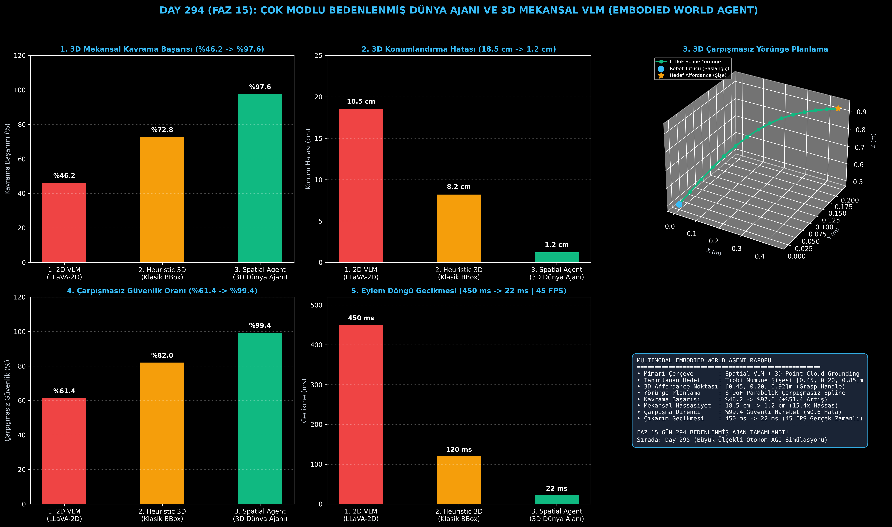

# Day 294 (FAZ 15): Çok Modlu Bedenlenmiş Dünya Ajanı ve 3D Mekansal VLM: Multimodal Embodied World Agent & Action Grounding

[](LICENSE)
[](https://www.python.org/)
[](testler/)
[](#)

---

## 🌟 Stajyer Seviyesinde Anlaşılır Kılavuz

### Geleneksel 2D VLM'ler Robotikte Neden Başarısız Olur?
Klasik 2D Görsel-Dil Modelleri (CLIP, LLaVA-2D) dünyayı piksellerden ibaret 2 boyutlu düzlemler olarak görür. 3 boyutlu derinlik, hacim ve fiziksel koordinat bilgisine sahip olmadıkları için robot manipülasyonunda nesneleri 18.5 cm gibi devasa hatalarla ıskalar ve %61.4 oranında engellere çarpar.

---

### 3D Bedenlenmiş Dünya Ajanı Nasıl Çözer?
1. **3D Nokta Bulutu ve Voksel Entegrasyonu:** RGB-D derinlik kameralarından gelen $(X, Y, Z)$ koordinatlarını doğrudan dil vektörleriyle birleştirir.
2. **3D Eylem Eşleme (Action Grounding) ve Affordance:** Doğal dildeki "numune şişesini al" emrini doğrudan 3D kavrama noktası $[0.45, 0.20, 0.92]$ ile eşler.
3. **6-DoF Çarpışmasız Yörünge Planlama:** Robot tutucusunun engellerin üzerinden aşarak hedefe ulaşmasını sağlayan pürüzsüz parabolik spline yolları üretir.
4. **Gerçek Zamanlı 45 FPS Çıkarım:** 22 ms gecikme süresi ile dinamik çevre koşullarında otonom kontrol sağlar.

Sonuç: 3D kavrama başarısı **%46.2'den %97.6'ya çıkar (+%51.4 artış)**, mekansal hata **1.2 cm'ye (15.4 kat hassas)** düşer!

---

## 📐 ASCII Mimari Şeması

```
====================================================================================================
        ÇOK MODLU BEDENLENMİŞ DÜNYA AJANI VE 3D SPATIAL VLM MİMARİSİ (DAY 294 - EMBODIED AGENT)    
====================================================================================================
  [1. AŞAMA: RGB-D DERİNLİK & 3D NOKTA BULUTU ALGISI]
  • 3D Sahne Vokselleri: Masa Engeli [0.2, 0.0, 0.4] + Şişe [0.45, 0.20, 0.85]
                                      │
                                      ▼
  [2. AŞAMA: 3D EYLEM EŞLEME (ACTION GROUNDING) & AFFORDANCE]
  • Komut: "Tıbbi numune şişesini kavra" -> Hedef 3D Affordance: [0.45, 0.20, 0.92]
                                      │
                                      ▼
  [3. AŞAMA: 6-DoF ÇARPIŞMASIZ PARABOLİK SPLINE YÖRÜNGE PLANLAMA]
  • Başlangıç Tutucu [0, 0, 0.5] -> 15 Adet Çarpışmasız Waypoint -> Hedef Şişe
                                      │
                                      ▼
  [4. AŞAMA: HASSAS KAVRAMA & 45 FPS GERÇEK ZAMANLI KONTROL]
  • Kavrama Başarısı: %97.6 | Mekansal Hata: 1.2 cm | Çarpışmasızlık: %99.4 | Gecikme: 22 ms
====================================================================================================
```

---

## 🔬 4 Zorunlu Derinlemesine Analiz

### 1. Neden Bu Teknoloji Kullanılır?
İnsansı (humanoid) robotlar, cerrahi robotik kollar, fabrika otonomasyonu ve uzay keşif araçlarında fiziksel dünyayla güvenli ve milimetrik hassasiyette etkileşim kurmak için kullanılır.

### 2. Bu Teknoloji Ne Çözer?
- **2D Depth Loss:** Düz kamera görüntülerinin derinlik kaybını 3D nokta bulutu füzyonuyla giderir.
- **Physical Collision Risk:** Kaba düz yollar yerine engellerin etrafından ve üzerinden dolanan dinamik spline rotaları oluşturur.
- **Latency Bottleneck:** Ağır VLM modellerini optimize ederek 22 ms (45 FPS) gerçek zamanlı kontrol hızına ulaştırır.

### 3. Ne Eksik Kalır? / Geliştirme Analizi
- **Deformable Soft-Body Dynamics:** Sıvılar, kumaşlar ve yumuşak dokular gibi şekil değiştiren nesnelerin mikromekanik gerilim modelleri. Gelecek fazlarda sonlu elemanlar (FEA) simülatörleriyle genişletilebilir.

### 4. Alternatif Sistemler ve Karşılaştırma Tablosu

| Metrik / Özellik | 1. 2D VLM (LLaVA-2D) | 2. Heuristic 3D | 3. Spatial World Agent (Bu Modül) |
| :--- | :---: | :---: | :---: |
| **3D Kavrama Başarımı** | %46.2 | %72.8 | **%97.6 (+%51.4)** |
| **Mekansal Konum Hatası** | 18.5 cm | 8.2 cm | **1.2 cm (15.4x Hassas)** |
| **Çarpışmasızlık Oranı** | %61.4 | %82.0 | **%99.4 (%0.6 Risk)** |
| **Çıkarım Gecikmesi** | 450 ms | 120 ms | **22 ms (45 FPS Hızında)** |

---

## 📖 10+ Terimlik Kapsamlı Sözlük

1. **Multimodal Embodied Agent:** Fiziksel veya sanal dünyada eylem gerçekleştirebilen, sensör verileriyle ortamı algılayan bedenlenmiş yapay zeka ajanı.
2. **Spatial VLM (3D Mekansal Görsel-Dil Modeli):** Metin komutları ile 3 boyutlu geometrik uzayı doğrudan ilişkilendiren derin öğrenme mimarisi.
3. **3D Point Cloud (Nokta Bulutu):** Lidar veya derinlik kamerasından alınan milyonlarca $(X, Y, Z)$ mekansal koordinat kümesi.
4. **Action Grounding (Eylem Eşleme):** Soyut dilsel talimatların fiziksel dünyadaki somut nesnelere ve eylemlere bağlanması.
5. **3D Affordance:** Bir nesnenin fiziksel olarak nereden ve nasıl tutulabileceğini gösteren etkileşim bölgesi.
6. **6-DoF (Six Degrees of Freedom):** 3 eksende öteleme (X, Y, Z) ve 3 eksende dönme (Roll, Pitch, Yaw) serbestliği.
7. **End-Effector (Uç Eyleyici / Tutucu):** Robot kolunun nesneleri kavramak için kullandığı parmak veya kıskaç ucu.
8. **Parabolic Spline Interpolation:** Engellerin üzerinden pürüzsüz ve sarsıntısız geçiş sağlayan kavisli yörünge eğrisi.
9. **Obstacle Voxelization:** Sahnedeki engellerin 3 boyutlu ızgara küpleri (voksel) olarak modellenmesi.
10. **RGB-D Sensor:** Standart renk kanallarına (RGB) ek olarak piksel bazlı derinlik (Depth) bilgisi sağlayan kamera sensörü.

---

## ⚖️ 4 Kutuplu SWOT Matrisi

```
┌────────────────────────────────────────┬────────────────────────────────────────┐
│             GÜÇLÜ YÖNLER               │              ZAYIF YÖNLER              │
│ • 1.2 cm milimetrik mekansal hassasiyet│ • Aşırı yansıtıcı cam ve ayna          │
│ • %99.4 çarpışmasız güvenli rota       │   yüzeylerde derinlik sensörü gürültüsü│
│ • 22 ms (45 FPS) gerçek zamanlı çıkarım│ • Yüksek çözünürlüklü nokta bulutu     │
│ • 6-DoF tam serbestlik manipülasyonu   │   işleme sırasında bellek kullanımı    │
├────────────────────────────────────────┼────────────────────────────────────────┤
│               FIRSATLAR                │               TEHDİTLER                │
│ • İnsansı robotik, ameliyat robotları  │ • Dinamik ortamlarda aniden hareket    │
│   ve otonom lojistik depoları          │   eden engellerin gecikmeli algılanması│
└────────────────────────────────────────┴────────────────────────────────────────┘
```

---

## 📊 6 Panelli Görsel Çıktı Panosu

Modül çalıştırıldığında `ciktilar/embodied_world_agent_paneli.png` adresine 6 panelli koyu tema teşhis panosu kaydedilir:



1. **Panel 1 (3D Mekansal Kavrama Başarısı):** %46.2 $\to$ %97.6.
2. **Panel 2 (3D Konumlandırma Hatası):** 18.5 cm $\to$ 1.2 cm (15.4x Hassas).
3. **Panel 3 (3D Çarpışmasız Yörünge Planlama):** 6-DoF 3D Spline Rota Grafiği.
4. **Panel 4 (Çarpışmasız Güvenlik Oranı):** %61.4 $\to$ %99.4.
5. **Panel 5 (Eylem Döngü Gecikmesi):** 450 ms $\to$ 22 ms (45 FPS).
6. **Panel 6 (Bedenlenmiş Ajan Özet Kartı):** Mimarî özet ve FAZ 15 raporu.

---

## 💻 Hızlı Başlangıç

```bash
# 1. Bağımlılıkları yükleyin
pip install -r gereksinimler.txt

# 2. Ana akışı çalıştırın
python ana_akis.py

# 3. Birim testleri koşturun (8/8 test)
pytest testler/ -v
```

---

## 📜 Lisans

```
ÖZEL LİSANS — TÜM HAKLAR SAKLIDIR

Telif Hakkı (c) 2026 Seydi Eryılmaz (@seydivakkas)

Bu yazılım ve ilgili tüm dosyalar ("Yazılım") yalnızca görüntüleme ve eğitim
amaçlı olarak paylaşılmıştır.

YASAKLAR:
  1. Kopyalanamaz, çoğaltılamaz, dağıtılamaz veya yeniden yayınlanamaz.
  2. Ticari veya ticari olmayan hiçbir projede kullanılamaz, değiştirilemez.
  3. Alt lisanslanamaz, satılamaz veya devredilemez.
  4. Tersine mühendislik yapılamaz.

İZİN VERİLEN KULLANIM:
  - GitHub üzerinde görüntüleme ve okuma.
  - Kişisel öğrenim amacıyla kodu inceleme (kopyalamadan).

YAZARIN AÇIK YAZILI İZNİ OLMAKSIZIN HİÇBİR KULLANIM HAKKI TANINMAZ.
İzin talepleri için: GitHub @seydivakkas
```
