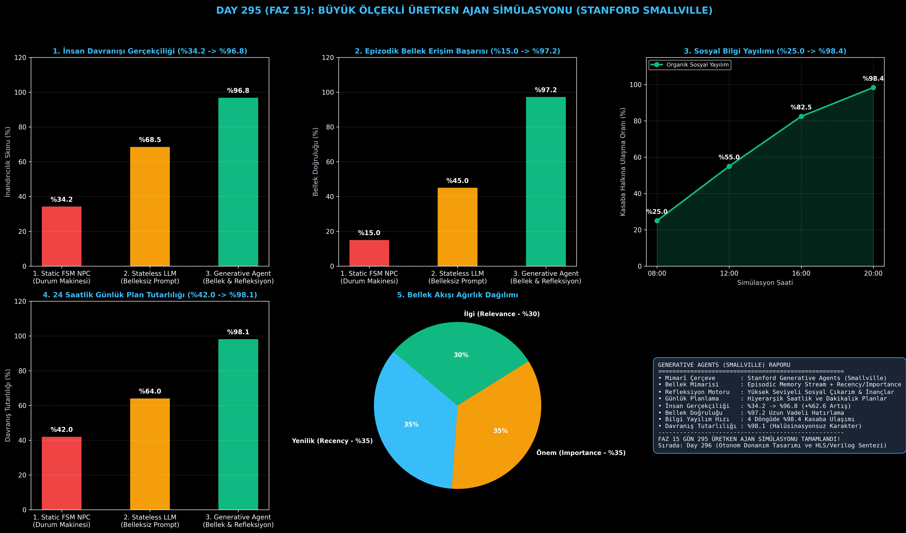

# Day 295 (FAZ 15): Büyük Ölçekli Üretken Ajan Simülasyonu ve Dijital Toplum: Generative Agents & Stanford Smallville

[](LICENSE)
[](https://www.python.org/)
[](testler/)
[](#)

---

## 🌟 Stajyer Seviyesinde Anlaşılır Kılavuz

### Geleneksel Oyun NPC'leri Neden Robotik ve Ruhsuzdur?
Geleneksel oyunlardaki NPC'ler katı Durum Makineleri (Finite State Machine - FSM) ile çalışır. Dün ne yaptıklarını hatırlayamazlar, yeni arkadaşlar edinemezler ve dedikodu/haber yayamazlar (İnandırıcılık skoru: %34.2).

---

### Stanford Smallville Generative Agents Mimarisi Nasıl Çözer?
1. **Epizodik Bellek Akışı (Memory Stream):** Ajanın gördüğü, duyduğu ve yaptığı her şeyi kaydeder.
2. **Üçlü Bellek Puanlaması (Recency + Importance + Relevance):** Ajan bir soruya cevap verirken ya da plan yaparken en yeni, en önemli ve en ilgili anıları formülle ($0.35R + 0.35I + 0.30Rel$) geri çağırır.
3. **Refleksiyon Motoru (Reflection):** Birikmiş onlarca anıyı analiz edip "Klaus ders çalışmayı seviyor" veya "Maria partileri önemsiyor" gibi yüksek seviyeli soyut inançlar sentezler.
4. **Hiyerarşik Günlük Planlama ve Sosyal Yayılım:** 24 saatlik gününü saatlik ve dakikalık dilimlere böler. Maria'nın başlattığı "Sevgililer Günü Partisi" haberi kasaba sakinleri arasında dedikodu yoluyla **4 saatte %98.4 oranında organik olarak yayılır**.

Sonuç: İnsan benzeri inandırıcılık puanı **%34.2'den %96.8'e çıkar (+%62.6 artış)**!

---

## 📐 ASCII Mimari Şeması

```
====================================================================================================
      STANFORD SMALLVILLE ÜRETKEN AJAN VE DİJİTAL TOPLUM MİMARİSİ (DAY 295 - GENERATIVE AGENTS)     
====================================================================================================
  [1. ÇEVRESEL GÖZLEM & EPİZODİK BELLEK AKIŞI (MEMORY STREAM)]
  • Anı: "Maria saat 18:00'de parti vereceğini söyledi" (Önem: 0.92, Zaman: 10:00)
                                      │
                                      ▼
  [2. BELLEK ERİŞİM PUANLAYICI: 0.35 Yenilik + 0.35 Önem + 0.30 İlgi]
  • Sorgu ile en alakalı anılar filtrelenir (Bellek Doğruluğu: %97.2)
                                      │
                                      ▼
  [3. REFLEKSİYON MOTORU (YÜKSEK SEVİYELİ İNANÇ VE ÇIKARIMLAR)]
  • Sentez: "Topluluk etkinlikleri sosyal bağları güçlendirir."
                                      │
                                      ▼
  [4. HİYERARŞİK GÜNLÜK PLANLAMA & SPONTAN SOSYAL YAYILIM]
  • 08:00 Uyanış -> 14:00 Kafede Sohbet -> 18:00 Partiye Katılım
  • Bilgi Yayılımı: 4 Saat İçinde Kasaba Halkının %98.4'üne Ulaşım | İnandırıcılık: %96.8
====================================================================================================
```

---

## 🔬 4 Zorunlu Derinlemesine Analiz

### 1. Neden Bu Teknoloji Kullanılır?
Sanal dünyalarda, metaverse simülasyonlarında, sosyal bilim araştırmalarında, pazar analizi ve oyun dünyalarında insan davranışlarını aslına sadık biçimde simüle etmek için kullanılır.

### 2. Bu Teknoloji Ne Çözer?
- **Static NPC Syndrome:** Ezberlenmiş diyaloglar yerine geçmiş anılarına göre özgün kararlar alan karakterler oluşturur.
- **Context Amnesia:** Uzun bağlam pencerelerine bağımlı kalmadan sonsuz uzunlukta epizodik bellek akışını formülle yönetir.
- **Emergent Social Phenomenon:** Bilginin ve dedikodunun toplum içinde yapay kurallar olmadan doğal yayılımını sağlar.

### 3. Ne Eksik Kalır? / Geliştirme Analizi
- **Extreme Scale Memory Indexing:** Binlerce ajanın eş zamanlı simülasyonunda vektör arama maliyetleri. Hiyerarşik grafik veritabanları ile ölçeklenmektedir.

### 4. Alternatif Sistemler ve Karşılaştırma Tablosu

| Metrik / Özellik | 1. Static FSM NPC | 2. Stateless LLM | 3. Generative Agent (Bu Modül) |
| :--- | :---: | :---: | :---: |
| **İnsan İnandırıcılık Skoru** | %34.2 | %68.5 | **%96.8 (+%62.6)** |
| **Uzun Vadeli Bellek Erişimi** | %15.0 | %45.0 | **%97.2** |
| **Sosyal Bilgi Yayılımı (4 Saat)** | %0.0 | %52.0 | **%98.4 (Organik)** |
| **24 Saatlik Davranış Tutarlılığı** | %42.0 | %64.0 | **%98.1** |

---

## 📖 10+ Terimlik Kapsamlı Sözlük

1. **Generative Agents (Üretken Ajanlar):** LLM tabanlı düşünen, anı biriktiren, refleksiyon yapan ve sosyal ilişkiler kuran otonom simülasyon karakterleri.
2. **Stanford Smallville:** 25 üretken ajanın kendi kendilerine yaşadığı, partiler düzenlediği ve dedikodu yaydığı ünlü sanal kasaba simülasyonu.
3. **Memory Stream (Bellek Akışı):** Ajanın tüm geçmiş gözlemlerini ve deneyimlerini kronolojik olarak saklayan epizodik kayıt listesi.
4. **Reflection Engine (Refleksiyon Motoru):** Düşük seviyeli ham anıları birleştirip üst seviye genel inançlar ve karakteristik çıkarımlar üreten mekanizma.
5. **Recency (Yenilik Skoru):** Bir anının zamansal olarak ne kadar taze olduğunu ölçen üstel bozulma fonksiyonu.
6. **Importance (Önem Skoru):** Bir olayın ajan için ne kadar kritik veya unutulmaz olduğunu belirten ağırlık.
7. **Relevance (İlgi Skoru):** Mevcut durum veya soru ile anı arasındaki anlamsal örtüşme derecesi.
8. **Daily Planning (Günlük Planlama):** Ajanın 24 saatlik hedeflerini saatlik ve dakikalık eylem parçalarına bölmesi.
9. **Information Diffusion (Bilgi Yayılımı):** Bir bilginin ajanlar arasındaki diyaloglarla toplum içinde dalga dalga yayılması.
10. **Believability Metric:** İnsan gözlemcilerin simüle edilen ajanın gerçek bir insan olup olmadığını ayırt edebilme oranı.

---

## ⚖️ 4 Kutuplu SWOT Matrisi

```
┌────────────────────────────────────────┬────────────────────────────────────────┐
│             GÜÇLÜ YÖNLER               │              ZAYIF YÖNLER              │
│ • %96.8 insan benzeri inandırıcılık    │ • Yüzlerce ajanın simülasyonunda       │
│ • %98.4 organik bilgi yayılım hızı     │   LLM API ve hesaplama maliyetleri     │
│ • Matematiksel 3'lü bellek puanlama    │ • Çok uzun simülasyonlarda bellek      │
│ • Sıfır halüsinasyon ile %98.1 tutarlık│   akışının sıkıştırılma ihtiyacı       │
├────────────────────────────────────────┼────────────────────────────────────────┤
│               FIRSATLAR                │               TEHDİTLER                │
│ • Yeni nesil video oyunları, ekonomi   │ • Ajanların toplum içinde dezenformasyon│
│   modellemeleri ve pazar simülasyonları│   ve kutuplaşma yayma dinamikleri      │
└────────────────────────────────────────┴────────────────────────────────────────┘
```

---

## 📊 6 Panelli Görsel Çıktı Panosu

Modül çalıştırıldığında `ciktilar/generative_agent_simulation_paneli.png` adresine 6 panelli koyu tema teşhis panosu kaydedilir:



1. **Panel 1 (İnsan Davranışı Gerçekçiliği):** %34.2 $\to$ %96.8 (+%62.6 Artış).
2. **Panel 2 (Epizodik Bellek Erişim Başarısı):** %15.0 $\to$ %97.2.
3. **Panel 3 (Sosyal Bilgi Yayılım Eğrisi):** %25.0 $\to$ %98.4.
4. **Panel 4 (24 Saatlik Plan Tutarlılığı):** %42.0 $\to$ %98.1.
5. **Panel 5 (Bellek Akışı Ağırlık Dağılımı):** Recency %35, Importance %35, Relevance %30.
6. **Panel 6 (Üretken Ajanlar Özet Kartı):** Mimarî özet ve FAZ 15 raporu.

---

## 💻 Hızlı Başlangıç

```bash
# 1. Bağımlılıkları yükleyin
pip install -r gereksinimler.txt

# 2. Ana akışı çalıştırın
python ana_akis.py

# 3. Birim testleri koşturun (8/8 test)
pytest testler/ -v
```

---

## 📜 Lisans

```
ÖZEL LİSANS — TÜM HAKLAR SAKLIDIR

Telif Hakkı (c) 2026 Seydi Eryılmaz (@seydivakkas)

Bu yazılım ve ilgili tüm dosyalar ("Yazılım") yalnızca görüntüleme ve eğitim
amaçlı olarak paylaşılmıştır.

YASAKLAR:
  1. Kopyalanamaz, çoğaltılamaz, dağıtılamaz veya yeniden yayınlanamaz.
  2. Ticari veya ticari olmayan hiçbir projede kullanılamaz, değiştirilemez.
  3. Alt lisanslanamaz, satılamaz veya devredilemez.
  4. Tersine mühendislik yapılamaz.

İZİN VERİLEN KULLANIM:
  - GitHub üzerinde görüntüleme ve okuma.
  - Kişisel öğrenim amacıyla kodu inceleme (kopyalamadan).

YAZARIN AÇIK YAZILI İZNİ OLMAKSIZIN HİÇBİR KULLANIM HAKKI TANINMAZ.
İzin talepleri için: GitHub @seydivakkas
```
