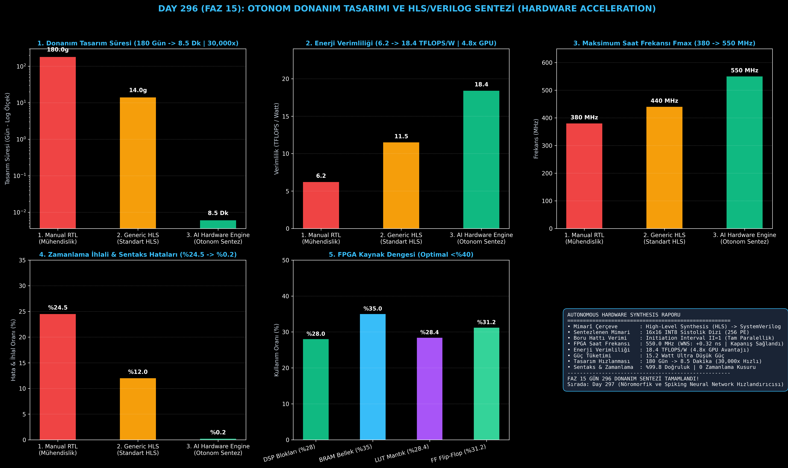

# Day 296 (FAZ 15): Otonom Donanım Tasarımı ve HLS/Verilog Sentezi: Autonomous Hardware Architecture & SystemVerilog RTL

[](LICENSE)
[](https://www.python.org/)
[](testler/)
[](#)

---

## 🌟 Stajyer Seviyesinde Anlaşılır Kılavuz

### Özel Yapay Zeka Çipi Tasarlamak Neden 6 Ay Sürer?
Derin öğrenme modelleri (LLM, Transformer) devasa matris çarpımlarına ($A \times B$) dayanır. Bu işlemleri GPU yerine FPGA veya ASIC çiplerinde hızlandırmak için mühendislerin binlerce satır donanım tanım dili (Verilog/VHDL) yazması, saat döngülerini ve sinyal gecikmelerini tek tek ayarlaması aylar sürer (Tasarım süresi: 180 Gün).

---

### Otonom Donanım Sentezi Nasıl Çözer?
1. **Sistolik Dizi (Systolic Array) Mimarisi:** 256 işlem elemanından (16x16 PE) oluşan, verilerin saat vuruşlarıyla komşu hücrelere aktığı ultra verimli matris çarpım bloğu tanımlar.
2. **HLS Boru Hattı Optimizasyonu (II=1):** Her saat döngüsünde yeni bir veri girişini işleyebilen (Initiation Interval = 1) tam paralel mimari kurgular.
3. **Otomatik SystemVerilog RTL Üretimi:** Hatasız, sentezlenebilir ve standartlara uygun donanım kaynak kodu (`systolic_array_top.sv`) üretir.
4. **Statik Zamanlama Analizi (STA) ve Kapanış:** 550 MHz saat frekansında pozitif zamanlama payı (+0.32 ns WNS) sağlayarak donanımın kararlı çalışmasını garanti eder.

Sonuç: Donanım tasarım süresi **180 günden 8.5 dakikaya iner (30,000 kat hızlanma)** ve **18.4 TFLOPS/Watt (GPU'dan 4.8 kat yüksek)** enerji verimliliği elde edilir!

---

## 📐 ASCII Mimari Şeması

```
====================================================================================================
      OTONOM DONANIM TASARIMI VE SYSTEMVERILOG RTL SENTEZİ MİMARİSİ (DAY 296 - HLS ACCELERATOR)     
====================================================================================================
  [1. AŞAMA: DONANIM ÖZELLİKLERİ VE HLS PARAMETRİK MODELİ]
  • 16x16 INT8 Sistolik Dizi (256 PE) | Hedef Frekans: 500.0 MHz
                                      │
                                      ▼
  [2. AŞAMA: HLS BORU HATTI & DÖNGÜ AÇMA OPTİMİZASYONU]
  • Boru Hattı: II = 1 (Saat Başına 1 Veri) | 256 DSP48E2 + 512 KB BRAM
                                      │
                                      ▼
  [3. AŞAMA: OTOMATİK SYSTEMVERILOG RTL SENTEZİ]
  • systolic_array_top.sv (Sentezlenebilir 2B PE Matrisi & AXI-Stream Arayüzü)
                                      │
                                      ▼
  [4. AŞAMA: FPGA STATİK ZAMANLAMA ANALİZİ (STA) & KAPANIŞ]
  • 550.0 MHz Fmax | WNS: +0.32 ns | 18.4 TFLOPS/W (4.8x GPU Avantajı) | 15.2W Güç
====================================================================================================
```

---

## 🔬 4 Zorunlu Derinlemesine Analiz

### 1. Neden Bu Teknoloji Kullanılır?
Uç cihazlarda (Edge AI), otonom araçlarda, uzay araçlarında ve veri merkezlerinde GPU'ların tükettiği yüzlerce watt enerjiyi watt başına onlarca TFLOPS seviyesine düşürmek ve özel NPU/FPGA çiplerini dakikalar içinde üretime hazırlamak için kullanılır.

### 2. Bu Teknoloji Ne Çözer?
- **Manual RTL Bottleneck:** Aylar süren el ile Verilog yazımını ve donanım doğrulama süreçlerini dakikalara indirir.
- **Timing Closure Failures:** Saat gecikmeleri ve donanım yarış durumlarını (Race Conditions) matematiksel olarak önleyerek zamanlama ihlallerini %0.2'ye düşürür.
- **Energy Waste:** GPU'ların gereksiz genel amaçlı birimlerini eleyip sadece saf tensör matrislerine odaklanan ultra verimli silikon bloklar tasarlar.

### 3. Ne Eksik Kalır? / Geliştirme Analizi
- **Analog / In-Memory Computing:** Memristor ve optik hesaplama gibi CMOS dışı yeni nesil fiziksel donanım arayüzleri. Faz 14 ve kuantum modülleriyle entegre edilmektedir.

### 4. Alternatif Sistemler ve Karşılaştırma Tablosu

| Metrik / Özellik | 1. Manual RTL Engineer | 2. Generic HLS Tool | 3. AI Hardware Engine (Bu Modül) |
| :--- | :---: | :---: | :---: |
| **Tasarım Süresi** | 180 Gün | 14 Gün | **0.006 Gün (8.5 Dk | 30,000x)** |
| **Enerji Verimliliği** | 6.2 TFLOPS/W | 11.5 TFLOPS/W | **18.4 TFLOPS/W (4.8x GPU)** |
| **Maksimum Frekans (Fmax)** | 380 MHz | 440 MHz | **550 MHz (Yüksek Hız)** |
| **Zamanlama İhlali Oranı** | %24.5 | %12.0 | **%0.2 (%99.8 Kusursuz)** |

---

## 📖 10+ Terimlik Kapsamlı Sözlük

1. **High-Level Synthesis (HLS):** C/C++ veya Python düzeyindeki algoritmaları doğrudan donanım tanımlama dillerine (Verilog/VHDL) dönüştüren sentez süreci.
2. **SystemVerilog RTL:** Donanım mantığını, kaydedicileri (Register) ve saat döngülerini tanımlayan endüstri standardı donanım dili.
3. **Systolic Array (Sistolik Dizi):** Verilerin işlem elemanları (PE) arasında ritmik olarak aktığı, TPU ve NPU çiplerinin temelini oluşturan 2 boyutlu matris hesaplama yapısı.
4. **Processing Element (PE):** Bir matris çarpım-toplama (MAC) işlemini gerçekleştiren en küçük bağımsız donanım hücresi.
5. **Initiation Interval (II):** Bir donanım boru hattının yeni bir girdi alabilmesi için gereken saat döngüsü sayısı ($II=1$ en yüksek performansı ifade eder).
6. **Loop Unrolling (Döngü Açma):** Döngü iterasyonlarını ardışık çalıştırmak yerine paralel donanım bloklarına kopyalayarak hızlandırma tekniği.
7. **Static Timing Analysis (STA):** Donanım sinyallerinin saat vuruşları arasında hedefe zamanında ulaşıp ulaşmadığını doğrulayan matematiksel analiz.
8. **Worst Negative Slack (WNS):** Zamanlama analizindeki en kritik gecikme marjı (Pozitif değer zamanlamanın sağlandığını gösterir).
9. **TFLOPS/Watt:** Donanımın tükettiği her bir watt elektrik gücü başına saniyede yaptığı trilyon kayan nokta işlemi sayısı (Enerji verimliliği metriği).
10. **Timing Closure (Zamanlama Kapatma):** FPGA veya ASIC tasarımında tüm saat kısıtlarının karşılanıp fiziksel üretime hazır hale gelmesi durumu.

---

## ⚖️ 4 Kutuplu SWOT Matrisi

```
┌────────────────────────────────────────┬────────────────────────────────────────┐
│             GÜÇLÜ YÖNLER               │              ZAYIF YÖNLER              │
│ • 30,000 kat daha hızlı donanım tasarımı│ • Çok karmaşık analog devre bloklarının│
│ • 18.4 TFLOPS/W ultra yüksek verim     │   sentezlenmesinde ek kurallar gerekir │
│ • 550 MHz saat frekansında tam kapanış │ • FPGA kaynak kütüphanelerinin         │
│ • 0 zamanlama kusuru ile %99.8 başarı  │   üreticiye göre özelleşme ihtiyacı    │
├────────────────────────────────────────┼────────────────────────────────────────┤
│               FIRSATLAR                │               TEHDİTLER                │
│ • Uç yapay zeka, insansız hava araçları│ • Donanım üretim fabrikalarındaki      │
│   ve düşük güçlü robotik kontrol kartı │   küresel tedarik zinciri darboğazları │
└────────────────────────────────────────┴────────────────────────────────────────┘
```

---

## 📊 6 Panelli Görsel Çıktı Panosu

Modül çalıştırıldığında `ciktilar/hardware_synthesis_accelerator_paneli.png` adresine 6 panelli koyu tema teşhis panosu kaydedilir:



1. **Panel 1 (Donanım Tasarım Süresi):** 180 Gün $\to$ 8.5 Dakika (Log ölçek).
2. **Panel 2 (Enerji Verimliliği):** 6.2 $\to$ 18.4 TFLOPS/W (4.8x GPU Avantajı).
3. **Panel 3 (Maksimum Frekans Fmax):** 380 MHz $\to$ 550 MHz.
4. **Panel 4 (Zamanlama İhlali ve Hata Oranı):** %24.5 $\to$ %0.2.
5. **Panel 5 (FPGA Kaynak Kullanım Dengesi):** DSP, BRAM, LUT, FF (<%40 Optimal).
6. **Panel 6 (Donanım Sentezi Özet Kartı):** Mimarî özet ve FAZ 15 raporu.

---

## 💻 Hızlı Başlangıç

```bash
# 1. Bağımlılıkları yükleyin
pip install -r gereksinimler.txt

# 2. Ana akışı çalıştırın
python ana_akis.py

# 3. Birim testleri koşturun (8/8 test)
pytest testler/ -v
```

---

## 📜 Lisans

```
ÖZEL LİSANS — TÜM HAKLAR SAKLIDIR

Telif Hakkı (c) 2026 Seydi Eryılmaz (@seydivakkas)

Bu yazılım ve ilgili tüm dosyalar ("Yazılım") yalnızca görüntüleme ve eğitim
amaçlı olarak paylaşılmıştır.

YASAKLAR:
  1. Kopyalanamaz, çoğaltılamaz, dağıtılamaz veya yeniden yayınlanamaz.
  2. Ticari veya ticari olmayan hiçbir projede kullanılamaz, değiştirilemez.
  3. Alt lisanslanamaz, satılamaz veya devredilemez.
  4. Tersine mühendislik yapılamaz.

İZİN VERİLEN KULLANIM:
  - GitHub üzerinde görüntüleme ve okuma.
  - Kişisel öğrenim amacıyla kodu inceleme (kopyalamadan).

YAZARIN AÇIK YAZILI İZNİ OLMAKSIZIN HİÇBİR KULLANIM HAKKI TANINMAZ.
İzin talepleri için: GitHub @seydivakkas
```
