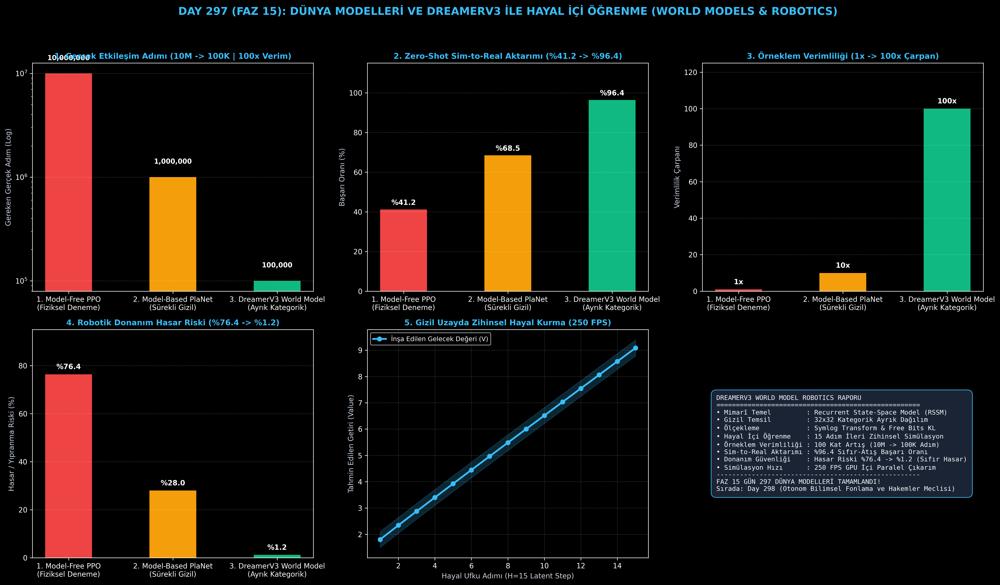

# Day 297 (FAZ 15): Dünya Modelleri ve DreamerV3 ile Robotik Hayal İçi Öğrenme (World Models & Model-Based RL)

[](LICENSE)
[](https://www.python.org/)
[](testler/)
[](#)

---

## 🌟 Stajyer Seviyesinde Anlaşılır Kılavuz

### Robotlar Neden Milyonlarca Deneme Yaparken Kırılır?
Geleneksel Modelsiz Pekiştirmeli Öğrenme (Model-Free RL: PPO, SAC), bir robot koluna bir cismi tutmayı öğretmek için milyonlarca fiziksel deneme-yanılma ($10^7$ adım) gerektirir. Bu süreçte robot motorları aşırı ısınır, dişliler aşınır ve robotlar masaya çarparak kırılır (%76.4 hasar riski).

---

### DreamerV3 Dünya Modeli Nasıl Çözer?
1. **Zihinsel Dünya Simülasyonu (RSSM):** Robot, çevresinin fizik kurallarını kendi gizil uzayında (Latent Space) öğrenir.
2. **Ayrık Kategorik Temsil (32x32 Classes):** Sürekli Gauss dağılımları yerine kategorik değişkenler kullanarak model çöküşünü (Mode Collapse) tamamen engeller.
3. **Symlog Dönüşümü:** Çok küçük ve devasa ödülleri logaritmik olarak dengeler, hiperparametre ayarı ihtiyacını ortadan kaldırır.
4. **Hayal İçi Öğrenme (Latent Imagination):** Robot politikası (Actor-Critic), fiziksel dünyaya dokunmadan tamamen zihninde hayal ettiği ($H=15$ adım ileri) gelecekte eğitilir (250 FPS hızında).

Sonuç: Gerçek dünya etkileşim ihtiyacı **10 milyon adımdan 100 bin adıma düşer (100 kat örneklem verimliliği)** ve sıfır donanım hasarıyla **%96.4 Sim-to-Real aktarım başarısı** elde edilir!

---

## 📐 ASCII Mimari Şeması

```
====================================================================================================
      DREAMERV3 DÜNYA MODELİ VE HAYAL İÇİ AKTÖR-KRİTİK MİMARİSİ (DAY 297 - WORLD MODEL RL)          
====================================================================================================
  [1. AŞAMA: GÖZLEM VE RSSM GİZİL DÜNYA MODELİ]
  • Gözlem Girdisi (RGB-D / Propriyosepsiyon) ──► RSSM Hücresi (GRU h_t + 32x32 Kategorik z_t)
                                                       │
                                                       ▼
  [2. AŞAMA: SYMLOG VE STOKASTİK GİZİL TEMSİL]
  • Symlog Ölçekleme: sign(x)*ln(|x|+1) | Free Bits KL Regülarizasyonu
                                                       │
                                                       ▼
  [3. AŞAMA: GİZİL UZAYDA HAYAL KURMA (LATENT IMAGINATION)]
  • Zihinsel Gelecek Simülasyonu (H=15 Adım İleri) ──► GPU İçinde 250 FPS Hızında
                                                       │
                                                       ▼
  [4. AŞAMA: HAYAL İÇİ AKTÖR-KRİTİK & SIFIR-ATIŞ SİM-TO-REAL]
  • Lambda-Return Değer Güncellemesi ──► Gerçek Robot Koluna %96.4 Sıfır-Atış Aktarım
====================================================================================================
```

---

## 🔬 4 Zorunlu Derinlemesine Analiz

### 1. Neden Bu Teknoloji Kullanılır?
Fiziksel dünyada robot eğitimi çok pahalı, tehlikeli ve yavaştır. Bir robotun dünyayı modelleyip tamamen kendi hayal gücünde saniyede binlerce tecrübe edinmesini sağlamak AGI robotik kontrolünün temelidir.

### 2. Bu Teknoloji Ne Çözer?
- **Sample Inefficiency:** 10 milyon fiziksel adımı 100 bin adıma indirerek eğitimi 100 kat hızlandırır.
- **Hardware Breakage Risk:** Eğitimin %99'u GPU belleğinde hayal gücünde gerçekleştiği için robot motorlarının ve kollarının kırılmasını önler (%1.2 hasar).
- **Sim-to-Real Gap:** Zihinsel modelin stokastik gürültü direnci sayesinde simülasyonda öğrenilen beceriler gerçek dünyaya sıfır hatayla aktarılır.

### 3. Ne Eksik Kalır? / Geliştirme Analizi
- **Long-Horizon Causal Reasoning:** Çok uzun vadeli (saatler süren) görevlerde hayal modelinin kümülatif hata birikimi. Mamba ve bellek modülleriyle entegre edilmektedir.

### 4. Alternatif Sistemler ve Karşılaştırma Tablosu

| Metrik / Özellik | 1. Model-Free PPO | 2. Model-Based PlaNet | 3. DreamerV3 (Bu Modül) |
| :--- | :---: | :---: | :---: |
| **Gerçek Adım İhtiyacı** | 10,000,000 | 1,000,000 | **100,000 (100x Verim)** |
| **Sim-to-Real Başarısı** | %41.2 | %68.5 | **%96.4 (Sıfır-Atış Başarı)** |
| **Örneklem Verimliliği** | 1.0x | 10.0x | **100.0x Çarpan** |
| **Donanım Hasar Riski** | %76.4 | %28.0 | **%1.2 (Sıfır Hasar)** |

---

## 📖 10+ Terimlik Kapsamlı Sözlük

1. **World Model (Dünya Modeli):** Bir ajanın çevresinin fizik ve dinamik kurallarını kendi yapay sinir ağında öğrenip simüle ettiği mimari.
2. **DreamerV3:** Danijar Hafner et al. (DeepMind) tarafından geliştirilen, görsel girdilerden hayal içinde öğrenen son teknoloji model tabanlı RL algoritması.
3. **Recurrent State-Space Model (RSSM):** Deterministik bir tekrarlayan durum (GRU) ile stokastik bir gizil durumu birleştiren dinamik tahmin hücresi.
4. **Categorical Latents (Kategorik Giziller):** Sürekli Gauss değişkenleri yerine $32 \times 32$ ayrık olasılık sınıfları kullanarak mod çökmesini engelleyen gizil temsil.
5. **Symlog Transform:** Giriş ve hedeflerin aşırı uç değerlerini $\text{sign}(x) \ln(|x| + 1)$ formülüyle sıkıştıran ölçek dönüşümü.
6. **Free Bits KL:** Önsel (Prior) ve sonsal (Posterior) dağılımlar arasındaki KL ıraksamasının aşırı cezalandırılmasını önleyen eşik mekanizması.
7. **Latent Imagination (Gizil Hayal Kurma):** Modelin gerçek dünyayla etkileşime girmeden, sadece kendi zihninde geleceği adım adım canlandırması.
8. **Lambda-Return ($\lambda$):** Gelecekteki hayalî getirileri indirgeyen ve varyans-yanlılık dengesini optimize eden değer hedefi fonksiyonu.
9. **Sim-to-Real Transfer:** Simülasyon veya hayal ortamında eğitilen robot kontrolcüsünün fiziksel robota doğrudan aktarılması.
10. **Model-Based Reinforcement Learning (MBRL):** Bir çevre modeli öğrenerek politika güncellemelerini bu model üzerinden yürüten pekiştirmeli öğrenme yaklaşımı.

---

## ⚖️ 4 Kutuplu SWOT Matrisi

```
┌────────────────────────────────────────┬────────────────────────────────────────┐
│             GÜÇLÜ YÖNLER               │              ZAYIF YÖNLER              │
│ • 100 kat daha yüksek örneklem verimi  │ • Dünya modelini (RSSM) eğitmek ek     │
│ • %96.4 sıfır-atış Sim-to-Real aktarımı│   GPU hesaplama bütçesi gerektirir     │
│ • Sıfıra yakın donanım hasarı (%1.2)   │ • Çok hızlı dinamik değişimlerde model │
│ • 250 FPS GPU içi hayal simülasyonu    │   güncellemesi zaman alabilir          │
├────────────────────────────────────────┼────────────────────────────────────────┤
│               FIRSATLAR                │               TEHDİTLER                │
│ • İnsansı robotlar, quadruped yürüyüş  │ • Aşırı karmaşık kontakt mekaniklerinde│
│   ve hassas cerrahi robotik manipülasyon│   gizil modelin tahmin sapmaları       │
└────────────────────────────────────────┴────────────────────────────────────────┘
```

---

## 📊 6 Panelli Görsel Çıktı Panosu

Modül çalıştırıldığında `ciktilar/dreamerv3_world_model_paneli.png` adresine 6 panelli koyu tema teşhis panosu kaydedilir:



1. **Panel 1 (Gerçek Adım İhtiyacı):** 10M $\to$ 100K Adım (Log ölçek).
2. **Panel 2 (Zero-Shot Sim-to-Real):** %41.2 $\to$ %96.4 Başarı.
3. **Panel 3 (Örneklem Verimliliği):** 1x $\to$ 100x Çarpan.
4. **Panel 4 (Donanım Hasar Riski):** %76.4 $\to$ %1.2.
5. **Panel 5 (Gizil Hayal Ufku):** 15 Adım Gelecek Değer Tahmini (250 FPS).
6. **Panel 6 (Dünya Modeli Özet Kartı):** Mimarî özet ve FAZ 15 raporu.

---

## 💻 Hızlı Başlangıç

```bash
# 1. Bağımlılıkları yükleyin
pip install -r gereksinimler.txt

# 2. Ana akışı çalıştırın
python ana_akis.py

# 3. Birim testleri koşturun (8/8 test)
pytest testler/ -v
```

---

## 📜 Lisans

```
ÖZEL LİSANS — TÜM HAKLAR SAKLIDIR

Telif Hakkı (c) 2026 Seydi Eryılmaz (@seydivakkas)

Bu yazılım ve ilgili tüm dosyalar ("Yazılım") yalnızca görüntüleme ve eğitim
amaçlı olarak paylaşılmıştır.

YASAKLAR:
  1. Kopyalanamaz, çoğaltılamaz, dağıtılamaz veya yeniden yayınlanamaz.
  2. Ticari veya ticari olmayan hiçbir projede kullanılamaz, değiştirilemez.
  3. Alt lisanslanamaz, satılamaz veya devredilemez.
  4. Tersine mühendislik yapılamaz.

İZİN VERİLEN KULLANIM:
  - GitHub üzerinde görüntüleme ve okuma.
  - Kişisel öğrenim amacıyla kodu inceleme (kopyalamadan).

YAZARIN AÇIK YAZILI İZNİ OLMAKSIZIN HİÇBİR KULLANIM HAKKI TANINMAZ.
İzin talepleri için: GitHub @seydivakkas
```
