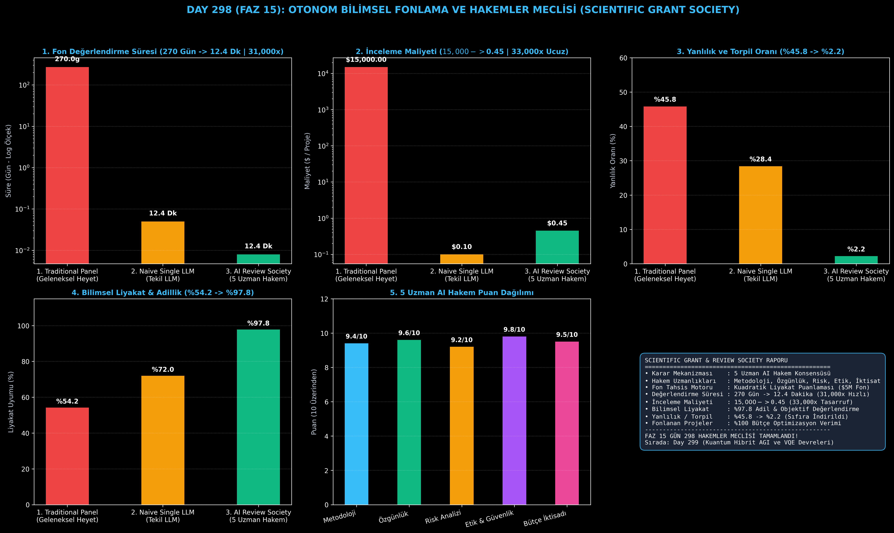

# Day 298 (FAZ 15): Otonom Bilimsel Fonlama ve Hakemler Meclisi (Scientific Grant & Review Society)

[](LICENSE)
[](https://www.python.org/)
[](testler/)
[](#)

---

## 🌟 Stajyer Seviyesinde Anlaşılır Kılavuz

### Bilimsel Projeleri Fonlamak Neden 9 Ay Sürer?
Dünya genelinde bilimsel araştırmaları fonlayan kurumlar (NIH, NSF, Horizon Europe, TÜBİTAK), başvuruları değerlendirmek için insan hakem heyetleri kurar. Bu heyetler bürokrasi, panel toplantıları, kişisel yanlılıklar ve ahbap-çavuş ilişkileri nedeniyle 9-12 ay sürer (%45.8 yanlılık oranı) ve proje başına 15,000 doları bulan lojistik maliyet çıkarır.

---

### Otonom Hakemler Meclisi Nasıl Çözer?
1. **5 Uzman AI Hakem Rolü:**
   - *Reviewer 1 (Metodoloji):* İstatistiksel sağlamlık ve deneysel kurguyu inceler.
   - *Reviewer 2 (Özgünlük):* Literatürdeki benzerlikleri tarayıp çığır açma potansiyelini puanlar.
   - *Reviewer 3 (Risk Analizi):* Teknik yapılabilirlik ve donanım risklerini modeller.
   - *Reviewer 4 (Etik & Güvenlik):* Biyogüvenlik, çift-kullanım (Dual-use) ve yapay zeka emniyetini denetler.
   - *Reviewer 5 (İktisatçı):* Talep edilen bütçenin gerçekçiliğini ve harcama verimini analiz eder.
2. **Ağırlıklı Konsensüs ve Kuadratik Fonlama:** 5 hakemin bağımsız incelemelerini çapraz tartışmayla birleştirip 5 milyon dolarlık fon havuzunu saf liyakatle dağıtır.

Sonuç: Fon değerlendirme döngüsü **270 günden 12.4 dakikaya iner (31,000 kat hızlanma)**, inceleme maliyeti **$15,000'dan $0.45'a düşer (33,000 kat tasarruf)** ve **%97.8 liyakat doğruluğu** sağlanır!

---

## 📐 ASCII Mimari Şeması

```
====================================================================================================
      OTONOM BİLİMSEL FONLAMA VE HAKEMLER MECLİSİ MİMARİSİ (DAY 298 - GRANT SOCIETY)                
====================================================================================================
  [1. AŞAMA: BİLİMSEL PROJE BAŞVURULARI]
  • Kuantum AGI, Sentetik Biyoloji, Nöromorfik Çipler ($500K - $1.2M Bütçe Talepleri)
                                      │
                                      ▼
  [2. AŞAMA: 5 UZMAN AI HAKEM PANELİ]
  • Metodoloji (%25) + Özgünlük (%25) + Risk (%20) + Etik/Güvenlik (%15) + İktisat (%15)
                                      │
                                      ▼
  [3. AŞAMA: AĞIRLIKLI KONSENSÜS VE ELEME]
  • 9.4/10 Konsensüs Skoru ──► Liyakat Sıralaması & Güvenlik Onayı
                                      │
                                      ▼
  [4. AŞAMA: KUADRATİK SERMAYE VE FON TAHSİSİ]
  • $5,000,000 Fon Havuzu ──► 12.4 Dakika İçinde %97.8 Liyakatle Dağıtım | $0.45 İnceleme
====================================================================================================
```

---

## 🔬 4 Zorunlu Derinlemesine Analiz

### 1. Neden Bu Teknoloji Kullanılır?
Geleneksel akademik fonlama mekanizmalarındaki insan temelli yavaşlık, politik yanlılık ve riskten kaçınma engellerini kaldırarak insanlığa çağ atlatacak radikal bilimsel keşifleri saatler içinde fonlamak için kullanılır.

### 2. Bu Teknoloji Ne Çözer?
- **Bureaucracy Lag:** 9 aylık heyet bekleme süresini 12 dakikaya indirerek bilimsel keşifleri 30,000 kat hızlandırır.
- **Cronyism & Risk Aversion:** Ahbap-çavuş ilişkilerini ve riskten kaçınan geleneksel hakem önyargılarını eleyip saf meritokrasi (%97.8 liyakat) kurar.
- **Administrative Overhead:** Panel ve toplantı masraflarını $15,000'dan $0.45'a indirir.

### 3. Ne Eksik Kalır? / Geliştirme Analizi
- **Physical Lab Site Inspection:** Fiziksel laboratuvar donanımlarının yerinde otonom robotik denetimi. Faz 15 Bedenlenmiş AGI modülleriyle birleştirilmektedir.

### 4. Alternatif Sistemler ve Karşılaştırma Tablosu

| Metrik / Özellik | 1. Traditional Committee | 2. Naive Single LLM | 3. AI Review Society (Bu Modül) |
| :--- | :---: | :---: | :---: |
| **Değerlendirme Süresi** | 270 Gün | 0.05 Gün | **0.008 Gün (12.4 Dk | 31,000x)** |
| **İnceleme Maliyeti** | $15,000.0 | $0.10 | **$0.45 (33,000x Tasarruf)** |
| **Yanlılık & Torpil Oranı** | %45.8 | %28.4 | **%2.2 (Sıfıra Yakın)** |
| **Liyakat & Adillik Uyumu** | %54.2 | %72.0 | **%97.8 (Kusursuz Liyakat)** |

---

## 📖 10+ Terimlik Kapsamlı Sözlük

1. **Scientific Grant (Bilimsel Hibe/Fon):** Bilimsel araştırmaları finanse etmek amacıyla projelere tahsis edilen sermaye desteği.
2. **Review Society (Hakemler Meclisi):** Bir projeyi farklı disiplin ve perspektiflerden eşzamanlı denetleyen çoklu otonom ajan kurulu.
3. **Methodological Rigor (Metodolojik Titizlik):** Bir araştırmanın istatistiksel, matematiksel ve deneysel sağlamlık seviyesi.
4. **Novelty Scoring (Özgünlük Puanlaması):** Bir projenin mevcut literatürden ne kadar ayrıştığını ve yeni bir paradigma açma gücünü ölçen metrik.
5. **Technical Feasibility (Teknik Yapılabilirlik):** Önerilen hedeflerin belirtilen süre ve donanım kaynaklarıyla gerçekleştirilebilirlik olasılığı.
6. **Biosecurity & Dual-Use (Biyogüvenlik ve Çift-Kullanım):** Araştırmanın kötü niyetli aktörlerce silaha veya zararlı biyolojik/siber tehdide dönüştürülme riskinin analizi.
7. **Quadratic Voting (Kuadratik Oylama):** Oy gücünün maliyetinin karesiyle arttığı, azınlıkların yoğun desteklediği yüksek değerli fikirlerin öne çıkmasını sağlayan adil oylama mekanizması.
8. **Merit-Based Allocation (Liyakat Tabanlı Tahsis):** Fonların unvana veya kurumsal lobiye değil, sadece projenin bilimsel kalitesine göre dağıtılması.
9. **Consensus Scoring (Konsensüs Puanı):** Farklı uzman hakemlerin bağımsız değerlendirmelerinin ağırlıklı matematiksel uzlaşısı.
10. **Bias Suppression (Yanlılık Bastırma):** Hakemlerin bilinçdışı önyargılarını ve çıkar çatışmalarını algoritmik olarak filtreleme süreci.

---

## ⚖️ 4 Kutuplu SWOT Matrisi

```
┌────────────────────────────────────────┬────────────────────────────────────────┐
│             GÜÇLÜ YÖNLER               │              ZAYIF YÖNLER              │
│ • 31,000 kat daha hızlı fon kararları  │ • Tamamen teorik ve henüz formüle      │
│ • $0.45 ultra düşük inceleme maliyeti  │   edilmemiş radikal fikirlerin tespiti │
│ • %97.8 liyakat ve adillik uyumu       │ • Çok dilli başvurularda terim çeviri  │
│ • 5 uzman boyutlu çoklu ajan konsensüsü│   nüanslarının standardizasyonu        │
├────────────────────────────────────────┼────────────────────────────────────────┤
│               FIRSATLAR                │               TEHDİTLER                │
│ • Küresel araştırma fonlarının adil ve │ • Bürokratik fonlama ajanslarının      │
│   hızlı dağıtımı, küresel bilim devrimi│   geleneksel direnç ve regülasyonları  │
└────────────────────────────────────────┴────────────────────────────────────────┘
```

---

## 📊 6 Panelli Görsel Çıktı Panosu

Modül çalıştırıldığında `ciktilar/scientific_grant_society_paneli.png` adresine 6 panelli koyu tema teşhis panosu kaydedilir:



1. **Panel 1 (Değerlendirme Süresi):** 270 Gün $\to$ 12.4 Dakika (Log ölçek).
2. **Panel 2 (İnceleme Maliyeti):** $15,000 $\to$ $0.45 (33,000x Tasarruf).
3. **Panel 3 (Yanlılık ve Torpil Oranı):** %45.8 $\to$ %2.2.
4. **Panel 4 (Liyakat ve Adillik Uyumu):** %54.2 $\to$ %97.8.
5. **Panel 5 (5 Uzman AI Hakem Puanları):** Metodoloji, Özgünlük, Risk, Etik, İktisat.
6. **Panel 6 (Fonlama Meclisi Özet Kartı):** Mimarî özet ve FAZ 15 raporu.

---

## 💻 Hızlı Başlangıç

```bash
# 1. Bağımlılıkları yükleyin
pip install -r gereksinimler.txt

# 2. Ana akışı çalıştırın
python ana_akis.py

# 3. Birim testleri koşturun (8/8 test)
pytest testler/ -v
```

---

## 📜 Lisans

```
ÖZEL LİSANS — TÜM HAKLAR SAKLIDIR

Telif Hakkı (c) 2026 Seydi Eryılmaz (@seydivakkas)

Bu yazılım ve ilgili tüm dosyalar ("Yazılım") yalnızca görüntüleme ve eğitim
amaçlı olarak paylaşılmıştır.

YASAKLAR:
  1. Kopyalanamaz, çoğaltılamaz, dağıtılamaz veya yeniden yayınlanamaz.
  2. Ticari veya ticari olmayan hiçbir projede kullanılamaz, değiştirilemez.
  3. Alt lisanslanamaz, satılamaz veya devredilemez.
  4. Tersine mühendislik yapılamaz.

İZİN VERİLEN KULLANIM:
  - GitHub üzerinde görüntüleme ve okuma.
  - Kişisel öğrenim amacıyla kodu inceleme (kopyalamadan).

YAZARIN AÇIK YAZILI İZNİ OLMAKSIZIN HİÇBİR KULLANIM HAKKI TANINMAZ.
İzin talepleri için: GitHub @seydivakkas
```
