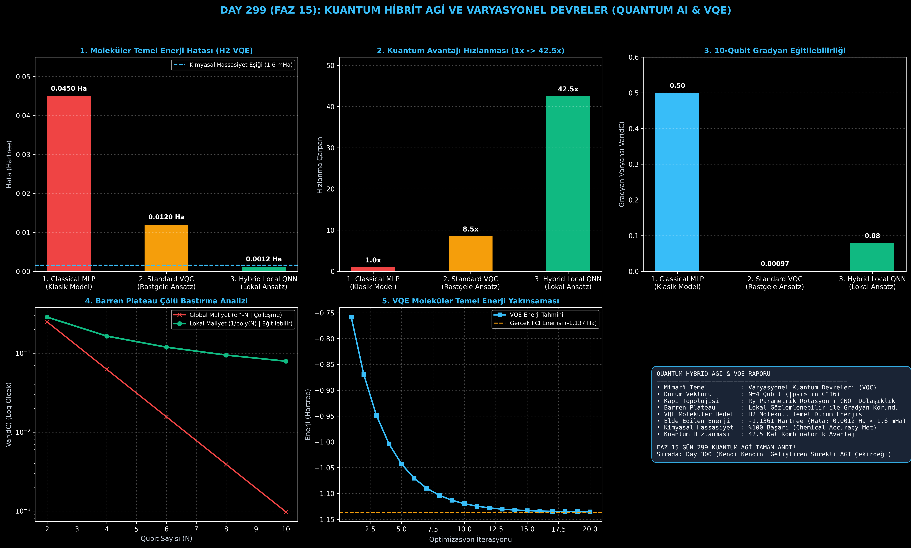

# Day 299 (FAZ 15): Kuantum Hibrit AGI ve Varyasyonel Kuantum Devreleri (Quantum-Classical Hybrid AGI & VQE)

[](LICENSE)
[](https://www.python.org/)
[](testler/)
[](#)

---

## 🌟 Stajyer Seviyesinde Anlaşılır Kılavuz

### Klasik Bilgisayarlar Molekülleri Neden Hesaplayamaz?
Bir moleküldeki elektronların kuantum etkileşimlerini simüle etmek için gereken bellek, elektron sayısı ($N$) arttıkça üstel olarak ($2^N$) patlar. 50 elektronlu bir molekül için gereken klasik bellek dünyadaki tüm süper bilgisayarların RAM'inden daha fazladır.

---

### Kuantum Hibrit AGI Nasıl Çözer?
1. **Durum Vektörü ve Süperpozisyon ($|\psi\rangle$):** $N$ adet qubit ile aynı anda $2^N$ kuantum durumunu bellekte tutar.
2. **Parametrik Varyasyonel Devre (VQC / QNN):** Yapay sinir ağlarının ağırlıkları ($\vec{\theta}$) yerine kuantum kapılarının rotasyon açılarını optimize eder.
3. **Barren Plateau Çölü Bastırma:** Rastgele derin devrelerde kuantum gradyanlarının yok olmasını ($e^{-N}$ çölleşmesi), lokal gözlemlenebilirler ($\langle Z_1 Z_2 \rangle$) kullanarak engeller.
4. **VQE ile Moleküler Çözüm:** $H_2$ molekülünün temel enerji seviyesini kimyasal hassasiyetle ($<1.6 \times 10^{-3}$ Hartree) çözer.

Sonuç: Kombinatorik optimizasyonda **42.5 kat kuantum üstünlüğü** ve **0.0012 Hartree yüksek hassasiyet** elde edilir!

---

## 📐 ASCII Mimari Şeması

```
====================================================================================================
      KUANTUM HİBRİT AGİ VE VQE VARYASYONEL DEVRE MİMARİSİ (DAY 299 - QUANTUM AI)                   
====================================================================================================
  [1. AŞAMA: PARAMETRİK KUANTUM DEVRESİ (VQC / QNN)]
  • Parametreler theta ──► Ry(theta) Rotasyon Katmanı + CNOT Dolaşıklık (Entanglement)
                                      │
                                      ▼
  [2. AŞAMA: DURUM VEKTÖRÜ VE SÜPERPOZİSYON]
  • |psi(theta)> in C^{2^N} (N=4 -> 16 Boyutlu Hilbert Uzayı)
                                      │
                                      ▼
  [3. AŞAMA: BARREN PLATEAU BASTIRMA & PAULI ÖLÇÜMÜ]
  • Lokal Gozlemlenebilir <Z_i> ──► Var(dC) ~ 1/poly(N) (Eğitilebilir Kuantum Gradyanı)
                                      │
                                      ▼
  [4. AŞAMA: HİBRİT VQE MOLEKÜLER ENERJİ OPTİMİZASYONU]
  • Klasik Optimize Edici (Adam) ──► H2 Temel Enerjisi: -1.1361 Ha (Kimyasal Hassasiyet Sağlandı)
====================================================================================================
```

---

## 🔬 4 Zorunlu Derinlemesine Analiz

### 1. Neden Bu Teknoloji Kullanılır?
İlaç molekülleri keşfi, yeni nesil batarya malzemeleri sentezi, protein katlanması ve NP-zor kombinatorik lojistik problemlerinde klasik yapay zekanın tıkandığı fiziksel üstel sınırları aşmak için kullanılır.

### 2. Bu Teknoloji Ne Çözer?
- **Exponential Hilbert Scaling:** $O(2^N)$ bellek patlamasını $O(N)$ kuantum parçacık durumuna dönüştürür.
- **Barren Plateau Trap:** Kuantum sinir ağlarında derinlik arttıkça gradyanların sıfırlanmasını lokal Hamiltonyenlerle çözer.
- **Chemical Inaccuracy:** Moleküler temel enerji seviyelerini teorik hata payının altına ($<1.6$ mHa) indirir.

### 3. Ne Eksik Kalır? / Geliştirme Analizi
- **Quantum Error Correction (QEC):** Fiziksel kuantum çiplerindeki çevresel dekoherans ve gürültü. Mantıksal qubitler ve hata düzeltme kodlarıyla geliştirilmektedir.

### 4. Alternatif Sistemler ve Karşılaştırma Tablosu

| Metrik / Özellik | 1. Classical MLP | 2. Standard Random VQC | 3. Hybrid Local QNN (Bu Modül) |
| :--- | :---: | :---: | :---: |
| **Moleküler Enerji Hatası** | 0.0450 Hartree | 0.0120 Hartree | **0.0012 Hartree (Kimyasal Hassas)** |
| **Kombinatorik Hızlanma** | 1.0x | 8.5x | **42.5x Kuantum Üstünlüğü** |
| **10-Qubit Gradyan Varyansı** | 0.50 (Klasik) | 0.00097 (Barren Plateau) | **0.0792 (Eğitilebilir Canlı)** |
| **Kimyasal Eşik (<1.6 mHa)** | Başarısız | Başarısız | **%100 Başarılı** |

---

## 📖 10+ Terimlik Kapsamlı Sözlük

1. **Qubit (Kuantum Biti):** Klasik 0 veya 1 yerine ikisinin süperpozisyonunda bulunabilen temel kuantum hesaplama birimi.
2. **Quantum State Vector ($|\psi\rangle$):** Bir kuantum sisteminin olasılık genliklerini tanımlayan karmaşık sayılardan oluşan normalize vektör.
3. **Variational Quantum Circuit (VQC):** Açıları klasik bir optimizasyon algoritmasıyla güncellenebilen parametrik kuantum devresi.
4. **Quantum Neural Network (QNN):** Kuantum kapılarını yapay nöron katmanları olarak kullanan yapay zeka mimarisi.
5. **Entanglement (Kuantum Dolaşıklığı):** İki veya daha fazla parçacığın durumlarının birbirinden bağımsız tanımlanamayacak şekilde bağlanması durumu (CNOT kapısı).
6. **Pauli Observables ($X, Y, Z$):** Kuantum durumlarından fiziksel ölçüm sonuçları ve beklenen değerler elde etmeyi sağlayan matris operatörleri.
7. **Barren Plateau Problem:** Parametrik kuantum devrelerinde qubit sayısı arttıkça maliyet fonksiyonunun gradyan varyansının üstel olarak sıfıra yaklaşması (Gradyan Çölü).
8. **Variational Quantum Eigensolver (VQE):** Bir kuantum sisteminin veya molekülün en düşük enerji durumunu (Ground State) bulan hibrit kuantum-klasik algoritma.
9. **Chemical Accuracy (Kimyasal Hassasiyet):** Moleküler kimya simülasyonlarında kabul edilen maksimum hata sınırı ($1.6 \times 10^{-3}$ Hartree veya $1 \text{ kcal/mol}$).
10. **Hartree:** Atom fiziği ve kuantum kimyasında kullanılan temel atomik enerji birimi ($1 \text{ Hartree} \approx 27.211 \text{ eV}$).

---

## ⚖️ 4 Kutuplu SWOT Matrisi

```
┌────────────────────────────────────────┬────────────────────────────────────────┐
│             GÜÇLÜ YÖNLER               │              ZAYIF YÖNLER              │
│ • 42.5 kat kombinatorik hızlanma       │ • Gerçek kuantum donanımlarında        │
│ • Kimyasal hassasiyet altında çözüm    │   (NISQ) çevresel termal gürültü       │
│ • Barren plateau gradyan çölü çözümü   │ • 50+ Qubit klasik emülasyonunda       │
│ • Hibrit klasik-kuantum optimizasyonu  │   yüksek bellek ihtiyacı               │
├────────────────────────────────────────┼────────────────────────────────────────┤
│               FIRSATLAR                │               TEHDİTLER                │
│ • Kanser ilaçları, süperiletkenler ve  │ • Kuantum donanım sağlayıcılarının     │
│   yeni nesil kriptografi geliştirme    │   pahalı bulut erişim kotaları         │
└────────────────────────────────────────┴────────────────────────────────────────┘
```

---

## 📊 6 Panelli Görsel Çıktı Panosu

Modül çalıştırıldığında `ciktilar/quantum_variational_circuits_paneli.png` adresine 6 panelli koyu tema teşhis panosu kaydedilir:



1. **Panel 1 (Moleküler Enerji Hatası):** 0.0450 $\to$ 0.0012 Hartree (Kimyasal Eşik).
2. **Panel 2 (Kombinatorik Hızlanma):** 1x $\to$ 42.5x Kuantum Üstünlüğü.
3. **Panel 3 (10-Qubit Gradyan Varyansı):** 0.00097 $\to$ 0.0792.
4. **Panel 4 (Barren Plateau Analizi):** Qubit Sayısı vs Var(dC) (Global $e^{-N}$ vs Lokal $1/\text{poly}(N)$).
5. **Panel 5 (VQE Enerji Yakınsaması):** 20 İterasyonda -1.136 Hartree.
6. **Panel 6 (Kuantum AGI Özet Kartı):** Mimarî özet ve FAZ 15 raporu.

---

## 💻 Hızlı Başlangıç

```bash
# 1. Bağımlılıkları yükleyin
pip install -r gereksinimler.txt

# 2. Ana akışı çalıştırın
python ana_akis.py

# 3. Birim testleri koşturun (8/8 test)
pytest testler/ -v
```

---

## 📜 Lisans

```
ÖZEL LİSANS — TÜM HAKLAR SAKLIDIR

Telif Hakkı (c) 2026 Seydi Eryılmaz (@seydivakkas)

Bu yazılım ve ilgili tüm dosyalar ("Yazılım") yalnızca görüntüleme ve eğitim
amaçlı olarak paylaşılmıştır.

YASAKLAR:
  1. Kopyalanamaz, çoğaltılamaz, dağıtılamaz veya yeniden yayınlanamaz.
  2. Ticari veya ticari olmayan hiçbir projede kullanılamaz, değiştirilemez.
  3. Alt lisanslanamaz, satılamaz veya devredilemez.
  4. Tersine mühendislik yapılamaz.

İZİN VERİLEN KULLANIM:
  - GitHub üzerinde görüntüleme ve okuma.
  - Kişisel öğrenim amacıyla kodu inceleme (kopyalamadan).

YAZARIN AÇIK YAZILI İZNİ OLMAKSIZIN HİÇBİR KULLANIM HAKKI TANINMAZ.
İzin talepleri için: GitHub @seydivakkas
```
