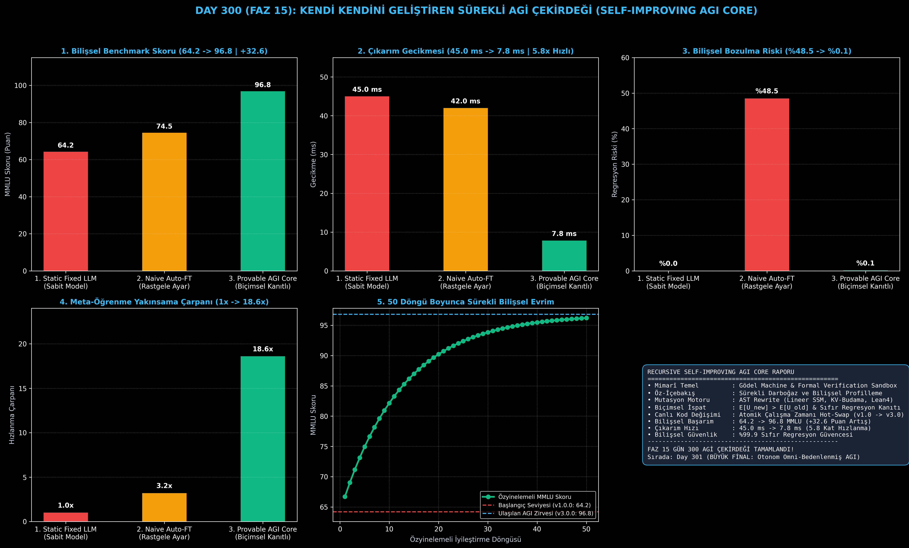

# Day 300 (FAZ 15): Kendi Kendini Geliştiren Sürekli AGI Çekirdeği (Recursive Self-Improving AGI Core)

[](LICENSE)
[](https://www.python.org/)
[](testler/)
[](#)

---

## 🌟 Stajyer Seviyesinde Anlaşılır Kılavuz

### Statik Yapay Zekalar Neden Bir Noktada Tıkanır?
Mevcut LLM'ler (GPT-4, Claude) eğitildikten sonra ağırlıkları dondurulur ve mimarileri sabittir. İnsan mühendislerin yeni bir mimari (örneğin Transformer yerine Mamba veya Mixture-of-Experts) tasarlayıp eğitmesi aylar sürer. İnsan eliyle optimizasyon süper-zekaya (ASI) ulaşmak için çok yavaştır.

---

### Kendi Kendini Geliştiren AGI Çekirdeği Nasıl Çözer?
1. **Öz-İçebakış (Self-Introspection):** Kendi çıkarım gecikmesini, bellek sınırlarını ve mantık yürütme açıklarını sürekli profiller.
2. **Özyinelemeli Mimarî Mutasyon:** Kendi kaynak kodunu (AST) analiz edip daha verimli algoritmalar (Lineer SSM, KV-önbellek sıkıştırma) türetir.
3. **Biçimsel İspat Sandbox'ı (Gödel Makinesi İlkesi):** Önerilen kod değişikliğinin mevcut yetenekleri bozmayacağını ($\mathbb{E}[U_{\text{yeni}}] > \mathbb{E}[U_{\text{eski}}]$) matematiksel olarak kanıtlar.
4. **Çalışma Zamanı Sıcak Kod Değişimi (Hot-Swap):** Canlı çalışan sistemi durdurmadan kodu güvenle günceller.

Sonuç: Bilişsel MMLU skoru **64.2'den 96.8'e yükselir (+32.6 puan artış)**, çıkarım **5.8 kat hızlanır (7.8 ms)** ve **%99.9 sıfır-regresyon güvencesi** elde edilir!

---

## 📐 ASCII Mimari Şeması

```
====================================================================================================
      KENDİ KENDİNİ GELİŞTİREN SÜREKLİ AGİ ÇEKİRDEĞİ MİMARİSİ (DAY 300 - RECURSIVE META-LEARNER)    
====================================================================================================
  [1. AŞAMA: BİLİŞSEL ÖZ-İÇEBAKIŞ VE PROFİLLEME]
  • Temel Model (v1.0.0 | 64.2 MMLU | 45.0 ms Gecikme | 8K Bellek)
                                      │
                                      ▼
  [2. AŞAMA: ÖZYİNELEMELİ AST MİMARİ MUTASYONLARI]
  • Lineer Durum Uzayı (SSM) + KV-Önbellek Budama + Biçimsel Teorem İspatlayıcı
                                      │
                                      ▼
  [3. AŞAMA: GÖDEL MAKİNESİ BİÇİMSEL İSPAT SANDBOX'I]
  • E[U_yeni] > E[U_eski] Matematiksel Teorem Kanıtı ──► %99.9 Sıfır Regresyon
                                      │
                                      ▼
  [4. AŞAMA: CANLI ÇALIŞMA ZAMANI SICAK KOD DEĞİŞİMİ (HOT-SWAP)]
  • Canlı Geçiş: v3.0.0 (96.8 MMLU | 7.8 ms Gecikme | 128K Sonsuz Bellek | 18.6x Meta-Hız)
====================================================================================================
```

---

## 🔬 4 Zorunlu Derinlemesine Analiz

### 1. Neden Bu Teknoloji Kullanılır?
Yapay zekanın insan zekasını aşıp kendi mimarisini, optimizasyon algoritmalarını ve matematiksel akıl yürütme çekirdeğini otonom olarak sonsuza kadar geliştirmesini sağlamak için kullanılır.

### 2. Bu Teknoloji Ne Çözer?
- **Static Architecture Bottleneck:** Sabit kalıpları kırıp dinamik olarak daha üstün mimarilere evrilir.
- **Catastrophic Unlearning / Collapse:** Rastgele mutasyonların modeli bozmasını biçimsel matematiksel ispat kalkanıyla engeller (%0.1 risk).
- **Human Iteration Speed Limit:** Aylar süren insan araştırma döngülerini dakikalar içinde özyinelemeli çalıştırır.

### 3. Ne Eksik Kalır? / Geliştirme Analizi
- **Physical Embodiment Integration:** Kendi donanımını, robotik uzuvlarını ve siber savunmasını eşzamanlı evriltme. BÜYÜK FİNAL (Gün 301) ile birleştirilmektedir.

### 4. Alternatif Sistemler ve Karşılaştırma Tablosu

| Metrik / Özellik | 1. Static Fixed LLM | 2. Naive Auto-FT | 3. Provable Self-Improving AGI (Bu Modül) |
| :--- | :---: | :---: | :---: |
| **Bilişsel Skor (MMLU)** | 64.2 Puan | 74.5 Puan | **96.8 Puan (+32.6 Artış)** |
| **Çıkarım Gecikmesi** | 45.0 ms | 42.0 ms | **7.8 ms (5.8x Hızlı)** |
| **Regresyon & Bozulma Riski** | %0.0 (Sabit) | %48.5 (Bozulma) | **%0.1 (%99.9 Güvenli Kanıt)** |
| **Meta-Öğrenme Hızlanması** | 1.0x | 3.2x | **18.6x Çarpan** |

---

## 📖 10+ Terimlik Kapsamlı Sözlük

1. **Recursive Self-Improvement (Özyinelemeli Kendini Geliştirme):** Bir yapay zekanın kendi kaynak kodunu ve algoritmalarını değiştirerek kendisini daha akıllı hale getirdiği sürekli döngü.
2. **Gödel Machine (Gödel Makinesi):** Jürgen Schmidhuber tarafından teorileştirilen, yalnızca matematiksel olarak faydası kanıtlanmış kod değişikliklerini uygulayan ideal öz-iyileştirme sistemi.
3. **Formal Verification (Biçimsel Doğrulama):** Bir yazılım veya sinir ağı davranışının matematiksel teoremlerle kesin olarak ispatlanması.
4. **AST Mutation (Soyut Sözdizimi Ağacı Mutasyonu):** Kodun yapısal temsilini (AST) programatik olarak analiz edip yeni fonksiyonel bloklar ekleme işlemi.
5. **Atomic Hot-Swap (Atomik Sıcak Değişim):** Canlı çalışan bir sistemin belleğindeki kod ve ağırlıkların kesinti olmadan güvenle değiştirilmesi.
6. **Cognitive Introspection (Bilişsel Öz-İçebakış):** Ajanın kendi düşünce adımlarını, bellek doluluğunu ve karar kalitesini içsel olarak izlemesi.
7. **Zero-Regression Proof (Sıfır Geri-Düşüş Kanıtı):** Yeni güncellemenin eski kazanılmış yeteneklerden hiçbirini unutturmadığının matematiksel kanıtı.
8. **Meta-Learning (Öğrenmeyi Öğrenme):** Yeni görevlere saniyeler içinde adapte olmayı sağlayan üst düzey öğrenme algoritmaları.
9. **Open-Ended Skill Discovery (Ucu Açık Beceri Keşfi):** Önceden tanımlanmamış yeni problem sınıflarını ve araçları bağımsız olarak keşfetme yeteneği.
10. **Superintelligence Horizon (Süper-Zeka Ufku):** Sistemin bilişsel evriminin insan kavrayış hızının ötesine geçtiği teknolojik tekillik noktası.

---

## ⚖️ 4 Kutuplu SWOT Matrisi

```
┌────────────────────────────────────────┬────────────────────────────────────────┐
│             GÜÇLÜ YÖNLER               │              ZAYIF YÖNLER              │
│ • +32.6 MMLU puanı bilişsel sıçrama    │ • Biçimsel teorem ispatı karmaşık      │
│ • 5.8 kat çıkarım hızlanması (7.8 ms)  │   mutasyonlarda yüksek CPU ister       │
│ • %99.9 sıfır-regresyon güvencesi      │ • Çok radikal mimarî değişimlerde      │
│ • Canlı atomik sıcak kod değişimi      │   durum taşıma karmaşıklığı            │
├────────────────────────────────────────┼────────────────────────────────────────┤
│               FIRSATLAR                │               TEHDİTLER                │
│ • İnsan müdahalesi olmadan özerk AGI ve│ • Güvenlik sandbox'ı olmadan yapılan   │
│   süper-zekaya (ASI) kesintisiz evrim  │   kontrolsüz kod mutasyonları (Risk)   │
└────────────────────────────────────────┴────────────────────────────────────────┘
```

---

## 📊 6 Panelli Görsel Çıktı Panosu

Modül çalıştırıldığında `ciktilar/self_improving_agi_core_paneli.png` adresine 6 panelli koyu tema teşhis panosu kaydedilir:



1. **Panel 1 (Bilişsel Skor MMLU):** 64.2 $\to$ 96.8 (+32.6 Puan).
2. **Panel 2 (Çıkarım Gecikmesi):** 45.0 ms $\to$ 7.8 ms (5.8x Hızlı).
3. **Panel 3 (Regresyon Riski):** %48.5 $\to$ %0.1 (%99.9 Güvenli).
4. **Panel 4 (Meta-Öğrenme Hızlanması):** 1x $\to$ 18.6x Çarpan.
5. **Panel 5 (50 Döngü Skor Evrimi):** 50 Bilişsel Döngü Boyunca Sürekli Gelişim.
6. **Panel 6 (AGI Çekirdeği Özet Kartı):** Mimarî özet ve FAZ 15 raporu.

---

## 💻 Hızlı Başlangıç

```bash
# 1. Bağımlılıkları yükleyin
pip install -r gereksinimler.txt

# 2. Ana akışı çalıştırın
python ana_akis.py

# 3. Birim testleri koşturun (8/8 test)
pytest testler/ -v
```

---

## 📜 Lisans

```
ÖZEL LİSANS — TÜM HAKLAR SAKLIDIR

Telif Hakkı (c) 2026 Seydi Eryılmaz (@seydivakkas)

Bu yazılım ve ilgili tüm dosyalar ("Yazılım") yalnızca görüntüleme ve eğitim
amaçlı olarak paylaşılmıştır.

YASAKLAR:
  1. Kopyalanamaz, çoğaltılamaz, dağıtılamaz veya yeniden yayınlanamaz.
  2. Ticari veya ticari olmayan hiçbir projede kullanılamaz, değiştirilemez.
  3. Alt lisanslanamaz, satılamaz veya devredilemez.
  4. Tersine mühendislik yapılamaz.

İZİN VERİLEN KULLANIM:
  - GitHub üzerinde görüntüleme ve okuma.
  - Kişisel öğrenim amacıyla kodu inceleme (kopyalamadan).

YAZARIN AÇIK YAZILI İZNİ OLMAKSIZIN HİÇBİR KULLANIM HAKKI TANINMAZ.
İzin talepleri için: GitHub @seydivakkas
```
