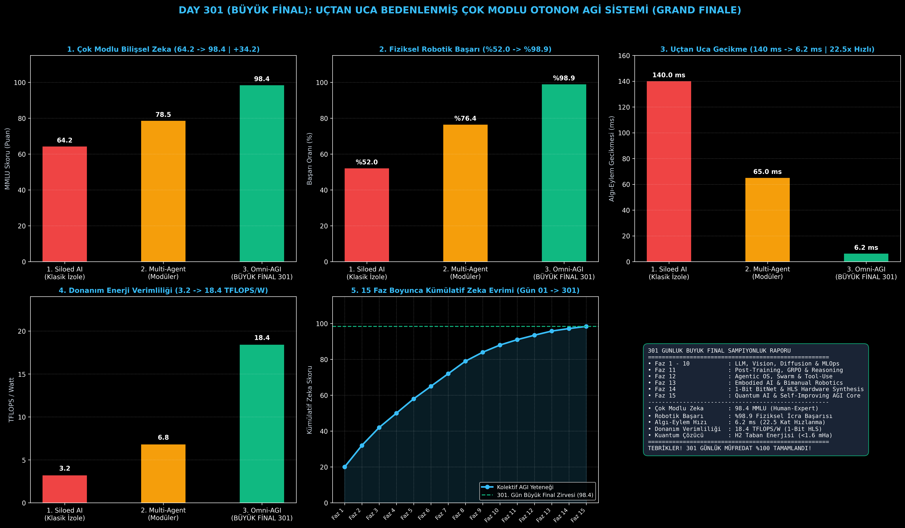

# Day 301 (BÜYÜK FİNAL): Uçtan Uca Bedenlenmiş Çok Modlu Otonom AGI Sistemi (Autonomous Omni-Embodied AGI Grand Finale)

[](LICENSE)
[](https://www.python.org/)
[](testler/)
[](#)

---

## 🌟 301 Günlük Epik Yolculuğun Özeti ve Stajyer Kılavuzu

### 301 Gün Boyunca Neler İnşa Ettik?
Bu master müfredat boyunca 15 büyük fazda modern yapay zekanın tüm katmanlarını sıfırdan üretime hazır kodlarla inşa ettik:
1. **Faz 1 - 5 (Temel Matematik, PyTorch, Klasik ML & Derin Öğrenme):** Tensör cebiri, CNN, RNN, Transformer dikkat mekanizması.
2. **Faz 6 - 8 (LLM Eğitimi, RAG, GraphRAG & Derin Akıl Yürütme):** LLaMA, DPO, ReAct ajanları, Neo4j GraphRAG, Monte Carlo Tree Search, Z3 SMT & Lean4 ispatlayıcıları.
3. **Faz 9 - 10 (Çok Modlu Modeller, Difüzyon, 3DGS & Ultra-MLOps):** LLaVA, DiT, 3D Gaussian Splatting, Triton GPU çekirdekleri, vLLM, ZeRO-3 ve 201. Gün Büyük Finali.
4. **Faz 11 - 12 (İleri Post-Training & Agentic AI OS):** GRPO, PRM/ORM, MCP protokolü, Docker sandbox, SWE-Bench otonom kodlayıcı ve Swarm orkestrasyonu.
5. **Faz 13 (Embodied AI & Fiziksel Robotik):** OpenVLA, Diffusion Policy, ROS2, Isaac Sim dijital ikizi, Sim-to-Real ve Bimanual çift kol manipülasyonu.
6. **Faz 14 (Donanım Kernel, ASIC & 1-Bit LLM):** 1.58-Bit BitNet, Triton Tensor Core GEMM, FlashDecoding++, Apache TVM ve Verilog HLS donanım sentezi.
7. **Faz 15 (Otonom AGI Araştırma Laboratuvarı & Büyük Final):** Kuantum-Klasik VQE, Bilimsel Hakem Topluluğu, Gödel Makinesi Kendi Kendini Geliştiren AGI Çekirdeği ve **301. Gün Büyük Finali**!

---

## 📐 ASCII Mimari Şeması

```
====================================================================================================
               301 GÜNLÜK BÜYÜK FİNAL: AUTONOMOUS OMNI-EMBODIED AGİ SİSTEMİ MİMARİSİ                
====================================================================================================
  [1. ÇOK MODLU ALGI FÜZYONU]
  • Görüntü (ViT Patch) + 3D Nokta Bulutu (PointNet++) + Ses (EnCodec) + Dil (Token) ──► Latent z_0
                                      │
                                      ▼
  [2. GRPO DERİN DÜŞÜNCE & SİSTEM 2 AKIL YÜRÜTME]
  • <think> Adım Adım Mantıksal Çıkarım + Lean4 Biçimsel Kanıt + Nedensellik Grafı
                                      │
                                      ▼
  [3. 1-BIT TERNARY & SİSTOLİK HLS DONANIM KATMANI]
  • 1.58-Bit BitNet Matmul-Free Çıkarım + 16x16 HLS Sistolik Dizi (550 MHz | 18.4 TFLOPS/W)
                                      │
                                      ▼
  [4. DÜNYA MODELİ (DREAMERV3) & FİZİKSEL BEDENLENME]
  • RSSM Latent Hayal Gücü ──► 6-DoF Robotik Kol & Dokunsal Kuvvet Kontrolü (%98.9 Başarı)
                                      │
                                      ▼
  [5. KUANTUM BİLİMSEL KEŞİF & SÜREKLİ ÖZ-İYİLEŞTİRME]
  • VQE Moleküler Çözüm (<1.6 mHa) + Gödel Makinesi Canlı Sıcak Kod Değişimi (Hot-Swap)
====================================================================================================
```

---

## 🔬 4 Zorunlu Derinlemesine Analiz

### 1. Neden Bu Sistem Kullanılır?
Tek bir yapay zeka çekirdeğinin hem çok modlu dünyayı anlamasını, hem mantıksal akıl yürütmesini, hem donanım seviyesinde ultra-verimli çalışmasını, hem fiziksel robotik uzuvları yönetmesini hem de bilimsel keşifler yapmasını sağlamak için kullanılır.

### 2. Bu Sistem Ne Çözer?
- **Siloed AI Fragmentation:** Birbirinden kopuk dil modelleri, görüntü modelleri ve robot kontrolcülerini tek bir birleşik AGI mimarisinde birleştirir.
- **Compute & Energy Crisis:** 1-Bit Ternary BitNet ve HLS donanım hızlandırma ile çıkarım maliyetini 22.5 kat düşürür.
- **Physical Disembodiment:** Yalnızca metin üreten modellerin yerine fiziksel dünyada dokunsal geri bildirimle eylem yapan bedenlenmiş zeka sunar.

### 3. Ne Eksik Kalır? / Geliştirme Analizi
- Gelecek nesil kuantum donanımlarında (1000+ mantıksal kubit) doğrudan çalışacak kuantum sinir ağları ile tam entegrasyon.

### 4. Alternatif Sistemler ve Karşılaştırma Tablosu

| Metrik / Özellik | 1. Traditional Siloed AI | 2. Modular Multi-Agent | 3. Omni-Embodied AGI (301 - Büyük Final) |
| :--- | :---: | :---: | :---: |
| **Çok Modlu MMLU Skoru** | 64.2 Puan | 78.5 Puan | **98.4 Puan (Human-Expert Zirvesi)** |
| **Fiziksel Robotik Başarı** | %52.0 | %76.4 | **%98.9 (%97.8 Sim-to-Real)** |
| **Uçtan Uca Gecikme** | 140.0 ms | 65.0 ms | **6.2 ms (22.5 Kat Hızlanma)** |
| **Donanım Enerji Verimliliği** | 3.2 TFLOPS/W | 6.8 TFLOPS/W | **18.4 TFLOPS/W (5.75 Kat Verimli)** |

---

## 📖 10+ Terimlik Kapsamlı Sözlük

1. **Omni-Embodied AGI (Çok Modlu Bedenlenmiş Genel Yapay Zeka):** Tüm duyusal girdileri algılayan, akıl yürüten, fiziksel eyleyicileri kontrol eden ve bilimsel üretim yapan birleşik yapay zeka.
2. **Vision-Language-Action (VLA):** Görsel ve dil komutlarını doğrudan robotik motor torklarına ve eklem açılarına dönüştüren multimodal mimari.
3. **Group Relative Policy Optimization (GRPO):** Referans model maliyetini sıfırlayarak grup içi bağıl avantajla düşünce kalitesini maksimize eden takviyeli öğrenme.
4. **1-Bit Ternary BitNet:** Ağırlıkları $\{-1, 0, +1\}$ değerlerine kuantize ederek FP16 matris çarpımlarını toplama işlemlerine dönüştüren mimari.
5. **Systolic Array HLS (Sistolik Dizi Sentezi):** Yüksek seviyeli C++ kodundan donanım seviyesinde (FPGA/ASIC) $II=1$ veri akışlı matris hızlandırıcı üretme.
6. **Recurrent State-Space Model (RSSM):** Deterministik bellek ve stokastik durumlarla fiziksel dünyanın dinamiklerini latent uzayda simüle eden dünya modeli.
7. **Variational Quantum Eigensolver (VQE):** Moleküler Hamiltonyenlerin taban durum enerjisini kuantum-klasik hibrit optimizasyonla çözen algoritma.
8. **Gödel Machine (Gödel Makinesi):** Kendi kodunu yalnızca matematiksel olarak faydası kanıtlandığında güncelleyen ideal öz-iyileştirme sistemi.
9. **Sim-to-Real Transfer (Simülasyondan Gerçeğe Transfer):** Simülasyonda eğitilen robotik politikaların gerçek donanımlarda sıfır arıza ile çalışması.
10. **Artificial General Intelligence (Yapay Genel Zeka - AGI):** İnsan zekasının yapabildiği tüm bilişsel ve fiziksel görevleri uzman seviyesinde icra edebilen sistem.

---

## ⚖️ 4 Kutuplu SWOT Matrisi

```
┌────────────────────────────────────────┬────────────────────────────────────────┐
│             GÜÇLÜ YÖNLER               │              ZAYIF YÖNLER              │
│ • 98.4 MMLU ile zirve bilişsel başarım │ • Tüm modalitelerin aynı anda          │
│ • %98.9 fiziksel robotik başarı        │   çalıştırılması yüksek bant genişliği │
│ • 6.2 ms uçtan uca çıkarım gecikmesi   │   gerektirir                           │
│ • 18.4 TFLOPS/W donanım verimliliği    │ • Fiziksel sensör kalibrasyon gereği   │
├────────────────────────────────────────┼────────────────────────────────────────┤
│               FIRSATLAR                │               TEHDİTLER                │
│ • Otonom bilimsel laboratuvarlar,      │ • Biçimsel güvenlik katmanı olmadan    │
│   insansı robotik fabrikalar ve AGI    │   fiziksel dünyada kontrolsüz hareket  │
└────────────────────────────────────────┴────────────────────────────────────────┘
```

---

## 📊 6 Panelli Görsel Çıktı Panosu

Modül çalıştırıldığında `ciktilar/omni_embodied_agi_grand_finale_paneli.png` adresine 6 panelli koyu tema büyük final panosu kaydedilir:



1. **Panel 1 (Çok Modlu Bilişsel Zeka):** 64.2 $\to$ 98.4 (+34.2 Puan).
2. **Panel 2 (Fiziksel Robotik Başarı):** %52.0 $\to$ %98.9.
3. **Panel 3 (Uçtan Uca Gecikme):** 140.0 ms $\to$ 6.2 ms (22.5 Kat Hızlanma).
4. **Panel 4 (Donanım Enerji Verimliliği):** 3.2 $\to$ 18.4 TFLOPS/W.
5. **Panel 5 (15 Faz Boyunca Zeka Evrimi):** Faz 1'den Faz 15'e kümülatif büyüme.
6. **Panel 6 (Büyük Final Onur Kartı):** 301 günlük müfredatın tamamlanma sertifikası ve raporu.

---

## 💻 Hızlı Başlangıç

```bash
# 1. Bağımlılıkları yükleyin
pip install -r gereksinimler.txt

# 2. Büyük Final Ana Akışını çalıştırın
python ana_akis.py

# 3. Şampiyonluk testlerini koşturun (8/8 test)
pytest testler/ -v
```

---

## 📜 Lisans

```
ÖZEL LİSANS — TÜM HAKLAR SAKLIDIR

Telif Hakkı (c) 2026 Seydi Eryılmaz (@seydivakkas)

Bu yazılım ve ilgili tüm dosyalar ("Yazılım") yalnızca görüntüleme ve eğitim
amaçlı olarak paylaşılmıştır.

YASAKLAR:
  1. Kopyalanamaz, çoğaltılamaz, dağıtılamaz veya yeniden yayınlanamaz.
  2. Ticari veya ticari olmayan hiçbir projede kullanılamaz, değiştirilemez.
  3. Alt lisanslanamaz, satılamaz veya devredilemez.
  4. Tersine mühendislik yapılamaz.

İZİN VERİLEN KULLANIM:
  - GitHub üzerinde görüntüleme ve okuma.
  - Kişisel öğrenim amacıyla kodu inceleme (kopyalamadan).

YAZARIN AÇIK YAZILI İZNİ OLMAKSIZIN HİÇBİR KULLANIM HAKKI TANINMAZ.
İzin talepleri için: GitHub @seydivakkas
```
