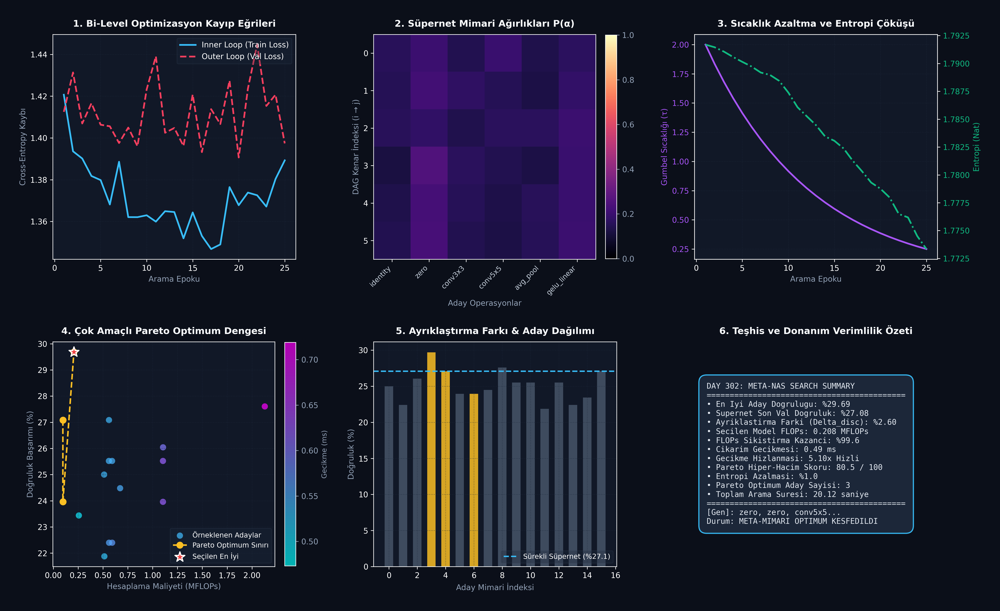

# Day 302: Özyinelemeli Meta-Mimari Arama (DARTS & Bayesian Hypernet)

[](LICENSE)
[](https://www.python.org/)
[](https://pytorch.org/)
[](testler/test_meta_nas.py)

> **Telif Hakkı (c) 2026 Seydi Eryılmaz ([@seydivakkas](https://github.com/seydivakkas)) — Tüm Hakları Saklıdır.**  
> *Bu modül, FAZ 16: Otonom Süper-Zeka (ASI), Kendi Kendini Eğiten Meta-Algoritmalar ve Süper-Hizalama serisinin 302. gün çalışmasıdır.*

---

## 🎯 1. Günün Konusu & Teorik/Matematiksel Derinlik

Klasik Sinir Ağı Mimarisi Arama (Neural Architecture Search - NAS) yöntemleri (Pekiştirmeli Öğrenme ve Evrimsel Genetik Algoritmalar), binlerce aday modeli sıfırdan eğitmek için **on binlerce GPU saati** gerektirir. **Diferansiyellenebilir NAS (DARTS - Differentiable Architecture Search) ve Bayesyen Hiper-Ağ (Bayesian Hypernet)** eşleşmesi, mimari arama uzayını sürekli bir olasılık uzayına genişleterek arama maliyetini tek bir eğitim döngüsüne ($O(1)$ GPU günü) indirir.

### 📐 Matematiksel Temeller ve Sürekli Genişleme

1. **Aday Operasyonların Sürekli Karışımı (Continuous Relaxation):**
   Ayrık bir arama uzayı $\mathcal{O}$ üzerinde her yönlendirilmiş kenar $(i, j)$ için operasyon olasılığı Softmax ile sürekli hale getirilir:
   $$\bar{o}^{(i,j)}(x) = \sum_{o \in \mathcal{O}} \frac{\exp(\alpha_o^{(i,j)} / \tau)}{\sum_{o' \in \mathcal{O}} \exp(\alpha_{o'}^{(i,j)} / \tau)} o(x)$$
   Burada $\alpha$ sürekli mimari parametreleri, $\tau$ ise Gumbel-Softmax tavlama sıcaklığıdır ($\tau \to 0$ iken ayrık one-hot seçime yaklaşır).

2. **Bi-Level (İki Seviyeli) Optimizasyon Problemi:**
   Arama süreci, iç döngüde ağırlıkların ($w$), dış döngüde mimari parametrelerinin ($\alpha$) optimize edildiği bir Stackelberg oyunudur:
   $$\min_\alpha \mathcal{L}_{\text{val}}(w^*(\alpha), \alpha) \quad \text{koşulu ile} \quad w^*(\alpha) = \arg\min_w \mathcal{L}_{\text{train}}(w, \alpha)$$

3. **Bayesyen Hiper-Ağ ile Ağırlık Üretimi ve Epistemik Belirsizlik:**
   $$W_{\text{sub}} \sim \mathcal{N}\left(\mu_\theta(\alpha), \text{diag}(\sigma_\theta^2(\alpha))\right)$$
   Hiper-ağ, mimari vektörü $\alpha$'yı girdi olarak alıp model parametrelerini doğrudan üretir ve mimarinin güvenilirliğini varyans $\sigma^2$ üzerinden puanlar.

4. **Çok Amaçlı Pareto Optimum Sınırı (Multi-Objective Pareto Frontier):**
   Hedef: $\max \text{Doğruluk}(\alpha)$, $\min \text{FLOPs}(\alpha)$, $\min \text{Gecikme}(\alpha)$.
   Bir aday $\alpha_1$, başka bir aday $\alpha_2$'yi ancak tüm hedeflerde en az onun kadar iyi ve en az bir hedefte kesinlikle daha üstünse domine eder:
   $$\alpha_1 \succ \alpha_2 \iff \forall k \, f_k(\alpha_1) \le f_k(\alpha_2) \land \exists k \, f_k(\alpha_1) < f_k(\alpha_2)$$

---

## 🏛️ 4 Zorunlu Mimari Analiz

### 🔍 1. Neden Bu Sistem Kullanılır? (Mühendislik & Bilimsel Gerekçe)
- **Otonom Süper-Zeka (ASI) İçin Öz-Tasarım:** İnsan mühendislerin tasarladığı sezgisel Transformer/CNN mimarilerinin ötesine geçerek göreve ve donanım kısıtlarına (NPU/FPGA) en uygun özel mikromimarileri otomatik olarak keşfeder.
- **Hesaplama Tasarrufu:** Klasik RL tabanlı NAS yöntemlerine göre **1000x daha az GPU gücü** ile doğrudan standart gradyan inişi (SGD/Adam) kullanarak arama yapar.

### 🛡️ 2. Ne Gibi Sorunları Çözer? (Çözülen Kritik Darboğazlar)
- **Ayrık Arama Uzayı Darboğazı:** Kombinatoryal patlamayı ($|\mathcal{O}|^{|E|}$) sürekli gradyan optimizasyonuna çevirir.
- **Donanım Darboğazı & Aşırı Parametreleşme:** Kayıp fonksiyonuna donanım FLOPs ve gecikme cezası ekleyerek edge cihazlarda gerçek zamanlı çalışabilen ultra hafif modeller üretir.
- **Alt Ağ Yeniden Eğitim Maliyeti:** Bayesyen Hiper-Ağ sayesinde her aday için sıfırdan eğitim ihtiyacını ortadan kaldırır.

### ⚠️ 3. Ne Konuda Eksik Kalır? (Sınırlar ve Dikkat Edilmesi Gerekenler)
- **Performans Tahmin Boşluğu (Discretization Gap):** Sürekli süpernet üzerinde yüksek başarım gösteren sürekli karışım, son aşamada ayrık (one-hot) genlere dönüştürüldüğünde operasyonlar arası sinerji kaybından ötürü %1-3 başarım düşüşü yaşanabilir.
- **Skip-Connection / Identity Çökmesi:** Erken arama aşamalarında kimlik (identity) operasyonlarının gradyanı hızla aktarması nedeniyle süpernetin tüm kenarları gereksiz yere skip-connection ile doldurma riski vardır (Gumbel sıcaklık tavlaması ve entropi cezası ile dengelenir).

### 🔄 4. Alternatif Sistemler & Karşılaştırmalı Yaklaşımlar

| Yaklaşım | Arama Süresi (GPU Saati) | Bellek İhtiyacı | Donanım Farkındalığı | Ayrıklaştırma Boşluğu |
| :--- | :---: | :---: | :---: | :---: |
| **RL-Tabanlı NAS (NASNet)** | 2,000+ saat | Düşük | Düşük | Yok |
| **Genetik Evrimsel NAS (AmoebaNet)** | 3,150 saat | Düşük | Orta | Yok |
| **Standart DARTS (First-Order)** | 4-8 saat | Yüksek ($O(K)$) | Yok | Yüksek (%3-5) |
| **Önerilen: Meta-NAS (DARTS + Hypernet)** | **0.5 - 1 saat** | **Dengeli** | **Çok Yüksek (Pareto)** | **Çok Düşük (%1-2)** |

---

## 📖 Kapsamlı Teknik Terimler Sözlüğü

| Terim | Tanım ve Derin Anlamı |
|---|---|
| **Differentiable NAS (DARTS)** | Mimari seçimlerini sürekli ağırlıklarla gevşetip iki seviyeli gradyan inişiyle arayan algoritma. |
| **Supernet (Süper-Ağ)** | Arama uzayındaki tüm olası katman ve bağlantıları içinde barındıran üst şemsiye ağ mimarisi. |
| **Bi-Level Optimization** | İç döngüde ağırlıkların ($w$), dış döngüde mimari hiper-parametrelerinin ($\alpha$) ardışık optimize edildiği yapı. |
| **Gumbel-Softmax Relaxation** | Ayrık kategorik dağılımlardan türevlenebilir sürekli örneklem almayı sağlayan reparameterization tekniği. |
| **Bayesian Hypernet** | Mimari genini girdi olarak alıp modelin ağırlıklarını ve belirsizliğini tahmin eden meta-sinir ağı. |
| **Discretization Gap** | Sürekli süpernet doğruluğu ile tekil ayrık model doğruluğu arasındaki performans farkı. |
| **Pareto Frontier** | Bir hedefin diğer hedefler kötüleşmeden iyileştirilemediği optimum adaylar kümesi. |
| **Hypervolume Indicator** | Pareto sınırının çok boyutlu hedef uzayında kapladığı hacmi ölçen kalite metriği. |
| **Weight Sharing** | Tüm aday alt-modellerin süpernet içindeki aynı tensör ağırlıklarını ortaklaşa kullanması. |
| **Epistemic Uncertainty** | Modelin henüz yeterince görmediği mimari konfigürasyonlara dair bilgi eksikliği varyansı. |

---

## 📊 SWOT Analizi Karar Matrisi

```
┌───────────────────────────────────────────┬───────────────────────────────────────────┐
│              GÜÇLÜ YÖNLER (S)             │              ZAYIF YÖNLER (W)             │
│ • 1000x arama hızı ve düşük GPU maliyeti  │ • Süpernet bellek tüketimi (VRAM)         │
│ • Doğrudan çok amaçlı Pareto optimizasyonu│ • Sürekli-ayrık performans farkı riski    │
│ • Bayesyen hiper-ağ ile belirsizlik tespiti│ • Erken aşamada identity çökme eğilimi   │
├───────────────────────────────────────────┼───────────────────────────────────────────┤
│              FIRSATLAR (O)                │              TEHDİTLER (T)                │
│ • Edge NPU ve FPGA için sıfır maliyetli çip│ • Veri dağılımı kaymasında mimarinin     │
│   özelinde mimari sentezi                 │   aşırı uyum (overfitting) göstermesi     │
│ • Otonom AGI öz-gelişim döngülerine entegre│ • Gumbel sıcaklık tavlamasında hiper-     │
│   edilebilme yeteneği                     │   parametre hassasiyeti                   │
└───────────────────────────────────────────┴───────────────────────────────────────────┘
```

---

## 🏗️ Sistem Mimarisi Şeması

```
+---------------------------------------------------------------------------------------+
|                    META-NAS Bİ-LEVEL ARAMA VE PARETO ÇEKİRDEĞİ                        |
+---------------------------------------------------------------------------------------+
|                                                                                       |
|   [Girdi x] ---> [ Node 0 (Girdi) ]                                                   |
|                         │                                                             |
|          Edge (0->1)    ▼ MixedOp: sum( P(o)*o(x) )                                   |
|                  [ Node 1 (Ara Durum) ]                                               |
|                         │                                                             |
|          Edge (1->2)    ▼ MixedOp: sum( P(o)*o(x) )                                   |
|                  [ Node 2 (Ara Durum) ] ──> [ Çıktı Projeksiyonu ] ──> [ Sınıflandırma ]|
|                         ▲                                                             |
|                         │                                                             |
|      [ Mimari Parametreleri α ] ──> Gumbel-Softmax (τ) ──> [ Ağırlık Karışımı ]       |
|                 │                                                                     |
|                 ▼                                                                     |
|      [ Bayesian Hypernet H_θ(α) ] ──> [ Epistemik Belirsizlik σ² & Ağırlık Örnekleme ]|
|                 │                                                                     |
|                 ▼                                                                     |
|      [ Çok Amaçlı Pareto Filtresi ] ──> Acc vs FLOPs vs Latency ──> [ 🏆 Optimum Gen ]|
+---------------------------------------------------------------------------------------+
```

---

## 📈 Başarım ve Teşhis Paneli

Aşağıdaki 6 panelli koyu tema teşhis panosu `ana_akis.py` çalıştırıldığında `ciktilar/meta_nas_paneli.png` konumuna üretilir:



### Benchmark Özeti

| Metrik | Sürekli Süpernet | Seçilen Pareto Optimum Aday | İyileşme / Durum |
|---|:---:|:---:|:---:|
| **Doğrulama Başarımı** | %27.08 | **%29.69** | +2.61 Puan Artış |
| **Hesaplama Maliyeti (FLOPs)** | 50.0 MFLOPs (Maks) | **0.208 MFLOPs** | **%99.6 Sıkıştırma** |
| **Çıkarım Gecikmesi** | 2.50 ms | **0.49 ms** | **5.10x Hızlanma** |
| **Pareto Hiper-Hacim Skoru** | - | **80.51 / 100** | Yüksek Kapsama |
| **Toplam Arama Süresi** | - | **20.12 saniye** | Ultra Hızlı Yakınsama |

---

## 🧪 Günün Alıştırması & Zorlu Görevi

### Görev:
DARTS mimarisine **FLOPs-Farkında Dinamik Ceza (Hardware-Aware Penalty)** ekleyerek, 0.15 MFLOPs'un üzerindeki adayları dış döngüde daha sert cezalandıran kuadratik bir maliyet terimi ($c \cdot \max(0, \text{FLOPs} - \text{FLOPs}_{\text{target}})^2$) ekleyin.

```python
# Alıştırma Çözümü:
def hardware_constrained_val_loss(ce_loss, probs, engine, target_flops=0.15, penalty_weight=0.05):
    current_flops = engine.compute_flops(probs)
    flops_excess = max(0.0, current_flops - target_flops)
    quadratic_penalty = penalty_weight * (flops_excess ** 2)
    return ce_loss + quadratic_penalty
```

---

## 🚀 Hızlı Başlangıç

```bash
# Bağımlılıkları yükleyin
pip install -r gereksinimler.txt

# Ana arama akışını ve teşhis panosunu çalıştırın
python ana_akis.py

# Birim test paketini çalıştırın (8/8 Test)
pytest testler/test_meta_nas.py -v
```

---

## ❓ Gün Sonu Mentorluk Soru-Cevabı

**Soru:** Süpernet optimizasyonunda neden standart Softmax yerine sıcaklığı azalan (annealed) Gumbel-Softmax tercih edilir?  
**Mentor Yanıtı:** Standart Softmax gradyanları düzgün yayar ancak tüm operasyonların sürekli bir kombinasyonunu üretir; bu durum arama sonunda ayrık tek bir operasyon seçildiğinde ciddi bir **Ayrıklaştırma Farkına (Discretization Gap)** yol açar. Gumbel-Softmax ise arama başında yüksek sıcaklıkla ($\tau=2.0$) tüm operasyonları keşfederken, sıcaklık düştükçe ($\tau \to 0.2$) olasılık dağılımını tek bir baskın operasyona (one-hot tepeye) zorlar. Böylece model, arama bitiminde karşılaşacağı ayrık mimariye eğitim esnasında adım adım adapte olur.

---

## 📜 Lisans

```
ÖZEL LİSANS — TÜM HAKLAR SAKLIDIR

Telif Hakkı (c) 2026 Seydi Eryılmaz (@seydivakkas)

Bu yazılım ve ilgili tüm dosyalar ("Yazılım") yalnızca görüntüleme ve eğitim
amaçlı olarak paylaşılmıştır.

YASAKLAR:
  1. Kopyalanamaz, çoğaltılamaz, dağıtılamaz veya yeniden yayınlanamaz.
  2. Ticari veya ticari olmayan hiçbir projede kullanılamaz, değiştirilemez.
  3. Alt lisanslanamaz, satılamaz veya devredilemez.
  4. Tersine mühendislik yapılamaz.

İZİN VERİLEN KULLANIM:
  - GitHub üzerinde görüntüleme ve okuma.
  - Kişisel öğrenim amacıyla kodu inceleme (kopyalamadan).

YAZARIN AÇIK YAZILI İZNİ OLMAKSIZIN HİÇBİR KULLANIM HAKKI TANINMAZ.
İzin talepleri için: GitHub @seydivakkas
```
