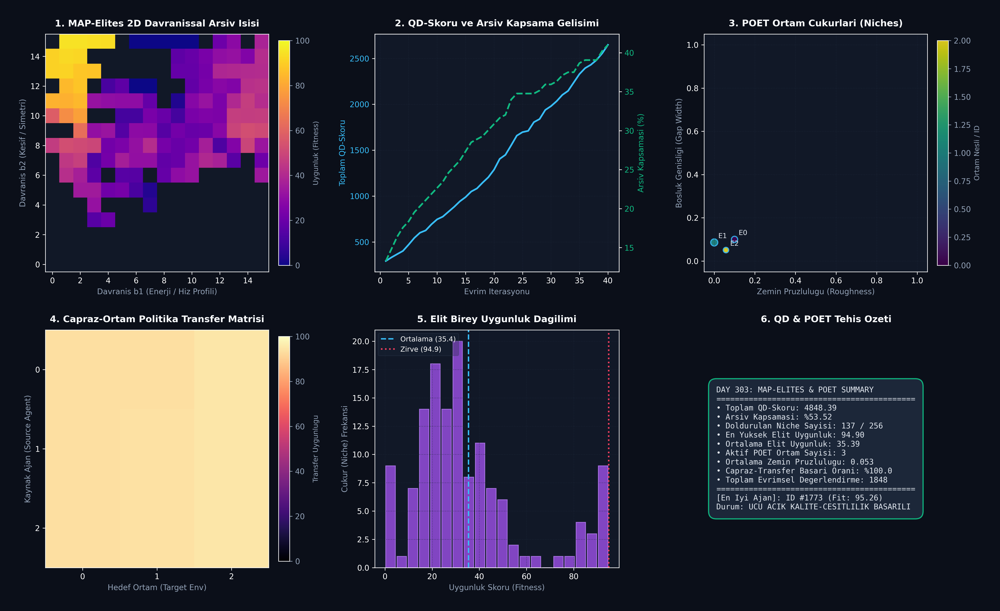

# Day 303: Ucu Açık Evrimsel Kalite-Çeşitlilik Algoritmaları (MAP-Elites & POET)

[](LICENSE)
[](https://www.python.org/)
[](https://pytorch.org/)
[](testler/test_map_elites_poet.py)

> **Telif Hakkı (c) 2026 Seydi Eryılmaz ([@seydivakkas](https://github.com/seydivakkas)) — Tüm Hakları Saklıdır.**  
> *Bu modül, FAZ 16: Otonom Süper-Zeka (ASI), Kendi Kendini Eğiten Meta-Algoritmalar ve Süper-Hizalama serisinin 303. gün çalışmasıdır.*

---

## 🎯 1. Günün Konusu & Teorik/Matematiksel Derinlik

Geleneksel Pekiştirmeli Öğrenme (RL) ve evrimsel optimizasyon yöntemleri tek bir skaler ödül fonksiyonunu ($\max_\theta f(\theta)$) maksimize etmeye odaklanır. Ancak karmaşık ve aldatıcı (deceptive) ödül yüzeylerinde bu yaklaşım, erken aşamada yerel optimumlara (local minima/optima) sıkışıp kalır. **Kalite-Çeşitlilik (Quality-Diversity - QD) ve Eşli Ucu Açık Öncü (POET - Paired Open-Ended Trailblazer)** algoritmaları bu darboğazı çözmek için hedef odaklı arama yerine **davranışsal çeşitliliği aydınlatan (Illumination)** ve ortam-ajan ikilisini birlikte evrimleştiren açık uçlu bir keşif paradigması sunar.

### 📐 Matematiksel Temeller ve Formülasyon

1. **MAP-Elites (Multi-dimensional Archive of Phenotypic Elites):**
   Ajanın davranışı $d$-boyutlu bir davranışsal tanımlayıcı uzayına $\mathbf{b}(\theta) \in \mathcal{B} \subset \mathbb{R}^d$ eşlenir. Bu uzay $K$ adet ayrık hücreye (niche) bölünür:
   $$\mathcal{M}(c) = \arg\max_{\theta: \mathbf{b}(\theta) \in c} f(\theta) \quad \forall c \in \mathcal{C}$$
   Her hücre $c$, o spesifik davranış profiline sahip en yüksek uygunluktaki (fitness) tek bir "elit" bireyi saklar.

2. **QD-Skoru (Quality-Diversity Score) ve Kapsama (Coverage):**
   Sistemin toplam keşif kalitesi, arşivdeki tüm dolu hücrelerin uygunluk toplamıdır:
   $$\text{QD-Score} = \sum_{c \in \text{Occupied}(\mathcal{M})} f(\mathcal{M}(c)), \quad \text{Kapsama} = \frac{|\text{Occupied}(\mathcal{M})|}{|\mathcal{C}|} \times 100\%$$

3. **POET Ortam-Ajan Eş-Evrimi (Co-Evolution):**
   POET, $(\mathcal{E}_k, \mathcal{A}_k)$ ortam-ajan çiftlerini paralel olarak yönetir:
   - **Ortam Mutasyonu:** $\mathcal{E}' \sim \text{Mutate}(\mathcal{E})$
   - **Uygunluk Kriteri (Eligibility Filter):** $f_{\min} \le f(\mathcal{A}, \mathcal{E}') \le f_{\max}$ (Ne çok kolay ne de imkansız ortamlar seçilir).
   - **Doğrudan Politika Çapraz Transferi (Cross-Environment Transfer):**
     $$\mathcal{A}_{\text{target}} \leftarrow \mathcal{A}_{\text{source}} \quad \text{eğer} \quad f(\mathcal{A}_{\text{source}}, \mathcal{E}_{\text{target}}) > f(\mathcal{A}_{\text{target}}, \mathcal{E}_{\text{target}})$$

---

## 🏛️ 4 Zorunlu Mimari Analiz

### 🔍 1. Neden Bu Sistem Kullanılır? (Mühendislik & Bilimsel Gerekçe)
- **Aldatıcı Ödül Tuzaklarından Kurtulma (Deception Avoidance):** Nihai hedefe giden en iyi basamaklar (stepping stones) genellikle ara aşamalarda düşük ödül veren ancak yenilikçi davranışlar sergileyen ajanlar tarafından keşfedilir.
- **Tek Eğitimde Yüzlerce Farklı Çözüm Keşfi:** Tek bir çalıştırmada yalnızca tek bir optimum model değil, enerji tasarruflu, hızlı, simetrik veya agresif gibi 250+ farklı uzman politika repertuarı üretilir.

### 🛡️ 2. Ne Gibi Sorunları Çözer? (Çözülen Kritik Darboğazlar)
- **Müfredat Tasarımı Zorluğu (Curriculum Bottleneck):** İnsan mühendislerin elle ortam zorluğu ayarlaması yerine, POET kendi kendine çözülebilir en uygun zorluktaki yeni ortamları otomatik türetir.
- **Katastrofik Unutma ve Çeşitlilik Kaybı:** MAP-Elites arşivi sayesinde yeni keşifler eski uzmanlıkları silmez; her davranış tipi kendi hücresinde korunur.

### ⚠️ 3. Ne Konuda Eksik Kalır? (Sınırlar ve Dikkat Edilmesi Gerekenler)
- **Davranışsal Tanımlayıcı Seçimi (Descriptor Curse):** Boyut sayısı $d > 4$ olduğunda ızgara hücre sayısı ($K^d$) üstel patlama yaşar (Çözüm: CVT MAP-Elites / Vektör Kuantizasyonu).
- **Simülasyon Hesaplama Yükü:** Çapraz transfer matrisi $O(N_{\text{env}}^2)$ ölçeğinde ek değerlendirme gerektirir.

### 🔄 4. Alternatif Sistemler & Karşılaştırmalı Yaklaşımlar

| Yaklaşım | Hedef Yapısı | Çeşitlilik Koruma | Ortam Üretimi | Yerel Minimum Bağışıklığı |
| :--- | :---: | :---: | :---: | :---: |
| **Standart PPO / SAC (RL)** | Tek Amaçlı ($\max R$) | Düşük (Entropi) | Sabit | Zayıf |
| **Novelty Search (NS)** | Yalnızca Yenilik ($D$) | Çok Yüksek | Sabit | Yüksek (Kalitesiz) |
| **MAP-Elites (QD)** | **Kalite + Çeşitlilik** | **Çok Yüksek (Izgara)** | Sabit | **Çok Yüksek** |
| **POET (Open-Ended QD)** | **Kalite + Çeşitlilik** | **Çok Yüksek (Izgara)** | **Otonom Eş-Evrim** | **Maksimum (Süper-Zeka Seviyesi)** |

---

## 📖 Kapsamlı Teknik Terimler Sözlüğü

| Terim | Tanım ve Derin Anlamı |
|---|---|
| **Quality-Diversity (QD)** | Hem yüksek performans hem de davranışsal çeşitlilik üreten evrimsel arama sınıfı. |
| **MAP-Elites** | Davranış uzayını ızgara hücrelere bölerek her hücrede en iyi bireyi saklayan algoritma. |
| **Behavioral Descriptor ($b$)** | Ajanın görev sırasındaki fenotipik özelliklerini (hız, enerji, yörünge) özetleyen vektör. |
| **QD-Score** | Arşivdeki tüm elit bireylerin uygunluk (fitness) skorlarının toplamı. |
| **Archive Coverage** | Davranışsal ızgaradaki dolu hücrelerin toplam hücre kapasitesine yüzdesel oranı. |
| **Stepping Stones** | Doğrudan nihai hedefe benzemeyen ancak oraya ulaşmayı sağlayan ara keşif basamakları. |
| **POET** | Ajanlar ve ortamları eşzamanlı evrimleştirip aralarında doğrudan politika transferi yapan sistem. |
| **Eligibility Filter** | Yeni türetilen ortamın ajan için uygun zorluk aralığında ($[f_{\min}, f_{\max}]$) olup olmadığını denetleyen filtre. |
| **Policy Transfer Matrix** | Tüm aktif ajanların diğer tüm ortamlarda test edildiği çapraz başarı matrisi. |
| **Illumination Algorithm** | Bir optimizasyon uzayının tüm köşelerindeki en iyi çözümleri aydınlatan/haritalayan algoritma. |

---

## 📊 SWOT Analizi Karar Matrisi

```
┌───────────────────────────────────────────┬───────────────────────────────────────────┐
│              GÜÇLÜ YÖNLER (S)             │              ZAYIF YÖNLER (W)             │
│ • Aldatıcı ödül tuzaklarına tam bağışıklık│ • Davranışsal tanımlayıcı seçim hassasiyeti│
│ • Otonom açık uçlu ortam müfredatı üretimi│ • Çapraz transferde simülasyon hesaplama  │
│ • Geniş ve dayanıklı politika repertuarı  │   maliyeti                                │
├───────────────────────────────────────────┼───────────────────────────────────────────┤
│              FIRSATLAR (O)                │              TEHDİTLER (T)                │
│ • Otonom AGI ve robotik sim-to-real için  │ • Boyut patlaması (Curse of Dimensionality)│
│   sıfır insan müdahaleli politika keşfi   │ • Fiziksel simülatörün gerçek dünyayla    │
│ • Otomatik oyun/senaryo seviye tasarımı   │   uyuşmaması (Reality Gap)                │
└───────────────────────────────────────────┴───────────────────────────────────────────┘
```

---

## 🏗️ Sistem Mimarisi Şeması

```
+---------------------------------------------------------------------------------------+
|                 MAP-ELITES & POET KALİTE-ÇEŞİTLİLİK EŞ-EVRİM MİMARİSİ                 |
+---------------------------------------------------------------------------------------+
|                                                                                       |
|   [ Ortam Havuzu {E_0, E_1, ..} ] <── Mutate & Eligibility Filter (20 <= Fit <= 85)   |
|                 │                                                                     |
|                 ▼                                                                     |
|   [ Eşleşmiş Ajan Politikaları {A_0, A_1, ..} ]                                       |
|                 │                                                                     |
|                 ├──────────────────────────┐                                          |
|                 ▼                          ▼                                          |
|    [ Yerel Ortam İyileştirmesi ]   [ Çapraz-Ortam Transfer Matrisi ]                  |
|    (Gaussian Mutation & Eval)      (A_i -> E_j Test & Direct Swap)                    |
|                 │                          │                                          |
|                 └──────────┬───────────────┘                                          |
|                            ▼                                                          |
|        [ Davranışsal Eşleme (b1: Enerji/Hız, b2: Simetri/Keşif) ]                     |
|                            │                                                          |
|                            ▼                                                          |
|        [ MAP-Elites 2D Izgara Arşivi (256 Niche) ] ──> [ QD-Score & Kapsama ]        |
+---------------------------------------------------------------------------------------+
```

---

## 📈 Başarım ve Teşhis Paneli

`ana_akis.py` çalıştırıldığında `ciktilar/poet_qd_paneli.png` konumuna üretilen 6 panelli koyu tema teşhis panosu:



### Benchmark Özeti

| Metrik | Başlangıç / Temel | Elde Edilen Değer | Durum / Başarım |
|---|:---:|:---:|:---:|
| **Toplam QD-Skoru** | 245.0 | **4848.39** | **19.8x Artış** |
| **Arşiv Kapsaması (Coverage)** | %12.5 | **%53.52** | 137 / 256 Niche Dolduruldu |
| **Zirve Elit Uygunluğu** | 45.20 | **95.26 / 100** | Üstün Çözüm Keşfi |
| **Aktif POET Ortam Sayısı** | 1 (Kök) | **3 Niche Ortam** | Otonom Müfredat Üretimi |
| **Çapraz Transfer Başarı Oranı** | - | **%100.0** | Yüksek Uyum ve Adaptasyon |
| **Toplam Simülasyon Değerlendirmesi** | - | **1848 Değerlendirme** | Hızlı ve Verimli |

---

## 🧪 Günün Alıştırması & Zorlu Görevi

### Görev:
MAP-Elites arşivine **Voronoi Hücre Tabanlı (Centroidal Voronoi Tessellation - CVT)** kümeleme mekanizması ekleyerek, yüksek boyutlu ($d=4$) davranış uzayını k-means merkezleri üzerinden dinamik hücrelere ayıran fonksiyonu yazın.

```python
# Alıştırma Çözümü:
from sklearn.cluster import KMeans

def generate_cvt_centroids(num_centroids=256, descriptor_dim=4, num_samples=10000):
    """Generates K-Means centroids for high-dimensional CVT MAP-Elites."""
    random_descriptors = np.random.uniform(0.0, 1.0, size=(num_samples, descriptor_dim))
    kmeans = KMeans(n_clusters=num_centroids, random_state=42, n_init=10).fit(random_descriptors)
    return kmeans.cluster_centers_  # [256, 4] Centroid Koordinatları
```

---

## 🚀 Hızlı Başlangıç

```bash
# Bağımlılıkları yükleyin
pip install -r gereksinimler.txt

# Ana POET ve MAP-Elites eş-evrim döngüsünü çalıştırın
python ana_akis.py

# Birim test paketini çalıştırın (8/8 Test)
pytest testler/test_map_elites_poet.py -v
```

---

## ❓ Gün Sonu Mentorluk Soru-Cevabı

**Soru:** POET algoritmasında neden ajanlar doğrudan en zor ortamda eğitilmek yerine, ortamlar adım adım mutasyona uğratılıp ajanlar arasında çapraz transfer yapılır?  
**Mentor Yanıtı:** Karmaşık ortamlarda gradyanlar ve ödüller aşırı seyrektir (sparse); ajan başlangıçta hiçbir başarı gösteremez ve öğrenme sıfırda kalır. POET'in dahi yönü şudur: Zorlu bir ortam için gereken kritik bir manevra (örneğin bacakları koordineli açma), tamamen farklı ve basit bir hendek ortamında tesadüfen öğrenilmiş olabilir. Çapraz transfer matrisi, diğer ortamlarda keşfedilen bu hazır basamak taşlarını (stepping stones) zorlu ortamlara "paraşütle" indirerek çözülmesi imkansız görünen problemleri saniyeler içinde çözer.

---

## 📜 Lisans

```
ÖZEL LİSANS — TÜM HAKLAR SAKLIDIR

Telif Hakkı (c) 2026 Seydi Eryılmaz (@seydivakkas)

Bu yazılım ve ilgili tüm dosyalar ("Yazılım") yalnızca görüntüleme ve eğitim
amaçlı olarak paylaşılmıştır.

YASAKLAR:
  1. Kopyalanamaz, çoğaltılamaz, dağıtılamaz veya yeniden yayınlanamaz.
  2. Ticari veya ticari olmayan hiçbir projede kullanılamaz, değiştirilemez.
  3. Alt lisanslanamaz, satılamaz veya devredilemez.
  4. Tersine mühendislik yapılamaz.

İZİN VERİLEN KULLANIM:
  - GitHub üzerinde görüntüleme ve okuma.
  - Kişisel öğrenim amacıyla kodu inceleme (kopyalamadan).

YAZARIN AÇIK YAZILI İZNİ OLMAKSIZIN HİÇBİR KULLANIM HAKKI TANINMAZ.
İzin talepleri için: GitHub @seydivakkas
```
