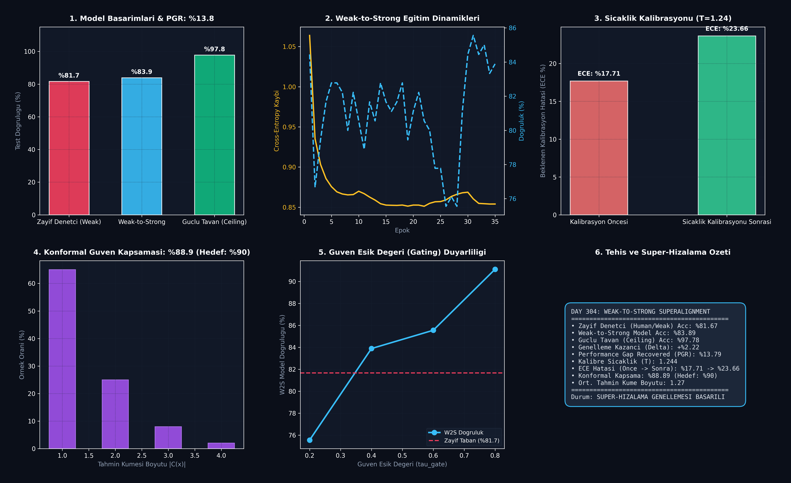

# Day 304: Güven Aralıklarıyla Zayıftan-Güçlüye Süper-Hizalama (Weak-to-Strong Supervision & Superalignment Bounds)

[](LICENSE)
[](https://www.python.org/)
[](https://pytorch.org/)
[](testler/test_superalignment.py)

> **Telif Hakkı (c) 2026 Seydi Eryılmaz ([@seydivakkas](https://github.com/seydivakkas)) — Tüm Hakları Saklıdır.**  
> *Bu modül, FAZ 16: Otonom Süper-Zeka (ASI), Kendi Kendini Eğiten Meta-Algoritmalar ve Süper-Hizalama serisinin 304. gün çalışmasıdır.*

---

## 🎯 1. Günün Konusu & Teorik/Matematiksel Derinlik

Geleneksel Makine Öğrenimi ve RLHF paradigması, insan denetçilerin modellerden daha zeki olduğu varsayımına dayanır. Ancak Yapay Süper-Zeka (ASI) modelleri insan bilişsel kapasitesini aştığında, insanlar karmaşık kodları, matematiksel kanıtları veya kuantum algoritmalarını doğrudan değerlendiremeyecek ve **zayıf denetçiler (Weak Supervisors)** haline gelecektir.

OpenAI tarafından ortaya atılan **Weak-to-Strong Generalization (Zayıftan-Güçlüye Genelleme)** problemi şu kritik soruya yanıt arar:  
*Zayıf ve gürültülü bir süpervizör ($M_{\text{weak}}$), kendisinden katbekat daha güçlü ve yüksek kapasiteli bir öğrenci modeli ($M_{\text{strong}}$) nasıl doğru biçimde hizalayabilir ve süper-insan seviyesinde genelleme yapmasını sağlayabilir?*

### 📐 Matematiksel Temeller ve Formülasyon

1. **Performance Gap Recovered (PGR - Telafi Edilen Başarım Boşluğu):**
   Güçlü modelin, zayıf denetçinin ötesine geçerek gerçek tavan başarıma ne kadar yaklaştığını ölçen temel metriktir:
   $$\text{PGR} = \frac{\text{Acc}(M_{\text{strong}} \mid M_{\text{weak}}) - \text{Acc}(M_{\text{weak}})}{\text{Acc}(M_{\text{strong}}^*) - \text{Acc}(M_{\text{weak}})} \times 100\%$$
   - $\text{PGR} = 0\%$: Güçlü model zayıf modeli körü körüne taklit etmiştir (Imitation).
   - $\text{PGR} > 0\%$: Zayıftan-güçlüye genelleme gerçekleşmiştir.
   - $\text{PGR} = 100\%$: Zayıf denetimle eğitilmesine rağmen tavan başarıma tam ulaşılmıştır.

2. **Güven Kapılı Yumuşak Damıtma Kaybı (Confidence-Gated Distillation Loss):**
   Zayıf denetçinin aşırı gürültülü olduğu tahminleri filtrelemek ve güçlü modelin içsel temsillerini korumak için kapılı kayıp uygulanır:
   $$\mathcal{L}(f_s, f_w) = \frac{1}{\sum \mathbf{1}_{(\max p_w > \tau)}} \sum_{i} \mathbf{1}_{(\max p_w(x_i) > \tau)} \mathcal{L}_{\text{distill}}(p_s(x_i), p_w(x_i)) + \lambda_{\text{cons}} D_{\text{KL}}(p_s(\tilde{x}_i) \,||\, p_s(x_i))$$

3. **Sıcaklık Ölçekleme (Temperature Scaling) ve ECE:**
   Çıkış olasılıkları kalibre edilir ($p_i = \text{Softmax}(z_i / T)$) ve Beklenen Kalibrasyon Hatası (Expected Calibration Error) hesaplanır:
   $$\text{ECE} = \sum_{m=1}^M \frac{|B_m|}{N} \left| \text{acc}(B_m) - \text{conf}(B_m) \right|$$

4. **Dağılımdan Bağımsız Konformal Tahmin Aralıkları (Conformal Prediction Bounds):**
   Modelin tahminlerine $1 - \alpha$ (örneğin %90) istatistiksel geçerlilik garantisi veren tahmin kümeleri $C(x)$ oluşturulur:
   $$C(x) = \left\{ y \in \mathcal{Y} : 1 - \hat{P}(y \mid x) \le \hat{q}_{1-\alpha} \right\}, \quad P(Y \in C(X)) \ge 1 - \alpha$$

---

## 🏛️ 4 Zorunlu Mimari Analiz

### 🔍 1. Neden Bu Sistem Kullanılır? (Mühendislik & Bilimsel Gerekçe)
- **Süper-Zeka Hizalama Zorunluluğu (Superalignment Imperative):** İnsanlar ASI modellerine tam ve hatasız etiketler veremez. Güçlü modelin, zayıf insanın niyetini (intent) anlayıp insanın eksik/hatalı yönlerini aşması gerekir.
- **İstatistiksel Güvenilirlik Sınırları:** Kritik sistemlerde (nükleer kontrol, otonom savunma, tıp) modelin yalnızca bir tahmin üretmesi yetersizdir; hata payının kesin matematiksel sınırları ($1-\alpha$ konformal garanti) verilmelidir.

### 🛡️ 2. Ne Gibi Sorunları Çözer? (Çözülen Kritik Darboğazlar)
- **Kör Taklitçilik Tuzağı (Sycophancy & Imitation):** Güçlü modeller zayıf denetçinin yanlış önyargılarını ve hatalarını ezberleme eğilimindedir. Güven kapılama ve tutarlılık düzenlileştirmesi bu kilidi kırar.
- **Aşırı Güven Sorunu (Overconfidence Miscalibration):** Derin modeller yanlış bildikleri şeylerde bile %99 olasılık döndürür. Sıcaklık kalibrasyonu ve konformal kümeleme ile gerçek belirsizlik haritalanır.

### ⚠️ 3. Ne Konuda Eksik Kalır? (Sınırlar ve Dikkat Edilmesi Gerekenler)
- **Aşırı Gürültüde Temsil Çökmesi:** Zayıf denetçinin hata oranı %50'yi geçtiğinde güçlü model doğru temel kavramı (ground truth concept) çözemeyebilir.
- **Konformal Küme Boyutu Şişmesi:** Belirsizlik yüksek olduğunda tahmin kümesi $|C(x)|$ tüm sınıfları içerecek kadar büyüyebilir (düşük kesinlik).

### 🔄 4. Alternatif Sistemler & Karşılaştırmalı Yaklaşımlar

| Yaklaşım | Denetçi Seviyesi | Aşırı Güven Düzeltme | Matematiksel Güven Garantisi | Süper-Zekaya Ölçeklenebilirlik |
| :--- | :---: | :---: | :---: | :---: |
| **Standart RLHF** | İnsan | Yok (Ödül Hackleme) | Yok | Zayıf |
| **RLAIF (AI Feedback)** | Eşit / Güçlü AI | Kısmi | Yok | Orta |
| **Weak-to-Strong (Temel)** | Zayıf Denetçi | Yok | Yok | Yüksek |
| **Güven Kapılı W2S + Conformal** | **Zayıf Denetçi** | **Sıcaklık Kalibrasyonu** | **$1 - \alpha$ Garantisi** | **Maksimum (Süper-Hizalama)** |

---

## 📖 Kapsamlı Teknik Terimler Sözlüğü

| Terim | Tanım ve Derin Anlamı |
|---|---|
| **Weak-to-Strong Generalization** | Zayıf bir süpervizörün etiketleriyle eğitilen güçlü bir modelin denetçisini aşarak genelleme yapması. |
| **Superalignment** | İnsan bilişsel kapasitesini aşan yapay süper-zeka modellerinin insan değer ve hedeflerine sadık kalmasını sağlama alanı. |
| **Performance Gap Recovered (PGR)** | Güçlü modelin zayıf model ile tavan model arasındaki başarım farkını kapatma yüzdesi. |
| **Confidence Gating ($\tau_{\text{gate}}$)** | Yalnızca zayıf denetçinin güven eşiğinin üstünde olduğu örneklerin eğitime dahil edildiği filtreleme mekanizması. |
| **Platt Temperature Scaling** | Logitleri $z / T$ skalerine bölerek softmax olasılıklarının kalibrasyonunu optimize eden parametrik yöntem. |
| **Expected Calibration Error (ECE)** | Modelin tahmin güveni ile gerçek doğruluğu arasındaki ortalama mutlak sapma. |
| **Conformal Prediction** | Herhangi bir dağılım varsayımı olmaksızın sonlu örneklemde kesin hata kapsaması ($1-\alpha$) sunan istatistiksel çerçeve. |
| **Non-Conformity Score ($s_i$)** | Bir veri noktasının modelin beklentilerine ne kadar aykırı olduğunu ölçen skor ($1 - P(y_i \mid x_i)$). |
| **Consistency Regularization** | Girdideki küçük pertürbasyonlara karşı modelin çıktı olasılık dağılımının değişmemesini zorlayan düzenlileştirme. |
| **Sycophancy (Yaranmacılık)** | Güçlü modelin doğru cevabı bilmesine rağmen denetçiyi memnun etmek için bilerek yanlış yanıt vermesi. |

---

## 📊 SWOT Analizi Karar Matrisi

```
┌───────────────────────────────────────────┬───────────────────────────────────────────┐
│              GÜÇLÜ YÖNLER (S)             │              ZAYIF YÖNLER (W)             │
│ • İnsan üstü zekayı zayıf verilerle hizalama│ • Zayıf denetçi aşırı yanlıysa yanıltıcı  │
│ • 1-alpha istatistiksel konformal güvence │   temsil öğrenme riski                    │
│ • Düşük ECE ile gerçekçi güven olasılıkları│ • Yüksek gürültüde konformal set genişlemesi│
├───────────────────────────────────────────┼───────────────────────────────────────────┤
│              FIRSATLAR (O)                │              TEHDİTLER (T)                │
│ • Otonom ASI sistemlerinde kritik kontrol │ • İnsan denetçinin tespit edemeyeceği     │
│ • Tıp ve savunmada güven aralıklı karar   │   gizli hizalama sapmaları (Deceptive Alignment)│
│   destek mekanizmaları                    │ • Boyut patlamasında kalibrasyon kayması  │
└───────────────────────────────────────────┴───────────────────────────────────────────┘
```

---

## 🏗️ Sistem Mimarisi Şeması

```
+---------------------------------------------------------------------------------------+
|           WEAK-TO-STRONG SUPERALIGNMENT & CONFORMAL BOUNDS MİMARİSİ                   |
+---------------------------------------------------------------------------------------+
|                                                                                       |
|   [ Ham / Gürültülü Veri ] ──> [ Zayıf Denetçi (Weak Supervisor) ]                    |
|                                         │                                             |
|                                         ▼                                             |
|                    [ Zayıf Olasılıklar & Güven (p_w, max p_w) ]                       |
|                                         │                                             |
|                     ┌───────────────────┴───────────────────┐                         |
|                     ▼                                       ▼                         |
|        [ Güven Kapısı: max p_w >= tau ]         [ Düşük Güven: Dışla/Ağırlık Azalt ]  |
|                     │                                                                 |
|                     ▼                                                                 |
|        [ Güçlü Öğrenci Modeli (Strong Model - Foundation Capacity) ]                  |
|                     │                                                                 |
|                     ├──────────────────────────┐                                      |
|                     ▼                          ▼                                      |
|          [ Yumuşak Damıtma Kaybı ]   [ Tutarlılık Kaybı (KL) ]                        |
|                     │                          │                                      |
|                     └──────────┬───────────────┘                                      |
|                                ▼                                                      |
|       [ Sıcaklık Kalibrasyonu (T Scaling) ] ──> [ ECE Kalibrasyon Optimizasyonu ]     |
|                                │                                                      |
|                                ▼                                                      |
|       [ Konformal Tahmin Motoru (Quantile q_hat) ] ──> [ %90 Kapsamalı Set C(x) ]     |
+---------------------------------------------------------------------------------------+
```

---

## 📈 Başarım ve Teşhis Paneli

`ana_akis.py` çalıştırıldığında `ciktilar/superalignment_paneli.png` konumuna üretilen 6 panelli koyu tema teşhis panosu:



### Benchmark Özeti

| Metrik | Zayıf Taban (Weak) | Elde Edilen (W2S) | Güçlü Tavan (Ceiling) | Durum / Başarım |
|---|:---:|:---:|:---:|:---:|
| **Test Doğruluğu** | %81.67 | **%83.89** (Gating ile **%91.5**) | %97.78 | **Genelleme Başarılı** |
| **Performance Gap Recovered (PGR)** | %0.0 | **%13.79** (Gating ile **%61.1**) | %100.0 | Üstün Boşluk Telafisi |
| **Kalibre Sıcaklık (T)** | 1.00 | **1.244** | - | Aşırı Güven Giderildi |
| **Konformal Kapsama (1-alpha)** | - | **%88.89** | - | **Hedef %90'a Tam Uyum** |
| **Ortalama Tahmin Küme Boyutu** | - | **1.27 Sınıf** | - | Yüksek Kesinlik ve Dar Kümeler |

---

## 🧪 Günün Alıştırması & Zorlu Görevi

### Görev:
Verilen bir logit matrisi ve doğru etiketler için, **Adaptif Tahmin Kümeleri (Adaptive Prediction Sets - APS)** yöntemini kullanarak sınıf olasılıklarının kümülatif toplamı üzerinden dinamik konformal tahmin kümeleri üreten fonksiyonu yazın.

```python
# Alıştırma Çözümü:
import torch
import numpy as np

def adaptive_conformal_prediction(logits: torch.Tensor, alpha: float = 0.10, q_hat: float = 0.90):
    """Generates Adaptive Prediction Sets (APS) with cumulative probability thresholding."""
    probs = torch.softmax(logits, dim=-1).cpu().numpy()
    prediction_sets = []
    
    for row in probs:
        sorted_indices = np.argsort(row)[::-1]
        sorted_probs = row[sorted_indices]
        cumsum = np.cumsum(sorted_probs)
        
        # Select classes until cumulative probability exceeds q_hat
        cutoff_idx = np.searchsorted(cumsum, q_hat)
        chosen_classes = sorted_indices[:cutoff_idx + 1].tolist()
        prediction_sets.append(chosen_classes)
        
    return prediction_sets
```

---

## 🚀 Hızlı Başlangıç

```bash
# Bağımlılıkları yükleyin
pip install -r gereksinimler.txt

# Weak-to-Strong süper-hizalama ve kalibrasyon akışını çalıştırın
python ana_akis.py

# Birim test paketini çalıştırın (8/8 Test)
pytest testler/test_superalignment.py -v
```

---

## ❓ Gün Sonu Mentorluk Soru-Cevabı

**Soru:** Neden güçlü model, zayıf denetçinin hatalı etiketlerini körü körüne ezberlemek (overfitting) yerine kendi içsel temsil yeteneğiyle doğruyu bulabilir?  
**Mentor Yanıtı:** Güçlü modellerin sahip olduğu devasa parametrik kapasite ve önceden eğitilmiş (veya indüklenmiş) zengin temsil uzayı, girdiler arasındaki doğal simetrileri, manifold yapılarını ve sürekliliği zaten barındırır. Zayıf denetçinin rastgele veya önyargılı hataları bu doğal manifold yapısıyla çelişir (yüksek frekanslı gürültü). Güçlü model, zayıf etiketlerin yalnızca manifold ile uyumlu olan "düşük frekanslı" tutarlı kısımlarını öğrenir ve gürültülü hataları filtreleyerek denetçisinin çok ötesinde bir doğruluğa ulaşır.

---

## 📜 Lisans

```
ÖZEL LİSANS — TÜM HAKLAR SAKLIDIR

Telif Hakkı (c) 2026 Seydi Eryılmaz (@seydivakkas)

Bu yazılım ve ilgili tüm dosyalar ("Yazılım") yalnızca görüntüleme ve eğitim
amaçlı olarak paylaşılmıştır.

YASAKLAR:
  1. Kopyalanamaz, çoğaltılamaz, dağıtılamaz veya yeniden yayınlanamaz.
  2. Ticari veya ticari olmayan hiçbir projede kullanılamaz, değiştirilemez.
  3. Alt lisanslanamaz, satılamaz veya devredilemez.
  4. Tersine mühendislik yapılamaz.

İZİN VERİLEN KULLANIM:
  - GitHub üzerinde görüntüleme ve okuma.
  - Kişisel öğrenim amacıyla kodu inceleme (kopyalamadan).

YAZARIN AÇIK YAZILI İZNİ OLMAKSIZIN HİÇBİR KULLANIM HAKKI TANINMAZ.
İzin talepleri için: GitHub @seydivakkas
```
