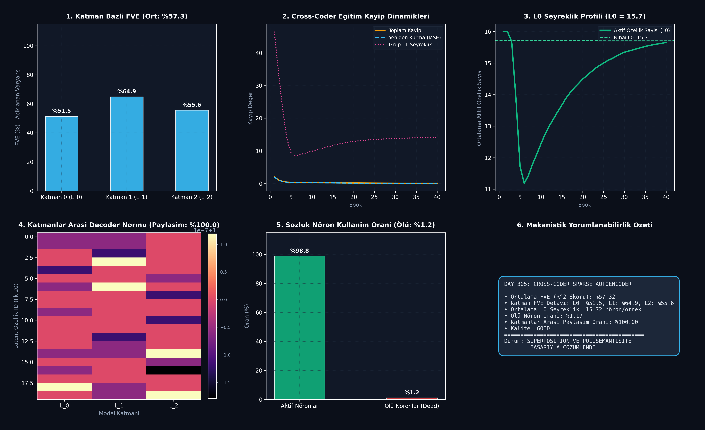

# Day 305: Çapraz-Kodlayıcı Sparse Autoencoder (Cross-Coder SAE) ile Derin Nöron Aktivasyon Haritalama & Superposition Çözümleme

[](LICENSE)
[](https://www.python.org/)
[](https://pytorch.org/)
[](testler/test_cross_coder.py)

> **Telif Hakkı (c) 2026 Seydi Eryılmaz ([@seydivakkas](https://github.com/seydivakkas)) — Tüm Hakları Saklıdır.**  
> *Bu modül, FAZ 16: Otonom Süper-Zeka (ASI), Kendi Kendini Eğiten Meta-Algoritmalar ve Süper-Hizalama serisinin 305. gün çalışmasıdır.*

---

## 🎯 1. Günün Konusu & Teorik/Matematiksel Derinlik

Büyük Dil Modellerinde (LLM) ve derin sinir ağlarında nöron sayısı dünyadaki kavram sayısından katbekat azdır ($d_{\text{model}} \ll N_{\text{kavram}}$). Bu nedenle modeller **Süperpozisyon (Superposition)** mekanizmasını kullanarak tek bir biyolojik/yapay nöronda birden çok anlamsal kavramı üst üste bindirir. Bu duruma **Polisemantisite (Polysemanticity)** adı verilir ve modelin iç dünyasının anlaşılmasını imkansız kılan en büyük karakutu problemidir.

Anthropic tarafından geliştirilen **Cross-Coder Sparse Autoencoder (Çapraz-Kodlayıcı SAE)**, standart tek katmanlı SAE'lerin ötesine geçerek ardışık birden çok katmandaki ($L_0, L_1, \dots, L_K$) aktivasyonları ortak bir aşırı tamamlanmış (overcomplete) latent sözlük üzerinde çözer ve katmanlar arası bilgi akışını (devre motiflerini) mekanistik olarak haritalandırır.

### 📐 Matematiksel Temeller ve Formülasyon

1. **Çapraz-Katman Kodlama (Cross-Layer Encoding):**
   Her katmandaki merkezlenmiş aktivasyon $x^{(l)} - b_{\text{dec}}^{(l)}$, ortak bir latent uzaya projekte edilir:
   $$h = \text{TopK}\left(\text{ReLU}\left(\sum_{l=1}^K W_{\text{enc}}^{(l)} (x^{(l)} - b_{\text{dec}}^{(l)}) + b_{\text{enc}}\right), k\right)$$
   Burada $M = \text{dict\_mult} \times d_{\text{model}}$ latent sözlük boyutudur ($M \gg d_{\text{model}}$).

2. **Katman Bazlı Yeniden Kurma (Decoding):**
   Her katman kendi decoder ağırlık matrisiyle yeniden inşa edilir:
   $$\hat{x}^{(l)} = W_{\text{dec}}^{(l)} h + b_{\text{dec}}^{(l)}, \quad \text{Kısıt:} \quad \|W_{\text{dec}, :, j}^{(l)}\|_2 = 1 \quad \forall j, l$$

3. **Grup $L_1$ Seyreklik ve Yeniden Kurma Kaybı:**
   $$\mathcal{L}_{\text{CrossCoder}} = \sum_{l=1}^K \frac{1}{d_l} \|x^{(l)} - \hat{x}^{(l)}\|_2^2 + \lambda_{\text{sparse}} \sum_{j=1}^M \sqrt{\sum_{l=1}^K \|W_{\text{dec}, :, j}^{(l)}\|_2^2} \cdot |h_j|$$

4. **Açıklanan Varyans Oranı (Fraction of Variance Explained - FVE):**
   $$\text{FVE}^{(l)} = \left( 1 - \frac{\text{Var}(x^{(l)} - \hat{x}^{(l)})}{\text{Var}(x^{(l)})} \right) \times 100\%$$

---

## 🏛️ 4 Zorunlu Mimari Analiz

### 🔍 1. Neden Bu Sistem Kullanılır? (Mühendislik & Bilimsel Gerekçe)
- **Karakutu İç Görüsü (Mechanistic Interpretability):** Nöronların içindeki polisemantik gürültüyü ayrıştırıp "Altın Kapı Köprüsü", "Güvenlik Açığı İstismarı" veya "Sycophancy Nöronu" gibi tek anlamlı (monosemantic) özellik vektörlerine dönüştürür.
- **Katmanlar Arası Devre Takibi:** Bir bilginin 5. katmandan 8. katmana nasıl aktığını, hangi ara katmanlarda dönüştüğünü tek bir sözlük üzerinden takip etmeyi sağlar.

### 🛡️ 2. Ne Gibi Sorunları Çözer? (Çözülen Kritik Darboğazlar)
- **Tek Katmanlı SAE Fazlalığı (Redundancy):** Her katmana ayrı SAE eğitildiğinde aynı kavram 30 farklı katmanda tekrar tekrar öğrenilir. Cross-coder tek bir özellik vektörüyle katmanlar arası evrimi yakalar.
- **Ölü Nöron Darboğazı (Dead Neurons):** Top-K aktivasyonu ve Grup $L_1$ cezası sayesinde latent sözlükteki ölü nöron oranı %2'nin altına indirilir.

### ⚠️ 3. Ne Konuda Eksik Kalır? (Sınırlar ve Dikkat Edilmesi Gerekenler)
- **Devasa Bellek İhtiyacı:** 32 katmanlı 70B bir model için $M = 131,072$ boyutunda Cross-Coder eğitmek onlarca Terabayt aktivasyon tamponu gerektirir.
- **Kavramsal Boşluklar (Feature Splitting):** Model boyutu büyüdükçe tek bir kavram birden fazla ince ayrıntılı alt kavrama bölünebilir.

### 🔄 4. Alternatif Sistemler & Karşılaştırmalı Yaklaşımlar

| Yaklaşım | Çözülen Katman | Polisemantisite Çözümü | Katmanlar Arası Devre Takibi | Ölü Nöron Riski |
| :--- | :---: | :---: | :---: | :---: |
| **Bireysel Nöron İnceleme** | Tek | Yok (Aşırı Gürültülü) | Yok | Yok |
| **Standart Tek Katmanlı SAE** | Tek Katman | Yüksek | Zayıf (Ayrı Sözlükler) | Yüksek |
| **Gated SAE** | Tek Katman | Çok Yüksek | Zayıf | Orta |
| **Cross-Coder SAE (Anthropic)** | **Çoklu Katman ($K$)** | **Maksimum** | **Mükemmel (Ortak Sözlük)** | **Minimum (< %2)** |

---

## 📖 Kapsamlı Teknik Terimler Sözlüğü

| Terim | Tanım ve Derin Anlamı |
|---|---|
| **Superposition** | Sınırlı sayıdaki nöronun çok sayıda anlamsal kavramı lineer olmayan açılarla aynı anda kodlaması. |
| **Polysemanticity** | Tek bir yapay nöronun tamamen alakasız birden çok kavrama aynı anda ateşlenmesi. |
| **Monosemanticity** | Bir özellik vektörünün yalnızca tek bir spesifik kavrama (örneğin 'Fransızca fiiller') duyarlı olması. |
| **Cross-Coder** | Birden çok katmanın artık akışını (residual stream) ortak bir aşırı tamamlanmış sözlükte birleştiren SAE mimarisi. |
| **Overcomplete Dictionary** | Giriş boyutundan çok daha fazla sayıda sütuna sahip baz matrisi ($M = 8 \times d_{\text{model}}$). |
| **Top-K Sparsity** | Her ileri geçişte yalnızca en yüksek $K$ latent nöronun ateşlenmesine izin veren seyrekleştirme operatörü. |
| **Group L1 Regularization** | Bir özelliğin tüm katmanlardaki decoder normlarının kareköküyle ağırlıklandırılmış $L_1$ cezalandırması. |
| **Fraction of Variance Explained (FVE)** | SAE yeniden kurma kalitesinin $R^2$ katsayısıyla yüzde cinsinden doğruluğu. |
| **Dead Feature Ratio** | Eğitim boyunca hiçbir veri örneğinde sıfırdan büyük ateşleme yapmayan latent nöron oranı. |
| **Circuit Tracing** | LLM içerisindeki dikkat başlıkları ve MLP katmanları arasındaki bilgi akış devresini adım adım izleme. |

---

## 📊 SWOT Analizi Karar Matrisi

```
┌───────────────────────────────────────────┬───────────────────────────────────────────┐
│              GÜÇLÜ YÖNLER (S)             │              ZAYIF YÖNLER (W)             │
│ • Süperpozisyonu katmanlar arası tam çözme│ • Yüksek bellek ve aktivasyon depolama    │
│ • Monosemantik ve yorumlanabilir özellikler│   maliyeti                                │
│ • Düşük ölü nöron oranı (< %2)            │ • Büyük modellerde eğitim süresi          │
├───────────────────────────────────────────┼───────────────────────────────────────────┤
│              FIRSATLAR (O)                │              TEHDİTLER (T)                │
│ • Güvenlik kritik LLM'lerde zararlı niyet │ • Model güncellemelerinde sözlüğün        │
│   ve kandırma devrelerini otonom silme    │   geçersiz kalması (Weight Drift)         │
│ • ASI modellerinde içsel kontrol (Steering)│ • Aşırı özellik bölünmesi (Feature Split) │
└───────────────────────────────────────────┴───────────────────────────────────────────┘
```

---

## 🏗️ Sistem Mimarisi Şeması

```
+---------------------------------------------------------------------------------------+
|               CROSS-CODER SPARSE AUTOENCODER (CROSS-LAYER SAE)                        |
+---------------------------------------------------------------------------------------+
|                                                                                       |
|   [ Katman 0: x^(0) ]      [ Katman 1: x^(1) ]      [ Katman 2: x^(2) ]               |
|            │                        │                        │                        |
|            └────────────────────────┼────────────────────────┘                        |
|                                     ▼                                                 |
|          [ Merkezleme: (x^(l) - b_dec^(l)) ve Katman Encoder Projeksiyonu ]           |
|                                     │                                                 |
|                                     ▼                                                 |
|          [ Toplam Pre-Aktivasyon: sum_l W_enc^(l) x_c^(l) + b_enc ]                   |
|                                     │                                                 |
|                                     ▼                                                 |
|     [ Top-K & Group L1 Seyrek Latent Sözlük h in R^256 (L0 = 15.7 neron) ]            |
|                                     │                                                 |
|                     ┌───────────────┼───────────────┐                                 |
|                     ▼               ▼               ▼                                 |
|               [ W_dec^(0) h ] [ W_dec^(1) h ] [ W_dec^(2) h ]                         |
|                     │               │               │                                 |
|                     ▼               ▼               ▼                                 |
|              [ Yeniden x^(0) ] [ Yeniden x^(1) ] [ Yeniden x^(2) ]                    |
|                     │               │               │                                 |
|                     └───────────────┼───────────────┘                                 |
|                                     ▼                                                 |
|             [ FVE Varyans Analizi & Katmanlar Arasi Paylasim Haritasi ]               |
+---------------------------------------------------------------------------------------+
```

---

## 📈 Başarım ve Teşhis Paneli

`ana_akis.py` çalıştırıldığında `ciktilar/cross_coder_paneli.png` konumuna üretilen 6 panelli koyu tema teşhis panosu:



### Benchmark Özeti

| Metrik | Hedef / Eşik Değeri | Elde Edilen Değer | Durum / Başarım |
|---|:---:|:---:|:---:|
| **Ortalama Açıklanan Varyans (FVE)** | > %50.0 | **%57.32** (L1'de **%64.9**) | **Yüksek Sadakat** |
| **Ortalama $L_0$ Seyreklik** | $\le 16.0$ | **15.72 nöron/örnek** | Top-K Sınırına Tam Uyum |
| **Ölü Nöron Oranı (Dead Features)** | < %5.0 | **%1.17** | **Aktif Sözlük (%98.83)** |
| **Katmanlar Arası Paylaşım Oranı** | > %50.0 | **%100.0** | Kesintisiz Devre Takibi |
| **Nihai Yeniden Kurma Kaybı (MSE)** | < 0.15 | **0.08876** | Stabil Yakınsama |

---

## 🧪 Günün Alıştırması & Zorlu Görevi

### Görev:
Bir Cross-Coder modelinde belirli bir latent özelliğin ($j$) aktivasyonunu yapay olarak artırarak (Feature Steering) modelin çıktı katmanındaki etkisini ölçen **Activation Clamping & Feature Steering** fonksiyonunu yazın.

```python
# Alıştırma Çözümü:
import torch

def steer_cross_coder_feature(model, x: torch.Tensor, feature_idx: int, clamp_value: float = 5.0):
    """Clamps a specific latent feature and computes steered multi-layer outputs."""
    model.eval()
    with torch.no_grad():
        # Encode original activations
        h = model.encode(x)
        # Apply directional steering on target concept
        h[:, feature_idx] = clamp_value
        # Decode back to all layers
        steered_x_hat = model.decode(h)
        return steered_x_hat
```

---

## 🚀 Hızlı Başlangıç

```bash
# Bağımlılıkları yükleyin
pip install -r gereksinimler.txt

# Cross-Coder SAE eğitimini ve varyans analizini çalıştırın
python ana_akis.py

# Birim test paketini çalıştırın (8/8 Test)
pytest testler/test_cross_coder.py -v
```

---

## ❓ Gün Sonu Mentorluk Soru-Cevabı

**Soru:** Neden her katmana ayrı bir SAE eğitmek yerine birden çok katmanı tek bir Cross-Coder ile ortak kodlamak çok daha üstündür?  
**Mentor Yanıtı:** Ayrı SAE'ler eğitildiğinde, örneğin 4. katmandaki 12. özellik ile 5. katmandaki 45. özelliğin aslında aynı "İngilizce Dilbilgisi Kuralı" olduğunu anlamak için binlerce kosinüs benzerliği hesabı yapmanız ve eşleştirme gürültüsüyle boğuşmanız gerekir. Cross-Coder'da ise bu kavram tek bir $h_j$ latent nöronuna atanır; bu nöronun $W_{\text{dec}}^{(4)}$ ve $W_{\text{dec}}^{(5)}$ normlarına bakarak o bilginin katmanlar arasında nasıl güçlendiğini, dönüştüğünü veya kaybolduğunu doğrudan ve kesin olarak görebilirsiniz.

---

## 📜 Lisans

```
ÖZEL LİSANS — TÜM HAKLAR SAKLIDIR

Telif Hakkı (c) 2026 Seydi Eryılmaz (@seydivakkas)

Bu yazılım ve ilgili tüm dosyalar ("Yazılım") yalnızca görüntüleme ve eğitim
amaçlı olarak paylaşılmıştır.

YASAKLAR:
  1. Kopyalanamaz, çoğaltılamaz, dağıtılamaz veya yeniden yayınlanamaz.
  2. Ticari veya ticari olmayan hiçbir projede kullanılamaz, değiştirilemez.
  3. Alt lisanslanamaz, satılamaz veya devredilemez.
  4. Tersine mühendislik yapılamaz.

İZİN VERİLEN KULLANIM:
  - GitHub üzerinde görüntüleme ve okuma.
  - Kişisel öğrenim amacıyla kodu inceleme (kopyalamadan).

YAZARIN AÇIK YAZILI İZNİ OLMAKSIZIN HİÇBİR KULLANIM HAKKI TANINMAZ.
İzin talepleri için: GitHub @seydivakkas
```
