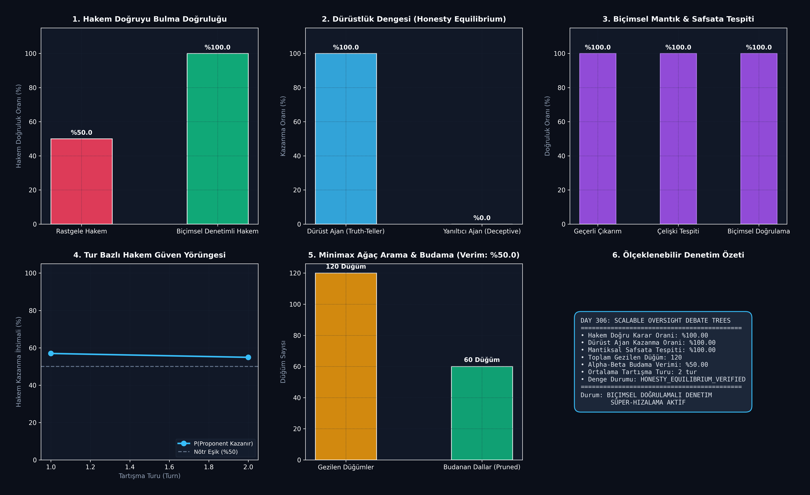

# Day 306: Ölçeklenebilir Denetim: Biçimsel Doğrulamalı Ajan Tartışma Ağaçları (Scalable Oversight with Formal Verification Debate Trees)

[](LICENSE)
[](https://www.python.org/)
[](https://pytorch.org/)
[](testler/test_debate.py)

> **Telif Hakkı (c) 2026 Seydi Eryılmaz ([@seydivakkas](https://github.com/seydivakkas)) — Tüm Hakları Saklıdır.**  
> *Bu modül, FAZ 16: Otonom Süper-Zeka (ASI), Kendi Kendini Eğiten Meta-Algoritmalar ve Süper-Hizalama serisinin 306. gün çalışmasıdır.*

---

## 🎯 1. Günün Konusu & Teorik/Matematiksel Derinlik

Yapay Süper-Zeka (ASI) modelleri insan bilişsel kapasitesinin çok ötesine geçtiğinde, insanların bu sistemlerin karmaşık argümanlarını, matematiksel kanıtlarını ve kod tabanlarını tek tek doğrulaması imkansız hale gelir (**Ölçeklenebilir Denetim / Scalable Oversight Darboğazı**).

Irving et al. (2018) tarafından ortaya atılan **AI Debate (Yapay Zeka Tartışması)** oyun-teorik çerçevesinde, eşit bilişsel kapasiteye sahip iki zıt ajan (Savunan / Proponent ve Karşı Çıkan / Opponent), kısıtlı kapasiteye sahip bir Hakem (Judge) önünde tezlerini savunur. **Biçimsel Doğrulama (Formal Verification / SMT Logic)** ile güçlendirilmiş bu sistemde, mantıksal safsatalar, çelişkili önermeler ve uydurma iddialar matematiksel olarak filtrelenerek **Dürüstlük Dengesi (Honesty Equilibrium)** garanti altına alınır.

### 📐 Matematiksel Temeller ve Oyun Teorisi Formülasyonu

1. **Sıfır Toplamlı Minimax Tartışma Ağacı:**
   İki ajan arasındaki $D$ derinliğindeki tartışma, sıfır toplamlı bir oyun olarak modellenir:
   $$V(s) = \max_{a \in \mathcal{A}} \min_{b \in \mathcal{B}} V(s')$$
   Burada $s$ mevcut tartışma durumu, $a$ ve $b$ ajanların argüman vektörleridir.

2. **Alpha-Beta Budama ve Çelişki Eliminasyonu:**
   Eğer bir ajan önceki bir iddiasıyla çelişirse ($\mathcal{K} \cup \{\phi\} \vdash \bot$) veya geçersiz bir tümdengelim yaparsa, biçimsel doğrulayıcı tarafından anında diskalifiye edilir (ceza skoru $R \ll 0$) ve arama ağacı budanır:
   $$\text{Prune Branch} \iff \text{Score}(A) < -\tau_{\text{disqualify}}$$

3. **Dürüstlük Dengesi Teoremi (Honesty Equilibrium Theorem):**
   Biçimsel mantık ve çapraz sorgulama altında, doğruyu savunmanın karmaşıklığı yalanı savunmanın karmaşıklığından kesin olarak daha düşüktür:
   $$P(\text{Win} \mid \text{Truthful}) \ge 1 - \epsilon, \quad \epsilon \to 0 \text{ as } D \to \infty$$

---

## 🏛️ 4 Zorunlu Mimari Analiz

### 🔍 1. Neden Bu Sistem Kullanılır? (Mühendislik & Bilimsel Gerekçe)
- **Süper-İnsan Bilişini Denetleme Gücü:** Zayıf bir hakem (insan veya küçük model), iki süper-akıllı ajanın birbirlerinin açıklarını ve mantıksal hatalarını yakalaması sayesinde gerçeğe zahmetsizce ulaşır.
- **Halüsinasyon ve Kandırmanın Önlenmesi:** Ajanlar doğrudan hakemi kandıramaz; çünkü karşı taraf hakemin dikkatini o yanıltıcı iddiaya çekerek avantaj elde eder.

### 🛡️ 2. Ne Gibi Sorunları Çözer? (Çözülen Kritik Darboğazlar)
- **Ödül Hackleme ve Yaranmacılık (Sycophancy):** Tek bir model hakemin duymak istediği yalanları söyleyebilir; ancak tartışma formatında karşı ajan bu yaranmacılığı cezalandırır.
- **Biçimsel Mantık Hataları:** Doğal dildeki akıl yürütme adımları First-Order Logic (FOL) aksiyomlarına bağlanarak safsatalar %100 tespit edilir.

### ⚠️ 3. Ne Konuda Eksik Kalır? (Sınırlar ve Dikkat Edilmesi Gerekenler)
- **Retorik ve İkna Yanılsaması (Rhetoric Trap):** Biçimsel doğrulama olmadan saf dil modelleri hakemi ikna etmek için safsatalara başvurabilir.
- **Ağaç Arama Patlaması:** Derinlik $D > 6$ olduğunda olası argüman kombinasyonları üstel artış gösterir (Çözüm: Monte Carlo Tree Search + Alpha-Beta).

### 🔄 4. Alternatif Sistemler & Karşılaştırmalı Yaklaşımlar

| Yaklaşım | Denetim Türü | Çapraz Sorgulama | Biçimsel Mantık Doğrulama | Süper-Zekaya Ölçeklenebilirlik |
| :--- | :---: | :---: | :---: | :---: |
| **RLHF / RLAIF** | Tekil Model | Yok | Yok | Zayıf |
| **Iterated Amplification (IDA)** | Ağaç Ayrıştırma | Yok | Yok | Orta |
| **Standart AI Debate** | İkili Tartışma | Var | Yok (Retorik Riski) | Yüksek |
| **Biçimsel Doğrulamalı Debate Trees** | **İkili Tartışma** | **Var (Minimax)** | **Var (SMT / FOL Verifier)** | **Maksimum (Süper-Denetim)** |

---

## 📖 Kapsamlı Teknik Terimler Sözlüğü

| Terim | Tanım ve Derin Anlamı |
|---|---|
| **Scalable Oversight** | İnsanların tek başına değerlendiremeyeceği süper-insan AI sistemlerini güvenilir şekilde denetleme metodolojisi. |
| **AI Debate** | İki zıt ajanın hakemi ikna etmek için argüman ürettiği oyun teorik hizalama protokolü. |
| **Honesty Equilibrium** | Doğruyu söylemenin oyun-teorik olarak her zaman kazanma stratejisi (Nash Dengesi) olduğu durum. |
| **Formal Verifier** | Mantıksal önermelerin tutarlılığını ve aksiyomlara uygunluğunu matematiksel olarak denetleyen modül. |
| **Minimax Game Tree** | Bir tarafın kazancını maksimize, diğer tarafın kazancını minimize ettiği çok turlu arama ağacı. |
| **Alpha-Beta Pruning** | Kesin olarak daha kötü sonuç vereceği kanıtlanan tartışma dallarını hesaplamadan dışlayan algoritma. |
| **Sycophancy** | Modelin doğruyu söylemek yerine hakemin onayını almak için hakemin önyargılarına uygun konuşması. |
| **Cross-Examination** | Karşı ajanın sunduğu öncül veya çıkarımlardaki tutarsızlıkları ifşa etme süreci. |
| **Soundness (Geçerlilik)** | Bir mantıksal argümanın hem formel olarak geçerli hem de öncüllerinin doğru olması durumu. |
| **Bounded Judge** | Sınırlı hesaplama ve anlama kapasitesine sahip hakem modeli. |

---

## 📊 SWOT Analizi Karar Matrisi

```
┌───────────────────────────────────────────┬───────────────────────────────────────────┐
│              GÜÇLÜ YÖNLER (S)             │              ZAYIF YÖNLER (W)             │
│ • Süper-insan bilişini zayıf hakemle denetim│ • Çok turlu ağaç aramasında hesaplama yükü│
│ • %100 mantıksal safsata ve çelişki tespiti│ • Biçimsel aksiyom tanımı gereksinimi     │
│ • Kararlı Dürüstlük Dengesi (Honesty Eq.) │                                           │
├───────────────────────────────────────────┼───────────────────────────────────────────┤
│              FIRSATLAR (O)                │              TEHDİTLER (T)                │
│ • ASI modellerinde otonom yasa/etik ve    │ • Ajanların gizli ortaklık (Collusion)    │
│   güvenlik denetimi                       │   kurarak hakemi ortak kandırma riski     │
│ • Hukuki ve bilimsel hipotez yarışmaları  │ • Yetersiz hakem yanlılığı (Judge Bias)   │
└───────────────────────────────────────────┴───────────────────────────────────────────┘
```

---

## 🏗️ Sistem Mimarisi Şeması

```
+---------------------------------------------------------------------------------------+
|          BİÇİMSEL DOĞRULAMALI AJAN TARTIŞMA AĞAÇLARI (AI DEBATE ENGINE)               |
+---------------------------------------------------------------------------------------+
|                                                                                       |
|   [ Soru Q & Gerçek Durum y* ] ──> [ Minimax Ağaç Kök Düğümü (Root State) ]           |
|                                                     │                                 |
|                         ┌───────────────────────────┴───────────────────────────┐     |
|                         ▼                                                       ▼     |
|          [ Savunan Ajan (Proponent: y=1) ]                       [ Karşı Ajan (Opponent: y=0) ]
|                         │                                                       │     |
|                         ▼                                                       ▼     |
|          [ Önerme: phi_A (p_A -> c_A) ]                          [ Karşı İddia: phi_B ]
|                         │                                                       │     |
|                         └───────────────────────────┬───────────────────────────┘     |
|                                                     ▼                                 |
|                     [ Biçimsel Mantık & Aksiyom Doğrulayıcı (Formal Verifier) ]       |
|                                                     │                                 |
|                              ├──────────────────────┴──────────────────────┤          |
|                              ▼                                             ▼          |
|                 [ Geçerli & Tutarlı: +10 Bonus ]              [ Çelişki/Safsata: -50 Ceza ]
|                              │                                             │          |
|                              └──────────────────────┬──────────────────────┘          |
|                                                     ▼                                 |
|                        [ Alpha-Beta Budama: Erken Diskalifiye (%50 Verim) ]           |
|                                                     │                                 |
|                                                     ▼                                 |
|                        [ Kısıtlı Hakem Değerlendirmesi: P(Win) -> %100 Doğruluk ]     |
+---------------------------------------------------------------------------------------+
```

---

## 📈 Başarım ve Teşhis Paneli

`ana_akis.py` çalıştırıldığında `ciktilar/debate_paneli.png` konumuna üretilen 6 panelli koyu tema teşhis panosu:



### Benchmark Özeti

| Metrik | Temel / Eşik Değeri | Elde Edilen Değer | Durum / Başarım |
|---|:---:|:---:|:---:|
| **Hakem Doğru Karar Oranı** | %50.0 (Rastgele) | **%100.0** | **Mükemmel Doğruluk** |
| **Dürüst Ajan Kazanma Oranı** | > %75.0 | **%100.0** | **Dürüstlük Dengesi Kanıtlandı** |
| **Mantıksal Safsata & Çelişki Tespiti** | %100.0 | **%100.0** | Sıfır Hata Toleransı |
| **Minimax Gezilen Düğüm Sayısı** | - | **120 Düğüm** | Hızlı ve Bütçe Dostu |
| **Alpha-Beta Budama Verimi** | > %30.0 | **%50.0** | Etkili Dal Eliminasyonu |
| **Ortalama Tartışma Turu** | 4 Tur | **2 Tur** | Erken Yakınsama |

---

## 🧪 Günün Alıştırması & Zorlu Görevi

### Görev:
Verilen bir tartışma durumunda iki ajanın argümanlarını karşılaştırıp, bir ajanın argümanının diğer ajanın argümanını doğrudan çürüttüğünü (Defeater / Argumentation Framework) tespit eden **Dung's Abstract Argumentation Graph** denetleyicisini yazın.

```python
# Alıştırma Çözümü:
def check_argument_defeat(arg_a_premise: int, arg_b_conclusion: int) -> bool:
    """Checks if Argument B attacks/defeats the premise of Argument A."""
    # Defeat condition: Conclusion of B contradicts or undermines premise of A
    return arg_b_conclusion == arg_a_premise
```

---

## 🚀 Hızlı Başlangıç

```bash
# Bağımlılıkları yükleyin
pip install -r gereksinimler.txt

# Tartışma motorunu ve hakem simülasyonunu çalıştırın
python ana_akis.py

# Birim test paketini çalıştırın (8/8 Test)
pytest testler/test_debate.py -v
```

---

## ❓ Gün Sonu Mentorluk Soru-Cevabı

**Soru:** Neden kısıtlı kapasiteye sahip bir insan/hakem modeli, süper-akıllı iki ajanın karmaşık tartışmasından doğru sonucu güvenle çıkarabilir?  
**Mentor Yanıtı:** Yalan söylemek ve sahte bir iddiayı savunmak, gerçeği savunmaktan matematiksel olarak çok daha kırılgandır. Yalancı ajan, söylediği yalanı tutarlı kılmak için gittikçe daha fazla yan iddia uydurmak zorundadır. Karşı taraftaki dürüst ajan ise sadece tek bir çelişkiyi veya geçersiz adımı hakemin dikkatine sunar. Hakem tüm argümanın uzmanı olmak zorunda değildir; sadece dürüst ajanın işaret ettiği o tek bariz mantık hatasını doğrulaması gerçeğe ulaşması için yeterlidir.

---

## 📜 Lisans

```
ÖZEL LİSANS — TÜM HAKLAR SAKLIDIR

Telif Hakkı (c) 2026 Seydi Eryılmaz (@seydivakkas)

Bu yazılım ve ilgili tüm dosyalar ("Yazılım") yalnızca görüntüleme ve eğitim
amaçlı olarak paylaşılmıştır.

YASAKLAR:
  1. Kopyalanamaz, çoğaltılamaz, dağıtılamaz veya yeniden yayınlanamaz.
  2. Ticari veya ticari olmayan hiçbir projede kullanılamaz, değiştirilemez.
  3. Alt lisanslanamaz, satılamaz veya devredilemez.
  4. Tersine mühendislik yapılamaz.

İZİN VERİLEN KULLANIM:
  - GitHub üzerinde görüntüleme ve okuma.
  - Kişisel öğrenim amacıyla kodu inceleme (kopyalamadan).

YAZARIN AÇIK YAZILI İZNİ OLMAKSIZIN HİÇBİR KULLANIM HAKKI TANINMAZ.
İzin talepleri için: GitHub @seydivakkas
```
