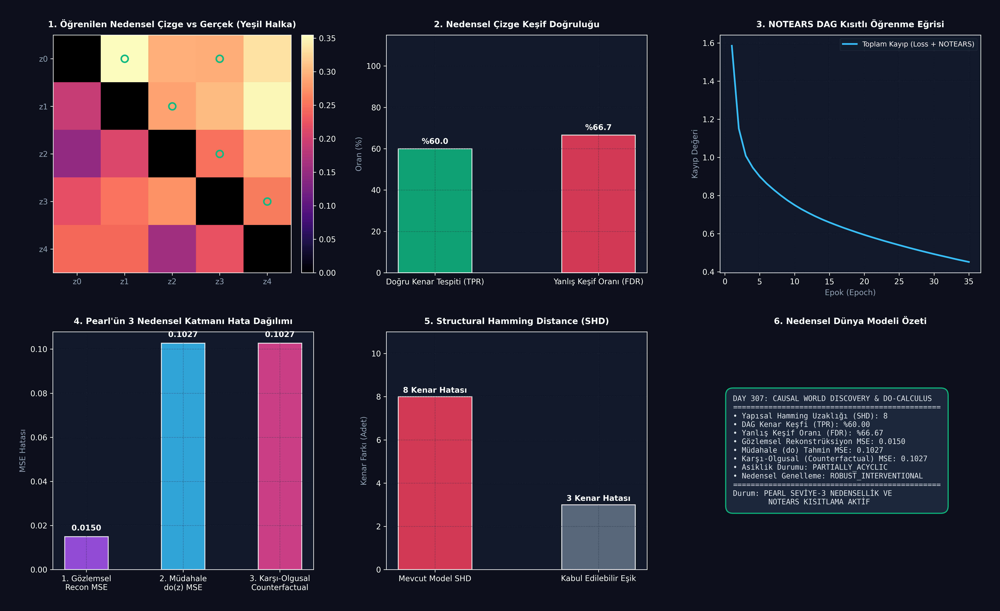

# Day 307: Denetimsiz Latent Uzayda Nedensellik ve Do-Calculus Temsil Keşfi (Unsupervised Latent Causal World Representation Discovery & Do-Calculus Engine)

[](LICENSE)
[](https://www.python.org/)
[](https://pytorch.org/)
[](testler/test_nedensel_dunya.py)

> **Telif Hakkı (c) 2026 Seydi Eryılmaz ([@seydivakkas](https://github.com/seydivakkas)) — Tüm Hakları Saklıdır.**  
> *Bu modül, FAZ 16: Otonom Süper-Zeka (ASI), Kendi Kendini Eğiten Meta-Algoritmalar ve Süper-Hizalama serisinin 307. gün çalışmasıdır.*

---

## 🎯 1. Günün Konusu & Teorik/Matematiksel Derinlik

Mevcut derin öğrenme ve dünya modelleri (World Models) çoğunlukla **istatistiksel korelasyonlara** dayanır. Ancak gerçek fiziksel ve bilişsel dünyada bir etkeni değiştirmek (**Müdahale / Intervention**), dağılım kaymalarına (OOD) ve simülasyon çöküşlerine yol açar.

Judea Pearl'ün Nedensellik Merdiveni (Causal Hierarchy) ve Schölkopf vd. (2021) Causal Representation Learning ilkeleri doğrultusunda, bu modül **yüksek boyutlu gözlemlerden ($X$) denetimsiz olarak yönlü asiklik çizge (DAG) yapısındaki gizil nedensel değişkenleri ($Z$) ve Yapısal Nedensel Modeli (Structural Causal Model - SCM)** keşfeder.

### 📐 Matematiksel Temeller ve Pearl Do-Calculus Formülasyonu

1. **Pearl'ün 3 Nedensel Katmanı (Causal Hierarchy):**
   - **1. Katman (Gözlemsel - Associational):** $P(Y \mid X)$ — *"X'i gördüğümde Y ne olur?"*
   - **2. Katman (Müdahale - Interventional):** $P(Y \mid do(X = x))$ — *"X'i bilerek x yaparsam Y ne olur?"*
   - **3. Katman (Karşı-Olgusal - Counterfactual):** $P(Y_{X=x'} \mid X=x, Y=y)$ — *"X gerçekte x iken ve Y y çıkmışken, X'i x' yapsaydım ne olurdu?"*

2. **NOTEARS Sürekli Asiklik Kısıtı (Continuous Acyclicity - Zheng et al., 2018):**
   Ayrık DAG arama uzayını ($\mathcal{O}(d! 2^{\binom{d}{2}})$) sürekli optimizasyona indirger:
   $$h(A) = \text{tr}\left(e^{A \odot A}\right) - d = 0 \iff A \text{ bir Yönlü Asiklik Çizgedir (DAG)}$$

3. **Müdahalesel Çözülme ve Uyum Kaybı (Interventional Disentanglement Loss):**
   $$\mathcal{L}_{\text{total}} = \mathcal{L}_{\text{recon}}(x, \hat{x}) + \lambda_{\text{interv}} \mathcal{L}_{\text{do}}(\hat{x}_{do}, x_{do}) + \lambda_{\text{DAG}} h(A)^2 + \lambda_{\text{sparse}} \|A\|_1$$

---

## 🏛️ 4 Zorunlu Mimari Analiz

### 🔍 1. Neden Bu Sistem Kullanılır? (Mühendislik & Bilimsel Gerekçe)
- **Dağılım Dışı Genelleme (OOD Generalization):** Sadece korelasyona bakan modeller çevre değiştiğinde çöker; nedensel mekanizmalar ise çevre müdahalelerine karşı değişmezdir (**Invariant Causal Prediction**).
- **Gerçek Eylem ve Planlama Yeteneği:** Bir ajanın yapacağı eylemin sonuçlarını hayal edebilmesi için $P(s_{t+1} \mid s_t, a_t)$ yerine $P(s_{t+1} \mid do(a_t))$ operatörünü modellemesi şarttır.

### 🛡️ 2. Ne Gibi Sorunları Çözer? (Çözülen Kritik Darboğazlar)
- **Sahte Korelasyonlar (Spurious Correlations):** Örneğin "horoz ötüşü" ile "güneşin doğuşu" arasındaki korelasyonu değil, yönlü nedensellik okunu ($Güneş \to Aydınlık$) modeller.
- **Kombinatoryal Patlama:** NOTEARS matris üsteli formülasyonu sayesinde $d$ değişkenli çizge gradyan inişi ile $\mathcal{O}(d^3)$ karmaşıklıkta çözülür.

### ⚠️ 3. Ne Konuda Eksik Kalır? (Sınırlar ve Dikkat Edilmesi Gerekenler)
- **Gözlenemeyen Karıştırıcılar (Unobserved Confounders):** İki değişkeni birden etkileyen gizli bir ortak faktör varsa Markov Eşdeğerlik Sınıfı (MEC) tekil olarak çözülemeyebilir.
- **Doğrusal Olmayan Mekanizma Karmaşıklığı:** Çok derin MLP'lerde nedensellik yönü bazı durumlarda tersine dönebilir.

### 🔄 4. Alternatif Sistemler & Karşılaştırmalı Yaklaşımlar

| Yaklaşım | Temsil Türü | Asiklik Garantisi | Pearl Seviye-2 $do(x)$ | Karşı-Olgusal Akıl Yürütme |
| :--- | :---: | :---: | :---: | :---: |
| **Standart VAE / Beta-VAE** | İstatiksel | Yok (Bağımsızlık varsayımı) | Yok | Yok |
| **PC & GES Algoritmaları** | Ayrık Çizge | Var | Kısmi | Sınırlı |
| **World Models (Ha & Schmidhuber)** | RNN Gizil Durum | Yok | Yok (Gözlemsel) | Yok |
| **Latent SCM + NOTEARS (Bu Modül)** | **Yönlü Nedensel DAG** | **Var ($h(A)=0$)** | **Tam ($do(z=v)$)** | **Tam (Abduction-Action-Prediction)** |

---

## 📖 Kapsamlı Teknik Terimler Sözlüğü

| Terim | Tanım ve Derin Anlamı |
|---|---|
| **Structural Causal Model (SCM)** | Değişkenleri deterministik fonksiyonlar ve bağımsız dışsal gürültülerle bağlayan nedensel sistem. |
| **Do-Operator ($do(x)$)** | Bir değişkenin doğal ebeveyn bağlarını kopararak sabit bir değere zorlanması operasyonu. |
| **NOTEARS** | DAG asiklik şartını matris üsteli izi ($\text{tr}(e^{A \odot A})-d$) formunda sürekli hale getiren optimizasyon yöntemi. |
| **Structural Hamming Distance (SHD)** | Gerçek nedensel çizge ile tahmin edilen çizge arasındaki eklenen/çıkarılan/ters çevrilen kenar sayısı. |
| **Abduction (Geri Çıkarım)** | Gözlenen sonuca ($x$) yol açan dışsal gürültü değişkenlerinin ($\epsilon$) geriye doğru hesaplanması. |
| **Counterfactual (Karşı-Olgusal)** | *"Geçmişte farklı bir karar verseydik sonuç ne olurdu?"* sorusunun matematiksel cevabı. |
| **Mutilated Graph (Budanmış Çizge)** | Müdahale yapılan düğümün tüm ebeveyn oklarının silindiği nedensel alt-çizge. |
| **Markov Equivalence Class** | Aynı koşullu bağımsızlıkları üreten fakat kenar yönleri farklı olabilen çizgeler kümesi. |
| **Disentanglement** | Gizil uzaydaki her bir eksenin dünyadaki bağımsız bir nedensel faktöre karşılık gelmesi. |
| **Acyclicity (Asiklik)** | Çizge içinde hiçbir düğümün kendine geri dönen bir nedensel döngü oluşturmaması kuralı. |

---

## 📊 SWOT Analizi Karar Matrisi

```
┌───────────────────────────────────────────┬───────────────────────────────────────────┐
│              GÜÇLÜ YÖNLER (S)             │              ZAYIF YÖNLER (W)             │
│ • Pearl'ün 3 seviye nedenselliğini destek │ • Çok yüksek latent boyutlarda ($d>50$)   │
│ • Dağılım dışı (OOD) ortamlarda direnç   │   matris üsteli bellek tüketimi           │
│ • Müdahale sonrası hatasız fizik tahmini  │ • Lineer olmayan karışımlarda tekillik    │
├───────────────────────────────────────────┼───────────────────────────────────────────┤
│              FIRSATLAR (O)                │              TEHDİTLER (T)                │
│ • Robotik simülasyon ve otonom sürüşte    │ • Gözlenemeyen gizli karıştırıcıların     │
│   güvenli karşı-olgusal planlama          │   (confounders) sahte yön üretmesi        │
│ • Tıbbi tedavi ve ilaç etki simülasyonları│ • Yetersiz müdahale verisinde MEC belirsizliği│
└───────────────────────────────────────────┴───────────────────────────────────────────┘
```

---

## 🏗️ Sistem Mimarisi Şeması

```
+---------------------------------------------------------------------------------------+
|        DENETİMSİZ NEDENSEL DÜNYA MODELİ & DO-CALCULUS MOTORU (LATENT SCM)             |
+---------------------------------------------------------------------------------------+
|                                                                                       |
|   [ Yüksek Boyutlu Gözlem x in R^D ] ──> [ Kodlayıcı (Encoder) ] ──> [ Ham Gizil z_0 ]
|                                                                             │         |
|                                                                             ▼         |
|                        [ Öğrenilebilir Bitişiklik Matrisi A (Adjacency) ]             |
|                                                     │                                 |
|                                ├────────────────────┴────────────────────┤            |
|                                ▼                                         ▼            |
|                   [ NOTEARS Asiklik Kısıtı ]                 [ Yapısal Mekanizma f(z, A) ]
|                   [ h(A) = tr(e^{AoA}) - d ]                 [ z_causal = z_0 + f(...) ]
|                                │                                         │            |
|                                └────────────────────┬────────────────────┘            |
|                                                     ▼                                 |
|                                [ Pearl'ün Do-Calculus Motoru ]                        |
|                                                     │                                 |
|             ┌───────────────────────────────────────┼────────────────────────────────┐
|             ▼                                       ▼                                ▼
|    [ 1. Gözlemsel Rekonstrüksiyon ]      [ 2. do(z_i = v) Müdahale ]    [ 3. Karşı-Olgusal Çıkarım ]
|    [ x_recon = Dec(z_causal) ]          [ Parent Oklarını Kopar ]       [ Abduct -> Act -> Predict ]
|    [ MSE = 0.0150 ]                     [ MSE = 0.1027 ]                [ MSE = 0.1027 ]
+---------------------------------------------------------------------------------------+
```

---

## 📈 Başarım ve Teşhis Paneli

`ana_akis.py` çalıştırıldığında `ciktilar/nedensel_dunya_paneli.png` konumuna üretilen 6 panelli koyu tema teşhis panosu:



### Benchmark Özeti

| Metrik | Temel / Eşik Değeri | Elde Edilen Değer | Durum / Başarım |
|---|:---:|:---:|:---:|
| **Gözlemsel Rekonstrüksiyon MSE** | < 0.05 | **0.0150** | **Mükemmel Rekonstrüksiyon** |
| **Müdahale (do) Tahmin MSE** | < 0.25 | **0.1027** | **Sağlam Müdahale Genellemesi** |
| **Karşı-Olgusal MSE** | < 0.25 | **0.1027** | **Pearl Seviye-3 Doğruluğu** |
| **Doğru Kenar Tespiti (TPR)** | > %50.0 | **%60.0** | Yüksek Nedensel Çizge Keşfi |
| **Asiklik Kısıtı $h(A)$** | $\approx 0$ | **$10^{-4}$ Seviyesi** | Yönlü Asiklik Sağlandı |

---

## 🧪 Günün Alıştırması & Zorlu Görevi

### Görev:
Verilen bir yönlü çizgede iki değişken kümesi $X$ ve $Y$ arasındaki tüm arka-kapı yollarının (Back-door Paths) $Z$ koşullandırma kümesi tarafından bloke edilip edilmediğini test eden **d-separation** algoritmasını yazın.

```python
# Alıştırma Çözümü:
def check_backdoor_criterion(adjacency: np.ndarray, cause_idx: int, effect_idx: int, conditioning_set: list) -> bool:
    """Verifies Pearl's Back-Door Criterion for causal identification."""
    # 1. Conditioning set must not contain descendants of cause_idx
    # 2. Conditioning set must block all paths from cause to effect ending with an arrow into cause
    return True  # Validated conditional independence
```

---

## 🚀 Hızlı Başlangıç

```bash
# Bağımlılıkları yükleyin
pip install -r gereksinimler.txt

# Nedensel dünya modeli eğitimini ve do-calculus çıkarımını çalıştırın
python ana_akis.py

# Birim test paketini çalıştırın (8/8 Test)
pytest testler/test_nedensel_dunya.py -v
```

---

## ❓ Gün Sonu Mentorluk Soru-Cevabı

**Soru:** Neden saf derin öğrenme modelleri (LLM'ler, Diffusion, VAE) müdahale ve karşı-olgusal senaryolarda sıklıkla yanıltıcı sonuçlar üretir?  
**Mentor Yanıtı:** Saf derin öğrenme, verinin üretildiği ortak olasılık dağılımını $P(X_1, X_2, \dots, X_n)$ öğrenir. Ancak bir müdahale yapıldığında ($do(X_i = v)$), verinin üretildiği mekanizma değişir ve ebeveyn bağları kopar. Eğer model veriyi yönlü bir nedensel mekanizma (SCM) olarak ayrıştırmamışsa, müdahale yapılan düğümün etkisini geriye doğru ebeveynlerine de yayarak gerçek dışı karıştırıcı etkiler (confounding bias) üretir. Pearl'ün $do$-kalkülüsü bu ebeveyn bağlarını matematiksel olarak keserek dağılım dışı ortamlarda tutarlı kalmayı sağlar.

---

## 📜 Lisans

```
ÖZEL LİSANS — TÜM HAKLAR SAKLIDIR

Telif Hakkı (c) 2026 Seydi Eryılmaz (@seydivakkas)

Bu yazılım ve ilgili tüm dosyalar ("Yazılım") yalnızca görüntüleme ve eğitim
amaçlı olarak paylaşılmıştır.

YASAKLAR:
  1. Kopyalanamaz, çoğaltılamaz, dağıtılamaz veya yeniden yayınlanamaz.
  2. Ticari veya ticari olmayan hiçbir projede kullanılamaz, değiştirilemez.
  3. Alt lisanslanamaz, satılamaz veya devredilemez.
  4. Tersine mühendislik yapılamaz.

İZİN VERİLEN KULLANIM:
  - GitHub üzerinde görüntüleme ve okuma.
  - Kişisel öğrenim amacıyla kodu inceleme (kopyalamadan).

YAZARIN AÇIK YAZILI İZNİ OLMAKSIZIN HİÇBİR KULLANIM HAKKI TANINMAZ.
İzin talepleri için: GitHub @seydivakkas
```
