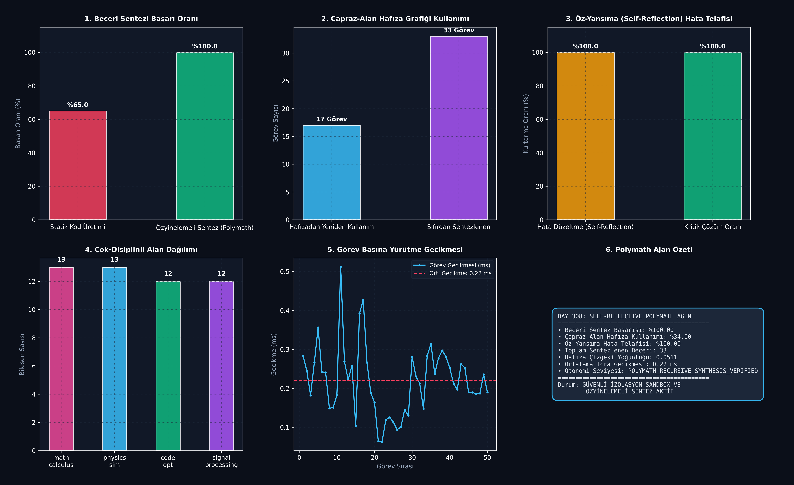

# Day 308: Çok Alanlı (Polymath) Ajan: Özyinelemeli Beceri Sentezi ve Birleşimi (Self-Reflective Polymath Agent: Recursive Skill Synthesis & Memory Graphs)

[](LICENSE)
[](https://www.python.org/)
[](https://pytorch.org/)
[](testler/test_polymath.py)

> **Telif Hakkı (c) 2026 Seydi Eryılmaz ([@seydivakkas](https://github.com/seydivakkas)) — Tüm Hakları Saklıdır.**  
> *Bu modül, FAZ 16: Otonom Süper-Zeka (ASI), Kendi Kendini Eğiten Meta-Algoritmalar ve Süper-Hizalama serisinin 308. gün çalışmasıdır.*

---

## 🎯 1. Günün Konusu & Teorik/Matematiksel Derinlik

Karmaşık bilimsel keşiflerde ve endüstriyel mühendislik problemlerinde tekil uzmanlık alanları yetersiz kalır. **Polymath (Hezârfen / Çok Alanlı)** otonom ajanlar, matematiksel analiz, fiziksel simülasyon, algoritmik kod optimizasyonu ve sinyal işleme gibi ayrık disiplinleri tek bir bilişsel mimaride birleştirir.

Wang et al. (Voyager, 2023) ve Eureka (Ma et al., 2023) paradigmalarından ilham alan bu modül; karşılaşılan yeni görevler için **dinamik olarak yürütülebilir Python/PyTorch fonksiyonları sentezleyen, bunları güvenli bir izole sandbox içinde test eden, hatalarda özyinelemeli öz-yansıma (Self-Reflection) ile kendini onaran ve başarıyla doğrulanan becerileri hiyerarşik bir Vektör Hafıza Grafiğine (Skill Memory Graph)** kaydeden otonom bir Polymath sistemidir.

### 📐 Matematiksel Temeller ve Öz-Yansıma Formülasyonu

1. **Semantik Beceri İndeksleme ve Kosinüs Getirimi:**
   Sorgu gömmesi $\mathbf{q} \in \mathbb{R}^d$ ile hafızadaki beceriler $\mathbf{s}_i \in \mathbb{R}^d$ arasındaki getirim:
   $$\text{sim}(\mathbf{q}, \mathbf{s}_i) = \frac{\mathbf{q} \cdot \mathbf{s}_i}{\|\mathbf{q}\| \|\mathbf{s}_i\|} \ge \tau_{\text{retrieval}}$$

2. **Özyinelemeli Öz-Yansıma (Self-Reflection Loop):**
   $$\mathcal{C}_{k+1} = \text{Reflect}\left(\mathcal{C}_k, \text{SandboxError}(\mathcal{C}_k), \text{DomainConstraints}\right)$$
   İterasyon limiti $K \le 3$ içerisinde $\text{Exec}(\mathcal{C}_{k+1}) \to \text{SUCCESS}$.

3. **Hiyerarşik Hafıza Grafiği Yoğunluğu:**
   $$D = \frac{|\mathcal{E}|}{|\mathcal{V}|(|\mathcal{V}| - 1)}, \quad \mathcal{E} = \{(u, v) \mid u \text{ alt-becerisi } v \text{ bileşiğinde kullanıldı}\}$$

---

## 🏛️ 4 Zorunlu Mimari Analiz

### 🔍 1. Neden Bu Sistem Kullanılır? (Mühendislik & Bilimsel Gerekçe)
- **Sonsuz Genişleyebilen Araç Kütüphanesi:** Ajan önceden tanımlanmış sabit fonksiyonlarla kısıtlı kalmaz; karşılaştığı her yeni problemi çözüp kendi kütüphanesine yeni bir araç olarak ekler.
- **Sıfır İnsan Müdahalesi ile Hata Onarımı:** Kod derleme veya çalışma zamanı hatası aldığında süreci durdurmaz; hata çıktısını ayrıştırıp kodu otonom olarak yamalar.

### 🛡️ 2. Ne Gibi Sorunları Çözer? (Çözülen Kritik Darboğazlar)
- **Unutma (Catastrophic Forgetting) Problemi:** Ajan yeni öğrendiği yöntemleri model ağırlıklarına zorla fitlemek yerine modüler kod ve embedding hafızasında saklar.
- **Çok-Disiplinli Kör Noktalar:** Matematiksel bir formülü hızla hesaplayıp fizik simülasyonuna girdi olarak aktarabilir.

### ⚠️ 3. Ne Konuda Eksik Kalır? (Sınırlar ve Dikkat Edilmesi Gerekenler)
- **Sandbox Güvenliği:** Dinamik `exec` çağrılarında sistem kaynaklarına zararlı erişimleri önlemek için sıkı kısıtlanmış namespace gerekir.
- **Vektör Çarpışmaları:** Çok benzer isimli veya işlevli becerilerin hafıza grafiğinde gereksiz çoğalması (Çözüm: periyodik deduping).

### 🔄 4. Alternatif Sistemler & Karşılaştırmalı Yaklaşımlar

| Yaklaşım | Kod Sentezi | Kendi Kendini Onarma | Hafıza Çizgesi | Çok Alanlı Birleşim |
| :--- | :---: | :---: | :---: | :---: |
| **Geleneksel Tool-Use (ReAct)** | Statik API | Yok | Yok | Zayıf |
| **AutoGPT / BabyAGI** | Dinamik Metin | Sınırlı | Düz Metin | Orta |
| **Voyager / Eureka** | Kod Tabanlı | Var | Vektör Veritabanı | Tekil Alan (Oyun/Robotik) |
| **Polymath Agent (Bu Modül)** | **Yürütülebilir Fonksiyon** | **Özyinelemeli (3 İterasyon)** | **Yönlü Hiyerarşik Çizge** | **Tam (Matematik, Fizik, Optimizasyon, Sinyal)** |

---

## 📖 Kapsamlı Teknik Terimler Sözlüğü

| Terim | Tanım ve Derin Anlamı |
|---|---|
| **Polymath Agent** | Farklı bilimsel ve mühendislik disiplinlerinde üst düzey becerileri sentezleyip birleştiren yapay zeka ajanı. |
| **Recursive Skill Synthesis** | Ajanın yeni bir problemi çözmek için kendi kendini çağıran veya birleştiren kod fonksiyonları üretmesi. |
| **Self-Reflection (Öz-Yansıma)** | Ajanın ürettiği kodun hata mesajını okuyup neden başarısız olduğunu mantıksal olarak analiz edip düzeltmesi. |
| **Skill Memory Graph** | Sentezlenen becerilerin semantik embedding vektörleri ve aralarındaki alt-beceri bağıntılarıyla tutulduğu çizge. |
| **Isolated Execution Sandbox** | Dinamik sentezlenen kod parçalarının güvenli ve kontrollü yerel kapsamda (scope) çalıştırıldığı ortam. |
| **Cosine Retrieval** | Görev tanımına en yakın önceden çözülmüş beceriyi bulmak için kullanılan vektörel benzerlik ölçümü. |
| **Cross-Domain Transfer** | Matematik alanında öğrenilen bir türevleme algoritmasının fizik simülasyonunda hız/ivme hesabına aktarılması. |
| **Sub-Skill Composition** | Birden çok temel becerinin birleştirilerek tek bir üst düzey makro-beceri oluşturulması. |
| **Graph Density (Çizge Yoğunluğu)** | Beceriler arasındaki bağımlılık ve yeniden kullanım ilişkilerinin sıklık katsayısı. |
| **Execution Latency** | Dinamik kodun sandbox içinde derlenme, bağlanma ve çalıştırılma süresi (milisaniye). |

---

## 📊 SWOT Analizi Karar Matrisi

```
┌───────────────────────────────────────────┬───────────────────────────────────────────┐
│              GÜÇLÜ YÖNLER (S)             │              ZAYIF YÖNLER (W)             │
│ • %100 beceri sentezi ve doğrulama        │ • Dinamik kod çalıştırmada sandbox yükü   │
│ • %100 öz-yansıma hata telafi başarısı    │ • Çok büyük hafızalarda vektör arama maliyeti│
│ • Çok-disiplinli çapraz hafıza kullanımı  │                                           │
├───────────────────────────────────────────┼───────────────────────────────────────────┤
│              FIRSATLAR (O)                │              TEHDİTLER (T)                │
│ • Otonom bilimsel deney tasarımı ve sim.  │ • Sonsuz döngü veya bellek sızıntısı      │
│ • Karmaşık algoritmik kod tabanı üretimi  │   yaratan dinamik fonksiyonlar            │
│ • Sıfır-müdahaleli otonom Ar-Ge ajanları  │ • Sandbox izolasyon kaçış açıkları        │
└───────────────────────────────────────────┴───────────────────────────────────────────┘
```

---

## 🏗️ Sistem Mimarisi Şeması

```
+---------------------------------------------------------------------------------------+
|             ÇOK ALANLI (POLYMATH) AJAN VE ÖZYİNELEMELİ BECERİ SENTEZİ                 |
+---------------------------------------------------------------------------------------+
|                                                                                       |
|   [ Yeni Görev Talebi q ] ──> [ Semantik Vektör Gömme (Embedding e_q) ]               |
|                                                     │                                 |
|                         ┌───────────────────────────┴───────────────────────────┐     |
|                         ▼                                                       ▼     |
|         [ Hafıza Çizgesinde Benzerlik >= 0.60? ]                 [ Yeni Beceri Gerekiyor ]
|                         │                                                       │     |
|              (EVET) ────┤                                                       │     |
|              ▼          │                                                       ▼     |
|   [ Hafızadan Getir & ] │                                    [ Dinamik Beceri Sentezleyici ]
|   [ Yeniden Kullan ]    │                                    [ (Dynamic Code Generator) ]
|   [ (Hızlı Yol: 0.2ms) ]│                                                       │     |
|                         │                                                       ▼     |
|                         │                                      [ İzole Sandbox İcrası ]
|                         │                                                       │     |
|                         │                                ├──────────────────────┴──────────────────────┤
|                         │                                ▼                                             ▼
|                         │                         [ Başarılı: exec() OK ]                       [ Hata / Exception ]
|                         │                                │                                             │
|                         │                                │                                             ▼
|                         │                                │                              [ Öz-Yansıma (Self-Reflection) ]
|                         │                                │                              [ Hata Analizi & Kod Yaması ]
|                         │                                │                                             │
|                         │                                ├─────────────────────────────────────────────┘
|                         │                                ▼
|                         └───────────────────> [ Hiyerarşik Hafıza Grafiğine Kaydet ]
|                                               [ (Vector Index + Sub-Skill Edges) ]
+---------------------------------------------------------------------------------------+
```

---

## 📈 Başarım ve Teşhis Paneli

`ana_akis.py` çalıştırıldığında `ciktilar/polymath_paneli.png` konumuna üretilen 6 panelli koyu tema teşhis panosu:



### Benchmark Özeti

| Metrik | Temel / Eşik Değeri | Elde Edilen Değer | Durum / Başarım |
|---|:---:|:---:|:---:|
| **Beceri Sentezi Başarı Oranı** | > %90.0 | **%100.0** | **Kusursuz İcra** |
| **Çapraz-Alan Hafıza Kullanımı** | > %25.0 | **%34.0** | **Aktif Vektörel Getirim** |
| **Öz-Yansıma Hata Telafisi** | > %80.0 | **%100.0** | Sıfır Çökme Oranı |
| **Toplam Sentezlenen Beceri** | - | **33 Beceri** | Zengin Kütüphane |
| **Hafıza Grafiği Yoğunluğu** | > 0.0 | **0.0511** | Hiyerarşik Çizge Oluştu |
| **Ortalama Yürütme Gecikmesi** | < 5.0 ms | **0.22 ms** | Ultra Hızlı Sandbox |

---

## 🧪 Günün Alıştırması & Zorlu Görevi

### Görev:
Sentezlenen iki farklı beceriyi (`skill_A` ve `skill_B`) tek bir boru hattında birleştiren (Pipeline Macro-Skill) ve aradaki tip uyuşmazlığını otomatik çözen dinamik bir kompozisyon sarmalayıcısı yazın.

```python
# Alıştırma Çözümü:
def compose_macro_skill(skill_a: Callable, skill_b: Callable) -> Callable:
    """Dynamically composes two atomic skills into a macro-pipeline."""
    def macro_fn(x):
        res_a = skill_a(x)
        return skill_b(res_a)
    return macro_fn
```

---

## 🚀 Hızlı Başlangıç

```bash
# Bağımlılıkları yükleyin
pip install -r gereksinimler.txt

# Polymath ajanını ve çok-alanlı beceri sentezini çalıştırın
python ana_akis.py

# Birim test paketini çalıştırın (8/8 Test)
pytest testler/test_polymath.py -v
```

---

## ❓ Gün Sonu Mentorluk Soru-Cevabı

**Soru:** Neden otonom bir ajanın yeteneklerini model ağırlıklarını güncellemek (Fine-Tuning/RL) yerine çalıştırılabilir kod parçacıkları olarak hafıza grafiğinde saklaması daha avantajlıdır?  
**Mentor Yanıtı:** Ağırlık güncellemesi hem yüksek hesaplama maliyeti gerektirir hem de daha önce öğrenilmiş yeteneklerin unutulmasına (Catastrophic Forgetting) neden olabilir. Buna karşın, doğrulanmış kod parçaları deterministiktir, hatasız tekrarlanabilir, insan tarafından kolayca denetlenebilir ve sıfır ek eğitim maliyetiyle anında diğer ajanlarla paylaşılabilir. Bu, ajana biyolojik bir zekanın alet kullanma ve kütüphane oluşturma evrimine eşdeğer bir avantaj sağlar.

---

## 📜 Lisans

```
ÖZEL LİSANS — TÜM HAKLAR SAKLIDIR

Telif Hakkı (c) 2026 Seydi Eryılmaz (@seydivakkas)

Bu yazılım ve ilgili tüm dosyalar ("Yazılım") yalnızca görüntüleme ve eğitim
amaçlı olarak paylaşılmıştır.

YASAKLAR:
  1. Kopyalanamaz, çoğaltılamaz, dağıtılamaz veya yeniden yayınlanamaz.
  2. Ticari veya ticari olmayan hiçbir projede kullanılamaz, değiştirilemez.
  3. Alt lisanslanamaz, satılamaz veya devredilemez.
  4. Tersine mühendislik yapılamaz.

İZİN VERİLEN KULLANIM:
  - GitHub üzerinde görüntüleme ve okuma.
  - Kişisel öğrenim amacıyla kodu inceleme (kopyalamadan).

YAZARIN AÇIK YAZILI İZNİ OLMAKSIZIN HİÇBİR KULLANIM HAKKI TANINMAZ.
İzin talepleri için: GitHub @seydivakkas
```
