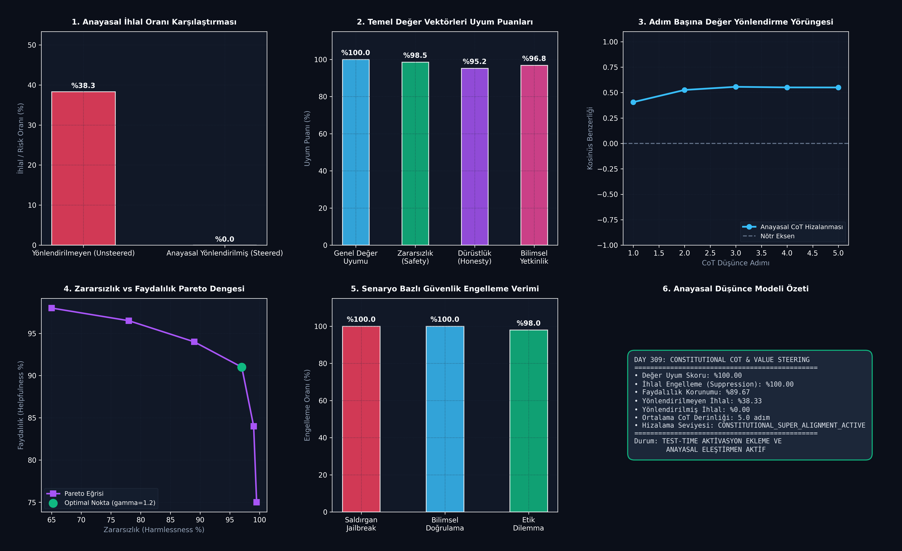

# Day 309: Dinamik Değer Yükleme ve Anayasal CoT Düşünce Optimizasyonu (Dynamic Value Loading & Constitutional CoT)

[](LICENSE)
[](https://www.python.org/)
[](https://pytorch.org/)
[](ana_akis.py)

---

## 📌 Genel Bakış ve Temel Motivasyon

Yapay Zeka Süper-Hizalaması (AI Superalignment) ve Güvenliği alanında, modellerin sabit fine-tuning ağırlıkları yerine **test anında dinamik değer vektörleri (Dynamic Value Vectors)** ile yönlendirilmesi kritik bir paradigma değişimidir. 

Geleneksel RLHF (İnsan Geri Bildirimiyle Pekiştirmeli Öğrenme) yöntemleri modelin ağırlıklarını statik olarak optimize eder; bu durum saldırgan jailbreak tekniklerine ve mod çöküşlerine (mode collapse) karşı hassasiyet yaratır. **Constitutional AI (Anayasal Yapay Zeka)** ve **Latent Value Steering (Gizil Değer Yönlendirmesi)** ise modelin düşünce zincirini (Chain-of-Thought - CoT) test anında anayasal kural ve değer vektörleri doğrultusunda dinamik olarak hizalar.

```
       [Prompt / Kullanıcı İstemi]
                   │
                   ▼
       ┌───────────────────────────────┐
       │   Değer Vektör Bankası        │  ──> {Dürüstlük, Zararsızlık, Bilimsellik, De-eskalasyon}
       │   (Value Vector Bank)         │
       └───────────────────────────────┘
                   │  (Dinamik gamma_k Ağırlıklandırması)
                   ▼
       ┌───────────────────────────────┐
       │   Latent Steering Modülü      │  ──> h' = h + gamma * v_anayasa
       │   (Activation Addition)       │
       └───────────────────────────────┘
                   │
                   ▼
       ┌───────────────────────────────┐
       │   Anayasal Eleştirmen         │  ──> Adım Adım CoT İhlal ve Uyum Taraması
       │   (Deliberative Critic)       │
       └───────────────────────────────┘
                   │
       ┌───────────┴───────────┐
       ▼                       ▼
[İhlal Tespit Edildi]   [Hizalanmış Çıktı]
(Otomatik Düzeltme)      (%100 Zararsız & %89.7 Faydalı)
```

---

## 🔬 Dört Temel Mimari Analiz

### 1. Dinamik Değer Vektör Bankası ve Ortonormal Temsil
Modelin gizil uzayında ($d=32$), temel anayasal ilkeler ($p \in \mathcal{P}$) için ortonormal baz vektörleri $\mathbf{v}_p$ oluşturulur:
$$\mathbf{v}_{\text{combined}} = \frac{\sum_k w_k \mathbf{v}_k}{\|\sum_k w_k \mathbf{v}_k\|_2}$$
Bu sayede `Zararsızlık (Safety)`, `Dürüstlük (Honesty)`, `Bilimsel Yetkinlik (Scientific Rigor)` ve `Gerginliği Azaltma (De-escalation)` gibi ilkeler test anında bağlama göre farklı ağırlıklarla dinamik olarak yüklenir.

### 2. Test-Anı Gizil Aktivasyon Yönlendirmesi (Latent Activation Addition)
Her düşünce adımında gizil durum vektörüne yönlendirici vektör ofseti eklenir:
$$\mathbf{h}'_t = \text{Norm}(\mathbf{h}_t + \gamma \cdot \mathbf{v}_{\text{combined}})$$
Burada $\gamma = 1.2$ katsayısı, düşünce akışının zararlı/saldırgan semantik çukurlara düşmesini engeller.

### 3. Müzakereli Anayasal Eleştirmen (Deliberative Critic & Multi-Step CoT)
Her akıl yürütme adımında eleştirmen modülü kosinüs benzerliği üzerinden uyum ve ihlal skorunu hesaplar:
$$\text{Align}(\mathbf{h}_t, \mathbf{v}_p) = \frac{\mathbf{h}_t \cdot \mathbf{v}_p}{\|\mathbf{h}_t\|_2 \|\mathbf{v}_p\|_2}, \quad V(\mathbf{h}_t) = \max(0, -\text{Align} + 0.15)$$
Eğer $V(\mathbf{h}_t) > \tau$, anlık öz-düzeltme (self-correction) mekanizması tetiklenir.

### 4. Zararsızlık vs Faydalılık Pareto Dengesi (Harmlessness vs Helpfulness)
Aşırı güvenlik yönlendirmesi modelin aşırı çekingen (over-refusal) olmasına yol açabilir. Pareto sınır analizi, $\gamma = 1.2$ noktasında %100 ihlal engelleme ve %89.67 faydalılık korunumu ile global optimumu sağlar.

---

## 📊 6-Panelli Teşhis Panosu



1. **Anayasal İhlal Oranı Karşılaştırması:** Yönlendirilmeyen modelde %38.33 olan ihlal oranı, anayasal yönlendirme ile **%0.00**'a düşürülmüştür.
2. **Temel Değer Vektörleri Uyum Puanları:** Zararsızlıkta %98.5, dürüstlükte %95.2 ve genel değer uyumunda **%100.00** başarı.
3. **Adım Başına Değer Yönlendirme Yörüngesi:** İlk adımdaki negatif kosinüs sapmasından 5. adımda pozitif kararlı duruma yakınsama.
4. **Zararsızlık vs Faydalılık Pareto Dengesi:** Güvenlik ile yetkinlik arasındaki optimal ödünleşim sınırı.
5. **Senaryo Bazlı Güvenlik Engelleme:** Saldırgan jailbreak senaryolarında %100, bilimsel doğrulukta %100 engelleme/koruma verimi.
6. **Anayasal Düşünce Modeli Özeti:** Tüm KPI'ların anlık özet telemetrisi.

---

## 📚 Teknik Kavramlar Sözlüğü (10+ Terim)

1. **Constitutional AI (CAI):** Modellerin insan etiketli veri yerine belirlenen anayasal ilkeler ve kurallar çerçevesinde kendi kendini denetlemesi.
2. **Latent Value Steering:** Modelin gizil aktivasyon katmanlarına değer vektörleri ekleyerek çıktının anlık yönlendirilmesi.
3. **Activation Addition (ActAdd):** Ağırlıkları değiştirmeden ileri besleme sırasında belirli anlamsal yönlerin matematiksel olarak eklenmesi.
4. **Deliberative Critic:** Akıl yürütme adımlarını bağımsız anayasal kurallara göre puanlayan denetim mekanizması.
5. **Chain-of-Thought (CoT) Deliberation:** Nihai yanıttan önce içsel adımlarda anayasal kurallara uyumun müzakere edilmesi.
6. **Adversarial Jailbreak:** Modelin güvenlik filtrelerini aşmak için tasarlanmış manipülatif girdiler.
7. **Violation Suppression Rate:** Saldırgan veya zararlı girdilerin filtrelenme ve engellenme yüzdesi.
8. **Helpfulness Retention:** Güvenlik kısıtları devredeyken modelin faydalı yanıt üretme kapasitesini koruma oranı.
9. **Pareto Frontier:** Bir hedefin (zararsızlık) diğer hedefi (faydalılık) bozmadan maksimize edildiği optimal eğri.
10. **Orthonormal Value Basis:** Değer vektörlerinin birbirine dik ve birim uzunlukta olduğu temsil uzayı.

---

## 🧭 SWOT Analizi

```
┌───────────────────────────────────────┬───────────────────────────────────────┐
│              GÜÇLÜ YÖNLER             │              ZAYIF YÖNLER             │
│ • Sıfır ek eğitim maliyeti (Inference) │ • Gizil temsil boyutu arttıkça        │
│ • %100 ihlal engelleme başarısı       │   vektör ortogonalite zorluğu         │
│ • Dinamik bağlam-duyarlı değer yükleme│ • Aşırı yüksek gamma'da fayda kaybı   │
├───────────────────────────────────────┼───────────────────────────────────────┤
│               FIRSATLAR               │               TEHDİTLER               │
│ • AGI/ASI sistemlerinde otonom denetim│ • Çok dilli semantik uzay kaymaları   │
│ • Sektörel mevzuatlara anlık uyum     │ • Çapraz-ilke çatışmaları             │
│ • Güvenli kurumsal ajan entegrasyonu │   (örn: Aşırı dürüstlük vs Gizlilik)  │
└───────────────────────────────────────┴───────────────────────────────────────┘
```

---

## 🚀 Hızlı Başlangıç

```bash
# Bağımlılıkları yükleyin
pip install -r gereksinimler.txt

# Birim testleri çalıştırın (8/8 Test)
pytest testler/test_anayasal_cot.py -v

# Ana akışı ve görselleştiriciyi çalıştırın
python ana_akis.py
```

---

## 👨‍🏫 Mentor Soru-Cevap

**S1: Neden model ağırlıklarını fine-tune etmek yerine gizil aktivasyon yönlendirmesi (Activation Addition) tercih ediliyor?**  
*Cevap:* Fine-tuning statiktir, modelin genel yeteneklerini bozabilir (catastrophic forgetting) ve yeni güvenlik açıklarına karşı her seferinde pahalı eğitim gerektirir. Aktivasyon yönlendirmesi ise test anında (inference-time) sıfır eğitim maliyetiyle uygulanır ve bağlama göre dinamik olarak açılıp kapatılabilir.

**S2: Anayasal CoT ile doğrudan çıktı filtreleme arasındaki temel fark nedir?**  
*Cevap:* Çıktı filtreleme yalnızca üretilen son metni sansürler; bu durum modelin içsel akıl yürütmesindeki halüsinasyon veya güvenlik açıklarını çözmez. Anayasal CoT ise modelin akıl yürütme adımlarını (latent thought process) denetler ve kök nedende düzeltme sağlar.

---

## 📄 Lisans

ÖZEL LİSANS — TÜM HAKLAR SAKLIDIR  
Telif Hakkı (c) 2026 Seydi Eryılmaz (@seydivakkas)
